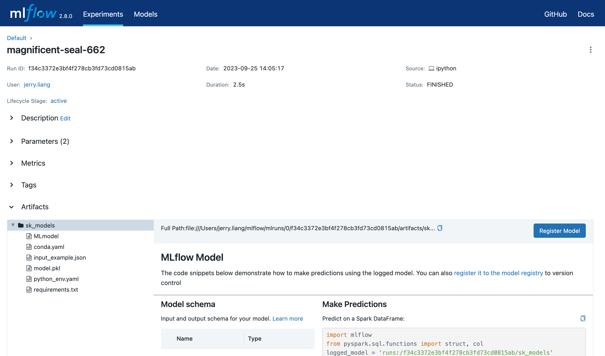
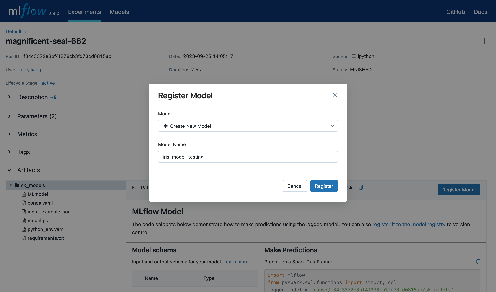
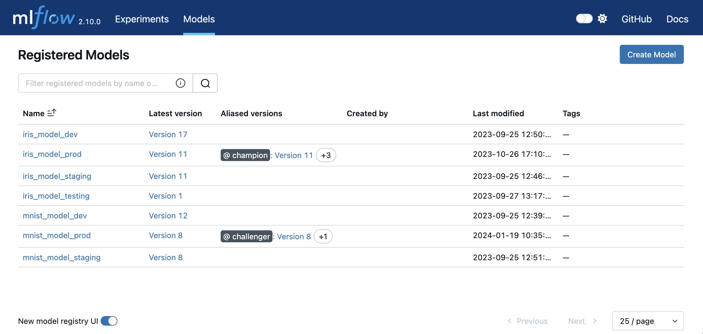
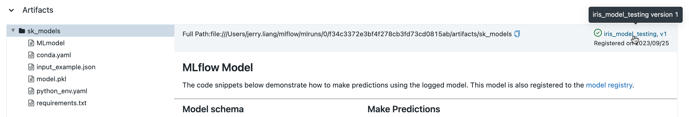
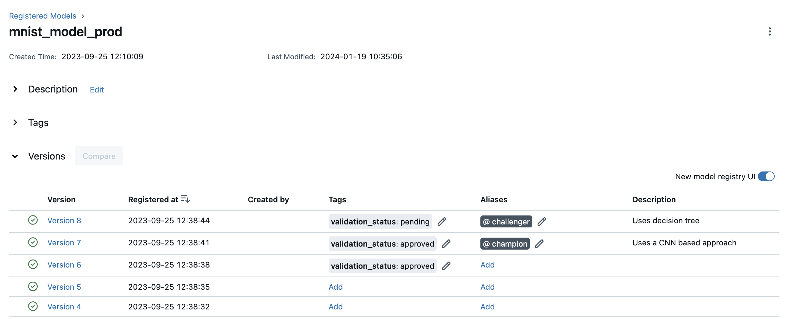
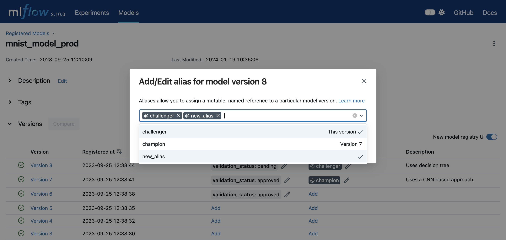
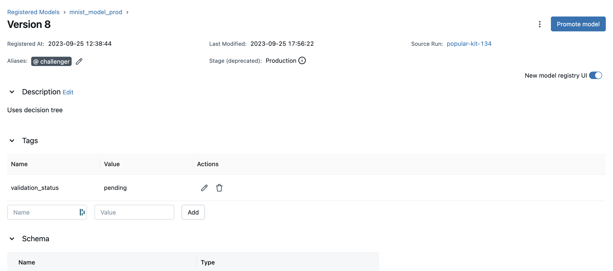
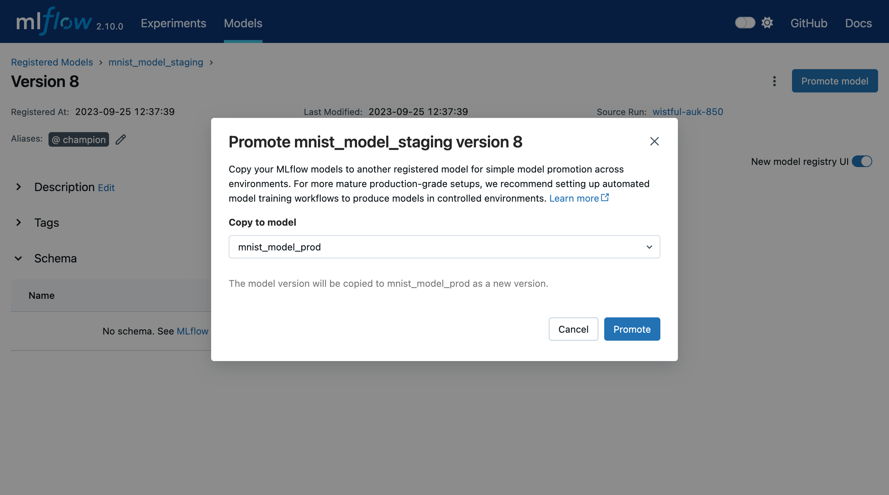

# 模型註冊的工作流

如果運行您自己的 MLflow 伺服器，您必須使用資料庫支援的後端儲存才能透過 UI 或 API 存取模型註冊表。瀏覽此處以獲取更多資訊。

在將模型新增至 model registry 之前，必須使用對應模型風格的 `log_model()` 方法對其進行記錄。記錄模型後，您可以透過 UI 或 API 在模型登錄中新增、修改、更新或刪除模型。

## UI Workflow

本部分示範如何使用 MLflow 模型登錄 UI 來管理 MLflow 模型。

### Register a Model

請依照下列步驟在 Model Registry 中註冊您的 MLflow 模型。

1. 開啟 MLflow Run 的詳細資訊頁面，其中包含您要註冊的已記錄 MLflow 模型。在 **Artifacts** 中選擇包含預期 MLflow 模型的模型資料夾。



2. 點擊 **Register Model** 按鈕，這將觸發彈出一個表單。

3. 在表單的 **Model** 下拉式選單中，您可以選擇 “Create New Model”，這會建立一個新的註冊模型，並將您的 MLflow 模型作為其初始版本，或選擇現有的註冊模型，這會將您的模型註冊為新的模型版本。下面的螢幕截圖示範了將 MLflow 模型註冊到名為 `iris_model_testing` 的新註冊模型。



### Find Registered Models

在 Model Registry 中註冊模型後，您可以透過以下方式找到它們。

- 導航至 Registered Models 頁面，該頁面連結到您註冊的模型和對應的模型版本。



- 前往 MLflow run 詳細資訊頁面的 **Artifacts**，按一下模型資料夾，然後按一下右上角的模型版本以查看從該模型建立的版本。



### Deploy and Organize Models

您可以使用模型別名(alias)和標籤(tag)在模型註冊表中部署和組織模型。若要為已註冊模型中的模型版本設定別名和標籤，請導覽至已註冊模型的概述頁面，如下所示。



您可以透過點擊模型版本表中對應的新增連結或鉛筆圖示來新增或編輯特定模型版本的別名和標籤。



要了解有關特定型號版本的更多信息，請導航至該型號版本的詳細資訊頁面。



在此頁面中，您可以檢查模型版本詳細信息，例如模型簽名、MLflow 來源運行和建立時間戳記。您也可以查看和配置版本的別名、標籤和描述。

## API Workflow

與 Model Registry 互動的另一種方法是使用 MLflow 模型風格或 MLflow 用戶端追蹤 API 介面。特別是，您可以在 MLflow 實驗運行期間或所有實驗運行之後註冊模型。

### Adding an MLflow Model to the Model Registry

可以透過三種程式設計方式將模型新增至 Model Registry。首先，您可以使用 `mlflow.<model_flavor>.log_model()` 方法。例如，在您的程式碼中：

```python
from sklearn.datasets import make_regression
from sklearn.ensemble import RandomForestRegressor
from sklearn.metrics import mean_squared_error
from sklearn.model_selection import train_test_split

import mlflow
import mlflow.sklearn
from mlflow.models import infer_signature

with mlflow.start_run() as run:
    X, y = make_regression(n_features=4, n_informative=2, random_state=0, shuffle=False)

    X_train, X_test, y_train, y_test = train_test_split(
        X, y, test_size=0.2, random_state=42
    )

    params = {"max_depth": 2, "random_state": 42}
    model = RandomForestRegressor(**params)
    model.fit(X_train, y_train)

    # Infer the model signature
    y_pred = model.predict(X_test)
    signature = infer_signature(X_test, y_pred)

    # Log parameters and metrics using the MLflow APIs
    mlflow.log_params(params)
    mlflow.log_metrics({"mse": mean_squared_error(y_test, y_pred)})

    # Log the sklearn model and register as version 1
    mlflow.sklearn.log_model(
        sk_model=model,
        artifact_path="sklearn-model",
        signature=signature,
        registered_model_name="sk-learn-random-forest-reg-model",
    )
```

在上面的程式碼片段中，如果具有該名稱的註冊模型不存在，則該方法將註冊一個新模型並建立版本 1。

第二種方法是在所有實驗運行完成並且確定哪個模型最適合添加到註冊表後，使用 `mlflow.register_model()` 方法。對於此方法，您需要 `run_id` 作為 **run:URI** 參數的一部分。

```python
result = mlflow.register_model(
    "runs:/d16076a3ec534311817565e6527539c0/sklearn-model", "sk-learn-random-forest-reg"
)
```

如果具有該名稱的註冊模型不存在，則該方法將註冊一個新模型，建立版本 1，並傳回 ModelVersion MLflow 物件。如果存在具有該名稱的註冊模型，則該方法將建立新的模型版本並傳回版本物件。

最後，您可以使用 `create_registered_model()` 建立新的註冊模型。如果模型名稱存在，此方法將拋出 MlflowException，因為建立新的註冊模型需要唯一的名稱。

```python
from mlflow import MlflowClient

client = MlflowClient()
client.create_registered_model("sk-learn-random-forest-reg-model")
```

上面的方法建立一個空的註冊模型，沒有關聯的版本。您可以使用如下所示的 `create_model_version()` 來建立模型的新版本。

```python
client = MlflowClient()
result = client.create_model_version(
    name="sk-learn-random-forest-reg-model",
    source="mlruns/0/d16076a3ec534311817565e6527539c0/artifacts/sklearn-model",
    run_id="d16076a3ec534311817565e6527539c0",
)
```

### Deploy and Organize Models with Aliases and Tags

模型別名和標籤可協助您在模型登錄中部署和組織模型。

**Set and delete aliases on models**

若要使用 MLflow 用戶端 API 設定、更新和刪除別名，請參閱下列範例：

```python
from mlflow import MlflowClient

client = MlflowClient()

# create "champion" alias for version 1 of model "example-model"
client.set_registered_model_alias("example-model", "champion", 1)

# reassign the "Champion" alias to version 2
client.set_registered_model_alias("example-model", "Champion", 2)

# get a model version by alias
client.get_model_version_by_alias("example-model", "Champion")

# delete the alias
client.delete_registered_model_alias("example-model", "Champion")
```

**Set and delete tags on models**

若要使用 MLflow 用戶端 API 設定和刪除標籤，請參閱下列範例：

```python
from mlflow import MlflowClient

client = MlflowClient()

# Set registered model tag
client.set_registered_model_tag("example-model", "task", "classification")

# Delete registered model tag
client.delete_registered_model_tag("example-model", "task")

# Set model version tag
client.set_model_version_tag("example-model", "1", "validation_status", "approved")

# Delete model version tag
client.delete_model_version_tag("example-model", "1", "validation_status")
```

有關別名和標籤客戶端 API 的更多詳細信息，請參閱 [mlflow.client](https://mlflow.org/docs/latest/python_api/mlflow.client.html#module-mlflow.client) API 文件。

### Fetching an MLflow Model from the Model Registry

註冊 MLflow 模型後，您可以使用 `mlflow.<model_flavor>.load_model()` 或更一般地使用 `load_model()` 來取得該模型。您可以將載入的模型用於一次性預測或推理工作負載（例如批量推理）。

**Fetch a specific model version**

要取得特定模型版本，只需提供該版本號作為模型 URI 的一部分。

```python
import mlflow.pyfunc

model_name = "sk-learn-random-forest-reg-model"
model_version = 1

model = mlflow.pyfunc.load_model(model_uri=f"models:/{model_name}/{model_version}")

model.predict(data)
```

**Fetch a model version by alias**

若要透過別名取得模型版本，請在模型 URI 中指定模型別名，它將取得目前在其下方的模型版本。

```python
import mlflow.pyfunc

model_name = "sk-learn-random-forest-reg-model"
alias = "champion"

champion_version = mlflow.pyfunc.load_model(f"models:/{model_name}@{alias}")

champion_version.predict(data)
```

請注意，模型別名分配可以獨立於生產代碼進行更新。如果上面程式碼片段中的冠軍別名被重新指派給模型登錄中的新模型版本，則該程式碼片段的下一次執行將自動選取新模型版本。這使您可以將模型部署與推理工作負載分離。

### Serving an MLflow Model from Model Registry

註冊 MLflow 模型後，您可以將此模型作為主機上的服務提供。

```python
#!/usr/bin/env sh

# Set environment variable for the tracking URL where the Model Registry resides
export MLFLOW_TRACKING_URI=http://localhost:5000

# Serve the production model from the model registry
mlflow models serve -m "models:/sk-learn-random-forest-reg-model@champion"
```

### Promoting an MLflow Model across environments

在成熟的 DevOps 和 MLOps 工作流程中，組織使用具有存取控制的單獨環境（通常是開發、登台和生產），以實現快速開發，而​​不會影響生產穩定性。在 MLflow 中，您可以使用註冊模型和 MLflow 驗證來表達 MLflow 模型的存取控制環境。例如，您可以建立與環境和業務問題的每個組合相對應的註冊模型（例如 prod.ml_team.revenue_forecasting、dev.ml_team.revenue_forecasting）並相應地配置權限。當您針對業務問題迭代 MLflow 模型時，您可以透過各種環境推廣它們以進行持續整合和部署。

對於成熟的生產級設置，我們建議設置自動化工作流程，在每個環境中訓練和註冊模型。若要生產業務問題的最新迭代，請透過原始碼控制和 CI/CD 系統跨環境推廣機器學習程式碼。

對於簡單的模型部署案例，您可以將經過訓練的 MLflow 模型註冊到開發環境註冊模型​​作為最新模型版本，然後使用 `copy_model_version()` 在註冊模型之間推廣它。

```python
from mlflow import MlflowClient

client = MlflowClient()
client.copy_model_version(
    src_model_uri="models:/regression-model-staging@candidate",
    dst_name="regression-model-production",
)
```

此程式碼片段將迴歸模型暫存模型中具有候選別名的模型版本複製到迴歸模型生產模型作為最新版本。

您也可以在 UI 中升級模型版本。為此，請導航至模型版本詳細資訊頁面並選擇升級模型按鈕。這將開啟一個模式，您可以在其中選擇當前模型版本將複製到的已註冊模型。



### Adding or Updating an MLflow Model Descriptions

在模型生命週期開發的任何時刻，您都可以使用 `update_model_version()` 更新模型版本的描述。

```python
client = MlflowClient()
client.update_model_version(
    name="sk-learn-random-forest-reg-model",
    version=1,
    description="This model version is a scikit-learn random forest containing 100 decision trees",
)
```

### Renaming an MLflow Model

除了新增或更新模型特定版本的描述之外，您還可以使用 `rename_registered_model()` 重新命名現有的註冊模型。

```python
client = MlflowClient()
client.rename_registered_model(
    name="sk-learn-random-forest-reg-model",
    new_name="sk-learn-random-forest-reg-model-100",
)
```

### Listing and Searching MLflow Models

您可以使用簡單的方法來取得註冊表中已註冊模型的清單。

```python
from pprint import pprint

client = MlflowClient()
for rm in client.search_registered_models():
    pprint(dict(rm), indent=4)
```

輸出：

```bash
{   'creation_timestamp': 1582671933216,
    'description': None,
    'last_updated_timestamp': 1582671960712,
    'latest_versions': [<ModelVersion: creation_timestamp=1582671933246, current_stage='Production', description='A random forest model containing 100 decision trees trained in scikit-learn', last_updated_timestamp=1582671960712, name='sk-learn-random-forest-reg-model', run_id='ae2cc01346de45f79a44a320aab1797b', source='./mlruns/0/ae2cc01346de45f79a44a320aab1797b/artifacts/sklearn-model', status='READY', status_message=None, user_id=None, version=1>,
                        <ModelVersion: creation_timestamp=1582671960628, current_stage='None', description=None, last_updated_timestamp=1582671960628, name='sk-learn-random-forest-reg-model', run_id='d994f18d09c64c148e62a785052e6723', source='./mlruns/0/d994f18d09c64c148e62a785052e6723/artifacts/sklearn-model', status='READY', status_message=None, user_id=None, version=2>],
    'name': 'sk-learn-random-forest-reg-model'}
```

對於數百個模型，仔細閱讀此呼叫返回的結果可能會很麻煩。更有效的方法是使用 `search_model_versions()` 方法搜尋特定模型名稱並列出其版本詳細信息，並提供過濾字串，例如 “`name='sk-learn-random-forest-reg-model'`”

```python
client = MlflowClient()
for mv in client.search_model_versions("name='sk-learn-random-forest-reg-model'"):
    pprint(dict(mv), indent=4)
```

輸出：

```bash
{
    "creation_timestamp": 1582671933246,
    "current_stage": "Production",
    "description": "A random forest model containing 100 decision trees "
    "trained in scikit-learn",
    "last_updated_timestamp": 1582671960712,
    "name": "sk-learn-random-forest-reg-model",
    "run_id": "ae2cc01346de45f79a44a320aab1797b",
    "source": "./mlruns/0/ae2cc01346de45f79a44a320aab1797b/artifacts/sklearn-model",
    "status": "READY",
    "status_message": None,
    "user_id": None,
    "version": 1,
}

{
    "creation_timestamp": 1582671960628,
    "current_stage": "None",
    "description": None,
    "last_updated_timestamp": 1582671960628,
    "name": "sk-learn-random-forest-reg-model",
    "run_id": "d994f18d09c64c148e62a785052e6723",
    "source": "./mlruns/0/d994f18d09c64c148e62a785052e6723/artifacts/sklearn-model",
    "status": "READY",
    "status_message": None,
    "user_id": None,
    "version": 2,
}
```

### Deleting MLflow Models

您可以刪除已註冊模型的特定版本，也可以刪除已註冊模型及其所有版本。

```python
# Delete versions 1,2, and 3 of the model
client = MlflowClient()
versions = [1, 2, 3]
for version in versions:
    client.delete_model_version(
        name="sk-learn-random-forest-reg-model", version=version
    )

# Delete a registered model along with all its versions
client.delete_registered_model(name="sk-learn-random-forest-reg-model")
```

雖然上述工作流程 API 演示了與模型註冊表的交互，但有兩種特殊情況需要注意。一種是您在不使用 MLflow 的情況下保存了訓練中的現有 ML 模型。以 sklearn 的 pickled 格式序列化並儲存在磁碟上，您希望將該模型註冊到模型註冊表中。第二種情況是當您使用沒有內建 MLflow 模型風格支援的 ML 框架（例如 vaderSentiment）並且想要註冊模型時。

### Registering a Model Saved Outside MLflow

並非每個人都會使用 MLflow 開始模型訓練。因此，您可能在使用 MLflow 之前訓練了一些模型。您不需要重新訓練模型，只需在模型註冊表中註冊您已儲存的模型即可。

此程式碼片段建立一個 sklearn 模型，我們假設您已建立該模型並以本機 pickle 格式儲存。

```python
import numpy as np
import pickle

from sklearn import datasets, linear_model
from sklearn.metrics import mean_squared_error, r2_score

# source: https://scikit-learn.org/stable/auto_examples/linear_model/plot_ols.html

# Load the diabetes dataset
diabetes_X, diabetes_y = datasets.load_diabetes(return_X_y=True)

# Use only one feature
diabetes_X = diabetes_X[:, np.newaxis, 2]

# Split the data into training/testing sets
diabetes_X_train = diabetes_X[:-20]
diabetes_X_test = diabetes_X[-20:]

# Split the targets into training/testing sets
diabetes_y_train = diabetes_y[:-20]
diabetes_y_test = diabetes_y[-20:]


def print_predictions(m, y_pred):
    # The coefficients
    print("Coefficients: \n", m.coef_)
    # The mean squared error
    print("Mean squared error: %.2f" % mean_squared_error(diabetes_y_test, y_pred))
    # The coefficient of determination: 1 is perfect prediction
    print("Coefficient of determination: %.2f" % r2_score(diabetes_y_test, y_pred))


# Create linear regression object
lr_model = linear_model.LinearRegression()

# Train the model using the training sets
lr_model.fit(diabetes_X_train, diabetes_y_train)

# Make predictions using the testing set
diabetes_y_pred = lr_model.predict(diabetes_X_test)
print_predictions(lr_model, diabetes_y_pred)

# save the model in the native sklearn format
filename = "lr_model.pkl"
pickle.dump(lr_model, open(filename, "wb"))
```

結果:

```bash
Coefficients:
[938.23786125]
Mean squared error: 2548.07
Coefficient of determination: 0.47
```

以 pickled 格式儲存後，您可以使用 pickle API 將 sklearn 模型載入到記憶體中，並使用模型登錄註冊載入的模型。

```python
import mlflow
from mlflow.models import infer_signature
import numpy as np
from sklearn import datasets

# load the model into memory
loaded_model = pickle.load(open(filename, "rb"))

# create a signature for the model based on the input and output data
diabetes_X, diabetes_y = datasets.load_diabetes(return_X_y=True)
diabetes_X = diabetes_X[:, np.newaxis, 2]
signature = infer_signature(diabetes_X, diabetes_y)

# log and register the model using MLflow scikit-learn API
mlflow.set_tracking_uri("sqlite:///mlruns.db")
reg_model_name = "SklearnLinearRegression"
print("--")
mlflow.sklearn.log_model(
    loaded_model,
    "sk_learn",
    serialization_format="cloudpickle",
    signature=signature,
    registered_model_name=reg_model_name,
)
```

結果:

```
--
Successfully registered model 'SklearnLinearRegression'.
2021/04/02 16:30:57 INFO mlflow.tracking._model_registry.client: Waiting up to 300 seconds for model version to finish creation.
Model name: SklearnLinearRegression, version 1
Created version '1' of model 'SklearnLinearRegression'.

```

現在，使用 MLflow Fluent API，您可以從模型註冊表重新載入模型並進行評分。

```python
# load the model from the Model Registry and score
model_uri = f"models:/{reg_model_name}/1"
loaded_model = mlflow.sklearn.load_model(model_uri)
print("--")

# Make predictions using the testing set
diabetes_y_pred = loaded_model.predict(diabetes_X_test)
print_predictions(loaded_model, diabetes_y_pred)
```

結果:

```bash
--
Coefficients:
[938.23786125]
Mean squared error: 2548.07
Coefficient of determination: 0.47
```

### Registering an Unsupported Machine Learning Model

在某些情況下，您可能會使用沒有內建 MLflow 模型風格支援的機器學習框架。例如，vaderSentiment 庫是用於情緒分析的標準自然語言處理 (NLP) 庫。由於它缺乏內建的 MLflow 模型風格，因此您無法使用 MLflow 模型流暢 API 來記錄或註冊模型。

要解決此問題，您可以建立 `mlflow.pyfunc` 模型風格的實例並將 NLP 模型嵌入其中，從而允許您儲存、記錄或註冊模型。註冊後，從模型註冊表載入模型並使用預測函數進行評分。

下面的程式碼部分示範如何建立一個嵌入了 `vaderSentiment` 模型的 `PythonFuncModel` 類，以及如何從模型註冊表和評分中儲存、記錄、註冊和載入。

!!! info
    要使用此範例，您需要 `pip install vaderSentiment`。

```python
from sys import version_info
import cloudpickle
import pandas as pd

import mlflow.pyfunc
from vaderSentiment.vaderSentiment import SentimentIntensityAnalyzer

#
# Good and readable paper from the authors of this package
# http://comp.social.gatech.edu/papers/icwsm14.vader.hutto.pdf
#

INPUT_TEXTS = [
    {"text": "This is a bad movie. You don't want to see it! :-)"},
    {"text": "Ricky Gervais is smart, witty, and creative!!!!!! :D"},
    {"text": "LOL, this guy fell off a chair while sleeping and snoring in a meeting"},
    {"text": "Men shoots himself while trying to steal a dog, OMG"},
    {"text": "Yay!! Another good phone interview. I nailed it!!"},
    {
        "text": "This is INSANE! I can't believe it. How could you do such a horrible thing?"
    },
]

PYTHON_VERSION = f"{version_info.major}.{version_info.minor}.{version_info.micro}"


def score_model(model):
    # Use inference to predict output from the customized PyFunc model
    for i, text in enumerate(INPUT_TEXTS):
        text = INPUT_TEXTS[i]["text"]
        m_input = pd.DataFrame([text])
        scores = loaded_model.predict(m_input)
        print(f"<{text}> -- {str(scores[0])}")


# Define a class and extend from PythonModel
class SocialMediaAnalyserModel(mlflow.pyfunc.PythonModel):
    def __init__(self):
        super().__init__()
        # embed your vader model instance
        self._analyser = SentimentIntensityAnalyzer()

    # preprocess the input with prediction from the vader sentiment model
    def _score(self, txt):
        prediction_scores = self._analyser.polarity_scores(txt)
        return prediction_scores

    def predict(self, context, model_input, params=None):
        # Apply the preprocess function from the vader model to score
        model_output = model_input.apply(lambda col: self._score(col))
        return model_output


model_path = "vader"
reg_model_name = "PyFuncVaderSentiments"
vader_model = SocialMediaAnalyserModel()

# Set the tracking URI to use local SQLAlchemy db file and start the run
# Log MLflow entities and save the model
mlflow.set_tracking_uri("sqlite:///mlruns.db")

# Save the conda environment for this model.
conda_env = {
    "channels": ["defaults", "conda-forge"],
    "dependencies": [f"python={PYTHON_VERSION}", "pip"],
    "pip": [
        "mlflow",
        f"cloudpickle=={cloudpickle.__version__}",
        "vaderSentiment==3.3.2",
    ],
    "name": "mlflow-env",
}

# Save the model
with mlflow.start_run(run_name="Vader Sentiment Analysis") as run:
    model_path = f"{model_path}-{run.info.run_uuid}"
    mlflow.log_param("algorithm", "VADER")
    mlflow.log_param("total_sentiments", len(INPUT_TEXTS))
    mlflow.pyfunc.save_model(
        path=model_path, python_model=vader_model, conda_env=conda_env
    )

# Use the saved model path to log and register into the model registry
mlflow.pyfunc.log_model(
    artifact_path=model_path,
    python_model=vader_model,
    registered_model_name=reg_model_name,
    conda_env=conda_env,
)

# Load the model from the model registry and score
model_uri = f"models:/{reg_model_name}/1"
loaded_model = mlflow.pyfunc.load_model(model_uri)
score_model(loaded_model)
```

結果:

```bash
Successfully registered model 'PyFuncVaderSentiments'.
2021/04/05 10:34:15 INFO mlflow.tracking._model_registry.client: Waiting up to 300 seconds for model version to finish creation.
Created version '1' of model 'PyFuncVaderSentiments'.

<This is a bad movie. You don't want to see it! :-)> -- {'neg': 0.307, 'neu': 0.552, 'pos': 0.141, 'compound': -0.4047}
<Ricky Gervais is smart, witty, and creative!!!!!! :D> -- {'neg': 0.0, 'neu': 0.316, 'pos': 0.684, 'compound': 0.8957}
<LOL, this guy fell off a chair while sleeping and snoring in a meeting> -- {'neg': 0.0, 'neu': 0.786, 'pos': 0.214, 'compound': 0.5473}
<Men shoots himself while trying to steal a dog, OMG> -- {'neg': 0.262, 'neu': 0.738, 'pos': 0.0, 'compound': -0.4939}
<Yay!! Another good phone interview. I nailed it!!> -- {'neg': 0.0, 'neu': 0.446, 'pos': 0.554, 'compound': 0.816}
<This is INSANE! I can't believe it. How could you do such a horrible thing?> -- {'neg': 0.357, 'neu': 0.643, 'pos': 0.0, 'compound': -0.8034}
```
