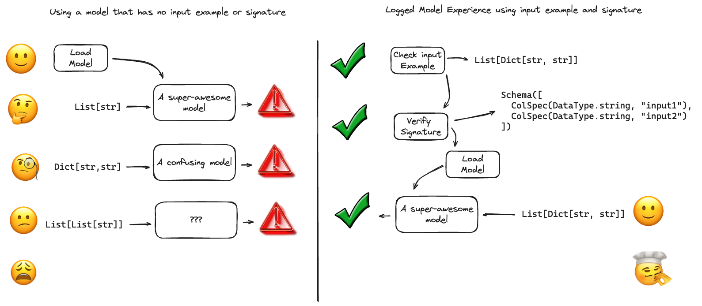
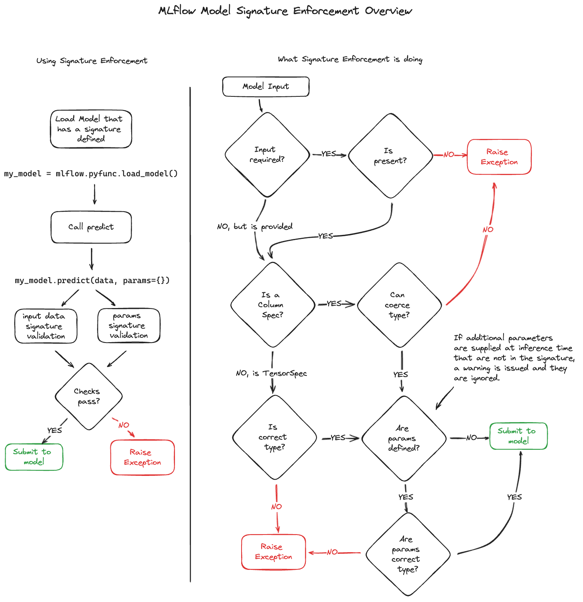

# MLflow 模型簽章與輸入範例

在 MLflow 中，模型簽章和模型輸入範例的概念對於有效使用機器學習模型至關重要。這些元件不僅僅提供元資料；他們為模型互動建立了重要的指導方針，增強了 MLflow 生態系統內的整合和可用性。

**Model Signature**

MLflow 中的 Model Signature 對於模型的清晰、準確操作至關重要。它定義了模型輸入和輸出的預期格式，包括推理所需的任何其他參數。該規範充當權威指南，確保模型與 MLflow 工具和外部服務的無縫整合。

**Model Input Example**

作為模型簽名的補充，Model Input Example 給出了有效模型輸入的具體實例。這個實踐範例對於開發人員來說非常寶貴，可以讓他們清楚地了解有效模型測試和實際應用所需的資料格式和結構。

## 為什麼這些很重要？



模型簽章和輸入範例是強大的 ML 工作流程的基礎，為模型互動提供了藍圖，確保一致性、準確性和易用性。它們充當模型與其用戶之間的合​​同，為預期的數據格式提供明確的指南，從而防止因不正確或意外的輸入而引起的溝通不暢和錯誤。

## 模型簽章

在 MLflow 中，模型簽章精確地定義了模型輸入、輸出以及有效模型操作所需的任何其他參數的架構。這個定義作為一個統一的介面，指導使用者正確、準確地使用他們的模型。模型簽章是 MLflow 生態系統不可或缺的一部分，讓 MLflow 追蹤 UI 和模型登錄機碼 UI 能夠清楚顯示模型所需的輸入、輸出和參數。此外，MLflow 模型部署工具利用這些簽章來確保推理中使用的資料符合模型的既定規範，從而維持模型的完整性和效能。有關這些簽名如何強制資料準確性的更多見解，請參閱簽名強制部分。

在 MLflow 中，在模型中嵌入模型簽章是一個簡單的過程。當使用 `sklearn.log_model()` 等函數來記錄或儲存模型時，只需包含 model input example 即可。此操作使 MLflow 能夠自動推斷模型的簽章。有關此過程的詳細說明可以在如何使用簽名記錄模型部分中找到。推斷的簽名以及其他基本模型元資料以 JSON 格式儲存在模型工件的 MLmodel 檔案中。如果需要在已記錄或儲存的模型中新增簽名，可以使用 `set_signature()` API 來實現此目的。有關實現此功能的詳細指南，請參閱 [How to set signatures on models](https://mlflow.org/docs/latest/model/signatures.html#how-to-set-signatures-on-models)。


### 模型簽章元件

MLflow 中模型簽署的結構由三種不同的模式類型組成：**(1) inputs**, **(2) outputs**　和 **(3) parameters (params)**。輸入和輸出模式分別指定模型期望接收和產生的資料結構。這些可以客製化以處理各種資料格式，包括柱狀資料和張量，以及陣列和物件類型輸入，滿足不同模型的不同需求。

另一方面，**Parameters (params)** 是指在模型推理階段至關重要的附加參數（通常是可選參數）。這些參數提供了額外的靈活性，允許對推理過程進行微調和自訂。

### 簽章 Playground

為了幫助理解如何將資料結構自動推斷為有效簽名，並提供有效簽名的廣泛範例，我們創建了一個您可以查看的筆記本，其中顯示了不同的範例及其推斷出的簽名。您可以在此處查看筆記本。

或者，如果您想在本地下載筆記本並使用您自己的資料結構進行測試，您可以在下面下載。

- [Download the Signature Playground Notebook](https://raw.githubusercontent.com/mlflow/mlflow/master/docs/source/model/notebooks/signature_examples.ipynb)

### 必填與可選輸入字段

在定義模型簽章時，需要考慮確定簽章強制執行的某些條件。最值得注意的之一是關於輸入資料的必需與可選的概念。

必填字段是輸入資料中必須存在的字段，以便模型能夠進行預測。如果缺少必填字段，簽名強制驗證將引發異常，指出缺少必填輸入字段。

為了將欄位配置為可選，您在使用 `mlflow.models.infer_signature()` 函數時必須為該欄位傳入 `None` 或 `np.nan` 值。或者，您可以手動定義簽名並將該欄位的必填欄位設為 `false`。

## 模型簽章資料型別

MLflow 支援兩種主要類型的簽名：用於基於 tabular-based data 的 column-based 的簽名，以及用於 tensor 資料的基於 tensor-based。

### Column-based 簽章

基於列的簽名通常用於需要表格資料輸入的傳統機器學習模型，例如 Pandas DataFrame。這些簽名由一系列 columns 組成，每個列可能具有名稱和指定的資料類型。輸入和輸出中每一列的類型都對應於受支援的資料類型之一，並且可以選擇對列進行命名。此外，輸入模式中的列可以指定為可選列，這表明它們在模型輸入中的包含不是強制性的，並且可以在必要時將其省略（有關更多詳細信息，請參閱 [Optional Column](https://mlflow.org/docs/latest/model/signatures.html#optional-column)）。

**支援的數據類型**

基於列的簽章支援 MLflow DataType 規格中定義的資料原語：

- string
- integer
- long
- float
- double
- boolean
- datetime

```python title="Input(Python)"
from mlflow.models import infer_signature

 infer_signature(model_input={
     "long_col": 1,
     "str_col": "a",
      "bool_col": True
 })
```

```yaml title="Inferred Signature"
signature:
    input: '[
        {"name": "long_col", "type": "long",    "required": "true"},
        {"name": "str_col",  "type": "string",  "required": "true"},
        {"name": "bool_col", "type": "boolean", "required": "true"}
    ]'
    output: null
    params: null
```

基於列的簽章也支援這些原語的複合資料型別。

- Array (list, numpy arrays)
- Object (dictionary)

透過查看 [signature examples notebook](https://mlflow.org/docs/latest/model/notebooks/signature_examples.html) 可以看到複合資料類型的其他範例。


```python title="Input(Python)"
from mlflow.models import infer_signature

infer_signature(model_input={
    # Python list
    "list_col": ["a", "b", "c"],
    # Numpy array
    "numpy_col": np.array([[1, 2], [3, 4]]),
    # Dictionary
    "obj_col": {
        "long_prop": 1,
         "array_prop": ["a", "b", "c"],
    },
 })

```

```yaml title="Inferred Signature"
signature:
    input: '[
         {"list_col": Array(string) (required)},
         {"numpy_col": Array(Array(long)) (required)},
         {"obj_col": {array_prop: Array(string) (required), long_prop: long (required)} (required)}
    ]'
    output: null
    params: null
```

**Optional Column**

輸入資料中包含 `None` 或 `np.nan` 值的欄位將被推斷為可選（即 `required=False`）


```python title="Input(Python)"
from mlflow.models import infer_signature

infer_signature(model_input=
    pd.DataFrame({
        "col": [1.0, 2.0, None]
    })
)
```

```yaml title="Inferred Signature"
signature:
    input: '[
        {"name": "col", "type": "double", "required": false}
    ]'
    output: null
    params: null
```

!!! note
    嵌套數組可以包含一個空列表，並且它不會使該列成為可選的，因為它表示一個空集合 (∅)。在這種情況下，模式將從清單的其他元素推斷出來，假設它們具有同構類型。如果您想要讓某列成為可選列，請傳遞 `None` 。

    ```python title="Input(Python)"
    infer_signature(model_input={
        "list_with_empty": [["a", "b"], []],
        "list_with_none": [["a", "b"], None],
    })
    ```

    ```yaml title="Inferred Signature"
    signature:
        input: '[
            {"name": "list_with_empty", "type": "Array(str)", "required": "true" },
            {"name": "list_with_none" , "type": "Array(str)", "required": "false"},
        ]'
        output: null
        params: null
    ```

### Tensor-based 簽章

基於張量的簽章主要用於處理張量輸入的模型，通常出現在涉及影像、音訊資料和類似格式的深度學習應用中。這些模式由張量序列組成，每個張量可能由特定的 numpy 資料類型命名和定義。

在基於張量的簽名中，每個輸入和輸出張量都有三個屬性：**dtype**（資料類型，與 numpy 資料類型對齊）、**shape** 和可選 **name**。值得注意的是，基於張量的簽章不支援可選輸入。 shape 屬性通常會對大小可能變化的任何維度使​​用 `-1`，這在批次 input 中常見。

考慮在 MNIST 資料集上訓練的分類模型。其模型簽名的一個範例是一個輸入張量，將影像表示為 28 × 28 × 1 float32 數字陣列。模型的輸出可能是一個張量，表示 10 個目標類別中每個類別的機率。在這種情況下，表示批次大小的第一個維度通常設定為 `-1`，允許模型處理不同大小的批次。

```yaml
signature:
    inputs: '[{"name": "images", "type": "tensor", "tensor-spec": {"dtype": "uint8", "shape": [-1, 28, 28, 1]}}]'
    outputs: '[{"type": "tensor", "tensor-spec": {"shape": [-1, 10], "dtype": "float32"}}]'
    params: null
```

**支援的數據類型**

Tensor-based schemas 支援 [numpy data types](https://numpy.org/devdocs/user/basics.types.html)。


```python title="Input(Python)"
from mlflow.models import infer_signature

infer_signature(model_input=np.array([
    [[1, 2, 3], [4, 5, 6]],
    [[7, 8, 9], [1, 2, 3]],
]))
```

```yaml title="Inferred Signature"
signature:
    input: '[{"type": "tensor", "tensor-spec": {"dtype": "int64", "shape": [-1, 2, 3]}}]'
    output: None
    params: None
```

### 具有推理參數的模型簽章

推理參數（或 “params”）是在推理階段傳遞給模型的附加設定。常見範例包括語言學習模型 (LLM) 中的溫度和 max_length 等參數。這些參數在訓練期間通常不需要，但在推理時調整模型的行為方面發揮著至關重要的作用。這種配置對於基礎模型變得越來越重要，因為同一模型可能需要針對不同推理場景的不同參數設定。

MLflow 2.6.0 版本在模型推理過程中引入了推理參數字典的規格。此功能增強了對推理結果的靈活性和控制，從而實現更細緻的模型行為調整。

要在推理時利用參數，必須將它們合併到模型簽名中。 params 的模式定義為一系列 ParamSpec 元素，每個元素包含：

- **name**: 參數的標識符，例如溫度。
- **type**: 參數的資料類型，必須與支援的資料類型之一一致。
- **default**: 參數的預設值，確保在未提供特定值時有後備選項。
- **shape**: 參數的形狀，對於標量值通常為 None，對於列表通常為 (-1,)。

此功能標誌著 MLflow 處理模型推理方式的重大進步，為模型參數化提供了更動態和更具適應性的方法。

```yaml
signature:
    inputs: '[{"name": "input", "type": "string"}]'
    outputs: '[{"name": "output", "type": "string"}]'
    params: '[
        {
            "name": "temperature",
            "type": "float",
            "default": 0.5,
            "shape": null
        },
        {
            "name": "suppress_tokens",
            "type": "integer",
            "default": [101, 102],
             "shape": [-1]
        }
    ]'
```

在推論階段，推論參數以字典的形式提供給模型。每個參數值都需要經過驗證，以確保其與模型簽章中指定的類型相符。下面的範例說明了在模型簽章中定義參數的過程，並示範了它們在模型推論中的應用。

```python
import mlflow
from mlflow.models import infer_signature


class MyModel(mlflow.pyfunc.PythonModel):
    def predict(self, ctx, model_input, params):
        return list(params.values())


params = {"temperature": 0.5, "suppress_tokens": [101, 102]}
# params' default values are saved with ModelSignature
signature = infer_signature(["input"], params=params)

with mlflow.start_run():
    model_info = mlflow.pyfunc.log_model(
        python_model=MyModel(), artifact_path="my_model", signature=signature
    )

loaded_model = mlflow.pyfunc.load_model(model_info.model_uri)

# Not passing params -- predict with default values
loaded_predict = loaded_model.predict(["input"])
assert loaded_predict == [0.5, [101, 102]]

# Passing some params -- override passed-in params
loaded_predict = loaded_model.predict(["input"], params={"temperature": 0.1})
assert loaded_predict == [0.1, [101, 102]]

# Passing all params -- override all params
loaded_predict = loaded_model.predict(
    ["input"], params={"temperature": 0.5, "suppress_tokens": [103]}
)
assert loaded_predict == [0.5, [103]]
```

MLflow 中的參數定義為接受 MLflow DataType 的值，包括這些資料類型的一維清單。目前，MLflow 僅支援一維參數清單。

## 簽章強制

MLflow 的模式實作根據模型簽章嚴格驗證提供的輸入和參數。如果輸入不相容，它會引發異常，並發出警告或引發不相容參數的異常。此強制執行在呼叫底層模型實作之前以及整個模型推理過程中應用。但請注意，此強制執行特定於使用 MLflow 模型部署工具或模型作為 `python_function` 載入時的場景。它不適用於以其本機格式載入的模型，例如透過 `mlflow.sklearn.load_model()` 載入的模型。



### Name Ordering Enforcement

在 MLflow 中，輸入名稱會根據模型簽章進行驗證。缺少必需的輸入會觸發異常，而缺少可選的輸入則不會。簽名中未聲明的輸入將被忽略。當簽名中的輸入模式指定輸入名稱時，將按名稱進行匹配，並相應地對輸入進行重新排序。如果架構缺少輸入名稱，則符合基於輸入的順序，MLflow 僅檢查提供的輸入數量。

### Input Type Enforcement

MLflow 強制執行模型簽章中定義的輸入類型。對於基於列的簽章模型（例如使用 DataFrame 輸入的簽章模型），MLflow 在必要時執行安全性類型轉換，僅允許無損轉換。例如，允許將 int 轉換為 long 或將 int 轉換為 double，但不允許將 long 轉換為 double。如果類型無法相容，MLflow 將引發錯誤。

對於 Pyspark DataFrame 輸入，MLflow 將 PySpark DataFrame 的樣本轉換為 Pandas DataFrame。 MLflow 將僅在資料行的子集上強制執行架構。

對於基於張量的簽章模型，類型檢查更加嚴格。如果輸入類型與架構指定的類型不一致，則會引發例外狀況。

### Params Type 與 Shape Enforcement

在 MLflow 中，參數 (params) 的類型和形狀會根據模型簽章進行仔細檢查。在推理過程中，每個參數的類型和形狀都會經過驗證，以確保它們與簽名中的規範保持一致。標量值的形狀應為 `None`，而列表值的形狀應為 `(-1,)`。如果發現參數的類型或形狀不相容，MLflow 會引發異常。此外，參數的值會根據簽章中指定的類型進行驗證檢查。如果轉換為指定類型失敗，則會觸發 MlflowException。有關有效參數的完整列表，請參閱模型推理參數部分。


### Handling Integers With Missing Values

在 Python 中，缺失值的整數資料通常表示為浮點數。這會導致整數列的資料類型發生變化，可能會在運行時導致架構強制錯誤，因為整數和浮點數本質上並不相容。例如，如果訓練資料中的 “c” 列完全是整數，它將被這樣識別。然而，如果‘c’中引入了缺失值，它將被表示為浮點數。如果模型的簽章期望「c」是整數，則 MLflow 將因無法將浮點轉換為整數而引發錯誤。為了緩解此問題，特別是由於 MLflow 使用 Python 進行模型服務和 Spark 部署，建議將缺失值的整數列定義為雙精確度數 (float64)。


### Handling Date and Timestamp

Python 的日期時間類型具有內建精確度，例如用於日精度的 `datetime64[D]` 和用於奈秒精度的 `datetime64[ns]`。雖然這種精確度細節在基於列的模型簽章中被忽略，但在基於張量的簽章中被強制執行。

### Handling Ragged Arrays

numpy 中的參差不齊的數組，其特徵為 (-1,) 的形狀和物件的 dtype，在使用 infer_signature 時會自動管理。這會產生類似 Tensor('object', (-1,)) 的簽章。為了更詳細的表示，可以手動建立簽章來反映不規則數組的特定性質，例如 Tensor('float64', (-1, -1, -1, 3))。然後按照簽名中的詳細說明進行強制執行，以適應不規則的輸入數組。

## 如何記錄模型與簽章

在 MLflow 中包含模型簽章非常簡單。只需在呼叫 巷`log_model()` 或 `save_model()` 函數（例如使用 `sklearn.log_model()`）時提供 [model input example](https://mlflow.org/docs/latest/model/signatures.html#input-example) 。然後，MLflow 將根據此輸入範例以及給定範例的模型預測輸出自動推斷模型的簽章。

或者，您可以將[簽名物件(signature object)](https://mlflow.org/docs/latest/python_api/mlflow.models.html#mlflow.models.ModelSignature)明確附加到您的模型。這是透過將簽名物件傳遞給 `log_model()` 或 `save_model()` 函數來完成的。您可以手動建立模型簽章對象，或使用 `infer_signature()` 函數從具有有效模型輸入（例如，訓練資料集減去目標列）、有效模型輸出（例如對訓練資料集進行的預測）的資料集產生模型簽章對象，以及有效的模型參數（例如用於模型推理的參數字典，常見於變壓器的生成配置中）。

!!! tip
    模型簽章在 MLflow 模型部署工具中發揮著至關重要的作用，特別是對於以 Python 函數 (PyFunc) flavor 提供模型的服務。因此，在將簽章附加到 `log_model` 或 `save_model` 呼叫時，確保簽章準確反映模型的 PyFunc 表示形式預期的輸入和輸出非常重要。如果模型的輸入模式（當作為 PyFunc 載入時）與用於測試的資料集的輸入模式不同（這種情況的一個例子是 pmdarima 模型風格），那麼這種考慮就變得尤為重要。


### Column-based Signature Example

以下範例示範如何儲存在 Iris 資料集上訓練的簡單分類器的模型簽章：

```python
import pandas as pd
from sklearn import datasets
from sklearn.ensemble import RandomForestClassifier
import mlflow

iris = datasets.load_iris()
iris_train = pd.DataFrame(iris.data, columns=iris.feature_names)

clf = RandomForestClassifier(max_depth=7, random_state=0)

with mlflow.start_run():
    # 進行模型訓練
    clf.fit(iris_train, iris.target)

    # 以訓練資料集的第一行作為模型輸入範例。
    input_example = iris_train.iloc[[0]]

    # 簽章是根據輸入範例及其預測輸出自動推斷出來的。
    mlflow.sklearn.log_model(clf, "iris_rf", input_example=input_example)
```

也可以明確地手動建立並記錄相同的簽章，如下所示：

```python
from mlflow.models import ModelSignature, infer_signature
from mlflow.types.schema import Schema, ColSpec

# Option 1: 手動建構簽章物件
input_schema = Schema(
    [
        ColSpec("double", "sepal length (cm)"),
        ColSpec("double", "sepal width (cm)"),
        ColSpec("double", "petal length (cm)"),
        ColSpec("double", "petal width (cm)"),
    ]
)

output_schema = Schema([ColSpec("long")])

signature = ModelSignature(inputs=input_schema, outputs=output_schema)

# Option 2: 推斷出簽章
signature = infer_signature(iris_train, clf.predict(iris_train))

with mlflow.start_run():
    mlflow.sklearn.log_model(clf, "iris_rf", signature=signature)
```

### Tensor-based Signature Example

以下範例示範如何儲存在 MNIST 資料集上訓練的簡單分類器的模型簽章：

```python
import tensorflow as tf
import mlflow

mnist = tf.keras.datasets.mnist

(x_train, y_train), (x_test, y_test) = mnist.load_data()

x_train, x_test = x_train / 255.0, x_test / 255.0

model = tf.keras.models.Sequential(
    [
        tf.keras.layers.Flatten(input_shape=(28, 28)),
        tf.keras.layers.Dense(128, activation="relu"),
        tf.keras.layers.Dropout(0.2),
        tf.keras.layers.Dense(10),
    ]
)

loss_fn = tf.keras.losses.SparseCategoricalCrossentropy(from_logits=True)

model.compile(optimizer="adam", loss=loss_fn, metrics=["accuracy"])

with mlflow.start_run():
    # 進行模型訓練
    model.fit(x_train, y_train, epochs=5)

    # 將前三個訓練範例作為模型輸入範例。
    input_example = x_train[:3, :]

    # 簽章是根據輸入範例及其預測輸出自動推斷出來的。
    mlflow.tensorflow.log_model(model, "mnist_cnn", input_example=input_example)
```

也可以明確地手動建立並記錄相同的簽章，如下所示：

```python
import numpy as np
from mlflow.models import ModelSignature, infer_signature
from mlflow.types.schema import Schema, TensorSpec

# Option 1: 手動建構簽章物件
input_schema = Schema(
    [
        TensorSpec(np.dtype(np.float64), (-1, 28, 28, 1)),
    ]
)

output_schema = Schema([TensorSpec(np.dtype(np.float32), (-1, 10))])

signature = ModelSignature(inputs=input_schema, outputs=output_schema)

# Option 2: 推斷出簽章
signature = infer_signature(testX, model.predict(testX))

with mlflow.start_run():
    mlflow.tensorflow.log_model(model, "mnist_cnn", signature=signature)
```

### Signature with params Example

以下範例示範如何為簡單的 Transformer 模型儲存帶有參數的模型簽章：

```python
import mlflow
from mlflow.models import infer_signature
import transformers

architecture = "mrm8488/t5-base-finetuned-common_gen"

model = transformers.pipeline(
    task="text2text-generation",
    tokenizer=transformers.T5TokenizerFast.from_pretrained(architecture),
    model=transformers.T5ForConditionalGeneration.from_pretrained(architecture),
)

data = "pencil draw paper"

# 定義模型推論所使用的參數範本
params = {
    "top_k": 2,
    "num_beams": 5,
    "max_length": 30,
    "temperature": 0.62,
    "top_p": 0.85,
    "repetition_penalty": 1.15,
    "begin_suppress_tokens": [1, 2, 3],
}

# 推斷出簽章(參數)
signature = infer_signature(
    data,
    mlflow.transformers.generate_signature_output(model, data),
    params,
)

# 儲存有簽章(參數)的模型
mlflow.transformers.save_model(
    model,
    "text2text",
    signature=signature,
)

# 載入模型
pyfunc_loaded = mlflow.pyfunc.load_model("text2text")

# 進行推論(夾附參數)
result = pyfunc_loaded.predict(data, params=params)
```

可以明確建立相同的簽名，如下所示：

```python
from mlflow.models import ModelSignature
from mlflow.types.schema import ColSpec, ParamSchema, ParamSpec, Schema

input_schema = Schema([ColSpec(type="string")])
output_schema = Schema([ColSpec(type="string")])
params_schema = ParamSchema(
    [
        ParamSpec("top_k", "long", 2),
        ParamSpec("num_beams", "long", 5),
        ParamSpec("max_length", "long", 30),
        ParamSpec("temperature", "double", 0.62),
        ParamSpec("top_p", "double", 0.85),
        ParamSpec("repetition_penalty", "double", 1.15),
        ParamSpec("begin_suppress_tokens", "long", [1, 2, 3], (-1,)),
    ]
)

signature = ModelSignature(
    inputs=input_schema, outputs=output_schema, params=params_schema
)
```

## 如何在既存模型設定簽章

可以在沒有模型簽名或錯誤簽名的情況下保存模型。若要新增或更新現有記錄模型的簽名，請使用 [mlflow.models.set_signature()](https://mlflow.org/docs/latest/python_api/mlflow.models.html#mlflow.models.set_signature) API。下面是一些示範其用法的範例。

### Setting a Signature on a Logged Model

以下範例示範如何在已記錄的 sklearn 模型上設定模型簽章。假設您記錄了一個沒有簽章的 sklearn 模型，如下所示：

```python
import pandas as pd
from sklearn import datasets
from sklearn.ensemble import RandomForestClassifier
import mlflow

X, y = datasets.load_iris(return_X_y=True, as_frame=True)
clf = RandomForestClassifier(max_depth=7, random_state=0)

with mlflow.start_run() as run:
    # 模型訓練
    clf.fit(X, y)

    # 記錄與保存模型到 MLflow 上
    mlflow.sklearn.log_model(clf, "iris_rf")
```

您可以在記錄的模型上設定簽名，如下所示：

```python
import pandas as pd
from sklearn import datasets
import mlflow
from mlflow.models.model import get_model_info
from mlflow.models import infer_signature, set_signature

# 載入己記錄在 MLflow 上的模型
model_uri = f"runs:/{run.info.run_id}/iris_rf"
model = mlflow.pyfunc.load_model(model_uri)

# 從測試資料集建立模型簽章
X_test, _ = datasets.load_iris(return_X_y=True, as_frame=True)
signature = infer_signature(X_test, model.predict(X_test))

# 設定既存記錄模型的簽名
set_signature(model_uri, signature)

# 現在，當您再次載入模型時，它將具有所需的簽名
assert get_model_info(model_uri).signature == signature
```

### Setting a Signature on a Registered Model

由於 MLflow 模型登錄工件是唯讀的，因此您無法直接在模型版本或由 `models:/URI` 方案表示的模型工件上設定簽名。相反，您應該先在來源模型工件上設定簽名，並使用更新的模型工件產生新的模型版本。以下範例說明如何完成此操作。

假設您建立了以下沒有簽名的模型版本，如下所示：

```python
from sklearn.ensemble import RandomForestClassifier
import mlflow
from mlflow.client import MlflowClient

model_name = "add_signature_model"

with mlflow.start_run() as run:
    mlflow.sklearn.log_model(RandomForestClassifier(), "sklearn-model")

model_uri = f"runs:/{run.info.run_id}/sklearn-model"
mlflow.register_model(model_uri=model_uri, name=model_name)
```

若要在模型版本上設定簽名，請使用新簽名建立重複的模型版本，如下所示：

```python
from sklearn.ensemble import RandomForestClassifier
import mlflow
from mlflow.store.artifact.models_artifact_repo import ModelsArtifactRepository

client = mlflow.client.MlflowClient()

model_name = "add_signature_model"
model_version = 1

mv = client.get_model_version(name=model_name, version=model_version)

# 在模型版本來源上設定虛擬簽名
signature = infer_signature(np.array([1]))
set_signature(mv.source, signature)

# 使用更新的來源建立新的模型版本
client.create_model_version(name=model_name, source=mv.source, run_id=mv.run_id)
```

請注意，此程序會使用新的模型簽章覆蓋模型版本 1 的來源運行中的模型工件。

## 模型輸入範例

模型輸入範例提供了有效模型輸入的實例。輸入範例作為單獨的工件與模型一起儲存，並在 MLmodel 檔案中引用。若要在模型中包含輸入範例，請將其新增至適當的 `log_model()` 呼叫中，例如`sklearn.log_model()`。當未指定簽名時，輸入範例也用於推斷 `log_model()` 呼叫中的模型簽名。

!!! tip
    在記錄模型時包含輸入範例(input example)具有雙重好處。首先，它有助於推斷模型的簽名。其次，同樣重要的是，它驗證了模型的要求。此輸入範例用於使用即將被記錄的模型來執行預測，從而提高識別模型需求依賴性的準確性。強烈建議您在記錄模型時始終包含輸入範例和模型。

預設情況下，如果輸入範例是字典(dictionary)，MLflow 在儲存時將其轉換為 **pandas DataFrame** 格式。請注意，對於 langchain、openai、pyfunc 和 Transformers 風格，可以透過將 **example_no_conversion** 設為 `False` 來儲存輸入範例而不進行轉換。

與模型簽章類似，模型輸入可以是基於列的（即 DataFrames）、基於張量的（即 numpy.ndarrays）或 json 物件（即 python 字典）。我們透過使用元組組合模型輸入和參數來為帶有參數的 input_example 提供支援。請參閱下面的範例：

### How To Log Model With Column-based Example

對於接受基於列(column-based)的輸入的模型，範例可以是單一記錄或一批記錄。範例輸入可以採用以下格式：

- Pandas DataFrame
- dict (of scalars, strings, or lists of scalar values)
- list
- str
- bytes

給定的範例將轉換為 Pandas DataFrame，然後使用 Pandas 面向分割的格式序列化為 json。位元組採用 Base64 編碼。以下範例示範如何使用模型記錄基於列的輸入範例：

```python
input_example = {
    "sepal length (cm)": 5.1,
    "sepal width (cm)": 3.5,
    "petal length (cm)": 1.4,
    "petal width (cm)": 0.2,
}

mlflow.sklearn.log_model(..., input_example=input_example)
```

### How To Log Models With a Tensor-based Example

對於接受基於張量的輸入的模型，範例必須是一批輸入。預設情況下，軸 0 是批次軸，除非模型簽章另有指定。範例輸入可以採用以下任意格式傳遞：

- numpy ndarray
- Python dict mapping a string to a numpy array
- Scipy csr_matrix (sparse matrix)
- Scipy csc_matrix (sparse matrix)

以下範例示範如何使用模型記錄基於張量的輸入範例：

```python
# each input has shape (4, 4)
input_example = np.array(
    [
        [[0, 0, 0, 0], [0, 134, 25, 56], [253, 242, 195, 6], [0, 93, 82, 82]],
        [[0, 23, 46, 0], [33, 13, 36, 166], [76, 75, 0, 255], [33, 44, 11, 82]],
    ],
    dtype=np.uint8,
)

mlflow.tensorflow.log_model(..., input_example=input_example)
```

### How To Log Models Using a JSON Object Example

對於接受 python 字典輸入而不是 pandas DataFrame 的模型，我們支援直接按原樣保存範例。若要啟用此功能，在記錄模型時應將 **example_no_conversion** 設為 `True`。此功能僅支援 langchain、openai、pyfunc 和 Transformers 風格，其中直接保存範例對於推理和模型服務很有用。預設情況下，**example_no_conversion** 設定為 `False` 以實現向後相容性。

以下範例示範如何使用模型記錄 json 物件輸入範例：

```python
input_example = {
    "messages": [
        {"role": "system", "content": "You are a helpful assistant."},
        {"role": "assistant", "content": "What would you like to ask?"},
        {"role": "user", "content": "Who owns MLflow?"},
    ]
}

mlflow.langchain.log_model(..., input_example=input_example, example_no_conversion=True)
```

### How To Log Model With an Example that Contains Params

對於在推理過程中需要額外參數的模型，您可以在儲存或記錄模型時包含包含參數的 input_example。為了實現這一點，範例輸入應作為元組提供。元組的第一個元素是輸入資料範例，第二個元素是參數的字典。有效參數的完整清單記錄在模型推理參數部分。

- Python tuple: (input_data, params)

以下範例示範如何使用包含參數的範例來記錄模型：

```python
# nput_example 可以是基於列或基於張量的範例，如上所示
# params 必須是有效的 params 字典
input_data = "Hello, Dolly!"

params = {"temperature": 0.5, "top_k": 1}

input_example = (input_data, params)

mlflow.transformers.log_model(..., input_example=input_example)
```
