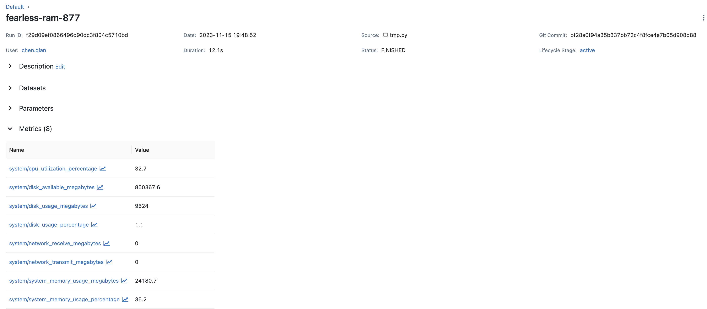

# System Metrics

MLflow 允許使用者在 MLflow 運行執行期間記錄系統指標，包括 CPU 統計資料、GPU 統計資料、記憶體使用情況、網路流量和磁碟使用情況。在本指南中，我們將介紹如何使用 MLflow 管理系統指標日誌記錄。

## 額外的依賴項

若要在 MLflow 中記錄系統指標，請安裝 `psutil`。MLflow 的套件并沒有將 `psutil` 包含在 MLflow 的依賴項中，是因為 `psutil` 的 Wheel 安裝並不適用於 **linux aarch64** (Arm64 的 CPU)，並且從原始碼建置會間歇性失敗。若要安裝 `psutil`，請執行下列命令：

```bash
pip install psutil
```

如果你想捕捉 GPU 指標，你還需要安裝 `pynvml`：

```bash
pip install pynvml
```

## 開啟/關閉系統指標記錄

可透過三種方式的任一種來啟用或停用系統指標日誌記錄：

- 將環境變數 **MLFLOW_ENABLE_SYSTEM_METRICS_LOGGING** 設為 `false` 以關閉系統指標日誌記錄，或設為 `true` 以針對所有 MLflow runs 啟用它。
- 使用 `mlflow.enable_system_metrics_logging()` 啟用所有 MLflow run 的系統指標日誌記錄，並使用 `mlflow.disable_system_metrics_logging()` 停用所有 MLflow run 的系統指標日誌記錄。
- 使用 `mlflow.start_run()` 中的 `log_system_metrics` 參數來控制目前 MLflow run 的系統指標日誌記錄，即 `mlflow.start_run(log_system_metrics=True)` 將啟用系統指標日誌記錄。

### 使用環境變數

您可以將環境變數 **MLFLOW_ENABLE_SYSTEM_METRICS_LOGGING** 設定為 `true` 以全域開啟系統指標日誌記錄，如下所示：

```bash
export MLFLOW_ENABLE_SYSTEM_METRICS_LOGGING=true
```

但是，如果您在 Ipython 筆記本（Jupyter、Databricks 筆記本、Google Colab）中執行上述命令，則由於臨時 shell 的隔離狀態，`export` 命令將無法運作。相反，您可以使用以下程式碼：

```python
import os

os.environ["MLFLOW_ENABLE_SYSTEM_METRICS_LOGGING"] = "true"
```

設定環境變數後，您將看到啟動 MLflow run 將自動收集並記錄預設系統指標。嘗試在您喜歡的環境中執行以下程式碼，您應該會看到記錄的運行資料中存在系統指標。

```python
import mlflow
import time

with mlflow.start_run() as run:
    time.sleep(15)

print(mlflow.MlflowClient().get_run(run.info.run_id).data)
```

你的輸出應該是這樣的：

```bash
<RunData: metrics={'system/cpu_utilization_percentage': 12.4,
'system/disk_available_megabytes': 213744.0,
'system/disk_usage_megabytes': 28725.3,
'system/disk_usage_percentage': 11.8,
'system/network_receive_megabytes': 0.0,
'system/network_transmit_megabytes': 0.0,
'system/system_memory_usage_megabytes': 771.1,
'system/system_memory_usage_percentage': 5.7}, params={}, tags={'mlflow.runName': 'nimble-auk-61',
'mlflow.source.name': '/usr/local/lib/python3.10/dist-packages/colab_kernel_launcher.py',
'mlflow.source.type': 'LOCAL',
'mlflow.user': 'root'}>
```

!!! tip
    由於 MLflow 預設每 10 秒去收集一次 system metrics, 如果 MLflow 的 run 的時間長度小於 10 秒就完成的話, 有可能會看不到 system metrics 的相關訊息。

若要停用系統指標日誌記錄，您可以使用下列命令之一：

```bash
export MLFLOW_ENABLE_SYSTEM_METRICS_LOGGING="false"
```

或是：

```python
import os

del os.environ["MLFLOW_ENABLE_SYSTEM_METRICS_LOGGING"]
```

重新運行上面的 MLflow 程式碼將不會記錄系統指標。

### 使用 mlflow.enable_system_metrics_logging()

我們還提供了一對 API `mlflow.enable_system_metrics_logging()` 和 `mlflow.disable_system_metrics_logging()`，用於在您沒有設定環境變數的適當存取權限的環境中全域開啟/關閉系統指標日誌記錄。

執行下列程式碼與將 **MLFLOW_ENABLE_SYSTEM_METRICS_LOGGING** 環境變數設為 `true` 具有相同的效果：

```python
import mlflow

mlflow.enable_system_metrics_logging()

with mlflow.start_run() as run:
    time.sleep(15)

print(mlflow.MlflowClient().get_run(run.info.run_id).data)
```

### 針對特定的 Run 啟動

除了全域控制系統指標日誌記錄之外，您還可以控制單次運行。為此，請在 `mlflow.start_run()` 中相應地將 `log_system_metrics` 設為 `True` 或 `False`：

```python
with mlflow.start_run(log_system_metrics=True) as run:
    time.sleep(15)

print(mlflow.MlflowClient().get_run(run.info.run_id).data)
```

另請注意，使用 `log_system_metrics` 將忽略系統指標日誌記錄的全域狀態。換句話說，即使您透過將 **MLFLOW_ENABLE_SYSTEM_METRICS_LOGGING** 設定為 `false` 或呼叫 `mlflow.disable_system_metrics_logging()` 來停用了系統指標日誌記錄，上述程式碼也會記錄特定運行的系統指標。


## System Metrics 種類

預設情況下，MLflow 記錄以下系統指標：

- `cpu_utilization_percentage`
- `system_memory_usage_megabytes`
- `system_memory_usage_percentage`
- `gpu_utilization_percentage`
- `gpu_memory_usage_megabytes`
- `gpu_memory_usage_percentage`
- `gpu_power_usage_watts`
- `gpu_power_usage_percentage`
- `network_receive_megabytes`
- `network_transmit_megabytes`
- `disk_usage_megabytes`
- `disk_available_megabytes`

僅當 GPU 可用且安裝了 `pynvml` 時才會記錄 GPU 指標。

每個系統指標在出於分組目的而記錄時都有一個前綴 `system/`。因此，記錄的實際指標名稱將帶有 `system/` 前綴，例如 `system/cpu_utilization_percentage`、`system/system_memory_usage_megabytes` 等。

## 在 MLflow UI 中查看系統指標

系統指標可在 MLflow UI 的指標部分下找到。為了查看它們，讓我們啟動 MLflow tracking service，並向其記錄一些系統指標：

```python
import mlflow
import time

mlflow.set_tracking_uri("http://127.0.0.1:5000")

with mlflow.start_run() as run:
    time.sleep(15)

```




## 客制系統指標日誌記錄

### 客制 Logging Frequency

預設情況下，系統指標每 10 秒採樣一次，採樣後直接記錄日誌。您可以將環境變數 **MLFLOW_SYSTEM_METRICS_SAMPLING_INTERVAL** 設定為表示日誌記錄頻率（以秒為單位）的整數或使用 `mlflow.set_system_metrics_sampling_interval()` 設定間隔來自訂取樣頻率，如下所示。

除了設定指標日誌記錄的頻率之外，您還可以自訂要聚合的樣本數量。您也可以透過設定環境變數 **MLFLOW_SYSTEM_METRICS_SAMPLES_BEFORE_LOGGING** 或使用 `mlflow.set_system_metrics_samples_before_logging()` 自訂在記錄之前聚合的樣本數量。

實際記錄時間視窗是 **MLFLOW_SYSTEM_METRICS_SAMPLING_INTERVAL** 和 **MLFLOW_SYSTEM_METRICS_SAMPLES_BEFORE_LOGGING** 的乘積。 例如，如果您將取樣間隔設為 2 秒，並將取樣次數設為 3，那麼系統指標將每 2 秒收集一次。在收集 3 次樣本後（2秒 * 3次 = 6秒），我們會聚合這些指標並將其記錄到 MLflow 伺服器。聚合邏輯取決於不同的系統指標。例如，對於 `cpu_utilization_percentage`，聚合邏輯是取樣本的平均值。

您將看到 `system/cpu_utilization_percentage` 被記錄了幾次。