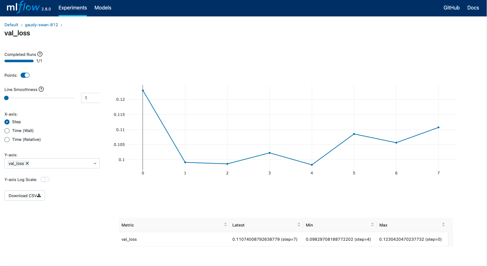

# MLflow Tracking

MLflow Tracking 是一個 API 和 UI，用於在運行機器學習程式碼時記錄參數、程式碼版本、指標和輸出文件，並用於稍後視覺化結果。 MLflow Tracking 提供 [Python](https://mlflow.org/docs/latest/python_api/index.html#python-api)、[REST](https://mlflow.org/docs/latest/rest-api.html#rest-api)、[R](https://mlflow.org/docs/latest/R-api.html#r-api) 和 [Java](https://mlflow.org/docs/latest/java_api/index.html#java-api) API。

