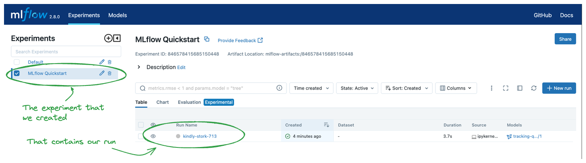
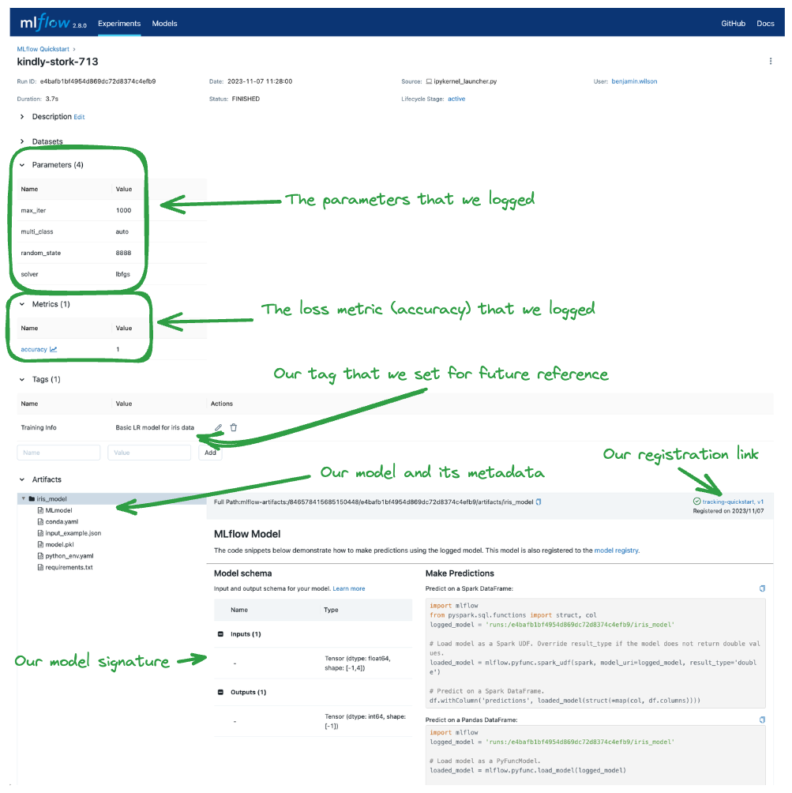

# MLflow Tracking Quickstart

本快速入門的目的是提供 MLflow Tracking 最基本的核心 API 的快速指南。具體來說，是那些啟用日誌記錄、註冊和載入模型以進行推理的功能。

!!! info
    如需更深入的 MLflow 教程，請參閱 [MLflow 入門教程](https://mlflow.org/docs/latest/getting-started/logging-first-model/index.html)。不過，我們建議您先從這裡開始，因為本快速入門使用最常見和最常用的 MLflow Tracking API，並為文件中的其他教學課程奠定了良好的基礎。

## 你將學到什麼

只需幾分鐘的時間來學習本快速入門，您將了解到：

- 如何記錄參數、指標和模型
- MLflow Fluent API 的基礎知識
- 如何在日誌記錄期間註冊模型
- 如何導覽到 MLflow UI 中的模型
- 如何載入記錄的模型進行推理

## Step 1 - Get MLflow

MLflow 可在 PyPI 上使用。如果您的系統上尚未安裝它，您可以使用以下命令進行安裝：

```bash
pip install mlflow
```

## Step 2 - Start a Tracking Server

方便使用者練習, 我們運行一個本地 tracing server。

我們將啟動一個本地 MLflow tracking server，我們將連接到該伺服器來記錄本快速入門的資料。從 termianl 運行：

```bash
mlflow server --host 127.0.0.1 --port 8080
```

**設定追蹤伺服器 URI**

如果您使用的不是 Databricks 提供的託管 MLflow 追蹤伺服器，或者您正在執行本機追蹤伺服器，請確保使用下列命令設定追蹤伺服器的 uri：

```python
import mlflow

mlflow.set_tracking_uri(uri="http://<host>:<port>")
```

如果您的 Notebook 或 runtime 環境中未設定此項，則執行將記錄到您的本機檔案系統中。

## Step 3 - Train a model and prepare metadata for logging

在本節中，我們將使用 MLflow 記錄模型。步驟的快速概述如下：

- 載入並準備 Iris 資料集以進行建模。
- 訓練邏輯迴歸模型並評估其表現。
- 準備模型超參數並計算日誌記錄指標。

```python
import mlflow
from mlflow.models import infer_signature

import pandas as pd
from sklearn import datasets
from sklearn.model_selection import train_test_split
from sklearn.linear_model import LogisticRegression
from sklearn.metrics import accuracy_score, precision_score, recall_score, f1_score


# 載入鳶尾花資料集
X, y = datasets.load_iris(return_X_y=True)

# 將資料分為訓練集和測試集
X_train, X_test, y_train, y_test = train_test_split(
    X, y, test_size=0.2, random_state=42
)

# 定義模型超參數
params = {
    "solver": "lbfgs",
    "max_iter": 1000,
    "multi_class": "auto",
    "random_state": 8888,
}

# 訓練模型
lr = LogisticRegression(**params)
lr.fit(X_train, y_train)

# 在測試集上進行預測
y_pred = lr.predict(X_test)

# 計算 metrics
accuracy = accuracy_score(y_test, y_pred)
```

## Step 4 - Log the model and its metadata to MLflow

在下一步中，我們將使用我們訓練的模型、為模型擬合指定的超參數以及透過評估模型在測試資料上的表現計算的損失指標，以記錄到 MLflow。

我們將採取的步驟是：

- 啟動 MLflow 運行上下文以啟動新的運行，我們將在其中記錄模型和元資料。
- 記錄模型參數和性能指標。
- 標記運行以便於檢索。
- 記錄（儲存）模型時，在 MLflow 模型登錄中註冊模型。

```python
# 設定我們的追蹤伺服器 uri 進行日誌記錄
mlflow.set_tracking_uri(uri="http://127.0.0.1:8080")

# 建立新的 MLflow 實驗
mlflow.set_experiment("MLflow Quickstart")

# 啟動 MLflow 運行
with mlflow.start_run():
    # 記錄超參數
    mlflow.log_params(params)

    # 記錄損失指標
    mlflow.log_metric("accuracy", accuracy)

    # 設定一個標籤，我們可以用它來提醒自己這次 run 的目的
    mlflow.set_tag("Training Info", "Basic LR model for iris data")

    # 推斷模型簽名
    signature = infer_signature(X_train, lr.predict(X_train))

    # 記錄模型
    model_info = mlflow.sklearn.log_model(
        sk_model=lr,
        artifact_path="iris_model",
        signature=signature,
        input_example=X_train,
        registered_model_name="tracking-quickstart",
    )

```

## Step 5 - Load the model as a Python Function (pyfunc) and use it for inference

記錄模型後，我們可以透過以下方式進行推理：

- 使用 MLflow 的 pyfunc 風格載入模型。
- 使用載入的模型對新資料運行預測。

```python
# 將模型載入回以作為通用 Python 函數模型進行預測
loaded_model = mlflow.pyfunc.load_model(model_info.model_uri)

predictions = loaded_model.predict(X_test)

iris_feature_names = datasets.load_iris().feature_names

result = pd.DataFrame(X_test, columns=iris_feature_names)
result["actual_class"] = y_test
result["predicted_class"] = predictions

result[:4]
```

該程式碼的輸出將如下所示：


## Step 6 - View the Run in the MLflow UI

為了查看運行結果，我們可以導航到 MLflow UI。由於我們已經在 `http://localhost:8080` 啟動了追蹤伺服器，因此我們可以簡單地在瀏覽器中導航到該 URL。

打開網站時，您將看到類似以下內容的畫面：



點擊我們創建的實驗的名稱（“MLflow Quickstart”）將為我們提供與實驗相關的運行清單。您應該會看到為運行產生的隨機名稱，並且在右側的表格清單檢視中沒有顯示任何其他內容。

點擊 run 名稱將帶您進入“run”頁面，其中將顯示我們記錄的詳細資訊。下面突出顯示了這些元素，以顯示此資料在 UI 中的記錄方式和位置。



## Conclusion

恭喜您完成 MLflow 追蹤快速入門！現在您應該對如何使用 MLflow Tracking API 來記錄模型有基本的了解。

如果您對更深入的教學感興趣，請參閱 [MLflow 入門教程](https://mlflow.org/docs/latest/getting-started/logging-first-model/index.html)，這是增加您對 MLflow 知識的良好下一步！