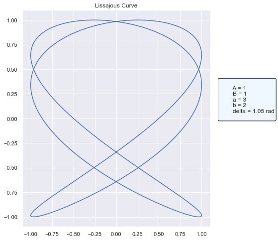

# 建立基本的自訂 Python 模型

## 簡介

在本教程中，我們加深了對 MLflow 的 Custom Pyfunc 的理解。 `PythonModel` 類別作為基石，可讓您使用自訂 PyFunc 模型來定義、儲存、載入和預測。我們將開發一個非常非標準的模型；一種產生繪圖的工具，以展示自訂 PyFunc 模型的靈活性。最後，我們將擁有一個功能性的利薩如曲線產生器，在 Pyfunc 框架內包裝和管理。

## 你將學到什麼?

- **Defining Custom PyFunc Models**: 探索 `PythonModel` 類別的結構及其基本方法。
- **Understanding Pyfunc Components**: 熟悉 Pyfunc 風格的基本構建塊。
- **Saving and Loading Models**: 體驗 MLflow 儲存和檢索功能的無縫整合。
- **Predicting with Custom Logic**: 與載入的自訂 Pyfunc 互動以產生有趣的利薩如曲線圖。

## PythonModel 類別

MLflow 對靈活性和標準化的承諾透過 `PythonModel` 類別得到體現。這個類別對於 Pyfunc 風格至關重要，提供了定義自訂邏輯、載入資源和進行預測所需的框架。

建立 `PythonModel` 實例有兩種主要方法： 

1. **Class-based approach**：使用必要的方法定義一個 class，並將其用作模型的藍圖。 
2. **Function-based approach**：在單一函數中定義整個預測(prediction)邏輯，讓 MLflow 處理其它部分。

在本教程中，我們將重點放在 **Class-based approach** 的方法，深入研究 `load_context` 與 `predict` 等方法，並理解它們在更大的生態系統中的角色。

有兩種方法可以建立自訂 `PythonModel` 實例。第一個，也就是我們將在本指南中使用的，涉及定義將用於介面的類別和方法。還有另一種方法可以使用，即定義一個名為 `Predict` 的函數，並將其記錄為 `mlflow.pyfunc.save_model()` 中的 python_model 參數。這種方法受到更多限制，但對於可以將整個預測邏輯封裝在單一函數中的實作方式來說，它是更可取的。對於 pyfunc 日誌記錄的第二種模式，將為您建立並記錄一個通用的 PythonModel 類，並將您提供的預測函數新增為類別中的 Predict() 方法。

### 核心 PythonModel 元件

MLflow 的 PyFunc 圍繞著 PythonModel 類別。該類別中的兩個基本方法是：

1. `load_context(self, context)`: 此方法用於載入工件或其他初始化任務。它是可選的，可用於取得外部引用。
2. `predict(self, context, model_input, params=None)`: 這是進行預測時模型的入口點。必須為您的自訂 PyFunc 模型定義它。

例如，如果您的模型使用 XGBoost 等外部函式庫，您可以在 `load_context` 方法中載入 XGBoost 模型並在 `predict` 方法中使用它。

注意事項:

1. 您的類別必須是 `mlflow.pyfunc.PythonModel` 的子類
2. 你的類別必須實作一個 `predict` 方法
3. `predict` 方法必須遵守 [Inference API](https://www.mlflow.org/docs/latest/python_api/mlflow.pyfunc.html#inference-api) 的要求。
4. `predict` 方法必須引用 context 作為第一個命名參數
5. 如果您希望為模型提供參數，則必須將這些參數定義為模型 signature 的一部分。signature 必須與模型一起保存。
6. 如果您打算在載入模型時執行其他功能（例如載入其他依賴檔案），您可以決定在類別中定義 `load_context` 方法。

## Lissajous Curves

數學上，利薩茹（Lissajous）曲線（又稱利薩茹圖形、李薩如圖形或鮑迪奇（Bowditch）曲線）是兩個沿著互相垂直方向的正弦振動的合成的軌跡。

```
x(t)=Asin(at+δ)
y(t)=Bsin(bt)
```

## 逐步指南

1. **Define the Custom PyFunc Model**: 我們先建立一個 Python 類別，封裝產生利薩如曲線的邏輯。
2. **Save the Model**: 定義模型後，我們利用 MLflow 的功能來保存它，確保未來的可重複性。
3. **Load the Model**: 從儲存中檢索模型並準備進行預測。
4. **Generate Curves**: 使用載入的模型建立和視覺化 Lissajous 曲線，展示 Pyfunc 風格的端對端功能。


### Step 1: Define the Custom PyFunc Model

我們首先為自訂模型定義一個 Python 類別。該類別應繼承自 `mlflow.pyfunc.PythonModel`。

```python
import matplotlib.pyplot as plt
import numpy as np
import pandas as pd
import seaborn as sns

import mlflow.pyfunc
from mlflow.models import infer_signature


class Lissajous(mlflow.pyfunc.PythonModel):
    def __init__(self, A=1, B=1, num_points=1000):
        self.A = A
        self.B = B
        self.num_points = num_points
        self.t_range = (0, 2 * np.pi)

    def generate_lissajous(self, a, b, delta):
        t = np.linspace(self.t_range[0], self.t_range[1], self.num_points)
        x = self.A * np.sin(a * t + delta)
        y = self.B * np.sin(b * t)
        return pd.DataFrame({"x": x, "y": y})

    def predict(self, context, model_input, params=None):
        """
        Generate and plot the Lissajous curve with annotations for parameters.

        Args:
        - model_input (pd.DataFrame): DataFrame containing columns 'a' and 'b'.
        - params (dict, optional): Dictionary containing optional parameter 'delta'.
        """
        # Extract a and b values from the input DataFrame
        a = model_input["a"].iloc[0]
        b = model_input["b"].iloc[0]

        # Extract delta from params or set it to 0 if not provided
        delta = params.get("delta", 0)

        # Generate the Lissajous curve data
        df = self.generate_lissajous(a, b, delta)

        sns.set_theme()

        # Create the plot components
        fig, ax = plt.subplots(figsize=(10, 8))
        ax.plot(df["x"], df["y"])
        ax.set_title("Lissajous Curve")

        # Define the annotation string
        annotation_text = f"""
        A = {self.A}
        B = {self.B}
        a = {a}
        b = {b}
        delta = {np.round(delta, 2)} rad
        """

        # Add the annotation with a bounding box outside the plot area
        ax.annotate(
            annotation_text,
            xy=(1.05, 0.5),
            xycoords="axes fraction",
            fontsize=12,
            bbox={"boxstyle": "round,pad=0.25", "facecolor": "aliceblue", "edgecolor": "black"},
        )

        # Adjust plot borders to make space for the annotation
        plt.subplots_adjust(right=0.65)
        plt.close()

        # Return the plot
        return fig
```

### Step 2: Save the Model

定義模型類別後，我們可以實例化它並使用 MLflow 保存它。 `infer_signature` 方法在這裡很有用，可以自動推斷模型的輸入和輸出 schema。

因為我們使用參數來覆蓋方程式的增量值，所以我們需要在保存過程中提供模型的簽名。未能在此處定義意味著該模型的已載入實例的使用（如果在沒有簽名的情況下保存）將忽略提供的參數（帶有警告）。

```python
# Define the path to save the model
model_path = "lissajous_model"

# Create an instance of the model, overriding the default instance variables `A`, `B`, and `num_points`
model_10k_standard = Lissajous(1, 1, 10_000)

# Infer the model signature, ensuring that we define the params that will be available for customization at inference time
signature = infer_signature(pd.DataFrame([{"a": 1, "b": 2}]), params={"delta": np.pi / 5})

# Save our custom model to the path we defined, with the signature that we declared
mlflow.pyfunc.save_model(path=model_path, python_model=model_10k_standard, signature=signature)
```

### Step 3: Load the Model

保存後，我們可以載入模型並將其用於預測。在這裡，我們的預測是利薩如曲線圖。

```python
# Load our custom model from the local artifact store
loaded_pyfunc_model = mlflow.pyfunc.load_model(model_path)
```

### Step 4: Use the model for generating curves

```python
# Define the input DataFrame. In our custom model, we're reading only the first row of data to generate a plot.
model_input = pd.DataFrame({"a": [3], "b": [2]})

# Define a params override for the `delta` parameter
params = {"delta": np.pi / 3}

# Run predict, which will call our internal method `generate_lissajous` before generating a `matplotlib` plot showing the curve
fig = loaded_pyfunc_model.predict(model_input, params)

# Display the plot
fig
```



```python
# Try a different configuration of arguments
fig2 = loaded_pyfunc_model.predict(
    pd.DataFrame({"a": [15], "b": [17]}), params={"delta": np.pi / 5}
)

fig2
```


