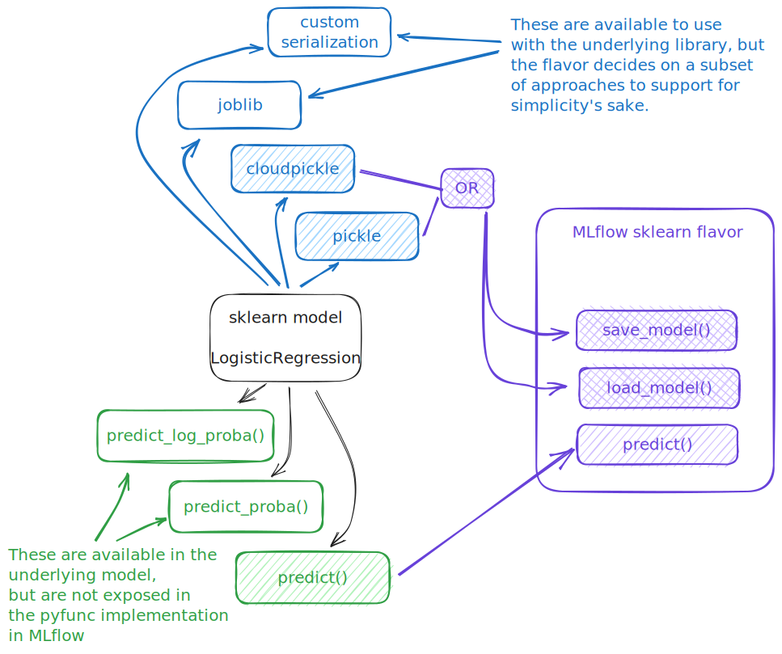
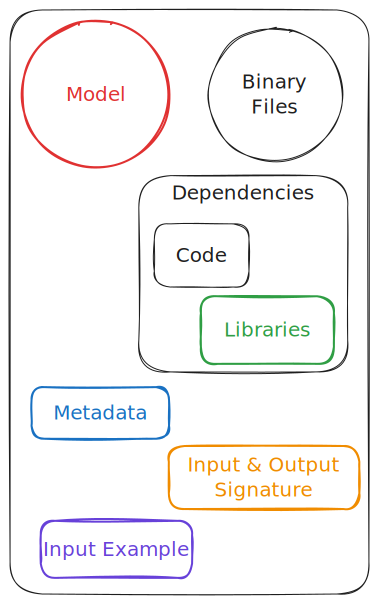
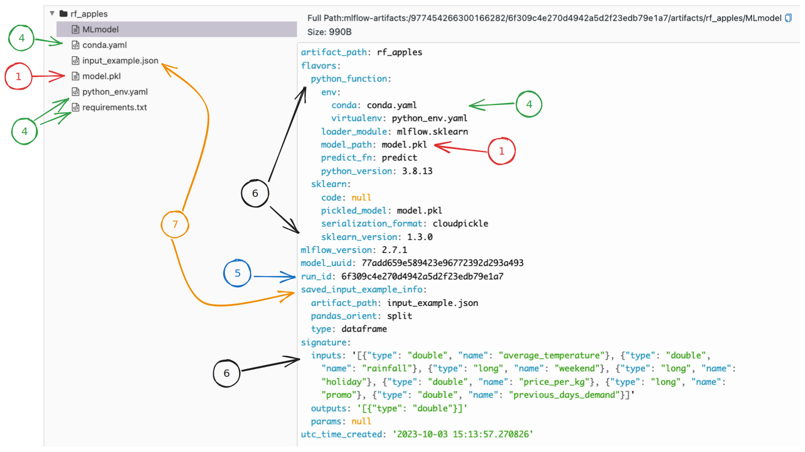

# Models, Flavors, and PyFuncs in MLflow

在 MLflow 生態系統中，"flavors" 在模型管理中發揮關鍵作用。本質上，flavors 是特定機器學習函式庫的特定包裝。例如，spark-ml 套件儘管會產生不同的模型類型（例如 Pipeline、LogisticRegressionModel 或 RandomForestModel），但都屬於 Spark 風格。這種抽象確保無論模型的基本結構如何，都可以使用 MLflow 的命名風味實用程式無縫保存、記錄和檢索其 Spark 風味變體。

Flavors 簡化了跨不同框架保存、加載和處理機器學習模型的過程。他們考慮每個 ML 函式庫的獨特模型序列化和反序列化方法。

MLflow 的 flavor 設計確保了一定程度的抽象性。對於每個 ML 函式庫，其對應的 MLflow 風格定義了用於推理部署的載入 [pyfunc](https://mlflow.org/docs/latest/python_api/mlflow.pyfunc.html#module-mlflow.pyfunc) 的行為。每種風格都規定了 `predict()` 方法的行為，確保一致但而且有明確的格式。

要理解這些設計，以 sklearn 風格為例。下圖描述了其實現，突出顯示了 MLflow 標準化的 API 和序列化方法：

雖然 MLflow 致力於為每種風格提供普遍適用的 pyfunc 表示，但適應特定庫產生的每個獨特模型場景並不總是可行的。

然而，還有一線希望。 MLflow 透過擴展基礎 [PythonModel](https://mlflow.org/docs/latest/python_api/mlflow.pyfunc.html#mlflow.pyfunc.PythonModel) 基底類別（所有命名風味的 `pyfunc` 變體的基礎），提供了創建自訂 `pyfunc` 的靈活性。透過正確實作 `PythonModel`，您可以將任何程式庫中的任何程式碼或模型嵌入到自訂類別中，同時享受與命名風格相關的一致性優勢。

為了更深入研究這些功能，讓我們來看看 MLflow 模型的核心結構。

## MLflow 中模型的元件

當想到 "model" 時，大多數從業者都會設想從機器學習訓練過程中學到的參數或權重。這些通常會儲存為檔案或檔案目錄，然後用於對新的、看不見的資料進行預測。然而，在 MLOps 領域，尤其是在 MLflow 中，"model" 的概念要廣泛得多。

在 MLflow 中，"model"　不僅僅是包含學習參數的二進位模型檔。它是一個全面的包或捆綁包，{==封裝了在各種環境中可靠地重現預測所需的所有內容==}。

這包括模型的權重，但遠不止於此。

1. **The Model Binary**: 這是核心部分 - 實際保存的模型權重或參數。這就是許多人所認為的 "model"。
2. **Additional Binary Files**: 對於某些 model，可能需要一些額外的輔助文件。例如，用於 NLP 模型的分詞器、用於預處理的縮放器，甚至非參數元素（如決策樹或 k 均值質心）。
3. **Pre-loaded Code**: 某些模型可能需要在推理環境中載入自訂程式碼。這可以用於預處理、後處理或其他自訂邏輯。
4. **Library Dependencies**: 為了使模型正常運行，它可能取決於特定版本的 ML 函式庫。 MLflow 會追蹤這些依賴關係，確保模型運行的環境與其訓練的環境相符。
5. **Metadata**: 這包含有關模型血統的重要資訊。它可以追蹤詳細信息，例如誰訓練了模型、使用什麼代碼、何時何地訓練的。此元資料對於模型治理、稽核和可重複性至關重要。
6. **PyFunc Signature**: 為了確保無縫部署和推理，MLflow 將模型包裝在標準化的 pyfunc 介面中。此介面定義了預期的輸入和輸出格式，確保一致性。
7. **Input Example**: 作為可選組件，它提供可用於測試的範例輸入，以確保部署的模型正常運作。

當查看已儲存的模型時，所有這些元素都可以在 MLflow UI 的 artifact 檢視器中查看。

建立自訂 pyfunc 時，了解此處顯示的元件非常重要，因為此結構及其中的元素是您在建立和使用自訂 PyFunc 時將要與之互動的內容。

## 了解 Named Flavors

MLflow 中的 named flavor 是指與特定機器學習或資料處理框架關聯的預先定義實體。例如，如果您正在使用 Scikit-Learn 模型，則可以使用 `mlflow.sklearn.save_model()`、`mlflow.sklearn.load_model()` 和 `mlflow.sklearn.log_model()` 等方法。

Named Flavors 的主要特性包括：

- **Root Namespace Integration**: Named Flavor 可直接從 MLflow 根命名空間訪問，從而實現簡單的互動。
- **PyFunc Compatibility**: 使用 Named Flavor 保存的模型可以作為 PyFunc 加載回來。這有助於與各種部署環境集成。
- **Autologging**: 某些 Named Flavor 支援自動記錄(autologging)，這是在訓練過程完成後自動記錄模型工件和訓練元資料的功能。

## Named Flavors 特徵

Named Flavor 封裝了多種功能：

- **Unified API**: 儘管機器學習框架存在根本差異，但命名風格提供了一組一致的模型保存、載入和日誌記錄方法。這種一致性擴展到高級功能，例如簽名聲明、輸入範例儲存、自訂依賴項和模型註冊。

- **Maintenance & Reliability**: 作為 MLflow 專案的一部分，Named Flavor 經過核心維護人員的嚴格測試和更新。

- **Serialization Methods**: 每個 Named Flavor 都利用與其關聯框架相關的本機序列化機制。

- **Custom Python Function Wrappers**: 每種 Flavor 都包含一個特定的實現，將底層框架的方法映射到標準 Python 函數，從而對函數的行為做出某些決定。

- **Simplified High-Level APIs**: 儘管它們能夠處理複雜的細節，但 Named Flavor 的高級 API 的設計目的是為了易於使用。

## 列入 Named Flavors 的標準

將某些特定框架作為 Named Flavor 來包含在 MLflow 中並不是任意的。

標準包括：

- **Popularity & Demand**: 在業界廣泛採用的框架受到青睞。是否包含在內還取決於用戶請求的頻率以及更廣泛的 ML 社群內的感知需求。
- **Framework Stability**: Named Flavor 通常與穩定、具有主動維護且缺乏過於複雜或限制性建置要求的框架相關聯，這些要求可能會導致與它們整合成為不可能的任務。

## Named Flavor 的剖析

MLflow 中的每個 Named Flavor 通常都會實現一組核心功能：

- `get_default_conda_env()`: 傳回 flavor 所需的 conda 依賴項清單。
- `get_default_pip_requirements()`: 列出對該 flavor 至關重要的 PyPI 依賴項。
- `load_model()`: 處理反序列化過程，透過提供的可解析 model_uri 從給定工件儲存中檢索模型實例。
- `save_model()`: 管理序列化流程，確保模型、其元資料和其他相關工件得到適當儲存。
- `log_model()`: save_model() 的擴展版本，除了保存過程之外還促進模型註冊。

此外，為了確保 flavor 模型可以作為通用 Python 函數加載，需要一個 Wrapper 類別才能與 `mlflow.pyfunc.load_model()` 整合。

## 解決 MLflow 中不支援的模型框架

對於不支援 named flavor 的機器學習框架，MLflow 提供了定義自訂 PyFunc 的靈活性。

本教學將引導您完成整個過程，使您能夠將幾乎任何模型合併到 MLflow 生態系統中。

## 建立可重複使用的自訂 Flavor

對於那些經常在各種專案中使用特定自訂 PyFunc 的人來說，MLflow 的架構支援透過插件式介面開發自訂風格。雖然有關此主題的綜合指南超出了本教程的範圍，但一般方法涉及建立一個包含用於保存、載入和記錄模型類型的功能的模組。然後製作一個 PyFunc 包裝類別來提供集成，以將自訂 flavor 加載為 PyFunc。