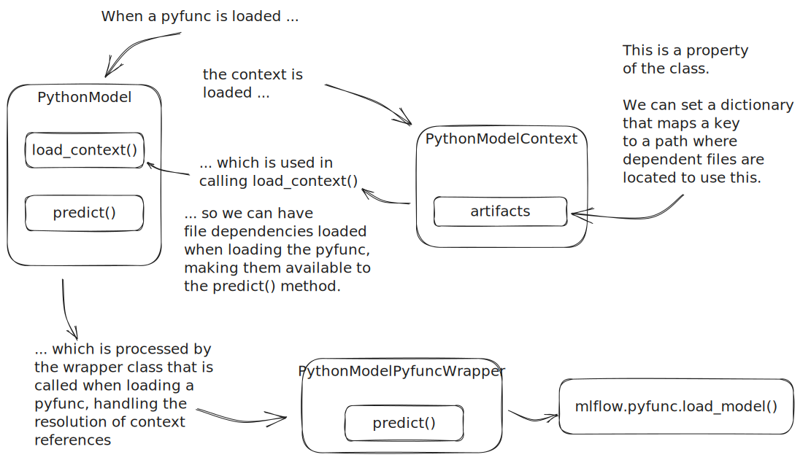

# Understanding PyFunc in MLflow

在 MLflow 領域，雖然 named flavor 提供了針對流行框架量身定制的特定功能，但有些情況和要求不屬於這些預定義路徑。輸入自訂 [pyfunc](https://mlflow.org/docs/latest/python_api/mlflow.pyfunc.html#module-mlflow.pyfunc)（Python 函數），這是一個通用接口，使您能夠透過定義自訂 Python 函數將來自任何框架的模型封裝到 MLflow 模型中。

PyFunc 版本的模型與任何其他 MLflow 模型類型的交互方式相同，提供 [save_model()](https://mlflow.org/docs/latest/python_api/mlflow.pyfunc.html#mlflow.pyfunc.save_model) 和 [log_model()](https://mlflow.org/docs/latest/python_api/mlflow.pyfunc.html#mlflow.pyfunc.log_model) 接口，以便分別創建（保存）和訪問（加載）模型。

由於這些自訂模型包含 python_function 風格，因此可以將它們部署到 MLflow 支援的任何生產環境，例如 SageMaker、AzureML、Databricks、Kubernetes 或本地 REST 端點。

## 為什麼選擇 PyFunc？

1. **Flexibility**: 它提供了與任何機器學習庫或框架配合使用的自由，確保 MLflow 對各種用例的適應性。

2. **Unified Interface**: 使用 pyfunc，您可以獲得一致的 API。一旦您的模型符合此接口，您就可以利用 MLflow 的所有部署工具，而無需擔心底層框架。

3. **Custom Logic**: 除了模型之外，pyfunc 還允許進行預處理和後處理，從而增強模型的部署能力。

## PyFunc 的元件

1. **Python Function Flavor**: 這是 MLflow Python 模型的預設模型介面。它確保可以使用一致的 API 載入每個 MLflow Python 模型並與之互動。
2. **Filesystem Format**: 一個結構化目錄，包含所有必要的資料、程式碼和配置，確保封裝的模型及其相依性是獨立且可重現的。
3. **MLModel Configuration**: MLmodel 檔案是一個重要的描述符，提供有關模型的詳細信息，包括其載入器模組、程式碼、資料和環境。
4. **Custom Pyfunc Models**: 這是一個超越 named flavor 的強大功能，允許創建具有自訂邏輯、資料轉換等的模型。

## 自訂 Pyfunc 模型的強大功能

雖然 MLflow 的命名風格為許多框架提供了開箱即用的解決方案，但它們可能無法滿足所有要求。這就是自訂 pyfunc 模型的亮點。無論您是使用利基框架、需要實現專門的預處理，還是想要整合後推理邏輯，自訂 pyfunc 模型都提供了執行此操作的工具。

透過定義繼承自 `PythonModel` 的 Python 類別並實作必要的方法，您可以建立適合您的特定需求的自訂 pyfunc 模型。

## 自訂 Pyfunc 的最佳條件

在許多場景中，自訂 Pyfunc 變得非常有價值：

1. **Distributed Inference with Large Models:**

    - 在 Apache Spark 或 Ray 等分散式系統中，推理是跨多個核心並行進行的，因此存在載入模型的多個副本（每個核心一個）的風險。這會極大地消耗系統資源，尤其是對於大型模型。
    - 透過自訂 Pyfunc，您可以確保每個工作節點或執行器僅載入模型的單一副本，從而最佳化資源使用並加快推理速度。

2. **Unsupported Models:**

    - 雖然 MLflow 為流行框架提供了多種 named flavors，但機器學習生態系統非常龐大。可能存在尚未支持的利基或新興框架。
    - 自訂 Pyfunc 提供了一種無縫封裝和管理來自任何此類不受支援的框架的模型的方法。

3. **Custom Inference Methods:**

    - 預設的 `.predict()` 方法可能並不總是滿足特定的要求。也許您需要一種產生邏輯、不確定性或其他指標的方法。
    - 自訂 Pyfunc 可以包裝任何推理方法，確保部署的模型完全按照需要運作。

4. **Loading Ancillary Data or External Systems:**

    - 有時，模型的推理不僅涉及模型本身。它可能需要引用未隨模型保​​存的外部數據，或者可能需要連接到其他系統。
    - 考慮這樣一個場景：模型需要在推論過程中查找向量資料庫中的條目。自訂 Pyfunc 可以利用 `load_context` 方法來載入設定檔。這為自訂預測方法提供了配置數據，使其能夠在推理期間連接到外部服務。

## 自訂 Pyfunc 的內部運作原理

了解 `mlflow.pyfunc.load_model()` 呼叫期間的事件順序對於充分利用自訂 Pyfunc 的功能至關重要。以下是載入自訂 pyfunc 時發生的事件序列的逐步細分，以及如何在儲存模型期間存取和引用聲明覆寫以控制載入的模型物件的行為。

1. **Initiation:**

    - 過程在呼叫 `mlflow.pyfunc.load_model()` 時開始，表示要載入自訂 Pyfunc 模型以供使用。

2. **Model Configuration Retrieval:**

    - 系統取得與已儲存的模型關聯的 MLmodel 設定檔。該描述符提供了有關模型的基本詳細信息，包括其載入器模組、程式碼、資料和環境。

3. **Artifact Mapping:**

    - 已儲存的模型 artifacts（可能包括序列化模型物件、輔助資料或其他必要檔案）被映射。此映射可確保自訂 Pyfunc 知道在哪裡可以找到它需要的所有內容。

4. **Python Model Initialization:**

    - 定義自訂 Pyfunc（通常繼承自 `PythonModel`）的 Python 類別被初始化。在此階段，模型尚未準備好進行推理，但已為後續載入步驟做好準備。

5. **Context Loading:**

    - 呼叫自訂 Pyfunc 的 `load_context` 方法。此方法旨在載入任何外部引用或執行初始化任務。例如，它可以反序列化模型對象，載入用於連接到外部服務的配置文件，或準備模型所需的任何其他資源。

6. **Model Ready:**

    - 載入上下文後，自訂 Pyfunc 模型現已完全初始化並準備好進行推理。現在對其預測方法的任何後續呼叫都將執行其中定義的自訂邏輯，從而產生設計的結果。

值得注意的是，這個序列確保自訂 Pyfunc 模型一旦加載，就是一個完全獨立的單元，不僅封裝模型，還封裝它所需的任何自訂邏輯、資料轉換和外部引用。無論模型部署在何處，這種設計都能確保可重複性和一致性。

