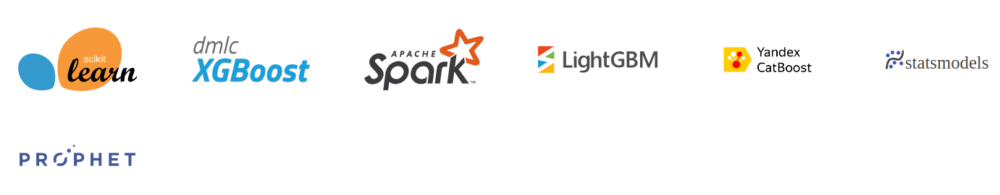

# Traditional ML

在機器學習的動態格局中，傳統技術仍然是基礎，在各個產業和研究機構中發揮關鍵作用。從醫療保健診斷中分類演算法的精確性到金融中回歸模型的預測能力，從供應鏈管理中時間序列分析的預測能力到社會科學中統計模型得出的見解，這些核心方法強調了許多我們今天見證的技術進步。

MLflow 認識到傳統機器學習的持久重要性。 MLflow 經過精確設計並深入了解資料科學家和 ML 從業者所面臨的挑戰和複雜性，提供了專為這些經典技術量身定制的全面工具套件。該平台不僅簡化了模型開發和部署流程，還確保了可重複性、可擴展性和可追溯性。

## 原生套件支援

MLflow 中有許多原生支援的傳統 ML 函式庫。在整個文件中，您可能會看到這些被稱為　"flavors"，因為它們是從這些庫生成的模型的保存、日誌記錄、載入和通用 python 函數表示的本機支援的特定實作。

使用這些實作的本機版本有明顯的好處，因為許多實作都內建了自動日誌記錄功能，以及具有序列化和反序列化的特定自訂處理，可以極大地簡化使用這些函式庫時的 MLOps 體驗。

官方支援的傳統 ML 函式庫整合包括：

