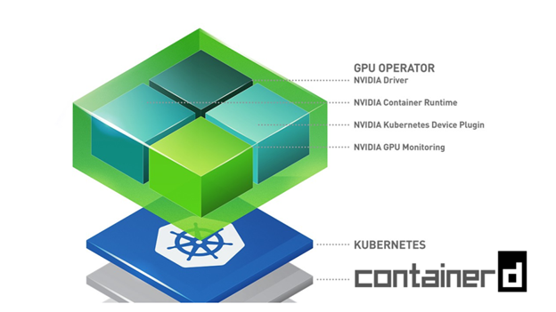

# 基於 containerd Runtime 在 Kubernetes 上部署 Nvidia GPU Operator

原文: [Tutorial: Deploy the Nvidia GPU Operator on Kubernetes Based on containerd Runtime](https://thenewstack.io/tutorial-deploy-the-nvidia-gpu-operator-on-kubernetes-based-on-containerd-runtime/)

參考: [Using kubeadm to Create a Cluster | Installation & Tutorial](https://www.containiq.com/post/kubeadm)

以下是安裝 [containerd](https://containerd.io/)、Kubernetes 和 [NVIDIA GPU Operator](https://docs.nvidia.com/datacenter/cloud-native/gpu-operator/getting-started.html#) 的步驟。在安裝即將結束時，我們將通過在 pod 中運行流行的 nvidia-smi 命令來測試 GPU 訪問。



本教程將探討在 Kubernetes 集群上使用基於 [containerd](https://containerd.io/) 運行時而不是 Docker 引擎的 GPU 主機安裝 [NVIDIA GPU Operator](https://docs.nvidia.com/datacenter/cloud-native/gpu-operator/getting-started.html#) 的步驟。

在典型的基於 GPU 的 Kubernetes 安裝中，每個節點都需要配置正確版本的 Nvidia 顯卡驅動程序、CUDA runtime 和 cuDNN 函式庫，然後是容器 runtime，例如 Docker Engine、containerd、podman 或 CRI-O。然後，部署 Nvidia Container Toolkit 以提供對容器化應用程序的 GPU 訪問。最後，安裝 Kubernetes，它將與選定的容器 runtime 交互以管理工作負載的生命週期。

Nvidia GPU Operator 顯著簡化了流程，無需安裝驅動程序、CUDA runtime、cuDNN 函式庫或 Container Toolkit。它可以安裝在任何滿足特定硬件和軟件要求的 Kubernetes 集群上。

以下是安裝 containerd、Kubernetes 和 Nvidia GPU Operator 的步驟。在安裝即將結束時，我們將通過在 pod 中運行流行的 `nvidia-smi` 命令來測試 GPU 訪問。

環境:

- Operating system: `Ubuntu 20.04 LTS`
- GPU: `Nvidia GeForce MX150`

## Step 1: 安裝 nvidia drivers

!!! info
    根據 Nvidia GPU Operator 的內容，operator 應該可自動幫每一個 Kubernetes 節點自動配置 GPU 的 Driver。然而在驗證的過程會發現 Ubuntu 的機器會在安裝完 Nvidia GPU Operator 之後一直重覆 reboot。因此在本教程中是先手動安裝 Nvidia GPU Driver 在 Ubuntu 的機器壬


我們可以先使用 `apt` 搜索可用的驅動程序：

```bash
sudo apt search nvidia-driver
```

在撰寫本文時，最新的可用驅動程序版本是 525，所以讓我們繼續安裝這個版本：

```bash
sudo apt install nvidia-driver-525 nvidia-dkms-525
```

重新啟動:

```bash
sudo shutdown now -r
```

驗證 nvidia driver 的安裝:


```bash
$ nvidia-smi

Fri Jan 20 01:05:54 2023       
+-----------------------------------------------------------------------------+
| NVIDIA-SMI 525.78.01    Driver Version: 525.78.01    CUDA Version: 12.0     |
|-------------------------------+----------------------+----------------------+
| GPU  Name        Persistence-M| Bus-Id        Disp.A | Volatile Uncorr. ECC |
| Fan  Temp  Perf  Pwr:Usage/Cap|         Memory-Usage | GPU-Util  Compute M. |
|                               |                      |               MIG M. |
|===============================+======================+======================|
|   0  NVIDIA GeForce ...  Off  | 00000000:02:00.0 Off |                  N/A |
| N/A   38C    P8    N/A /  N/A |      4MiB /  2048MiB |      0%      Default |
|                               |                      |                  N/A |
+-------------------------------+----------------------+----------------------+
                                                                               
+-----------------------------------------------------------------------------+
| Processes:                                                                  |
|  GPU   GI   CI        PID   Type   Process name                  GPU Memory |
|        ID   ID                                                   Usage      |
|=============================================================================|
|    0   N/A  N/A       942      G   /usr/lib/xorg/Xorg                  4MiB |
+-----------------------------------------------------------------------------+
```

## Step 2: 安裝 Containerd Runtime

加載所需的模塊並確保它們在重新啟動期間保持不變。

```bash
sudo modprobe overlay
sudo modprobe br_netfilter
```

您還可以確保這些是持久的：

```bash
cat <<EOF | sudo tee /etc/modules-load.d/containerd.conf
overlay
br_netfilter
EOF
```

我們打算將 containerd 用作 Kubernetes 的 CRI 運行 runtime，配置 sysctl 參數:

```bash
cat <<EOF | sudo tee /etc/sysctl.d/99-kubernetes-cri.conf
net.bridge.bridge-nf-call-iptables  = 1
net.ipv4.ip_forward                 = 1
net.bridge.bridge-nf-call-ip6tables = 1
EOF
```

在不重新啟動系統的情況下加載 `sysctl` 參數。

```bash
sudo sysctl --system
```

安裝相關命令工具:

```bash
sudo apt-get update

sudo apt-get install -y \
    ca-certificates \
    curl \
    gnupg \
    lsb-release
```

添加存儲庫 GPG 密鑰和存儲庫:

```bash
curl -fsSL https://download.docker.com/linux/ubuntu/gpg | sudo gpg --dearmor -o /usr/share/keyrings/docker-archive-keyring.gpg

echo \
  "deb [arch=$(dpkg --print-architecture) signed-by=/usr/share/keyrings/docker-archive-keyring.gpg] https://download.docker.com/linux/ubuntu \
$(lsb_release -cs) stable" | sudo tee /etc/apt/sources.list.d/docker.list > /dev/null
```

最後，安裝 containerd runtime。

```bash
sudo apt-get update \
    && sudo apt-get install -y containerd.io

sudo apt-get update
sudo apt-get install containerd -y
```

讓我們創建預設的 `containerd` 配置文件。

```bash
sudo mkdir -p /etc/containerd
sudo containerd config default | sudo tee /etc/containerd/config.toml
```

將 `runc` 的 cgroup 驅動程序設置為 `systemd`，這是 kubelet 所必需的。


在 `[plugins."io.containerd.grpc.v1.cri".containerd.runtimes.runc]` 部分中，添加以下內容:

```toml title="/etc/containerd/config.toml"
[plugins."io.containerd.grpc.v1.cri".containerd.runtimes.runc.options]
  SystemdCgroup = true
```

```bash
sudo cat /etc/containerd/config.toml
```


你的 `config.toml` 看起來應該是這樣的：

```toml title="/etc/containerd/config.toml" hl_lines="112" 
disabled_plugins = []
imports = []
oom_score = 0
plugin_dir = ""
required_plugins = []
root = "/var/lib/containerd"
state = "/run/containerd"
version = 2

[cgroup]
  path = ""

[debug]
  address = ""
  format = ""
  gid = 0
  level = ""
  uid = 0

[grpc]
  address = "/run/containerd/containerd.sock"
  gid = 0
  max_recv_message_size = 16777216
  max_send_message_size = 16777216
  tcp_address = ""
  tcp_tls_cert = ""
  tcp_tls_key = ""
  uid = 0

[metrics]
  address = ""
  grpc_histogram = false

[plugins]

  [plugins."io.containerd.gc.v1.scheduler"]
    deletion_threshold = 0
    mutation_threshold = 100
    pause_threshold = 0.02
    schedule_delay = "0s"
    startup_delay = "100ms"

  [plugins."io.containerd.grpc.v1.cri"]
    disable_apparmor = false
    disable_cgroup = false
    disable_hugetlb_controller = true
    disable_proc_mount = false
    disable_tcp_service = true
    enable_selinux = false
    enable_tls_streaming = false
    ignore_image_defined_volumes = false
    max_concurrent_downloads = 3
    max_container_log_line_size = 16384
    netns_mounts_under_state_dir = false
    restrict_oom_score_adj = false
    sandbox_image = "k8s.gcr.io/pause:3.5"
    selinux_category_range = 1024
    stats_collect_period = 10
    stream_idle_timeout = "4h0m0s"
    stream_server_address = "127.0.0.1"
    stream_server_port = "0"
    systemd_cgroup = false
    tolerate_missing_hugetlb_controller = true
    unset_seccomp_profile = ""

    [plugins."io.containerd.grpc.v1.cri".cni]
      bin_dir = "/opt/cni/bin"
      conf_dir = "/etc/cni/net.d"
      conf_template = ""
      max_conf_num = 1

    [plugins."io.containerd.grpc.v1.cri".containerd]
      default_runtime_name = "runc"
      disable_snapshot_annotations = true
      discard_unpacked_layers = false
      no_pivot = false
      snapshotter = "overlayfs"

      [plugins."io.containerd.grpc.v1.cri".containerd.default_runtime]
        base_runtime_spec = ""
        container_annotations = []
        pod_annotations = []
        privileged_without_host_devices = false
        runtime_engine = ""
        runtime_root = ""
        runtime_type = ""

        [plugins."io.containerd.grpc.v1.cri".containerd.default_runtime.options]

      [plugins."io.containerd.grpc.v1.cri".containerd.runtimes]

        [plugins."io.containerd.grpc.v1.cri".containerd.runtimes.runc]
          base_runtime_spec = ""
          container_annotations = []
          pod_annotations = []
          privileged_without_host_devices = false
          runtime_engine = "" echo 1 > /proc/sys/net/bridge/bridge-nf-call-iptables
            CriuWorkPath = ""
            IoGid = 0
            IoUid = 0
            NoNewKeyring = false
            NoPivotRoot = false
            Root = ""
            ShimCgroup = ""
            SystemdCgroup = true

      [plugins."io.containerd.grpc.v1.cri".containerd.untrusted_workload_runtime]
        base_runtime_spec = ""
        container_annotations = []
        pod_annotations = []
        privileged_without_host_devices = false
        runtime_engine = ""
        runtime_root = ""
        runtime_type = ""

        [plugins."io.containerd.grpc.v1.cri".containerd.untrusted_workload_run echo 1 > /proc/sys/net/bridge/bridge-nf-call-iptables

      [plugins."io.containerd.grpc.v1.cri".registry.headers]

      [plugins."io.containerd.grpc.v1.cri".registry.mirrors]

    [plugins."io.containerd.grpc.v1.cri".x509_key_pair_streaming]
      tls_cert_file = ""
      tls_key_file = ""

  [plugins."io.containerd.internal.v1.opt"]
    path = "/opt/containerd"

  [plugins."io.containerd.internal.v1.restart"]
    interval = "10s"

  [plugins."io.containerd.metadata.v1.bolt"]
    content_sharing_policy = "shared"

  [plugins."io.containerd.monitor.v1.cgroups"] echo 1 > /proc/sys/net/bridge/bridge-nf-call-iptables
  [plugins."io.containerd.runtime.v1.linux"]
    no_shim = false
    runtime = "runc"
    runtime_root = ""
    shim = "containerd-shim"
    shim_debug = false

  [plugins."io.containerd.runtime.v2.task"]
    platforms = ["linux/amd64"]

  [plugins."io.containerd.service.v1.diff-service"]
    default = ["walking"]

  [plugins."io.containerd.snapshotter.v1.aufs"]
    root_path = ""

  [plugins."io.containerd.snapshotter.v1.btrfs"]
    root_path = ""

  [plugins."io.containerd.snapshotter.v1.devmapper"]
    async_remove = false
    base_image_size = ""
    pool_name = ""
    root_path = ""

  [plugins."io.containerd.snapshotter.v1.native"]
    root_path = ""

  [plugins."io.containerd.snapshotter.v1.overlayfs"]
    root_path = ""

  [plugins."io.containerd.snapshotter.v1.zfs"]
    root_path = ""

[proxy_plugins]

[stream_processors]

  [stream_processors."io.containerd.ocicrypt.decoder.v1.tar"]
    accepts = ["application/vnd.oci.image.layer.v1.tar+encrypted"]
    args = ["--decryption-keys-path", "/etc/containerd/ocicrypt/keys"]
    env = ["OCICRYPT_KEYPROVIDER_CONFIG=/etc/containerd/ocicrypt/ocicrypt_keyprovider.conf"]
    path = "ctd-decoder"
    returns = "application/vnd.oci.image.layer.v1.tar"

  [stream_processors."io.containerd.ocicrypt.decoder.v1.tar.gzip"]
    accepts = ["application/vnd.oci.image.layer.v1.tar+gzip+encrypted"]
    args = ["--decryption-keys-path", "/etc/containerd/ocicrypt/keys"]
    env = ["OCICRYPT_KEYPROVIDER_CONFIG=/etc/containerd/ocicrypt/ocicrypt_keyprovider.conf"]
    path = "ctd-decoder"
    returns = "application/vnd.oci.image.layer.v1.tar+gzip"

[timeouts]
  "io.containerd.timeout.shim.cleanup" = "5s"
  "io.containerd.timeout.shim.load" = "5s"
  "io.containerd.timeout.shim.shutdown" = "3s"
  "io.containerd.timeout.task.state" = "2s"

[ttrpc]
  address = ""
  gid = 0
  uid = 0
```

下載範例: [config.toml](./assets/config.toml)

使用新配置重新啟動 `containerd`。

```bash
sudo systemctl restart containerd
```

檢查 containerd 運行時的狀態。

```bash
sudo systemctl status containerd
```

結果:

```
● containerd.service - containerd container runtime
     Loaded: loaded (/lib/systemd/system/containerd.service; enabled; vendor preset: enabled)
     Active: active (running) since Thu 2023-01-19 19:57:01 EST; 1min 13s ago
       Docs: https://containerd.io
    Process: 7693 ExecStartPre=/sbin/modprobe overlay (code=exited, status=0/SUCCESS)
   Main PID: 7694 (containerd)
      Tasks: 17
     Memory: 22.5M
     CGroup: /system.slice/containerd.service
             └─7694 /usr/bin/containerd

Jan 19 19:57:01 dxlab-nb-00 containerd[7694]: time="2023-01-19T19:57:01.160522236-05:00" level=info msg="Start subscribing containerd event"
Jan 19 19:57:01 dxlab-nb-00 containerd[7694]: time="2023-01-19T19:57:01.160562031-05:00" level=info msg="Start recovering state"
Jan 19 19:57:01 dxlab-nb-00 containerd[7694]: time="2023-01-19T19:57:01.160581937-05:00" level=info msg=serving... address=/run/containerd/containerd.sock.ttrpc
Jan 19 19:57:01 dxlab-nb-00 containerd[7694]: time="2023-01-19T19:57:01.160620962-05:00" level=info msg=serving... address=/run/containerd/containerd.sock
Jan 19 19:57:01 dxlab-nb-00 containerd[7694]: time="2023-01-19T19:57:01.160622678-05:00" level=info msg="Start event monitor"
Jan 19 19:57:01 dxlab-nb-00 containerd[7694]: time="2023-01-19T19:57:01.160643735-05:00" level=info msg="Start snapshots syncer"
Jan 19 19:57:01 dxlab-nb-00 containerd[7694]: time="2023-01-19T19:57:01.160655262-05:00" level=info msg="Start cni network conf syncer"
Jan 19 19:57:01 dxlab-nb-00 containerd[7694]: time="2023-01-19T19:57:01.160664949-05:00" level=info msg="Start streaming server"
Jan 19 19:57:01 dxlab-nb-00 containerd[7694]: time="2023-01-19T19:57:01.160671816-05:00" level=info msg="containerd successfully booted in 0.027967s"
```

## Step 2: Install Kubernetes 1.26.1

首先禁用 swap memory。

```bash
sudo swapoff -a
sudo sed -i '/ swap / s/^\(.*\)$/#\1/g' /etc/fstab
```

安裝所需的工具。

```bash
sudo apt-get update

sudo apt-get install -y apt-transport-https

# Download the Google Cloud public signing key
sudo curl -fsSLo /usr/share/keyrings/kubernetes-archive-keyring.gpg https://packages.cloud.google.com/apt/doc/apt-key.gpg

# Add the Kubernetes apt repository using the following command
echo "deb [signed-by=/usr/share/keyrings/kubernetes-archive-keyring.gpg] https://apt.kubernetes.io/ kubernetes-xenial main" | sudo tee /etc/apt/sources.list.d/kubernetes.list

sudo apt update \
  && sudo apt install -y kubelet kubeadm kubectl \
  && sudo apt-mark hold kubelet kubeadm kubectl
```

!!! tip
    `apt-mark hold` 命令是 optional 的，但強烈推薦。這命令將阻止更新這些特定宣告的包，直到您使用以下命令取消保留它們。

讓我們初始化控制平面。

```bash
sudo kubeadm init --pod-network-cidr=10.244.0.0/16 \
  --apiserver-advertise-address=192.168.50.195 \
  --apiserver-cert-extra-sans=192.168.50.195 \
  --node-name dxlab-nb-00
```

在幕後，`kubeadm init` 已經根據指定的 flags 配置了控制平面節點。下面，我們將討論它們中的每一個。

- `--apiserver-advertise-address`: 這是 Kubernetes API 服務器將公佈其正在偵聽的 IP 地址。如果未指定，將使用默認網絡接口。在此示例中，使用主節點的 IP 地址 `192.168.50.195`。

- `--apiserver-cert-extra-sans`: 此標誌是 optional 的，用於為 API 服務器使用的 TLS 證書提供額外的主題備用名稱 (SAN)。值得注意的是，該字符串的值既可以是 IP 地址，也可以是 DNS 名稱。

- `--pod-network-cidr`: 這是最重要的 flag 之一，因為它指示 pod 網絡的 IP 地址範圍。這允許控制平面節點自動為每個節點分配 CIDR。本例中使用的範圍 `192.168.0.0/16` 與 Calico 網絡插件有關，稍後將進一步討論。

- `--node-name`: 顧名思義，這是該節點的名稱。

!!! info
    確保將 IP 地址 `10.0.0.54` 替換為本地主機的 IP 地址。

結果:

```bash
[init] Using Kubernetes version: v1.26.1
[preflight] Running pre-flight checks
[preflight] Pulling images required for setting up a Kubernetes cluster
[preflight] This might take a minute or two, depending on the speed of your internet connection
[preflight] You can also perform this action in beforehand using 'kubeadm config images pull'
[certs] Using certificateDir folder "/etc/kubernetes/pki"
[certs] Generating "ca" certificate and key
[certs] Generating "apiserver" certificate and key
[certs] apiserver serving cert is signed for DNS names [dxlab-nb-00 kubernetes kubernetes.default kubernetes.default.svc kubernetes.default.svc.cluster.local] and IPs [10.96.0.1 192.168.50.195]
[certs] Generating "apiserver-kubelet-client" certificate and key
[certs] Generating "front-proxy-ca" certificate and key
[certs] Generating "front-proxy-client" certificate and key
[certs] Generating "etcd/ca" certificate and key
[certs] Generating "etcd/server" certificate and key
[certs] etcd/server serving cert is signed for DNS names [dxlab-nb-00 localhost] and IPs [192.168.50.195 127.0.0.1 ::1]
[certs] Generating "etcd/peer" certificate and key
[certs] etcd/peer serving cert is signed for DNS names [dxlab-nb-00 localhost] and IPs [192.168.50.195 127.0.0.1 ::1]
[certs] Generating "etcd/healthcheck-client" certificate and key
[certs] Generating "apiserver-etcd-client" certificate and key
[certs] Generating "sa" key and public key
[kubeconfig] Using kubeconfig folder "/etc/kubernetes"
[kubeconfig] Writing "admin.conf" kubeconfig file
[kubeconfig] Writing "kubelet.conf" kubeconfig file
[kubeconfig] Writing "controller-manager.conf" kubeconfig file
[kubeconfig] Writing "scheduler.conf" kubeconfig file
[kubelet-start] Writing kubelet environment file with flags to file "/var/lib/kubelet/kubeadm-flags.env"
[kubelet-start] Writing kubelet configuration to file "/var/lib/kubelet/config.yaml"
[kubelet-start] Starting the kubelet
[control-plane] Using manifest folder "/etc/kubernetes/manifests"
[control-plane] Creating static Pod manifest for "kube-apiserver"
[control-plane] Creating static Pod manifest for "kube-controller-manager"
[control-plane] Creating static Pod manifest for "kube-scheduler"
[etcd] Creating static Pod manifest for local etcd in "/etc/kubernetes/manifests"
[wait-control-plane] Waiting for the kubelet to boot up the control plane as static Pods from directory "/etc/kubernetes/manifests". This can take up to 4m0s
[apiclient] All control plane components are healthy after 6.002257 seconds
[upload-config] Storing the configuration used in ConfigMap "kubeadm-config" in the "kube-system" Namespace
[kubelet] Creating a ConfigMap "kubelet-config" in namespace kube-system with the configuration for the kubelets in the cluster
[upload-certs] Skipping phase. Please see --upload-certs
[mark-control-plane] Marking the node dxlab-nb-00 as control-plane by adding the labels: [node-role.kubernetes.io/control-plane node.kubernetes.io/exclude-from-external-load-balancers]
[mark-control-plane] Marking the node dxlab-nb-00 as control-plane by adding the taints [node-role.kubernetes.io/control-plane:NoSchedule]
[bootstrap-token] Using token: 8wj7gj.akbbtwr60x7e5bhx
[bootstrap-token] Configuring bootstrap tokens, cluster-info ConfigMap, RBAC Roles
[bootstrap-token] Configured RBAC rules to allow Node Bootstrap tokens to get nodes
[bootstrap-token] Configured RBAC rules to allow Node Bootstrap tokens to post CSRs in order for nodes to get long term certificate credentials
[bootstrap-token] Configured RBAC rules to allow the csrapprover controller automatically approve CSRs from a Node Bootstrap Token
[bootstrap-token] Configured RBAC rules to allow certificate rotation for all node client certificates in the cluster
[bootstrap-token] Creating the "cluster-info" ConfigMap in the "kube-public" namespace
[kubelet-finalize] Updating "/etc/kubernetes/kubelet.conf" to point to a rotatable kubelet client certificate and key
[addons] Applied essential addon: CoreDNS
[addons] Applied essential addon: kube-proxy

Your Kubernetes control-plane has initialized successfully!

To start using your cluster, you need to run the following as a regular user:

  mkdir -p $HOME/.kube
  sudo cp -i /etc/kubernetes/admin.conf $HOME/.kube/config
  sudo chown $(id -u):$(id -g) $HOME/.kube/config

Alternatively, if you are the root user, you can run:

  export KUBECONFIG=/etc/kubernetes/admin.conf

You should now deploy a pod network to the cluster.
Run "kubectl apply -f [podnetwork].yaml" with one of the options listed at:
  https://kubernetes.io/docs/concepts/cluster-administration/addons/

Then you can join any number of worker nodes by running the following on each as root:

kubeadm join 192.168.50.195:6443 --token 8wj7gj.akbbtwr60x7e5bhx \
	--discovery-token-ca-cert-hash sha256:a58acdf439e5da5ddc881c572c4ffeca8e8d92bca120b8f221d902fd39193699 
```

### 配置 kubectl

`kubectl` 是一個命令行工具，用於在集群上執行操作。在繼續之前，您需要配置 `kubectl`。為此，請從您的控制平面節點運行以下命令:

```bash
mkdir -p $HOME/.kube \
&& sudo cp -i /etc/kubernetes/admin.conf $HOME/.kube/config \
&& sudo chown $(id -u):$(id -g) $HOME/.kube/config

export KUBECONFIG=$HOME/.kube/config
echo "export KUBECONFIG=$HOME/.kube/config" | tee -a ~/.bashrc
```

由於我們只有一個節點，所以讓我們刪除污點以啟用調度。

```bash
kubectl taint nodes dxlab-nb-00 node-role.kubernetes.io/control-plane:NoSchedule-
````

### 安裝 Calico CNI

在大多數實現中，使用容器網絡接口 (CNI) 以便 pod 可以直接接受流量，從而盡可能降低網絡延遲。

此示例中使用了 [Calico](https://projectcalico.docs.tigera.io/networking/advertise-service-ips)，因為它是當前可用的功能最豐富的 CNI 之一。但是你也可在 Kubernetes 中安裝其他 CNI 兼容的套件例如 Flannel。請記住，某些 CNI 需要特定的 `--pod-network-cidr` 值。您可以在文檔中找到有關 Kubernetes 網絡插件的更多詳細信息。

要安裝 Calico，請使用以下命令:

```bash
kubectl apply -f https://docs.projectcalico.org/manifests/calico.yaml
```

在你可以使用集群之前，你必須等待 Calico 所需的 pod 下載完成。要驗證安裝是否成功，請運行以下命令：

```bash
kubectl get nodes
```

結果:

```
NAME          STATUS   ROLES           AGE   VERSION
dxlab-nb-00   Ready    control-plane   18m   v1.26.1
```

## Step 3 – 安裝 Nvidia GPU Operator

首先安裝 Helm3 的二進製文件。

```bash
curl -fsSL -o get_helm.sh https://raw.githubusercontent.com/helm/helm/master/scripts/get-helm-3

chmod 700 get_helm.sh

sudo ./get_helm.sh
```

添加 Nvidia Helm 存儲庫。

```bash
helm repo add nvidia https://helm.ngc.nvidia.com/nvidia \
   && helm repo update
```

由於我們使用的是 `containerd` 容器 runtime，因此我們將其設置為默認值。


```bash hl_lines="4"
helm install gpu-operator \
     -n gpu-operator --create-namespace \
     nvidia/gpu-operator \
     --set operator.defaultRuntime=containerd \
     --set driver.enabled=false
```

從[github.com/NVIDIA/gpu-operator](https://github.com/NVIDIA/gpu-operator/blob/master/deployments/gpu-operator/values.yaml) 可了解預默認的設定值。

```yaml hl_lines="58"
# Default values for gpu-operator.
# This is a YAML-formatted file.
# Declare variables to be passed into your templates.

platform:
  openshift: false

nfd:
  enabled: true

psp:
  enabled: false

sandboxWorkloads:
  enabled: false
  defaultWorkload: "container"

daemonsets:
  labels: {}
  annotations: {}
  priorityClassName: system-node-critical
  tolerations:
  - key: nvidia.com/gpu
    operator: Exists
    effect: NoSchedule
  # configuration for controlling update strategy("OnDelete" or "RollingUpdate") of GPU Operands
  # note that driver Daemonset is always set with OnDelete to avoid unintended disruptions
  updateStrategy: "RollingUpdate"
  # configuration for controlling rolling update of GPU Operands
  rollingUpdate:
    # maximum number of nodes to simultaneously apply pod updates on.
    # can be specified either as number or percentage of nodes. Default 1.
    maxUnavailable: "1"

validator:
  repository: nvcr.io/nvidia/cloud-native
  image: gpu-operator-validator
  # If version is not specified, then default is to use chart.AppVersion
  #version: ""
  imagePullPolicy: IfNotPresent
  imagePullSecrets: []
  env: []
  args: []
  resources: {}
  plugin:
    env:
      - name: WITH_WORKLOAD
        value: "true"

operator:
  repository: nvcr.io/nvidia
  image: gpu-operator
  # If version is not specified, then default is to use chart.AppVersion
  #version: ""
  imagePullPolicy: IfNotPresent
  imagePullSecrets: []
  priorityClassName: system-node-critical
  defaultRuntime: docker
  runtimeClass: nvidia
  use_ocp_driver_toolkit: false
  # cleanup CRD on chart un-install
  cleanupCRD: false
  # upgrade CRD on chart upgrade, requires --disable-openapi-validation flag
  # to be passed during helm upgrade.
  upgradeCRD: false
  initContainer:
    image: cuda
    repository: nvcr.io/nvidia
    version: 11.8.0-base-ubi8
    imagePullPolicy: IfNotPresent
  tolerations:
  - key: "node-role.kubernetes.io/master"
    operator: "Equal"
    value: ""
    effect: "NoSchedule"
  annotations:
    openshift.io/scc: restricted-readonly
  affinity:
    nodeAffinity:
      preferredDuringSchedulingIgnoredDuringExecution:
        - weight: 1
          preference:
            matchExpressions:
              - key: "node-role.kubernetes.io/master"
                operator: In
                values: [""]
  logging:
    # Zap time encoding (one of 'epoch', 'millis', 'nano', 'iso8601', 'rfc3339' or 'rfc3339nano')
    timeEncoding: epoch
    # Zap Level to configure the verbosity of logging. Can be one of 'debug', 'info', 'error', or any integer value > 0 which corresponds to custom debug levels of increasing verbosity
    level: info
    # Development Mode defaults(encoder=consoleEncoder,logLevel=Debug,stackTraceLevel=Warn)
    # Production Mode defaults(encoder=jsonEncoder,logLevel=Info,stackTraceLevel=Error)
    develMode: false
  resources:
    limits:
      cpu: 500m
      memory: 350Mi
    requests:
      cpu: 200m
      memory: 100Mi

mig:
  strategy: single

driver:
  enabled: true
  repository: nvcr.io/nvidia
  image: driver
  version: "525.60.13"
  imagePullPolicy: IfNotPresent
  imagePullSecrets: []
  rdma:
    enabled: false
    useHostMofed: false
  upgradePolicy:
    # global switch for automatic upgrade feature
    # if set to false all other options are ignored
    autoUpgrade: true
    # how many nodes can be upgraded in parallel
    # 0 means no limit, all nodes will be upgraded in parallel
    maxParallelUpgrades: 1
    # options for waiting on pod(job) completions
    waitForCompletion:
      timeoutSeconds: 0
      podSelector: ""
    # options for gpu pod deletion
    gpuPodDeletion:
      force: false
      timeoutSeconds: 300
      deleteEmptyDir: false
    # options for node drain (`kubectl drain`) before the driver reload
    # this is required only if default GPU pod deletions done by the operator
    # are not sufficient to re-install the driver
    drain:
      enable: false
      force: false
      podSelector: ""
      # It's recommended to set a timeout to avoid infinite drain in case non-fatal error keeps happening on retries
      timeoutSeconds: 300
      deleteEmptyDir: false
  manager:
    image: k8s-driver-manager
    repository: nvcr.io/nvidia/cloud-native
    version: v0.6.0
    imagePullPolicy: IfNotPresent
    env:
      - name: ENABLE_GPU_POD_EVICTION
        value: "true"
      - name: ENABLE_AUTO_DRAIN
        value: "false"
      - name: DRAIN_USE_FORCE
        value: "false"
      - name: DRAIN_POD_SELECTOR_LABEL
        value: ""
      - name: DRAIN_TIMEOUT_SECONDS
        value: "0s"
      - name: DRAIN_DELETE_EMPTYDIR_DATA
        value: "false"
  env: []
  resources: {}
  # Private mirror repository configuration
  repoConfig:
    configMapName: ""
  # custom ssl key/certificate configuration
  certConfig:
    name: ""
  # vGPU licensing configuration
  licensingConfig:
    configMapName: ""
    nlsEnabled: false
  # vGPU topology daemon configuration
  virtualTopology:
    config: ""
  # kernel module configuration for NVIDIA driver
  kernelModuleConfig:
    name: ""

toolkit:
  enabled: true
  repository: nvcr.io/nvidia/k8s
  image: container-toolkit
  version: v1.11.0-ubuntu20.04
  imagePullPolicy: IfNotPresent
  imagePullSecrets: []
  env: []
  resources: {}
  installDir: "/usr/local/nvidia"

devicePlugin:
  enabled: true
  repository: nvcr.io/nvidia
  image: k8s-device-plugin
  version: v0.13.0-ubi8
  imagePullPolicy: IfNotPresent
  imagePullSecrets: []
  args: []
  env:
    - name: PASS_DEVICE_SPECS
      value: "true"
    - name: FAIL_ON_INIT_ERROR
      value: "true"
    - name: DEVICE_LIST_STRATEGY
      value: envvar
    - name: DEVICE_ID_STRATEGY
      value: uuid
    - name: NVIDIA_VISIBLE_DEVICES
      value: all
    - name: NVIDIA_DRIVER_CAPABILITIES
      value: all
  resources: {}
  # Plugin configuration
  # Use "name" to either point to an existing ConfigMap or to create a new one with a list of configurations(i.e with create=true).
  # Use "data" to build an integrated ConfigMap from a set of configurations as
  # part of this helm chart. An example of setting "data" might be:
  # config:
  #   name: device-plugin-config
  #   create: true
  #   data:
  #     default: |-
  #       version: v1
  #       flags:
  #         migStrategy: none
  #     mig-single: |-
  #       version: v1
  #       flags:
  #         migStrategy: single
  #     mig-mixed: |-
  #       version: v1
  #       flags:
  #         migStrategy: mixed
  config:
    # Create a ConfigMap (default: false)
    create: false
    # ConfigMap name (either exiting or to create a new one with create=true above)
    name: ""
    # Default config name within the ConfigMap
    default: ""
    # Data section for the ConfigMap to create (i.e only applies when create=true)
    data: {}

# standalone dcgm hostengine
dcgm:
  # disabled by default to use embedded nv-hostengine by exporter
  enabled: false
  repository: nvcr.io/nvidia/cloud-native
  image: dcgm
  version: 3.1.3-1-ubuntu20.04
  imagePullPolicy: IfNotPresent
  hostPort: 5555
  args: []
  env: []
  resources: {}

dcgmExporter:
  enabled: true
  repository: nvcr.io/nvidia/k8s
  image: dcgm-exporter
  version: 3.1.3-3.1.2-ubuntu20.04
  imagePullPolicy: IfNotPresent
  env:
    - name: DCGM_EXPORTER_LISTEN
      value: ":9400"
    - name: DCGM_EXPORTER_KUBERNETES
      value: "true"
    - name: DCGM_EXPORTER_COLLECTORS
      value: "/etc/dcgm-exporter/dcp-metrics-included.csv"
  resources: {}
  serviceMonitor:
    enabled: false
    interval: 15s
    honorLabels: false
    additionalLabels: {}

gfd:
  enabled: true
  repository: nvcr.io/nvidia
  image: gpu-feature-discovery
  version: v0.7.0-ubi8
  imagePullPolicy: IfNotPresent
  imagePullSecrets: []
  env:
    - name: GFD_SLEEP_INTERVAL
      value: 60s
    - name: GFD_FAIL_ON_INIT_ERROR
      value: "true"
  resources: {}

migManager:
  enabled: true
  repository: nvcr.io/nvidia/cloud-native
  image: k8s-mig-manager
  version: v0.5.0-ubuntu20.04
  imagePullPolicy: IfNotPresent
  imagePullSecrets: []
  env:
    - name: WITH_REBOOT
      value: "false"
  resources: {}
  config:
    name: ""
  gpuClientsConfig:
    name: ""

nodeStatusExporter:
  enabled: false
  repository: nvcr.io/nvidia/cloud-native
  image: gpu-operator-validator
  # If version is not specified, then default is to use chart.AppVersion
  #version: ""
  imagePullPolicy: IfNotPresent
  imagePullSecrets: []
  resources: {}

gds:
  enabled: false
  repository: nvcr.io/nvidia/cloud-native
  image: nvidia-fs
  version: "2.14.13"
  imagePullPolicy: IfNotPresent
  imagePullSecrets: []
  env: []
  args: []

vgpuManager:
  enabled: false
  repository: ""
  image: vgpu-manager
  version: ""
  imagePullPolicy: IfNotPresent
  imagePullSecrets: []
  env: []
  resources: {}
  driverManager:
    image: k8s-driver-manager
    repository: nvcr.io/nvidia/cloud-native
    version: v0.6.0
    imagePullPolicy: IfNotPresent
    env:
      - name: ENABLE_GPU_POD_EVICTION
        value: "false"
      - name: ENABLE_AUTO_DRAIN
        value: "false"

vgpuDeviceManager:
  enabled: true
  repository: nvcr.io/nvidia/cloud-native
  image: vgpu-device-manager
  version: "v0.2.0"
  imagePullPolicy: IfNotPresent
  imagePullSecrets: []
  env: []
  config:
    name: ""
    default: "default"

vfioManager:
  enabled: true
  repository: nvcr.io/nvidia
  image: cuda
  version: 11.7.1-base-ubi8
  imagePullPolicy: IfNotPresent
  imagePullSecrets: []
  env: []
  resources: {}
  driverManager:
    image: k8s-driver-manager
    repository: nvcr.io/nvidia/cloud-native
    version: v0.6.0
    imagePullPolicy: IfNotPresent
    env:
      - name: ENABLE_GPU_POD_EVICTION
        value: "false"
      - name: ENABLE_AUTO_DRAIN
        value: "false"

sandboxDevicePlugin:
  enabled: true
  repository: nvcr.io/nvidia
  image: kubevirt-gpu-device-plugin
  version: v1.2.1
  imagePullPolicy: IfNotPresent
  imagePullSecrets: []
  args: []
  env: []
  resources: {}

node-feature-discovery:
  worker:
    tolerations:
    - key: "node-role.kubernetes.io/master"
      operator: "Equal"
      value: ""
      effect: "NoSchedule"
    - key: nvidia.com/gpu
      operator: Exists
      effect: NoSchedule

    config:
      sources:
        pci:
          deviceClassWhitelist:
          - "02"
          - "0200"
          - "0207"
          - "0300"
          - "0302"
          deviceLabelFields:
          - vendor

  master:
    extraLabelNs:
      - nvidia.com
    serviceAccount:
      name: node-feature-discovery
```


幾分鐘後，您應該會看到 `gpu-operator` 命名空間中的 pod 正在運行。

```bash
kubectl get pods -n gpu-operator
```

結果:

```
NAME                                                          READY   STATUS      RESTARTS   AGE
gpu-feature-discovery-t6j5m                                   1/1     Running     0          5m8s
gpu-operator-5c9754f456-xvcmx                                 1/1     Running     0          5m27s
gpu-operator-node-feature-discovery-master-79bc547944-tvnjm   1/1     Running     0          5m27s
gpu-operator-node-feature-discovery-worker-9mhcs              1/1     Running     0          5m27s
nvidia-container-toolkit-daemonset-6lfhn                      1/1     Running     0          5m8s
nvidia-cuda-validator-dk2hn                                   0/1     Completed   0          4m23s
nvidia-dcgm-exporter-4w2ng                                    1/1     Running     0          5m8s
nvidia-device-plugin-daemonset-4lnwg                          1/1     Running     0          5m8s
nvidia-device-plugin-validator-qkhxb                          0/1     Completed   0          4m2s
nvidia-operator-validator-tcfz6                               1/1     Running     0          5m8s
```

是時候測試 Pod 的 GPU 訪問了。運行以下命令以啟動測試 pod。

```bash
kubectl run gpu-test \
     --rm -t -i \
     --restart=Never \
     --image=nvcr.io/nvidia/cuda:10.1-base-ubuntu18.04 nvidia-smi
```

結果:

```bash
Fri Jan 20 05:28:21 2023       
+-----------------------------------------------------------------------------+
| NVIDIA-SMI 525.78.01    Driver Version: 525.78.01    CUDA Version: 12.0     |
|-------------------------------+----------------------+----------------------+
| GPU  Name        Persistence-M| Bus-Id        Disp.A | Volatile Uncorr. ECC |
| Fan  Temp  Perf  Pwr:Usage/Cap|         Memory-Usage | GPU-Util  Compute M. |
|                               |                      |               MIG M. |
|===============================+======================+======================|
|   0  NVIDIA GeForce ...  Off  | 00000000:02:00.0 Off |                  N/A |
| N/A   39C    P8    N/A /  N/A |      4MiB /  2048MiB |      0%      Default |
|                               |                      |                  N/A |
+-------------------------------+----------------------+----------------------+
                                                                               
+-----------------------------------------------------------------------------+
| Processes:                                                                  |
|  GPU   GI   CI        PID   Type   Process name                  GPU Memory |
|        ID   ID                                                   Usage      |
|=============================================================================|
+-----------------------------------------------------------------------------+
```

恭喜！在不到 10 分鐘的時間裡，我們配置了一個基於 GPU 驅動的 containerd 的 Kubernetes 集群。

