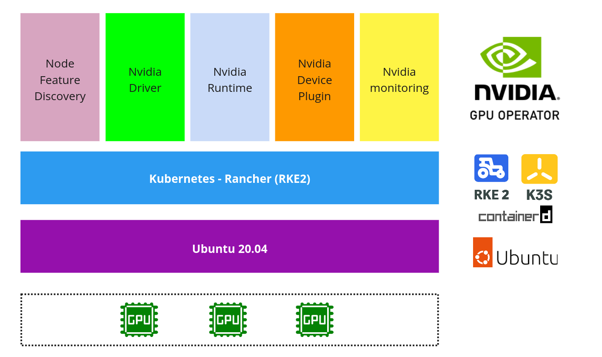
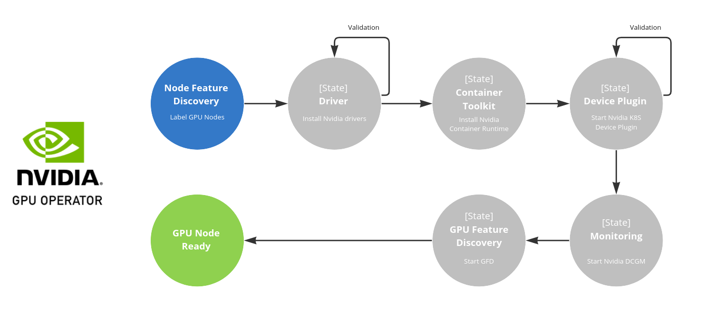

# Rancher (RKE2) 上部署 Nvidia GPU Operator



本教程將探討在 Kubernetes 集群上使用基於 [containerd](https://containerd.io/) 容器 runtime 而不是 Docker 引擎的 GPU 主機安裝 [NVIDIA GPU Operator](https://docs.nvidia.com/datacenter/cloud-native/gpu-operator/getting-started.html#) 的步驟。

與 Upstream Kubernetes 發行版上的安裝相比，RKE2/K3S 上的安裝步驟略有不同。關鍵區別在於 RKE2/K3S 帶有嵌入式 `containerd`，因此不需要獨立安裝 `containerd` 的容器 runtime。

## 步驟 01 - 環境安裝

在典型的基於 GPU 的 Kubernetes 安裝中，每個節點都需要設定正確版本的 Nvidia 顯卡驅動程式、CUDA runtime 和 cuDNN 函式庫，然後是容器 runtime，例如 Docker Engine、containerd、podman 或 CRI-O。

然後，部署 Nvidia Container Toolkit 以提供對容器化應用程式的 GPU 訪問。最後，安裝 Kubernetes，它將與選定的容器 runtime 交互以管理工作負載的生命週期。

Nvidia GPU Operator 顯著簡化了相關的設定與安裝流程，無需安裝驅動程式、CUDA runtime、cuDNN 函式庫或 Container Toolkit。它可以安裝在任何滿足特定硬體和軟體要求的 Kubernetes 集群上。

以下是安裝 Rancher (RKE2/K3S) 和 Nvidia GPU Operator 的步驟。在安裝結束後，我們將通過在 pod 中運行 Vector 運算來測試與驗證了 GPU 的訪問。

**先決條件 (一台配備著 Nvidia GPU 的機器):**

- Operating system: `Ubuntu 20.04 LTS`
- GPU: `Nvidia GeForce MX150` (Nvidia GPU 顯卡)

### Step 1: 安裝 nvidia drivers

!!! tip
    根據 Nvidia GPU Operator 的內容，operator 應該可自動幫每一個 Kubernetes 節點自動設定 GPU 的 Driver。
    
    然而在驗證的過程會發現 Ubuntu 的機器會在安裝完 Nvidia GPU Operator 之後一直重覆 reboot。
    
    排查之後的結果因該是 GPU Operator 在自動安裝 GPU Driver 後所發生的現象，查找相關 Githut 與 Google 之後尚未找出根因，因此在本教程中是先手動安裝 Nvidia GPU Driver 與 Nvidia Container Toolkit 在 Ubuntu 的機器上。


我們可以先使用 `apt` 搜索可用的 Nvidia GPU 卡的驅動程式：

```bash
sudo apt update

sudo apt search nvidia-driver
```

在撰寫本文時，最新的可用驅動程式版本是 `525`，所以讓我們安裝這個版本：

```bash
sudo apt install nvidia-driver-525 nvidia-dkms-525 -y
```

重新啟動 Ubuntu 的機器:

```bash
sudo shutdown now -r
```

驗證 nvidia driver 的安裝:

```bash
nvidia-smi
```

結果:

```
Fri Jan 20 01:05:54 2023       
+-----------------------------------------------------------------------------+
| NVIDIA-SMI 525.78.01    Driver Version: 525.78.01    CUDA Version: 12.0     |
|-------------------------------+----------------------+----------------------+
| GPU  Name        Persistence-M| Bus-Id        Disp.A | Volatile Uncorr. ECC |
| Fan  Temp  Perf  Pwr:Usage/Cap|         Memory-Usage | GPU-Util  Compute M. |
|                               |                      |               MIG M. |
|===============================+======================+======================|
|   0  NVIDIA GeForce ...  Off  | 00000000:02:00.0 Off |                  N/A |
| N/A   38C    P8    N/A /  N/A |      4MiB /  2048MiB |      0%      Default |
|                               |                      |                  N/A |
+-------------------------------+----------------------+----------------------+
                                                                               
+-----------------------------------------------------------------------------+
| Processes:                                                                  |
|  GPU   GI   CI        PID   Type   Process name                  GPU Memory |
|        ID   ID                                                   Usage      |
|=============================================================================|
|    0   N/A  N/A       942      G   /usr/lib/xorg/Xorg                  4MiB |
+-----------------------------------------------------------------------------+
```

### Step 2: 安裝 nvidia container toolkit

首先，設置包存儲庫和 GPG 密鑰：

```bash
distribution=$(. /etc/os-release;echo $ID$VERSION_ID) \
    && curl -s -L https://nvidia.github.io/libnvidia-container/gpgkey | sudo apt-key add - \
    && curl -s -L https://nvidia.github.io/libnvidia-container/$distribution/libnvidia-container.list | sudo tee /etc/apt/sources.list.d/nvidia-container-toolkit.list
```

現在，安裝 NVIDIA Container Toolkit:

```bash
sudo apt-get update \
    && sudo apt-get install -y nvidia-container-toolkit
```

### Step 3: 安裝 kubernetes

=== "RKE2"

    創建 RKE2 設定文件 `/etc/rancher/rke2/config.yaml`：

    ```bash
    sudo mkdir /etc/rancher/rke2 -p

    cat <<EOF | sudo tee /etc/rancher/rke2/config.yaml
    write-kubeconfig-mode: "0644"
    write-kubeconfig: "/root/.kube/config"
    cni: "calico"
    tls-san:
      - dxlab-nb-00
      - 192.168.50.195
    EOF
    ```

    下載並運行 RKE2 的安裝腳本:

    ```bash
    sudo apt install curl -y

    curl -sfL https://get.rke2.io --output install.sh

    chmod +x install.sh

    sudo ./install.sh
    ```

    啟用 `rke2-server` 服務:

    ```bash
    # Enable and activate RKE2 server
    sudo systemctl enable rke2-server.service
    sudo systemctl start rke2-server.service
    ```

    檢查 `rke2-server` 運行時的狀態。

    ```bash
    sudo systemctl status rke2-server
    ```

    結果:

    ```
    ● rke2-server.service - Rancher Kubernetes Engine v2 (server)
        Loaded: loaded (/usr/local/lib/systemd/system/rke2-server.service; enabled; vendor preset: enabled)
        Active: active (running) since Tue 2023-01-24 23:25:42 EST; 4min 35s ago
          Docs: https://github.com/rancher/rke2#readme
        Process: 2725 ExecStartPre=/bin/sh -xc ! /usr/bin/systemctl is-enabled --quiet nm-cloud-setup.service (code=exited, status=0/SUCCESS)
        Process: 2727 ExecStartPre=/sbin/modprobe br_netfilter (code=exited, status=0/SUCCESS)
        Process: 2730 ExecStartPre=/sbin/modprobe overlay (code=exited, status=0/SUCCESS)
      Main PID: 2731 (rke2)
          Tasks: 212
        Memory: 4.4G
        CGroup: /system.slice/rke2-server.service
                ├─2731 /usr/local/bin/rke2 server
                ├─2754 containerd -c /var/lib/rancher/rke2/agent/etc/containerd/config.toml -a /run/k3s/containerd/containerd.sock --state /run/k3s/containerd --root /var/lib/ran>
                ├─2782 kubelet --volume-plugin-dir=/var/lib/kubelet/volumeplugins --file-check-frequency=5s --sync-frequency=30s --address=0.0.0.0 --alsologtostderr=false --anony>
                ├─2883 /var/lib/rancher/rke2/data/v1.24.9-rke2r2-154c18a3ccf5/bin/containerd-shim-runc-v2 -namespace k8s.io -id fc3a59fb6a2e65cad40e89916a5e0ba26e4442f57f994801d3>
                ├─2965 /var/lib/rancher/rke2/data/v1.24.9-rke2r2-154c18a3ccf5/bin/containerd-shim-runc-v2 -namespace k8s.io -id 5746595b1334a8e2fee3ce71c7ef08d59b0b087be9dc04695c>
                ├─3064 /var/lib/rancher/rke2/data/v1.24.9-rke2r2-154c18a3ccf5/bin/containerd-shim-runc-v2 -namespace k8s.io -id 5b6dcc2cc00203125e95676907517f9210d1934fb5f72b23e6>
                ├─3076 /var/lib/rancher/rke2/data/v1.24.9-rke2r2-154c18a3ccf5/bin/containerd-shim-runc-v2 -namespace k8s.io -id cd274b023bcf42ed557167394ca4874c9fd3f160b4354d8cf7>
                ├─3233 /var/lib/rancher/rke2/data/v1.24.9-rke2r2-154c18a3ccf5/bin/containerd-shim-runc-v2 -namespace k8s.io -id 23bcd47f24e4b855d454364b771c183ca0d482c424c18b082b>
                ├─3365 /var/lib/rancher/rke2/data/v1.24.9-rke2r2-154c18a3ccf5/bin/containerd-shim-runc-v2 -namespace k8s.io -id 93e97168004715c832dca86bdc709d35f8ec94168d3e52cfd8>
                ├─4374 /var/lib/rancher/rke2/data/v1.24.9-rke2r2-154c18a3ccf5/bin/containerd-shim-runc-v2 -namespace k8s.io -id 043f7e79539f560d8bd38cfc3edbb1f028683bc00b4ef4984c>
                ├─4729 /var/lib/rancher/rke2/data/v1.24.9-rke2r2-154c18a3ccf5/bin/containerd-shim-runc-v2 -namespace k8s.io -id fe869fd79959b303a8ff5494c471d7c443b31358bb43482ce1>
                ├─5738 /var/lib/rancher/rke2/data/v1.24.9-rke2r2-154c18a3ccf5/bin/containerd-shim-runc-v2 -namespace k8s.io -id 2ae41a5a0c107f3591c2378c2d2b3ddba9052a39169edd4268>
                ├─6940 /var/lib/rancher/rke2/data/v1.24.9-rke2r2-154c18a3ccf5/bin/containerd-shim-runc-v2 -namespace k8s.io -id 72a759cf32ba0c922fd55fbb2e414a2bff7f438a58d74acc99>
                ├─6976 /var/lib/rancher/rke2/data/v1.24.9-rke2r2-154c18a3ccf5/bin/containerd-shim-runc-v2 -namespace k8s.io -id 5a8b1a0f32b2bcbb70631289b0c2a6c23b5b6628a8c6b9b1fd>
                ├─7448 /var/lib/rancher/rke2/data/v1.24.9-rke2r2-154c18a3ccf5/bin/containerd-shim-runc-v2 -namespace k8s.io -id 22599e38a6bdbc2b669f53dc51ae225ac4085d4f022b398b8d>
                ├─7618 /var/lib/rancher/rke2/data/v1.24.9-rke2r2-154c18a3ccf5/bin/containerd-shim-runc-v2 -namespace k8s.io -id 78da35606323653a02e191983e51d7c4185b656b2f08e2b733>
                └─8980 /var/lib/rancher/rke2/data/v1.24.9-rke2r2-154c18a3ccf5/bin/containerd-shim-runc-v2 -namespace k8s.io -id 0f5b1009c45e04c530cf8a422caa6e0106c212a60eae09b621>
    ```

    將包含 Kubernetes 二進製文件的目錄添加到路徑中，然後運行 `kubectl` 命令來檢查服務器的狀態。


    ```bash
    # copy RKE2 kubeconfig file to the default location
    mkdir ~/.kube
    sudo cp /etc/rancher/rke2/rke2.yaml ~/.kube/config
    sudo chown $(id -u):$(id -g) $HOME/.kube/config
    chmod 600 ~/.kube/config

    # add RKE2 binaries to path
    export PATH=$PATH:/var/lib/rancher/rke2/bin
    echo "export PATH=$PATH:/var/lib/rancher/rke2/bin" >> ~/.bashrc

    export KUBECONFIG=$HOME/.kube/config
    echo "export KUBECONFIG=$HOME/.kube/config" | tee -a ~/.bashrc
    ```

    請運行以下命令並檢查節點的狀態是否 `Ready`：

    ```bash
    kubectl get nodes
    ```

    結果:

    ```
    NAME          STATUS   ROLES                       AGE     VERSION
    dxlab-nb-00   Ready    control-plane,etcd,master   6m25s   v1.24.9+rke2r2
    ```

    檢查 `containerd` 的設定:

    ```bash
    sudo cat /var/lib/rancher/rke2/agent/etc/containerd/config.toml
    ```

    ```toml title="/var/lib/rancher/rke2/agent/etc/containerd/config.toml" hl_lines="25-28"
    version = 2

    [plugins."io.containerd.internal.v1.opt"]
      path = "/var/lib/rancher/rke2/agent/containerd"
    [plugins."io.containerd.grpc.v1.cri"]
      stream_server_address = "127.0.0.1"
      stream_server_port = "10010"
      enable_selinux = false
      enable_unprivileged_ports = true
      enable_unprivileged_icmp = true
      sandbox_image = "index.docker.io/rancher/pause:3.6"

    [plugins."io.containerd.grpc.v1.cri".containerd]
      snapshotter = "overlayfs"
      disable_snapshot_annotations = true


    [plugins."io.containerd.grpc.v1.cri".containerd.runtimes.runc]
      runtime_type = "io.containerd.runc.v2"

    [plugins."io.containerd.grpc.v1.cri".containerd.runtimes.runc.options]
      SystemdCgroup = true

    [plugins."io.containerd.grpc.v1.cri".containerd.runtimes."nvidia"]
      runtime_type = "io.containerd.runc.v2"
    [plugins."io.containerd.grpc.v1.cri".containerd.runtimes."nvidia".options]
      BinaryName = "/usr/bin/nvidia-container-runtime"
    ```

    !!! tip
        在安裝 RKE2 之前若先安裝好 Nvidia Driver 與 Nvidia Container Toolkit 的話, RKE2 會自動將 `nvidia` 的容器 runtime 加入到 `containerd` 的設定檔中。

=== "K3S"

    參考: https://docs.k3s.io/quick-start

    K3s 提供了一個安裝腳本，可以方便地將其作為服務安裝在基於 systemd 或 openrc 的系統上。該腳本可在 https://get.k3s.io 獲得。要使用這種方法安裝 K3s，只需運行：

    ```bash
    sudo apt install curl -y

    curl -sfL https://get.k3s.io | sh -
    ```

    運行此安裝後：

    - K3s 服務將設定為在節點重啟後或進程崩潰或被終止時自動重啟
    - 將安裝其他實用程式，包括 `kubectl`、`crictl`、`ctr`、`k3s-killall.sh` 和 `k3s-uninstall.sh`
    - 一個 `kubeconfig` 文件會寫入 `/etc/rancher/k3s/k3s.yaml`，K3s安裝的 `kubectl` 會自動使用它

    單節點服務器安裝是一個功能齊全的 Kubernetes 集群，包括託管工作負載 pod 所需的所有數據存儲、控制平面、kubelet 和容器運行時組件。沒有必要添加額外的服務器或代理節點，但您可能希望這樣做以向集群添加額外的容量或冗餘。

    檢察 k3s 服務:

    ```bash
    sudo systemctl status k3s
    ```

    結果:

    ```
    ● k3s.service - Lightweight Kubernetes
        Loaded: loaded (/etc/systemd/system/k3s.service; enabled; vendor preset: enabled)
        Active: active (running) since Wed 2023-01-25 02:02:35 EST; 2min 22s ago
          Docs: https://k3s.io
        Process: 2722 ExecStartPre=/bin/sh -xc ! /usr/bin/systemctl is-enabled --quiet nm-cloud-setup.service (code=exited, status=0/>
        Process: 2724 ExecStartPre=/sbin/modprobe br_netfilter (code=exited, status=0/SUCCESS)
        Process: 2727 ExecStartPre=/sbin/modprobe overlay (code=exited, status=0/SUCCESS)
      Main PID: 2728 (k3s-server)
          Tasks: 113
        Memory: 1.2G
        CGroup: /system.slice/k3s.service
                ├─2728 /usr/local/bin/k3s server
                ├─2756 containerd -c /var/lib/rancher/k3s/agent/etc/containerd/config.toml -a /run/k3s/containerd/containerd.sock -->
                ├─3535 /var/lib/rancher/k3s/data/84e02c125ef7644128a11b4ba4ebf72630b91abe0433e60a19586a247542e75b/bin/containerd-shi>
                ├─3582 /var/lib/rancher/k3s/data/84e02c125ef7644128a11b4ba4ebf72630b91abe0433e60a19586a247542e75b/bin/containerd-shi>
                ├─3620 /var/lib/rancher/k3s/data/84e02c125ef7644128a11b4ba4ebf72630b91abe0433e60a19586a247542e75b/bin/containerd-shi>
                ├─4467 /var/lib/rancher/k3s/data/84e02c125ef7644128a11b4ba4ebf72630b91abe0433e60a19586a247542e75b/bin/containerd-shi>
                └─4546 /var/lib/rancher/k3s/data/84e02c125ef7644128a11b4ba4ebf72630b91abe0433e60a19586a247542e75b/bin/containerd-shi>
    ```
    
    將上下文複製到您的 `~/.kube/config` 並將此設定設置為默認設定。

    ```bash
    # copy K3S kubeconfig file to the default location
    mkdir ~/.kube
    sudo cp /etc/rancher/k3s/k3s.yaml ~/.kube/config
    sudo chown $(id -u):$(id -g) $HOME/.kube/config
    chmod 600 ~/.kube/config

    export KUBECONFIG=$HOME/.kube/config
    echo "export KUBECONFIG=$HOME/.kube/config" | tee -a ~/.bashrc
    ```

    請運行以下命令並檢查節點的狀態是否 `Ready`：

    ```bash
    kubectl get nodes
    ```

    結果:

    ```
    NAME          STATUS   ROLES                  AGE   VERSION
    dxlab-nb-00   Ready    control-plane,master   46m   v1.25.5+k3s2
    ```

    檢查 `containerd` 的設定:

    ```bash
    sudo cat /var/lib/rancher/k3s/agent/etc/containerd/config.toml
    ```

    結果:

    ```toml title="/var/lib/rancher/k3s/agent/etc/containerd/config.toml"
    version = 2

    [plugins."io.containerd.internal.v1.opt"]
      path = "/var/lib/rancher/k3s/agent/containerd"
    [plugins."io.containerd.grpc.v1.cri"]
      stream_server_address = "127.0.0.1"
      stream_server_port = "10010"
      enable_selinux = false
      enable_unprivileged_ports = true
      enable_unprivileged_icmp = true
      sandbox_image = "rancher/mirrored-pause:3.6"

    [plugins."io.containerd.grpc.v1.cri".containerd]
      snapshotter = "overlayfs"
      disable_snapshot_annotations = true


    [plugins."io.containerd.grpc.v1.cri".cni]
      bin_dir = "/var/lib/rancher/k3s/data/84e02c125ef7644128a11b4ba4ebf72630b91abe0433e60a19586a247542e75b/bin"
      conf_dir = "/var/lib/rancher/k3s/agent/etc/cni/net.d"


    [plugins."io.containerd.grpc.v1.cri".containerd.runtimes.runc]
      runtime_type = "io.containerd.runc.v2"

    [plugins."io.containerd.grpc.v1.cri".containerd.runtimes.runc.options]
      SystemdCgroup = true
    ```

    !!! tip
        在安裝 K3S 之前若先安裝好 Nvidia Driver 與 Nvidia Container Toolkit 的話, K3S 會自動將 `nvidia` 的容器 runtime 加入到 `containerd` 的設定檔中。

### Step 4: 安裝 gpu operator

詳細的 Nvidia GPU Operator 說明請見: [Nvidia GPU Operator 官網](https://docs.nvidia.com/datacenter/cloud-native/gpu-operator/overview.html)

首先安裝 Helm3 的二進製文件。

```bash
sudo apt install git -y

curl -fsSL -o get_helm.sh https://raw.githubusercontent.com/helm/helm/master/scripts/get-helm-3

chmod 700 get_helm.sh

sudo ./get_helm.sh
```

添加 Nvidia Helm 存儲庫。

```bash
helm repo add nvidia https://helm.ngc.nvidia.com/nvidia \
   && helm repo update
```

由於我們使用的是 `containerd` 容器 runtime，因此我們將其設置為默認值並且宣告不自動安裝 Nvidia Driver。


```bash hl_lines="4 5 6"
helm install gpu-operator \
     -n gpu-operator --create-namespace \
     nvidia/gpu-operator \
     --set operator.defaultRuntime=containerd \
     --set driver.enabled=false \
     --set toolkit.enabled=false
```

幾分鐘後，您應該會看到 `gpu-operator` 命名空間中的 pod 正在運行, 檢查是否有運行錯誤或異常的的 pod。

```bash
kubectl get pods -n gpu-operator
```

結果:

```
NAME                                                          READY   STATUS      RESTARTS   AGE
gpu-feature-discovery-7kcmc                                   1/1     Running     0          2m24s
gpu-operator-95b545d6f-vv5kz                                  1/1     Running     0          2m46s
gpu-operator-node-feature-discovery-master-84c7c7c6cf-lcsrx   1/1     Running     0          2m46s
gpu-operator-node-feature-discovery-worker-wz58s              1/1     Running     0          2m46s
nvidia-cuda-validator-pl2mh                                   0/1     Completed   0          2m9s
nvidia-dcgm-exporter-r7gkw                                    1/1     Running     0          2m24s
nvidia-device-plugin-daemonset-qwjhn                          1/1     Running     0          2m24s
nvidia-device-plugin-validator-xn9mr                          0/1     Completed   0          108s
nvidia-operator-validator-4md82                               1/1     Running     0          2m24s
```

使用 Nvidia GPU Operator 運行的 state-machine diagram 可了解它運作的順序。



## 步驟 02 - GPU 設定功能驗證

是時候測試 Pod 的 GPU 訪問了。運行以下命令以啟動測試 pod。

```bash hl_lines="8"
kubectl apply -f -<<EOF
apiVersion: v1
kind: Pod
metadata:
  name: gpu-pod
spec:
  restartPolicy: Never
  runtimeClassName: nvidia
  containers:
    - name: cuda-container
      image: nvcr.io/nvidia/k8s/cuda-sample:vectoradd-cuda10.2
      resources:
        limits:
          nvidia.com/gpu: 1
  tolerations:
  - key: nvidia.com/gpu
    operator: Exists
    effect: NoSchedule
EOF
```

!!! tip
    由於在 Kubernetes 中包含了多個 container runtime, 因此要使用 `runtimeClassName: nvidia` 來指定特別的 container runtime。


檢查 pod 運行的日誌:

```bash
kubectl logs pod/gpu-pod
```

結果:

```
[Vector addition of 50000 elements]
Copy input data from the host memory to the CUDA device
CUDA kernel launch with 196 blocks of 256 threads
Copy output data from the CUDA device to the host memory
Test PASSED
Done
```

恭喜！在短短的時間裡，我們設定了一個基於 GPU 驅動的 `RKE2`/`K3S` 的 Kubernetes 集群。

## 總結

在本教程裡我們展示了 [Rancher RKE2](https://docs.rke2.io/)/[K3S](https://k3s.io/) 和 [NVIDIA GPU Operator](https://docs.nvidia.com/datacenter/cloud-native/gpu-operator/getting-started.html#) 相關安裝與設定的步驟。在安裝結束後，我們通過在 pod 中運行 Vector 運算來測試與驗證了 GPU 的訪問。


**參考:**

- [Install a Nvidia GPU Operator on RKE2 Kubernetes Cluster](https://thenewstack.io/install-a-nvidia-gpu-operator-on-rke2-kubernetes-cluster/)