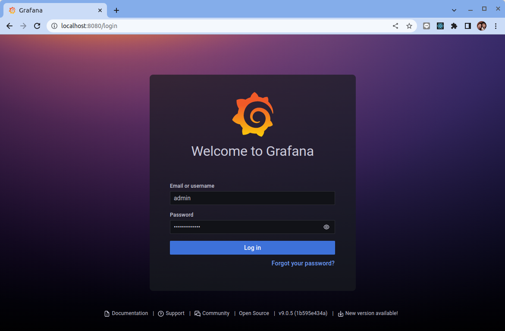

# Nvidia 雲原生 GPU Operator 分析


## 背景

我們知道，如果在 Kubernetes 中支持 GPU 設備調度，需要做如下的工作：

- 節點上安裝 nvidia 驅動程式
- 節點上安裝 nvidia-docker
- 集群部署 gpu device plugin，用於為調度到該節點的 pod 分配 GPU 設備

除此之外，如果你需要監控集群 GPU 資源使用情況，你可能還需要安裝 [DCCM exporter](https://github.com/NVIDIA/gpu-monitoring-tools?spm=a2c6h.12873639.article-detail.6.6bba35aa5IYKyv) 結合 Prometheus 輸出 GPU 資源監控信息。

要安裝和管理這麼多的組件，對於運維人員來說壓力不小。基於此，NVIDIA 開源了一款叫 [NVIDIA GPU Operator](https://github.com/NVIDIA/gpu-operator?spm=a2c6h.12873639.article-detail.7.6bba35aa5IYKyv) 的工具，該工具基於 [Operator Framework](https://github.com/operator-framework?spm=a2c6h.12873639.article-detail.8.6bba35aa5IYKyv) 實現，用於自動化管理上面我們提到的這些組件。

NVIDIA GPU Operator 有以下的組件構成：

- 安裝 nvidia driver 的組件
- 安裝 nvidia container toolkit 的組件
- 安裝 nvidia devcie plugin 的組件
- 安裝 gpu feature discovery 組件
- 安裝 nvidia dcgm exporter 組件

本教程將會介詔各個組件的功能與定位並且手動安裝這些組件。

## 步驟 01 - 環境準備

**先決條件 (一台配備著 Nvidia GPU 的機器):**

- Operating system: `Ubuntu 20.04 LTS`
- GPU: `Nvidia GeForce MX150` (Nvidia GPU 顯卡)

### 安裝 Kubernetes

創建 RKE2 設定文件 `/etc/rancher/rke2/config.yaml`：

```bash
sudo mkdir /etc/rancher/rke2 -p

cat <<EOF | sudo tee /etc/rancher/rke2/config.yaml
write-kubeconfig-mode: "0644"
write-kubeconfig: "/root/.kube/config"
cni: "calico"
tls-san:
  - dxlab-nb-00
  - 192.168.50.195
EOF
```

下載並運行 RKE2 的安裝腳本:

```bash
sudo apt install curl -y

curl -sfL https://get.rke2.io --output install.sh

chmod +x install.sh

sudo ./install.sh
```

啟用 `rke2-server` 服務:

```bash
# Enable and activate RKE2 server
sudo systemctl enable rke2-server.service
sudo systemctl start rke2-server.service
```

檢查 `rke2-server` 運行時的狀態。

```bash
sudo systemctl status rke2-server
```

結果:

```
● rke2-server.service - Rancher Kubernetes Engine v2 (server)
     Loaded: loaded (/usr/local/lib/systemd/system/rke2-server.service; enabled; vendor preset: enabled)
     Active: active (running) since Thu 2023-01-26 22:24:54 EST; 28s ago
       Docs: https://github.com/rancher/rke2#readme
    Process: 7423 ExecStartPre=/bin/sh -xc ! /usr/bin/systemctl is-enabled --quiet nm-cloud-setup.service (code=exited, status=0/SUCCESS)
    Process: 7425 ExecStartPre=/sbin/modprobe br_netfilter (code=exited, status=0/SUCCESS)
    Process: 7428 ExecStartPre=/sbin/modprobe overlay (code=exited, status=0/SUCCESS)
   Main PID: 7429 (rke2)
      Tasks: 153
     Memory: 1.8G
     CGroup: /system.slice/rke2-server.service
             ├─7429 /usr/local/bin/rke2 server
             ├─7451 containerd -c /var/lib/rancher/rke2/agent/etc/containerd/config.toml -a /run/k3s/containerd/containerd.sock --state /run/k3s/containerd 
             ...
             ...
```

將包含 Kubernetes 二進製文件的目錄添加到路徑中，然後運行 `kubectl` 命令來檢查服務器的狀態。


```bash
# copy RKE2 kubeconfig file to the default location
mkdir ~/.kube
sudo cp /etc/rancher/rke2/rke2.yaml ~/.kube/config
sudo chown $(id -u):$(id -g) $HOME/.kube/config
chmod 600 ~/.kube/config

# add RKE2 binaries to path
export PATH=$PATH:/var/lib/rancher/rke2/bin
echo "export PATH=$PATH:/var/lib/rancher/rke2/bin" >> ~/.bashrc

export KUBECONFIG=$HOME/.kube/config
echo "export KUBECONFIG=$HOME/.kube/config" | tee -a ~/.bashrc
```

請運行以下命令並檢查節點的狀態是否 `Ready`：

```bash
kubectl get nodes
```

結果:

```
NAME          STATUS   ROLES                       AGE     VERSION
dxlab-nb-00   Ready    control-plane,etcd,master   6m23s   v1.24.9+rke2r2
```

檢查 containerd 的設定:

```bash
sudo cat /var/lib/rancher/rke2/agent/etc/containerd/config.toml
```

```toml title="/var/lib/rancher/rke2/agent/etc/containerd/config.toml"
version = 2

[plugins."io.containerd.internal.v1.opt"]
  path = "/var/lib/rancher/rke2/agent/containerd"
[plugins."io.containerd.grpc.v1.cri"]
  stream_server_address = "127.0.0.1"
  stream_server_port = "10010"
  enable_selinux = false
  enable_unprivileged_ports = true
  enable_unprivileged_icmp = true
  sandbox_image = "index.docker.io/rancher/pause:3.6"

[plugins."io.containerd.grpc.v1.cri".containerd]
  snapshotter = "overlayfs"
  disable_snapshot_annotations = true


[plugins."io.containerd.grpc.v1.cri".containerd.runtimes.runc]
  runtime_type = "io.containerd.runc.v2"

[plugins."io.containerd.grpc.v1.cri".containerd.runtimes.runc.options]
  SystemdCgroup = true
```

## 步驟 02 - 安裝 Nvidia 組件

### 1. NVIDIA Driver


**安裝**

我們可以先使用 `apt` 搜索可用的 Nvidia GPU 卡的驅動程序：

```bash
sudo apt update

sudo apt search nvidia-driver -y
```

在撰寫本文時，最新的可用驅動程序版本是 `525`，所以讓我們安裝這個版本：

```bash
sudo apt install nvidia-driver-525 nvidia-dkms-525
```

重新啟動 Ubuntu 的機器:

```bash
sudo shutdown now -r
```

驗證 nvidia driver 的安裝:

```bash
nvidia-smi
```

結果:

```
Fri Jan 20 01:05:54 2023       
+-----------------------------------------------------------------------------+
| NVIDIA-SMI 525.78.01    Driver Version: 525.78.01    CUDA Version: 12.0     |
|-------------------------------+----------------------+----------------------+
| GPU  Name        Persistence-M| Bus-Id        Disp.A | Volatile Uncorr. ECC |
| Fan  Temp  Perf  Pwr:Usage/Cap|         Memory-Usage | GPU-Util  Compute M. |
|                               |                      |               MIG M. |
|===============================+======================+======================|
|   0  NVIDIA GeForce ...  Off  | 00000000:02:00.0 Off |                  N/A |
| N/A   38C    P8    N/A /  N/A |      4MiB /  2048MiB |      0%      Default |
|                               |                      |                  N/A |
+-------------------------------+----------------------+----------------------+
                                                                               
+-----------------------------------------------------------------------------+
| Processes:                                                                  |
|  GPU   GI   CI        PID   Type   Process name                  GPU Memory |
|        ID   ID                                                   Usage      |
|=============================================================================|
|    0   N/A  N/A       942      G   /usr/lib/xorg/Xorg                  4MiB |
+-----------------------------------------------------------------------------+
```

### 2. NVIDIA Container Toolkit


**簡介:**

如果您需要在容器中使用 NVIDIA GPU 設備，那麼 NVIDIA Container Toolkit 是必不可少的組件。它的主要作用是將 NVIDIA GPU 設備掛載到容器中。

NVIDIA Container Tookit 由如下的組件構成：

- nvidia-docker2 (本教程不使用 docker engine, 因此在後續的安裝中不會使用)
- nvidia-container-runtime
- nvidia-container-toolkit
- libnvidia-container

??? info
    Nvidia Container Toolkits:
    
    - https://github.com/NVIDIA/nvidia-container-toolkit

    


下面這幅架構圖詳細介紹了各個組件的關係。


!!! info
    `runc` (run container)是一個基於 OCI 標準實現的一個輕量級容器運行工具，用來創建和運行容器。而 `Containerd` 是用來維持通過 `runc` 創建的容器的運行狀態。即 `runc` 用來創建和運行容器，`containerd` 作為常駐進程用來管理容器。

    `runc` 包含 `libcontainer`，包括對 `namespace` 和 `cgroup` 的調用操作。

    `runc` 源碼: https://github.com/opencontainers/runc

讓我們從下而上地介詔相關組件的定位與功能:

- **libnvidia-container**
    - `libnvidia-container` 提供了一個庫和簡單的 CLI 工具，以實現在容器當中支持使用 GPU 設備的目標。
- **nvidia-container-toolkit**
    - `nvidia-container-toolkit` 是一個實現了 `runC prestart hook` 接口的腳本，該腳本在 `runC` 創建一個容器之後，在啟動該容器之前調用，其主要作用就是修改與容器相關聯的 `config.json`，注入一些在容器中使用 NVIDIA GPU 設備所需要的一些信息（比如：需要掛載哪些GPU設備到容器當中）。
- **nvidia-container-runtime**
    - `nvidia-container-runtime` 主要用於將容器 `runC spec` 作為輸入，然後將 nvidia-container-toolkit 腳本作為一個 `prestart hook` 注入到 `runC spec` 中，將修改後的 `runC spec` 交給 `runC` 處理。
- **nvidia-docker2**
    - `nvidia-docker2` 只適用於 docker，其主要作用是可以通過環境變量指定容器需要使用節點上哪些 GPU (在本教程不會使用)。

**安裝:**

首先，設置包存儲庫和 GPG 密鑰：

```bash
distribution=$(. /etc/os-release;echo $ID$VERSION_ID) \
    && curl -s -L https://nvidia.github.io/libnvidia-container/gpgkey | sudo apt-key add - \
    && curl -s -L https://nvidia.github.io/libnvidia-container/$distribution/libnvidia-container.list | sudo tee /etc/apt/sources.list.d/nvidia-container-toolkit.list
```

現在，安裝 NVIDIA Container Toolkit:

```bash
sudo apt-get update \
    && sudo apt-get install -y nvidia-container-toolkit
```

重新啟動 `rke2-server` 服務:

```bash
sudo systemctl restart rke2-server.service
```

檢查 containerd 的設定:

```bash
sudo cat /var/lib/rancher/rke2/agent/etc/containerd/config.toml
```

結果:

```
version = 2

[plugins."io.containerd.internal.v1.opt"]
  path = "/var/lib/rancher/rke2/agent/containerd"
[plugins."io.containerd.grpc.v1.cri"]
  stream_server_address = "127.0.0.1"
  stream_server_port = "10010"
  enable_selinux = false
  enable_unprivileged_ports = true
  enable_unprivileged_icmp = true
  sandbox_image = "index.docker.io/rancher/pause:3.6"

[plugins."io.containerd.grpc.v1.cri".containerd]
  snapshotter = "overlayfs"
  disable_snapshot_annotations = true


[plugins."io.containerd.grpc.v1.cri".containerd.runtimes.runc]
  runtime_type = "io.containerd.runc.v2"

[plugins."io.containerd.grpc.v1.cri".containerd.runtimes.runc.options]
  SystemdCgroup = true


[plugins."io.containerd.grpc.v1.cri".containerd.runtimes."nvidia"]
  runtime_type = "io.containerd.runc.v2"
[plugins."io.containerd.grpc.v1.cri".containerd.runtimes."nvidia".options]
  BinaryName = "/usr/bin/nvidia-container-runtime"
```

!!! tip
    Rancher RKE2 的服務在重新啟動的時候會檢查在系統中是否有安裝 Nvidia Driver 與 Nvidia Toolkit，如果有發現的話它會在 `containerd` 的設定檔中增加對於 `nvidia` runtime 的設定資訊。

### 3. NVIDIA Device Plugin


**簡介:**

安裝完 NVIDIA Container Toolkit 後，當啟動 docker 容器的時侯，可以通過環境變量指定容器所需的 GPU，例如:

```bash
docker run -d --name gpu-test -e NVIDIA_VISIBLE_DEVICES=0,1 centos:7 sleep 5000
```

那麼在 Kubernetes 集群中應該如何給一個應用程式指定所使用的 GPU 呢? 可以通過給 pod 的容器指定環境變量 `NVIDIA_VISIBLE_DEVICES` 實現嗎? 可以，但是這樣做有一些問題：

- 因為 kubernetes 集群中有很多節點，每個節點的 GPU 數量可能不同，假設指定 pod 的容器的環境變量為 `NVIDIA_VISIBLE_DEVICES=3,4`，但是 pod 調度到節點是隨機的，最終 pod 所在的節點如果只有一張 GPU 卡，那麼 pod 將啟動失敗。
- 直接在 pod 的容器中指定環境變量 `NVIDIA_VISIBLE_DEVICES`，用戶無法維護哪些節點的哪些 GPU 已經使用，哪些未使用。

Kubernetes 從 1.8 開始支持設備插件 (device plugin) 機制，只要用戶實現與設備相對應的 device plugin，然後在 pod 提交時指定需要使用多少個設備，kubernetes 就能為pod 自動掛載設備並且維護節點上設備狀態（即哪些設備已使用，哪些設備未使用）。

NVIDIA Device Plugin 的工作原理簡單的流程:

1. 在 `pod spec` 中的 `resources.limits` 欄位宣告該 pod 需要多少個 GPU 設備，像下面這樣：
  ```yaml
  kind: Pod
  metadata:
    name: gpu-pod
  spec:
    containers:
      - name: gpu-container-1
        image: centos:7
        resources:
          limits:
            nvidia.com/gpu: 2 #代表為該 Pod 申請了 2 個GPU。
  ```
2. 每個節點的 kubelet 組件維護該節點的 GPU 設備狀態（哪些已用，哪些未用）並定時報告給調度器，讓調度器知道每一個節點有多少張 GPU 卡可用。
3. 調度器為 pod 選擇節點時，從符合條件的節點中選擇一個節點。
4. 當 pod 調度到節點上後，kubelet 組件為 pod 分配 GPU 設備 ID，並將這些 ID 作為參數傳遞給 NVIDIA Device Plugin
5. NVIDIA Device Plugin 將分配給該 pod 的容器的 GPU 設備 ID 寫入到容器的環境變量 `NVIDIA_VISIBLE_DEVICES` 中，然後將信息返回給 kubelet。
6. kubelet 啟動容器。
7. NVIDIA Container Toolkit 檢測容器的 spec 中存在環境變量 `NVIDIA_VISIBLE_DEVICES`，然後根據環境變量的值將 GPU 設備掛載到容器中。

**安裝/佈署:**

在進行 NVIDIA Device Plugin 之前我們先來看一下當前 Kubernetes 節點的標籤。

```bash
kubectl describe node/dxlab-nb-00
```

下面列出 `Labels` 與 `Capacity` 的資訊：

- Labels:
  - beta.kubernetes.io/arch=amd64
  - beta.kubernetes.io/instance-type=rke2
  - beta.kubernetes.io/os=linux
  - egress.rke2.io/cluster=true
  - kubernetes.io/arch=amd64
  - kubernetes.io/hostname=dxlab-nb-00
  - kubernetes.io/os=linux
  - node-role.kubernetes.io/control-plane=true
  - node-role.kubernetes.io/etcd=true
  - node-role.kubernetes.io/master=true
  - node.kubernetes.io/instance-type=rke2
- Capacity:
  - cpu: 8
  - ephemeral-storage: 121969296Ki
  - hugepages-1Gi: 0
  - hugepages-2Mi: 0
  - memory: 32581392Ki
  - pods: 110


參考: 

- https://github.com/k3s-io/k3s/issues/4070
- https://docs.containerplatform.hpe.com/54/reference/nvidia-gpu-support/Using_GPUs_in_Kubernetes_Pods.html

創建 RuntimeClass 來宣告

```bash
kubectl apply -f -<<EOF
apiVersion: node.k8s.io/v1
kind: RuntimeClass
metadata:
  name: nvidia
handler: nvidia
EOF
```

安裝 Helm:

```bash
curl -fsSL -o get_helm.sh https://raw.githubusercontent.com/helm/helm/main/scripts/get-helm-3
chmod 700 get_helm.sh
./get_helm.sh
```

加入 helm 的 repo:

```bash
helm repo add nvdp https://nvidia.github.io/k8s-device-plugin

helm repo update
```

使用 helm 來安裝 nvidia device plugin:

!!! info
    注意: 要宣告 `runtimeClassName=nvidia`

```bash
helm upgrade -i nvdp nvdp/nvidia-device-plugin \
  --namespace nvidia-device-plugin \
  --create-namespace \
  --version 0.13.0 \
  --set runtimeClassName=nvidia
```

檢查:

```bash
kubectl get all -n nvidia-device-plugin
```

結果:

```
NAME                                       DESIRED   CURRENT   READY   UP-TO-DATE   AVAILABLE   NODE SELECTOR   AGE
daemonset.apps/nvdp-nvidia-device-plugin   0         0         0       0            0           <none>          22s
```

從上述的結果來解讀 nvidia-device-plugin 的 daemonset 並沒有找到任何要佈署 gpu device plugin 的節點。

主要的原因在於 NVIDIA Device Plugin 的 daemonset 會監看 Kubernetes 每一個節點的標籤並根據特定的標籤來決定是否需要為該節點來佈署 device plugin。

接下來讓我們使用 Node Featrue Discovery 與 GPU Feature Discovery 組件來幫我們發現節點的feature並自動打上所需要的標籤。

### 4. NVIDIA GPU Feature Discovery


**簡介:**

GPU Feature Discovery 這個組件主要的作用是給 GPU 節點打上一些與 GPU 設備屬性相關的標籤，比如：該節點的 GPU 驅動是哪個版本，GPU 顯存是多大等，其效果是節點擁有很多以 "nvidia.com" 開頭的標籤。

有了這些相對應的標籤可幫助到 `nvidia-device-plugin` 在有 GPU 的節點來佈署管理 GPU 的 device plugin。

**安裝/佈署:**

由於 `nvidia-device-plugin` 的 helm chart 裡己經包含了 GPU Feature Discovery 的 sub-chart，我們只需要在 helm 的佈署上啟動它:

```bash hl_lines="6"
helm upgrade -i nvdp nvdp/nvidia-device-plugin \
  --namespace nvidia-device-plugin \
  --create-namespace \
  --version 0.13.0 \
  --set runtimeClassName=nvidia \
  --set gfd.enabled=true
```

!!! tip
    `gpu-feature-discovery` 的 helm chart 裡包含了 `node-feature-discovery` 的 chart。

檢查:

```bash
kubectl get all -n nvidia-device-plugin
```

結果:

```
NAME                                                      READY   STATUS    RESTARTS   AGE
pod/nvdp-gpu-feature-discovery-bvh8w                      1/1     Running   0          69s
pod/nvdp-node-feature-discovery-master-8488dd66f6-l25nl   1/1     Running   0          13m
pod/nvdp-node-feature-discovery-worker-bsct9              1/1     Running   0          13m
pod/nvdp-nvidia-device-plugin-dzmb5                       1/1     Running   0          88s

NAME                                         TYPE        CLUSTER-IP     EXTERNAL-IP   PORT(S)    AGE
service/nvdp-node-feature-discovery-master   ClusterIP   10.43.18.253   <none>        8080/TCP   13m

NAME                                                DESIRED   CURRENT   READY   UP-TO-DATE   AVAILABLE   NODE SELECTOR   AGE
daemonset.apps/nvdp-gpu-feature-discovery           1         1         1       1            1           <none>          3m53s
daemonset.apps/nvdp-node-feature-discovery-worker   1         1         1       1            1           <none>          13m
daemonset.apps/nvdp-nvidia-device-plugin            1         1         1       1            1           <none>          35m

NAME                                                 READY   UP-TO-DATE   AVAILABLE   AGE
deployment.apps/nvdp-node-feature-discovery-master   1/1     1            1           13m

NAME                                                            DESIRED   CURRENT   READY   AGE
replicaset.apps/nvdp-node-feature-discovery-master-8488dd66f6   1         1         1       13m
```

讓我們再來看一下當前 Kubernetes 節點的標籤。

```bash
kubectl describe node/dxlab-nb-00
```

Labels 在探索前後的比較:

|Before|After|
|------|-----|
|beta.kubernetes.io/arch=amd64|beta.kubernetes.io/arch=amd64|
|beta.kubernetes.io/instance-type=rke2|beta.kubernetes.io/instance-type=rke2|
|beta.kubernetes.io/os=linux|beta.kubernetes.io/os=linux|
|egress.rke2.io/cluster=true|egress.rke2.io/cluster=true|
|kubernetes.io/arch=amd64|kubernetes.io/arch=amd64|
|kubernetes.io/hostname=dxlab-nb-00|kubernetes.io/hostname=dxlab-nb-00|
|kubernetes.io/os=linux|kubernetes.io/os=linux|
|node-role.kubernetes.io/control-plane=true|node-role.kubernetes.io/control-plane=true|
|node-role.kubernetes.io/etcd=true|node-role.kubernetes.io/etcd=true|
|node-role.kubernetes.io/master=true|node-role.kubernetes.io/master=true|
|node.kubernetes.io/instance-type=rke2|node.kubernetes.io/instance-type=rke2|                  
||feature.node.kubernetes.io/cpu-cpuid.ADX=true|
||feature.node.kubernetes.io/cpu-cpuid.AESNI=true|
||feature.node.kubernetes.io/cpu-cpuid.AVX=true|
||feature.node.kubernetes.io/cpu-cpuid.AVX2=true|
||feature.node.kubernetes.io/cpu-cpuid.CMPXCHG8=true|
||feature.node.kubernetes.io/cpu-cpuid.FMA3=true|
||feature.node.kubernetes.io/cpu-cpuid.FXSR=true|
||feature.node.kubernetes.io/cpu-cpuid.FXSROPT=true|
||feature.node.kubernetes.io/cpu-cpuid.IBPB=true|
||feature.node.kubernetes.io/cpu-cpuid.LAHF=true|
||feature.node.kubernetes.io/cpu-cpuid.MOVBE=true|
||feature.node.kubernetes.io/cpu-cpuid.MPX=true|
||feature.node.kubernetes.io/cpu-cpuid.OSXSAVE=true|
||feature.node.kubernetes.io/cpu-cpuid.RTM_ALWAYS_ABORT=true|
||feature.node.kubernetes.io/cpu-cpuid.SCE=true|
||feature.node.kubernetes.io/cpu-cpuid.STIBP=true|
||feature.node.kubernetes.io/cpu-cpuid.VMX=true|
||feature.node.kubernetes.io/cpu-cpuid.X87=true|
||feature.node.kubernetes.io/cpu-cpuid.XSAVE=true|
||feature.node.kubernetes.io/cpu-cstate.enabled=true|
||feature.node.kubernetes.io/cpu-hardware_multithreading=true|
||feature.node.kubernetes.io/cpu-model.family=6|
||feature.node.kubernetes.io/cpu-model.id=142|
||feature.node.kubernetes.io/cpu-model.vendor_id=Intel|
||feature.node.kubernetes.io/cpu-pstate.scaling_governor=powersave|
||feature.node.kubernetes.io/cpu-pstate.status=active|
||feature.node.kubernetes.io/cpu-pstate.turbo=true|
||feature.node.kubernetes.io/cpu-sgx.enabled=true|
||feature.node.kubernetes.io/kernel-config.NO_HZ=true|
||feature.node.kubernetes.io/kernel-config.NO_HZ_IDLE=true|
||feature.node.kubernetes.io/kernel-version.full=5.15.0-46-generic|
||feature.node.kubernetes.io/kernel-version.major=5|
||feature.node.kubernetes.io/kernel-version.minor=15|
||feature.node.kubernetes.io/kernel-version.revision=0|
||{==feature.node.kubernetes.io/pci-10de.present=true==}|
||feature.node.kubernetes.io/pci-8086.present=true|
||feature.node.kubernetes.io/storage-nonrotationaldisk=true|
||feature.node.kubernetes.io/system-os_release.ID=ubuntu|
||feature.node.kubernetes.io/system-os_release.VERSION_ID=20.04|
||feature.node.kubernetes.io/system-os_release.VERSION_ID.major=20|
||feature.node.kubernetes.io/system-os_release.VERSION_ID.minor=04|
||feature.node.kubernetes.io/usb-ef_04f2_b604.present=true|
||feature.node.kubernetes.io/usb-ef_04f2_b613.present=true|
||feature.node.kubernetes.io/usb-ff_06cb_009a.present=true|
||nvidia.com/cuda.driver.major=525|
||nvidia.com/cuda.driver.minor=78|
||nvidia.com/cuda.driver.rev=01|
||nvidia.com/cuda.runtime.major=12|
||nvidia.com/cuda.runtime.minor=0|
||nvidia.com/gfd.timestamp=1674807232|
||nvidia.com/gpu.compute.major=6|
||nvidia.com/gpu.compute.minor=1|
||nvidia.com/gpu.count=1|
||nvidia.com/gpu.family=pascal|
||nvidia.com/gpu.machine=4810CW0100|
||nvidia.com/gpu.memory=2048|
||nvidia.com/gpu.product=NVIDIA## 4. NVIDIA GPU Feature Discovery
    除此之外也可看到許多 `nvidia.com/xxx` 打頭的標籤則是由 `GPU Feature Discovery` 所所標註出來的標籤。

  
Capacity 在探索前後的比較:

|Before|After|
|------|-----|
|cpu: 8|cpu: 8|
|ephemeral-storage: 121969296Ki|ephemeral-storage: 121969296Ki|
|hugepages-1Gi: 0|hugepages-1Gi: 0|
|hugepages-2Mi: 0|hugepages-2Mi: 0|
|memory: 32581392Ki|memory: 32581392Ki|
||{==nvidia.com/gpu: 1==}|
|pods: 110|pods: 110|

!!! info
    `nvidia.com/gpu` 代表者該節點擁有的 GPU 資源數量。

### 5. NVIDIA DCGM Exporter


**簡介:**

DCGM Exporter 是一個用 golang 編寫組件，它的核心功能是用來收集 Kubernetes 節點上 GPU 信息（比如 GPU 卡的利用率、溫度、顯存使用情況等）的工具，結合 Prometheus 和 Grafana 可以提供豐富的 dashboard。

從 1.13 開始，kubelet 通過 `/var/lib/kubelet/pod-resources` 下的 Unix 套接字來提供 pod 資源查詢服務，`dcgm-exporter` 可以訪問 `/var/lib/kubelet/pod-resources/` 下的套接字服務來查詢為每個 pod 分配的 GPU 設備，然後將 GPU 的 pod 信息附加到收集的度量中。

DCGM Exporter 服務在每個 GPU 節點上都會被佈署，當 Prometheus 每隔一段時間（用戶可設置時間間隔）就訪問該節點 GCGM Exporter 的服務來獲取該節點 GPU 相關指標，然後存入的 Prometheus 的數據庫中，grafana 每隔一段時間（用戶可設置時間間隔）從 Prometheus 數據庫中拿取該節點 GPU 指標，然後在瀏覽器中通過各種 dashboard 展示出來。


**安裝/佈署:**

由於 DCGM Export 相依於 Prometheus Operator，因此我們先安裝 `prometheus-stack`:

添加 Prometheus 圖表存儲庫並更新本地緩存:

```bash
helm repo add prometheus-community https://prometheus-community.github.io/helm-charts

helm repo update 
```

創建要配置的 vlaues 檔案:

```yaml title="kube-stack-prometheus-values.yaml"
grafana:
  sidecar:
    dashboards:
      logLevel: "DEBUG"
      # Enables the cluster wide search for dashboards and adds/updates/deletes them in grafana
      enabled: true
      searchNamespace: "ALL"


prometheus:
  prometheusSpec:
    serviceMonitorSelectorNilUsesHelmValues: false
    podMonitorSelectorNilUsesHelmValues: false
    ruleSelectorNilUsesHelmValues: false
    probeSelectorNilUsesHelmValues: false
```

使用 Helm 在命名空間監控中部署 kube-stack-prometheus chart：

```bash
helm upgrade --install --create-namespace --namespace monitoring  \
     kube-stack-prometheus prometheus-community/kube-prometheus-stack \
     --values kube-stack-prometheus-values.yaml
```


加入 Nvidia DCGM Export 的 helm repo:

```bash
helm repo add nvdcgm https://nvidia.github.io/dcgm-exporter/helm-charts

helm repo update
```

使用 helm 來安裝 nvidia dcgm exporter:

```bash
helm upgrade -i nvdcgm nvdcgm/dcgm-exporter \
  --namespace nvidia-dcgm \
  --create-namespace 
```

查看佈署:

```bash
kubectl get all -n nvidia-dcgm
```

結果:

```
NAME                             READY   STATUS             RESTARTS         AGE
pod/nvdcgm-dcgm-exporter-xkxt7   0/1     CrashLoopBackOff   11 (2m55s ago)   35m

NAME                           TYPE        CLUSTER-IP      EXTERNAL-IP   PORT(S)    AGE
service/nvdcgm-dcgm-exporter   ClusterIP   10.43.190.247   <none>        9400/TCP   35m

NAME                                  DESIRED   CURRENT   READY   UP-TO-DATE   AVAILABLE   NODE SELECTOR   AGE
daemonset.apps/nvdcgm-dcgm-exporter   1         1         0       1            0           <none>          35m
```

很明顯的 dcgm-exporter 的 pod 會無法順利運行, 主要原因是 dcgm-exporter 需要跑在 `nvidia runtime`。 讓我們 patch 一下:

```bash
kubectl edit daemonset.apps/nvdcgm-dcgm-exporter -n nvidia-dcgm
```

在 pod spec 中指定 `runtimeClassName: nvidia`：

```yaml hl_lines="36"
apiVersion: apps/v1
kind: DaemonSet
metadata:
  ...
  ...
spec:
  selector:
    matchLabels:
      app.kubernetes.io/component: dcgm-exporter
      app.kubernetes.io/instance: nvdcgm
      app.kubernetes.io/name: dcgm-exporter
  template:
    metadata:
      creationTimestamp: null
      labels:
        app.kubernetes.io/component: dcgm-exporter
        app.kubernetes.io/instance: nvdcgm
        app.kubernetes.io/name: dcgm-exporter
    spec:
      containers:
      - args:
        - -f
        - /etc/dcgm-exporter/dcp-metrics-included.csv
        env:
        - name: DCGM_EXPORTER_KUBERNETES
          value: "true"
        - name: DCGM_EXPORTER_LISTEN
          value: :9400
        image: nvcr.io/nvidia/k8s/dcgm-exporter:3.1.3-3.1.2-ubuntu20.04
        imagePullPolicy: IfNotPresent
        ...
        ...
      dnsPolicy: ClusterFirst
      priorityClassName: system-node-critical
      restartPolicy: Always
      runtimeClassName: nvidia
      schedulerName: default-scheduler
      ...
      ...
```

查看佈署:

```bash
kubectl get all -n nvidia-dcgm
```

結果:

```
NAME                             READY   STATUS    RESTARTS   AGE
pod/nvdcgm-dcgm-exporter-qkjlt   1/1     Running   0          17m

NAME                           TYPE        CLUSTER-IP      EXTERNAL-IP   PORT(S)    AGE
service/nvdcgm-dcgm-exporter   ClusterIP   10.43.190.247   <none>        9400/TCP   59m

NAME                                  DESIRED   CURRENT   READY   UP-TO-DATE   AVAILABLE   NODE SELECTOR   AGE
daemonset.apps/nvdcgm-dcgm-exporter   1         1         1       1            1           <none>          59m
```

獲取 nvidia-dcgm-exporter 服務監聽的端口：

```bash
kubectl get service/nvdcgm-dcgm-exporter -n nvidia-dcgm -o yaml
```

結果:

```yaml hl_lines="28 29"
apiVersion: v1
kind: Service
metadata:
  annotations:
    meta.helm.sh/release-name: nvdcgm
    meta.helm.sh/release-namespace: nvidia-dcgm
  creationTimestamp: "2023-01-27T11:27:11Z"
  labels:
    app.kubernetes.io/component: dcgm-exporter
    app.kubernetes.io/instance: nvdcgm
    app.kubernetes.io/managed-by: Helm
    app.kubernetes.io/name: dcgm-exporter
    app.kubernetes.io/version: 3.1.2
    helm.sh/chart: dcgm-exporter-3.1.2
  name: nvdcgm-dcgm-exporter
  namespace: nvidia-dcgm
  resourceVersion: "42518"
  uid: 88963e0c-1eaa-4cb4-90ea-30561d091567
spec:
  clusterIP: 10.43.190.247
  clusterIPs:
  - 10.43.190.247
  internalTrafficPolicy: Cluster
  ipFamilies:
  - IPv4
  ipFamilyPolicy: SingleStack
  ports:
  - name: metrics
    port: 9400
    protocol: TCP
    targetPort: 9400
  selector:
    app.kubernetes.io/instance: nvdcgm
    app.kubernetes.io/name: dcgm-exporter
  sessionAffinity: None
  type: ClusterIP
status:
  loadBalancer: {}
```

可以看到，服務監聽的端口為 `9400`，端口名為 `metrics`。

```bash
kubectl port-forward service/nvdcgm-dcgm-exporter 9400:9400 -n nvidia-dcgm --address 0.0.0.0
```

使用瀏覽器 `http://localhost:9400/metrics` 可看到由 DCGM Exporter 曝露出來的指標:


|指標名稱	|型別	|說明|
|--------|----|----|
|DCGM_FI_DEV_FB_FREE	|gauge	|Framebuffer memory free (in MiB).|
|DCGM_FI_DEV_FB_USED	|gauge	|Framebuffer memory used (in MiB).|
|DCGM_FI_DEV_GPU_TEMP	|gauge	|GPU temperature (in C).|
|DCGM_FI_DEV_GPU_UTIL	|gauge	|GPU utilization (in %).|
|DCGM_FI_DEV_MEM_CLOCK	|gauge	|Memory clock frequency (in MHz).|
|DCGM_FI_DEV_MEM_COPY_UTIL	|gauge	|Memory utilization (in %).|
|DCGM_FI_DEV_NVLINK_BANDWIDTH_TOTAL	|counter	|Total number of NVLink bandwidth counters for all lanes.|
|DCGM_FI_DEV_PCIE_REPLAY_COUNTER	|counter	|Total number of PCIe retries.|
|DCGM_FI_DEV_SM_CLOCK	|gauge	|SM clock frequency (in MHz).|
|DCGM_FI_DEV_XID_ERRORS	|gauge	|Value of the last XID error encountered.|

**連接到 Grafana:**

Grafana UI 可通過以下命令通過端口轉發訪問:

```bash
kubectl port-forward --namespace monitoring svc/kube-stack-prometheus-grafana 3000:80 --address="0.0.0.0"
```

打開瀏覽器並轉到 http://localhost:3000 並填寫前一個命令所取得的用戶名/密碼。預設的帳號是:

- username: admin
- password: prom-operator



在 grafana 中安裝 dashboard:

1. 從 `https://grafana.com/grafana/dashboards/12239` 下載 dashboard，點擊界面右側的 “Download JSON” 進行下載，文件名為`nvidia-dcgm-exporter-dashboard_rev2.json`。

2. 點擊 “+” -> Import 導入 `nvidia-dcgm-exporter-dashboard_rev2.json`。

    

    導入時需要選擇數據源。

    

3. 導入後效果如下。

    

## 總結

我們完成了對 NVIDIA GPU Operator 各個組件的功能與定位的介詔並且手動安裝這些組件：

- 安裝 nvidia driver 的組件
- 安裝 nvidia container toolkit 的組件
- 安裝 nvidia devcie plugin 的組件
- 安裝 gpu feature discovery 組件
- 安裝 nvidia dcgm exporter 組件

經由手動安裝的過程也更清晰 NVIDIA GPU Operator 的狀態機圖中的順序與過程。


參考:

- [NVIDIA GPU Operator分析一：NVIDIA驱动安装](https://developer.aliyun.com/article/784149)
- [NVIDIA GPU Operator分析二：NVIDIA Container Toolkit安装](https://developer.aliyun.com/article/784150)
- [NVIDIA GPU Operator分析三：NVIDIA Device Plugin安装](https://developer.aliyun.com/article/784151)
- [NVIDIA GPU Operator分析四：DCGM Exporter安装](https://developer.aliyun.com/article/784152)
- [NVIDIA GPU Operator分析五：GPU Feature Discovery安装](https://developer.aliyun.com/article/784153)
- [Monitoring GPUs in Kubernetes with DCGM](https://developer.nvidia.com/blog/monitoring-gpus-in-kubernetes-with-dcgm/)