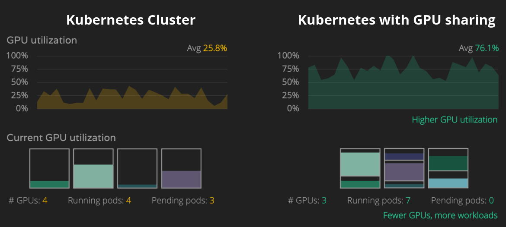

# 提高 Kubernetes 的 GPU 利用率 - Time Slicing

原文: [Improving GPU Utilization in Kubernetes](https://developer.nvidia.com/blog/improving-gpu-utilization-in-kubernetes/)



NVIDIA GPU 通過 `device plugin` 框架來將 GPU 作為 Kubernetes 中可被調度的運算資源。然而，此框架僅允許將 GPU (`nvidia.com/gpu`) 設備作為 **整數** 資源進行宣告，因此不允許過度訂閱 (oversubscription)。

要提高 GPU 利用率之前必需先對 Nvidia GPU 的併發機制有基本的認識:

- CUDA streams
- Time-slicing
- CUDA Multi-Process Service
- Multi-instance GPU (MIG)
- Virtualization with vGPU

詳細的說明請見: [Nvidia GPU 共享的機制](./nvidia-gpu-sharing-concepts.md)

在本文，我們將討論使用 **Time-slicing** 的機制在 Kubernetes 中超額訂閱 GPU 的方法。

## 步驟 01 - 環境安裝

**先決條件 (一台配備著 Nvidia GPU 的機器):**

- Operating system: `Ubuntu 20.04 LTS`
- GPU: `Nvidia GeForce MX150` (Nvidia GPU 顯卡)
- Kubernetes
- Nvidia GPU Operator

根據 Nvidia 的文件說明 CUDA 應用程序的 time-slice duration 可通過 `nvidia-smi` 工具程式在 CUDA 11.1 (R455+ drivers) 的環境下來動態設定。

下面列出 CUDA 版本對應到 Driver 版本的兼容性:

|CUDA Toolkit	|Linux x86_64 Minimum Required Driver Version	|Windows Minimum Required Driver Version|
|-------------|---------------------------------------------|---------------------------------------|
|CUDA 12.x	|>=525.60.13	|>=527.41|
|CUDA 11.x	|>= 450.80.02*	|>=452.39*|
|CUDA 10.2	|>= 440.33	|>=441.22|
|CUDA 10.1	|>= 418.39	|>=418.96|
|CUDA 10.0	|>= 410.48	|>=411.31|

因此在安裝 Nvidia Driver 時要注意版本與 CUDA 版本的適配性。

### Step 1: 安裝 nvidia drivers

在撰寫本文時，CUDA 11.x 是主流的版本，因此在本教程會選擇相搭配的驅動程式版本 `515`，所以讓我們安裝這個版本：

```bash
sudo apt install nvidia-driver-515 nvidia-dkms-515 -y
```

重新啟動 Ubuntu 的機器:

```bash
sudo shutdown now -r
```

驗證 nvidia driver 的安裝:

```bash
nvidia-smi
```

結果:

```
Sat Jan 28 00:13:13 2023       
+-----------------------------------------------------------------------------+
| NVIDIA-SMI 515.86.01    Driver Version: 515.86.01    CUDA Version: 11.7     |
|-------------------------------+----------------------+----------------------+
| GPU  Name        Persistence-M| Bus-Id        Disp.A | Volatile Uncorr. ECC |
| Fan  Temp  Perf  Pwr:Usage/Cap|         Memory-Usage | GPU-Util  Compute M. |
|                               |                      |               MIG M. |
|===============================+======================+======================|
|   0  NVIDIA GeForce ...  Off  | 00000000:02:00.0 Off |                  N/A |
| N/A   57C    P0    N/A /  N/A |    469MiB /  2048MiB |    100%      Default |
|                               |                      |                  N/A |
+-------------------------------+----------------------+----------------------+
                                                                               
+-----------------------------------------------------------------------------+
| Processes:                                                                  |
|  GPU   GI   CI        PID   Type   Process name                  GPU Memory |
|        ID   ID                                                   Usage      |
|=============================================================================|
|    0   N/A  N/A       937      G   /usr/lib/xorg/Xorg                  4MiB |
|    0   N/A  N/A    102783      C   /usr/bin/dcgmproftester11         463MiB |
+-----------------------------------------------------------------------------+
```

### Step 2: 安裝 nvidia container toolkit

首先，設置包存儲庫和 GPG 密鑰：

```bash
distribution=$(. /etc/os-release;echo $ID$VERSION_ID) \
    && curl -s -L https://nvidia.github.io/libnvidia-container/gpgkey | sudo apt-key add - \
    && curl -s -L https://nvidia.github.io/libnvidia-container/$distribution/libnvidia-container.list | sudo tee /etc/apt/sources.list.d/nvidia-container-toolkit.list
```

現在，安裝 NVIDIA Container Toolkit:

```bash
sudo apt-get update \
    && sudo apt-get install -y nvidia-container-toolkit
```

### Step 3: 安裝 kubernetes

創建 RKE2 設定文件 `/etc/rancher/rke2/config.yaml`：

```bash
sudo mkdir /etc/rancher/rke2 -p

cat <<EOF | sudo tee /etc/rancher/rke2/config.yaml
write-kubeconfig-mode: "0644"
write-kubeconfig: "/root/.kube/config"
cni: "calico"
tls-san:
  - dxlab-nb-00
  - 192.168.50.195
EOF
```

下載並運行 RKE2 的安裝腳本:

```bash
sudo apt install curl -y

curl -sfL https://get.rke2.io --output install.sh

chmod +x install.sh

sudo ./install.sh
```

啟用 `rke2-server` 服務:

```bash
# Enable and activate RKE2 server
sudo systemctl enable rke2-server.service
sudo systemctl start rke2-server.service
```

檢查 `rke2-server` 運行時的狀態。

```bash
sudo systemctl status rke2-server
```

結果:

```
● rke2-server.service - Rancher Kubernetes Engine v2 (server)
    Loaded: loaded (/usr/local/lib/systemd/system/rke2-server.service; enabled; vendor preset: enabled)
    Active: active (running) since Tue 2023-01-24 23:25:42 EST; 4min 35s ago
      Docs: https://github.com/rancher/rke2#readme
    Process: 2725 ExecStartPre=/bin/sh -xc ! /usr/bin/systemctl is-enabled --quiet nm-cloud-setup.service (code=exited, status=0/SUCCESS)
    Process: 2727 ExecStartPre=/sbin/modprobe br_netfilter (code=exited, status=0/SUCCESS)
    Process: 2730 ExecStartPre=/sbin/modprobe overlay (code=exited, status=0/SUCCESS)
    ...
    ...
```

將包含 Kubernetes 二進製文件的目錄添加到路徑中，然後運行 `kubectl` 命令來檢查服務器的狀態。


```bash
# copy RKE2 kubeconfig file to the default location
mkdir ~/.kube
sudo cp /etc/rancher/rke2/rke2.yaml ~/.kube/config
sudo chown $(id -u):$(id -g) $HOME/.kube/config
chmod 600 ~/.kube/config

# add RKE2 binaries to path
export PATH=$PATH:/var/lib/rancher/rke2/bin
echo "export PATH=$PATH:/var/lib/rancher/rke2/bin" >> ~/.bashrc

export KUBECONFIG=$HOME/.kube/config
echo "export KUBECONFIG=$HOME/.kube/config" | tee -a ~/.bashrc
```

請運行以下命令並檢查節點的狀態是否 `Ready`：

```bash
kubectl get nodes
```

結果:

```
NAME          STATUS   ROLES                       AGE     VERSION
dxlab-nb-00   Ready    control-plane,etcd,master   6m25s   v1.24.9+rke2r2
```

檢查 `containerd` 的設定:

```bash
sudo cat /var/lib/rancher/rke2/agent/etc/containerd/config.toml
```

```toml title="/var/lib/rancher/rke2/agent/etc/containerd/config.toml" hl_lines="25-28"
version = 2

[plugins."io.containerd.internal.v1.opt"]
  path = "/var/lib/rancher/rke2/agent/containerd"
[plugins."io.containerd.grpc.v1.cri"]
  stream_server_address = "127.0.0.1"
  stream_server_port = "10010"
  enable_selinux = false
  enable_unprivileged_ports = true
  enable_unprivileged_icmp = true
  sandbox_image = "index.docker.io/rancher/pause:3.6"

[plugins."io.containerd.grpc.v1.cri".containerd]
  snapshotter = "overlayfs"
  disable_snapshot_annotations = true


[plugins."io.containerd.grpc.v1.cri".containerd.runtimes.runc]
  runtime_type = "io.containerd.runc.v2"

[plugins."io.containerd.grpc.v1.cri".containerd.runtimes.runc.options]
  SystemdCgroup = true

[plugins."io.containerd.grpc.v1.cri".containerd.runtimes."nvidia"]
  runtime_type = "io.containerd.runc.v2"
[plugins."io.containerd.grpc.v1.cri".containerd.runtimes."nvidia".options]
  BinaryName = "/usr/bin/nvidia-container-runtime"
```

!!! tip
      在安裝 RKE2 之前若先安裝好 Nvidia Driver 與 Nvidia Container Toolkit 的話, RKE2 會自動將 `nvidia` 的容器 runtime 加入到 `containerd` 的設定檔中。

### Step 4: 安裝 gpu operator

詳細的 Nvidia GPU Operator 說明請見: [Nvidia GPU Operator 官網](https://docs.nvidia.com/datacenter/cloud-native/gpu-operator/overview.html)

首先安裝 Helm3 的二進製文件。

```bash
sudo apt install git -y

curl -fsSL -o get_helm.sh https://raw.githubusercontent.com/helm/helm/master/scripts/get-helm-3

chmod 700 get_helm.sh

sudo ./get_helm.sh
```

添加 Nvidia Helm 存儲庫。

```bash
helm repo add nvidia https://helm.ngc.nvidia.com/nvidia \
   && helm repo update
```

由於我們使用的是 `containerd` 容器 runtime，因此我們將其設置為默認值並且宣告不自動安裝 Nvidia Driver。

```bash
cat << EOF > /tmp/dp-example-config.yaml
version: v1
flags:
  migStrategy: "none"
  failOnInitError: true
  nvidiaDriverRoot: "/"
  plugin:
    passDeviceSpecs: false
    deviceListStrategy: "envvar"
    deviceIDStrategy: "uuid"
  gfd:
    oneshot: false
    noTimestamp: false
    outputFile: /etc/kubernetes/node-feature-discovery/features.d/gfd
    sleepInterval: 60s
sharing:
  timeSlicing:
    resources:
    - name: nvidia.com/gpu
      replicas: 5
EOF
```

```bash hl_lines="4 5 6"
helm upgrade --install gpu-operator \
     -n gpu-operator --create-namespace \
     nvidia/gpu-operator \
     --set operator.defaultRuntime=containerd \
     --set driver.enabled=false \
     --set toolkit.enabled=false
```

幾分鐘後，您應該會看到 `gpu-operator` 命名空間中的 pod 正在運行, 檢查是否有運行錯誤或異常的的 pod。

```bash
kubectl get pods -n gpu-operator
```

結果:

```
NAME                                                          READY   STATUS      RESTARTS   AGE
gpu-feature-discovery-7kcmc                                   1/1     Running     0          2m24s
gpu-operator-95b545d6f-vv5kz                                  1/1     Running     0          2m46s
gpu-operator-node-feature-discovery-master-84c7c7c6cf-lcsrx   1/1     Running     0          2m46s
gpu-operator-node-feature-discovery-worker-wz58s              1/1     Running     0          2m46s
nvidia-cuda-validator-pl2mh                                   0/1     Completed   0          2m9s
nvidia-dcgm-exporter-r7gkw                                    1/1     Running     0          2m24s
nvidia-device-plugin-daemonset-qwjhn                          1/1     Running     0          2m24s
nvidia-device-plugin-validator-xn9mr                          0/1     Completed   0          108s
nvidia-operator-validator-4md82                               1/1     Running     0          2m24s
```

## 步驟 02 - GPU Operator 功能驗證

**產生 GPU 負載:**

要生成 GPU 負載，我們直接運行 `nvidia/samples:dcgmproftester-2.1.7-cuda11.2.2-ubuntu20.04` 的容器鏡像。此容器鏡像在 NVIDIA DockerHub 存儲庫中可下載使用。

通過指定 `-t 1004` 並運行 `-d 60`（60 秒）測試，此容器鏡像會使用 Tensor Core 來觸發 FP16 矩陣乘法。您可以通過修改 `-t` 參數嘗試運行其他工作負載。

```bash
cat << EOF | kubectl create -f -
apiVersion: apps/v1
kind: Deployment
metadata:
  name: dcgmproftester
  labels:
    app: dcgmproftester
spec:
  replicas: 1
  selector:
    matchLabels:
      app: dcgmproftester
  template:
    metadata:
      labels:
        app: dcgmproftester
    spec:
      tolerations:
        - key: nvidia.com/gpu
          operator: Exists
          effect: NoSchedule
      runtimeClassName: nvidia
      containers:
        - name: dcgmproftester11
          image: nvidia/samples:dcgmproftester-2.1.7-cuda11.2.2-ubuntu20.04
          command: ["/bin/sh", "-c"]
          args:
            - while true; do /usr/bin/dcgmproftester11 --no-dcgm-validation -t 1004 -d 60; sleep 30; done
          resources:
            limits:
              nvidia.com/gpu: 1
          securityContext:
            capabilities:
              add: ["SYS_ADMIN"]
EOF
```

檢查:

```bash
kubectl get all
```

結果:

```
NAME                                 READY   STATUS    RESTARTS   AGE
pod/dcgmproftester-c6f5c8b7f-g6c6z   1/1     Running   0          107s

NAME                 TYPE        CLUSTER-IP   EXTERNAL-IP   PORT(S)   AGE
service/kubernetes   ClusterIP   10.43.0.1    <none>        443/TCP   7h26m

NAME                             READY   UP-TO-DATE   AVAILABLE   AGE
deployment.apps/dcgmproftester   1/1     1            1           107s

NAME                                       DESIRED   CURRENT   READY   AGE
replicaset.apps/dcgmproftester-c6f5c8b7f   1         1         1       107s
```

您可以看到 dcgmproftester pod 正在運行。

```bash
kubectl logs pod/dcgmproftester-c6f5c8b7f-g6c6z
```

結果:

```
Skipping CreateDcgmGroups() since DCGM validation is disabled
Skipping CreateDcgmGroups() since DCGM validation is disabled
Skipping WatchFields() since DCGM validation is disabled
Skipping CreateDcgmGroups() since DCGM validation is disabled
Worker 0:0[1004]: TensorEngineActive: generated ???, dcgm 0.000 (20.4 gflops)
Worker 0:0[1004]: TensorEngineActive: generated ???, dcgm 0.000 (20.4 gflops)
Worker 0:0[1004]: TensorEngineActive: generated ???, dcgm 0.000 (20.4 gflops)
```

接著讓我們修改 `dcgmproftester` 佈署的設定 `spec.replicas` 從 "1" 提高成 "4":

```bash hl_lines="11"
kubectl delete deploy/dcgmproftester

cat << EOF | kubectl apply -f -
apiVersion: apps/v1
kind: Deployment
metadata:
  name: dcgmproftester
  labels:
    app: dcgmproftester
spec:
  replicas: 4
  selector:
    matchLabels:
      app: dcgmproftester
  template:
    metadata:
      labels:
        app: dcgmproftester
    spec:
      tolerations:
        - key: nvidia.com/gpu
          operator: Exists
          effect: NoSchedule
      runtimeClassName: nvidia
      containers:
        - name: dcgmproftester11
          image: nvidia/samples:dcgmproftester-2.1.7-cuda11.2.2-ubuntu20.04
          command: ["/bin/sh", "-c"]
          args:
            - while true; do /usr/bin/dcgmproftester11 --no-dcgm-validation -t 1004 -d 300; sleep 30; done
          resources:
            limits:
              nvidia.com/gpu: 1
          securityContext:
            capabilities:
              add: ["SYS_ADMIN"]
EOF
```

檢查:

```bash
kubectl get all
```

結果:

```
NAME                                  READY   STATUS    RESTARTS   AGE
pod/dcgmproftester-5c644f4694-4hxbf   0/1     Pending   0          6s
pod/dcgmproftester-5c644f4694-5p82x   0/1     Pending   0          6s
pod/dcgmproftester-5c644f4694-7czsr   0/1     Pending   0          6s
pod/dcgmproftester-5c644f4694-wqtx2   1/1     Running   0          6s

NAME                 TYPE        CLUSTER-IP   EXTERNAL-IP   PORT(S)   AGE
service/kubernetes   ClusterIP   10.43.0.1    <none>        443/TCP   23h

NAME                             READY   UP-TO-DATE   AVAILABLE   AGE
deployment.apps/dcgmproftester   1/4     4            1           6s

NAME                                        DESIRED   CURRENT   READY   AGE
replicaset.apps/dcgmproftester-5c644f4694   4         4         1       6s
```

由於在範例的 lab 環境中只有一張 Nvidia GPU 顯卡, 因此四個 Pods 中只有一個 pod 是順利運行, 而其中三個則是在 `pending` 的狀態。

讓我們使用 `kubectl describe` 來了解 pod 的狀態訊息:

```bash
kubectl describe pod/dcgmproftester-5c644f4694-4hxbf
```

結果:

```
Name:           dcgmproftester-5c644f4694-4hxbf
Namespace:      default
Priority:       0
Node:           <none>
Labels:         app=dcgmproftester
                pod-template-hash=5c644f4694
Annotations:    kubernetes.io/psp: global-unrestricted-psp
Status:         Pending
...
...
Events:
  Type     Reason            Age   From               Message
  ----     ------            ----  ----               -------
  Warning  FailedScheduling  5m5s  default-scheduler  0/1 nodes are available: 1 Insufficient nvidia.com/gpu. preemption: 0/1 nodes are available: 1 No preemption victims found for incoming pod.
```

從 Events 的訊息中 "Insufficient nvidia.com/gpu" 可確認是因 `nvidia.com/gpu` 的資源不夠因此無法被排程來運行。

## 步驟 03 - 啟動 GPU Time-slicing

### Time-slicing 設定

您可以創建一個 ConfigMap 物件來作為 NVIDIA Kubernetes 設備插件 `time-slicing` 的設定:

```yaml
version: v1
sharing:
  timeSlicing:
    renameByDefault: <bool>
    failRequestsGreaterThanOne: <bool>
    resources:
    - name: <resource-name>
      replicas: <num-replicas>
    ...
```

也就是說，你可對於 `sharing.timeSlicing.resources` 下的每個命名 GPU 資源來定義多個副本。

此外，如果把 `renameByDefault` 設成 `true` 的話，則每個 GPU 資源都會在原有的資源名稱下被修改成 `<resource-name>.shared` 而不是 `<resource-name>`。

對於向後兼容性，`failRequestsGreaterThanOne` 標誌默認為 `false`。它控制 pod 是否可以請求多個 GPU 資源。一個以上的 GPU 請求並不意味著 pod 會按比例獲得更多的時間片，因為 GPU 調度器會為當前在 GPU 上運行的所有進程提供相等的時間份額。

`failRequestsGreaterThanOne` 標誌設定了插件的行為，將一個 GPU 的請求視為訪問請求，而不是獨占資源請求。

創建新的超額訂閱資源時，Kubernetes 設備插件會將這些資源分配給請求的作業。當兩個或多個作業落在同一 GPU 上時，這些作業會{==自動使用 GPU 的時間切片機制==}。該插件不提供任何其他額外的隔離好處。

您也可以在 ConfigMap 中指定多個設定，如以下示例所示;

```yaml
cat << EOF >> time-slicing-config.yaml
apiVersion: v1
kind: ConfigMap
metadata:
  name: time-slicing-config
  namespace: gpu-operator
data:
    a100-40gb: |-
        version: v1
        sharing:
          timeSlicing:
            resources:
            - name: nvidia.com/gpu
              replicas: 8
            - name: nvidia.com/mig-1g.5gb
              replicas: 2
            - name: nvidia.com/mig-2g.10gb
              replicas: 2
            - name: nvidia.com/mig-3g.20gb
              replicas: 3
            - name: nvidia.com/mig-7g.40gb
              replicas: 7
    tesla-t4: |-
        version: v1
        sharing:
          timeSlicing:
            resources:
            - name: nvidia.com/gpu
              replicas: 4
EOF
```

在本教程中我們將使用下列的範例來設定 `time-slicing`:

```bash title="time-slicing-config.yaml"
cat << EOF >> time-slicing-config.yaml
apiVersion: v1
kind: ConfigMap
metadata:
  name: time-slicing-config
  namespace: gpu-operator
data:
    default: |-
        version: v1
        sharing:
          timeSlicing:
            resources:
            - name: nvidia.com/gpu
              replicas: 4
EOF
```

在 `gpu-operator` 命名空間中創建一個 ConfigMap:

```bash
kubectl apply -f time-slicing-config.yaml
```

### 啟用 GPU 的共享訪問

您可以通過傳遞 `devicePlugin.config.name=<config-map-name>` 參數來讓 NVIDIA GPU Operator 啟用 `time-slicing`，其中 <config-map-name> 是為時間切片配置創建的 ConfigMap 的名稱如前一節所述，而 `devicePlugin.config.default` 則是設定要用那一組設定做為預設。

執行下列命令:

```bash hl_lines="8 9"
helm upgrade --install gpu-operator \
     -n gpu-operator --create-namespace \
     nvidia/gpu-operator \
     --set operator.defaultRuntime=containerd \
     --set driver.enabled=false \
     --set toolkit.enabled=false \
     --set gfd.enabled=true \
     --set devicePlugin.config.name=time-slicing-config \
     --set devicePlugin.config.default=default
```

### 測試 GPU Time-Slicing

下面是使用時間切片 API 超額訂閱 GPU 資源的完整示例。在此示例中，您將了解 Kubernetes 設備插件和 GFD 的其他配置設置，以設置 GPU 超額訂閱並使用指定資源啟動工作負載。

1. 創建 GPU 工作負載如下：

```bash hl_lines="11"
kubectl delete deploy/dcgmproftester

cat << EOF | kubectl apply -f -
apiVersion: apps/v1
kind: Deployment
metadata:
  name: dcgmproftester
  labels:
    app: dcgmproftester
spec:
  replicas: 4
  selector:
    matchLabels:
      app: dcgmproftester
  template:
    metadata:
      labels:
        app: dcgmproftester
    spec:
      tolerations:
        - key: nvidia.com/gpu
          operator: Exists
          effect: NoSchedule
      runtimeClassName: nvidia
      containers:
        - name: dcgmproftester11
          image: nvidia/samples:dcgmproftester-2.1.7-cuda11.2.2-ubuntu20.04
          command: ["/bin/sh", "-c"]
          args:
            - while true; do /usr/bin/dcgmproftester11 --no-dcgm-validation -t 1004 -d 300; sleep 30; done
          resources:
            limits:
              nvidia.com/gpu: 1
          securityContext:
            capabilities:
              add: ["SYS_ADMIN"]
EOF
```

2. 驗證所有四個副本都在運行:

```bash
kubectl get pods
```

結果:

```
NAME                                  READY   STATUS    RESTARTS   AGE
pod/dcgmproftester-5c644f4694-567p9   1/1     Running   0          102s
pod/dcgmproftester-5c644f4694-f9r82   1/1     Running   0          102s
pod/dcgmproftester-5c644f4694-qxsjf   1/1     Running   0          102s
pod/dcgmproftester-5c644f4694-tdncs   1/1     Running   0          102s

NAME                             READY   UP-TO-DATE   AVAILABLE   AGE
deployment.apps/dcgmproftester   4/4     4            4           102s

NAME                                        DESIRED   CURRENT   READY   AGE
replicaset.apps/dcgmproftester-5c644f4694   4         4         4       102s
```

使用 `nvidia-smi` 來查看:

```bash
nvidia-smi
```

結果:

```
Sun Jan 29 08:55:48 2023       
+-----------------------------------------------------------------------------+
| NVIDIA-SMI 515.86.01    Driver Version: 515.86.01    CUDA Version: 11.7     |
|-------------------------------+----------------------+----------------------+
| GPU  Name        Persistence-M| Bus-Id        Disp.A | Volatile Uncorr. ECC |
| Fan  Temp  Perf  Pwr:Usage/Cap|         Memory-Usage | GPU-Util  Compute M. |
|                               |                      |               MIG M. |
|===============================+======================+======================|
|   0  NVIDIA GeForce ...  Off  | 00000000:02:00.0 Off |                  N/A |
| N/A   57C    P0    N/A /  N/A |   1858MiB /  2048MiB |    100%      Default |
|                               |                      |                  N/A |
+-------------------------------+----------------------+----------------------+
                                                                               
+-----------------------------------------------------------------------------+
| Processes:                                                                  |
|  GPU   GI   CI        PID   Type   Process name                  GPU Memory |
|        ID   ID                                                   Usage      |
|=============================================================================|
|    0   N/A  N/A       947      G   /usr/lib/xorg/Xorg                  4MiB |
|    0   N/A  N/A    658429      C   /usr/bin/dcgmproftester11         463MiB |
|    0   N/A  N/A    658430      C   /usr/bin/dcgmproftester11         463MiB |
|    0   N/A  N/A    658435      C   /usr/bin/dcgmproftester11         463MiB |
|    0   N/A  N/A    659103      C   /usr/bin/dcgmproftester11         463MiB |
+-----------------------------------------------------------------------------+
```

## 總結

不同的 GPU sharing 技術都有其適用的場景與需要去考慮的相關因子。架構師或運維工程師需要依據實際的工作負載特性來做對應的調整與設定。

參考:

- [Nvidia GPU 共享的機制](./nvidia-gpu-sharing-concepts.md)
- [Time-Slicing GPUs in Kubernetes](https://docs.nvidia.com/datacenter/cloud-native/gpu-operator/gpu-sharing.html#)
