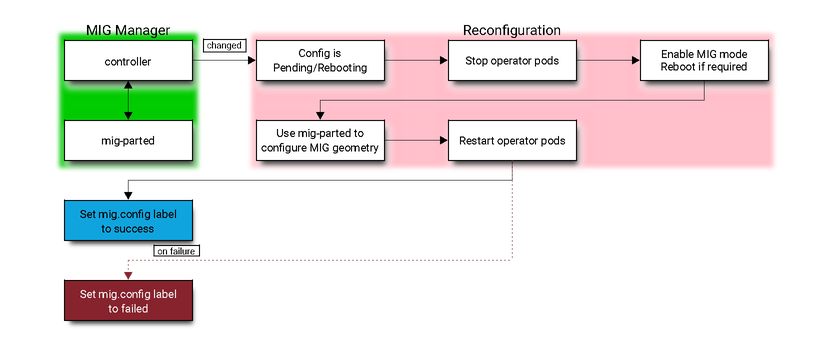

# GPU Operator 與 MIG 配置

原文: [GPU Operator with MIG](https://docs.nvidia.com/datacenter/cloud-native/gpu-operator/gpu-operator-mig.html)

多實例 GPU (MIG) 允許將基於 NVIDIA Ampere 架構的 GPU（例如 NVIDIA A100）安全地劃分為用於 CUDA 應用程序的獨立 GPU 實例。有關 MIG 的更多詳細信息，請參閱 [MIG 用戶指南](https://docs.nvidia.com/datacenter/tesla/mig-user-guide/index.html)。

本文檔概述瞭如何將 GPU Operator 與支持 MIG 的節點結合使用。

## 架構

`MIG manager` 被設計為 Kubernetes 中的控制器。它監視節點上 `nvidia.com/mig.config` 標籤的變化，當標籤發生變化時應用用戶請求的 MIG 配置。

`MIG manager` 首先停止所有 GPU pod（包括設備插件、gfd 和 dcgm-exporter）。如果預安裝了驅動程序，它會停止在 ConfigMap 中列出的所有主機 GPU 客戶端。最後，它應用 MIG 重新配置並重新啟動 GPU pod（並可能託管 GPU 客戶端）。

如果需要啟用 MIG 模式，MIG 重新配置還可能涉及節點重啟。

對　MIG manager daemonset 來說相關可被應用的 MIG 配置文件存放在 `ConfigMap`。用戶可以選擇這些配置文件中的設定來應用於 `mig.config` 標籤以觸發 MIG 結構的重新配置。

MIG manager 依靠 `[mig-parted](https://github.com/NVIDIA/mig-parted)` 工具來將配置更改應用到 GPU，包括啟用 MIG 模式（根據某些場景的要求可能需要重新啟動節點）。



## 步驟 01 - 環境安裝

本教程使用了 Azure 上的 VM (O.S: Ubuntu 20.04.05)來作為練習在 Kubernetes 裡應用 MIG 的環境。

|型號	|vCPU	|記憶體：GiB	|暫存儲存體：GiB	|GPU	|GPU 記憶體：GiB	|
|----|-----|------------|---------------|-----|----------------|
|Standard_NC24ads_A100_v4|24|220|1123|1|80|

這個 VM 會搭配一張 **Nvidia A100 (80gb)** 的 GPU 卡。

參考: [NC A100 v4 系列](https://learn.microsoft.com/zh-tw/azure/virtual-machines/nc-a100-v4-series)

以下是安裝 Rancher (RKE2/K3S) 和 Nvidia GPU Operator 的步驟。

**先決條件 (一台配備著 Nvidia GPU 的機器):**

- Operating system: `Ubuntu 20.04.05 LTS`
- GPU: `Nvidia A100 (80gb)` (Nvidia GPU 顯卡)

### Step 1: 安裝 nvidia drivers

!!! tip
    根據 Nvidia GPU Operator 的內容，operator 應該可自動幫每一個 Kubernetes 節點自動設定 GPU 的 Driver。
    
    然而在驗證的過程會發現 Ubuntu 的機器會在安裝完 Nvidia GPU Operator 之後一直重覆 reboot。
    
    排查之後的結果因該是 GPU Operator 在自動安裝 GPU Driver 後所發生的現象，查找相關 Githut 與 Google 之後尚未找出根因，因此在本教程中是先手動安裝 Nvidia GPU Driver 與 Nvidia Container Toolkit 在 Ubuntu 的機器上。


我們可以先使用 `apt` 搜索可用的 Nvidia GPU 卡的驅動程式：

```bash
sudo apt update

sudo apt search nvidia-driver
```

由於許多深度學習開發工具會與 Nvidia CUDA 函式庫有相依性，在安裝 Nvidia Driver 時需要根據實際的情況來決定要安裝的 Driver 版本。

下面列出 CUDA 版本對應到 Driver 版本的兼容性:

|CUDA Toolkit	|Linux x86_64 Minimum Required Driver Version	|Windows Minimum Required Driver Version|
|-------------|---------------------------------------------|---------------------------------------|
|CUDA 12.x	|>=525.60.13	|>=527.41|
|CUDA 11.x	|>= 450.80.02*	|>=452.39*|
|CUDA 10.2	|>= 440.33	|>=441.22|
|CUDA 10.1	|>= 418.39	|>=418.96|
|CUDA 10.0	|>= 410.48	|>=411.31|

在撰寫本文時，CUDA 11.x 是主流的版本，因此在本教程會選擇相搭配的驅動程式版本 `515`，所以讓我們安裝這個版本:

```bash
sudo apt install nvidia-driver-515 nvidia-dkms-515 -y
```

重新啟動 Ubuntu 的機器:

```bash
sudo shutdown now -r
```

驗證 nvidia driver 的安裝:

```bash
nvidia-smi
```

結果:

```
+-----------------------------------------------------------------------------+
| NVIDIA-SMI 515.86.01    Driver Version: 515.86.01    CUDA Version: 11.7     |
|-------------------------------+----------------------+----------------------+
| GPU  Name        Persistence-M| Bus-Id        Disp.A | Volatile Uncorr. ECC |
| Fan  Temp  Perf  Pwr:Usage/Cap|         Memory-Usage | GPU-Util  Compute M. |
|                               |                      |               MIG M. |
|===============================+======================+======================|
|   0  NVIDIA A100 80G...  On   | 00000001:00:00.0 Off |                    0 |
| N/A   35C    P0    45W / 300W |    144MiB / 81920MiB |      0%      Default |
|                               |                      |             Disabled |
+-------------------------------+----------------------+----------------------+
```

### Step 2: 安裝 nvidia container toolkit

首先，設置包存儲庫和 GPG 密鑰:

```bash
distribution=$(. /etc/os-release;echo $ID$VERSION_ID) \
    && curl -s -L https://nvidia.github.io/libnvidia-container/gpgkey | sudo apt-key add - \
    && curl -s -L https://nvidia.github.io/libnvidia-container/$distribution/libnvidia-container.list | sudo tee /etc/apt/sources.list.d/nvidia-container-toolkit.list
```

現在，安裝 NVIDIA Container Toolkit:

```bash
sudo apt-get update \
    && sudo apt-get install -y nvidia-container-toolkit
```

### Step 3: 安裝 kubernetes

創建 RKE2 設定文件 `/etc/rancher/rke2/config.yaml`：

```bash
sudo mkdir /etc/rancher/rke2 -p

cat <<EOF | sudo tee /etc/rancher/rke2/config.yaml
write-kubeconfig-mode: "0644"
write-kubeconfig: "/root/.kube/config"
cni: "calico"
tls-san:
  - aiml-server-0
  - 10.30.148.14
EOF
```

!!! info
    請根據本機的 hostname 與 IP 來修改 `tls-san` 的設定。

下載並運行 RKE2 的安裝腳本:

```bash
sudo apt install curl -y

curl -sfL https://get.rke2.io --output install.sh

chmod +x install.sh

sudo ./install.sh
```

啟用 `rke2-server` 服務:

```bash
# Enable and activate RKE2 server
sudo systemctl enable rke2-server.service
sudo systemctl start rke2-server.service
```

檢查 `rke2-server` 運行時的狀態。

```bash
sudo systemctl status rke2-server
```

結果:

```
● rke2-server.service - Rancher Kubernetes Engine v2 (server)
     Loaded: loaded (/usr/local/lib/systemd/system/rke2-server.service; enabled; vendor preset: enabled)
     Active: active (running) since Tue 2023-02-14 09:33:24 UTC; 44s ago
       Docs: https://github.com/rancher/rke2#readme
    Process: 2895 ExecStartPre=/bin/sh -xc ! /usr/bin/systemctl is-enabled --quiet nm-cloud-setup.service (code=exited, status=0/SUCCESS)
    Process: 2897 ExecStartPre=/sbin/modprobe br_netfilter (code=exited, status=0/SUCCESS)
    Process: 2899 ExecStartPre=/sbin/modprobe overlay (code=exited, status=0/SUCCESS)
    ...
    ...
```

將包含 Kubernetes 二進製文件的目錄添加到路徑中，然後運行 `kubectl` 命令來檢查服務器的狀態。


```bash
# copy RKE2 kubeconfig file to the default location
mkdir ~/.kube
sudo cp /etc/rancher/rke2/rke2.yaml ~/.kube/config
sudo chown $(id -u):$(id -g) $HOME/.kube/config
chmod 600 ~/.kube/config

# add RKE2 binaries to path
export PATH=$PATH:/var/lib/rancher/rke2/bin
echo "export PATH=$PATH:/var/lib/rancher/rke2/bin" >> ~/.bashrc

export KUBECONFIG=$HOME/.kube/config
echo "export KUBECONFIG=$HOME/.kube/config" | tee -a ~/.bashrc
```

請運行以下命令並檢查節點的狀態是否 `Ready`：

```bash
kubectl get nodes
```

結果:

```
NAME            STATUS   ROLES                       AGE     VERSION
aiml-server-2   Ready    control-plane,etcd,master   5m15s   v1.24.10+rke2r1
```

檢查 `containerd` 的設定:

```bash
sudo cat /var/lib/rancher/rke2/agent/etc/containerd/config.toml
```

```toml title="/var/lib/rancher/rke2/agent/etc/containerd/config.toml" hl_lines="25-28"
version = 2

[plugins."io.containerd.internal.v1.opt"]
  path = "/var/lib/rancher/rke2/agent/containerd"
[plugins."io.containerd.grpc.v1.cri"]
  stream_server_address = "127.0.0.1"
  stream_server_port = "10010"
  enable_selinux = false
  enable_unprivileged_ports = true
  enable_unprivileged_icmp = true
  sandbox_image = "index.docker.io/rancher/pause:3.6"

[plugins."io.containerd.grpc.v1.cri".containerd]
  snapshotter = "overlayfs"
  disable_snapshot_annotations = true


[plugins."io.containerd.grpc.v1.cri".containerd.runtimes.runc]
  runtime_type = "io.containerd.runc.v2"

[plugins."io.containerd.grpc.v1.cri".containerd.runtimes.runc.options]
  SystemdCgroup = true

[plugins."io.containerd.grpc.v1.cri".containerd.runtimes."nvidia"]
  runtime_type = "io.containerd.runc.v2"
[plugins."io.containerd.grpc.v1.cri".containerd.runtimes."nvidia".options]
  BinaryName = "/usr/bin/nvidia-container-runtime"
```

!!! tip
    在安裝 RKE2 之前若先安裝好 Nvidia Driver 與 Nvidia Container Toolkit 的話, RKE2 會自動將 `nvidia` 的容器 runtime 加入到 `containerd` 的設定檔中。

### Step 4: 安裝 gpu operator

檢查 GPU 的 MIG mode:

```bash
nvidia-smi
```

結果:

```
+-----------------------------------------------------------------------------+
| NVIDIA-SMI 515.86.01    Driver Version: 515.86.01    CUDA Version: 11.7     |
|-------------------------------+----------------------+----------------------+
| GPU  Name        Persistence-M| Bus-Id        Disp.A | Volatile Uncorr. ECC |
| Fan  Temp  Perf  Pwr:Usage/Cap|         Memory-Usage | GPU-Util  Compute M. |
|                               |                      |               MIG M. |
|===============================+======================+======================|
|   0  NVIDIA A100 80G...  On   | 00000001:00:00.0 Off |                   On |
| N/A   40C    P0    76W / 300W |     38MiB / 81920MiB |     N/A      Default |
|                               |                      |              Enabled |
+-------------------------------+----------------------+----------------------+
```

如果 `MIG M.` 是 `Enabled` 則執行下列指命來先行關閉:

```
sudo nvidia-smi -i 0 -mig 0
```

重新啟動:

```bash
sudo shutdown now -r
```

接下來安裝 gpu operator, 詳細的 Nvidia GPU Operator 說明請見: [Nvidia GPU Operator 官網](https://docs.nvidia.com/datacenter/cloud-native/gpu-operator/overview.html)

首先安裝 Helm3 的二進製文件。

```bash
sudo apt install git -y

curl -fsSL -o get_helm.sh https://raw.githubusercontent.com/helm/helm/master/scripts/get-helm-3

chmod 700 get_helm.sh

sudo ./get_helm.sh
```

添加 Nvidia Helm 存儲庫。

```bash
helm repo add nvidia https://helm.ngc.nvidia.com/nvidia \
   && helm repo update
```

由於我們使用的是 `containerd` 容器 runtime，因此我們將其設置為默認值並且宣告不自動安裝 Nvidia Driver。

```bash hl_lines="7"
helm upgrade --install gpu-operator \
     -n gpu-operator --create-namespace \
     nvidia/gpu-operator \
     --set operator.defaultRuntime=containerd \
     --set driver.enabled=false \
     --set toolkit.enabled=false \
     --set mig.strategy=none
```

幾分鐘後，您應該會看到 `gpu-operator` 命名空間中的 pod 正在運行, 檢查是否有運行錯誤或異常的的 pod。

```bash
kubectl get pods -n gpu-operator
```

結果:

```
NAME                                                          READY   STATUS      RESTARTS      AGE
gpu-feature-discovery-hk4rx                                   1/1     Running     0             2m22s
gpu-operator-5df795584-gql7v                                  1/1     Running     2 (73s ago)   2m45s
gpu-operator-node-feature-discovery-master-84c7c7c6cf-c65gm   1/1     Running     0             2m45s
gpu-operator-node-feature-discovery-worker-fkgdk              1/1     Running     1 (72s ago)   2m45s
nvidia-cuda-validator-dvvtk                                   0/1     Completed   0             116s
nvidia-dcgm-exporter-nl44g                                    1/1     Running     0             2m22s
nvidia-device-plugin-daemonset-5dfbc                          1/1     Running     0             2m22s
nvidia-device-plugin-validator-xsw4w                          0/1     Completed   0             84s
nvidia-mig-manager-8qdkq                                      1/1     Running     0             15s
nvidia-operator-validator-zg2l7                               1/1     Running     0             2m22s
```

檢查 `nvidia-mig-manager` pod 的日誌:

```bash
kubectl logs pod/nvidia-mig-manager-8qdkq -n gpu-operator
```

結果:

```
Defaulted container "nvidia-mig-manager" out of: nvidia-mig-manager, toolkit-validation (init)
W0214 10:24:23.908849   71683 client_config.go:615] Neither --kubeconfig nor --master was specified.  Using the inClusterConfig.  This might not work.
time="2023-02-14T10:24:23Z" level=info msg="Waiting for change to 'nvidia.com/mig.config' label"
```

## 初始設置

在此示例工作流程中，我們從 `single` 的 MIG 策略開始。`mixed` 策略也可以以類似的方式指定和使用。

!!! note
    在谷歌雲等 CSP IaaS 環境中，確保 mig-manager 環境變量 `WITH_REBOOT` 設置為 “true”。有關啟用 MIG 模式的約束的更多信息，請參閱 MIG 用戶指南中的[註釋](https://docs.nvidia.com/datacenter/tesla/mig-user-guide/index.html#enable-mig-mode)。

創建 `gpu-operator-values.yaml` 的配置檔:

```yaml title="gpu-operator-values.yaml"
migManager:
  env:
    - name: WITH_REBOOT
      value: "true"
```

我們可以使用以下選項來安裝 GPU Operator:

```bash hl_lines="7 8"
helm upgrade --install gpu-operator \
     -n gpu-operator --create-namespace \
     nvidia/gpu-operator \
     --set operator.defaultRuntime=containerd \
     --set driver.enabled=false \
     --set toolkit.enabled=false \
     --set mig.strategy=single \
     --values gpu-operator-values.yaml
```

!!! note
    如果不是在節點上的所有 GPU 上都啟用 MIG 模式的時候，應將 `mig.strategy` 設置為 `mixed`。

!!! note
    從 v1.9 開始，MIG Manager 支持預裝驅動程序。如果預安裝了驅動程序，請在安裝期間使用附加選項 `--set driver.enabled=false`。有關更多詳細信息，請參閱帶[有預安裝驅動程序的 MIG 管理器](https://docs.nvidia.com/datacenter/cloud-native/gpu-operator/gpu-operator-mig.html#mig-with-preinstalled-drivers)。

此時，包括 `nvidia-mig-manager` 在內的所有 pod 都將部署在具有支持 MIG 的 GPU 的節點上:

```bash
kubectl get pods -n gpu-operator
```

結果:

```
NAME                                                          READY   STATUS      RESTARTS        AGE
gpu-feature-discovery-bkdnl                                   1/1     Running     0               3m
gpu-operator-5df795584-gql7v                                  1/1     Running     2 (7m58s ago)   9m30s
gpu-operator-node-feature-discovery-master-84c7c7c6cf-c65gm   1/1     Running     0               9m30s
gpu-operator-node-feature-discovery-worker-fkgdk              1/1     Running     1 (7m57s ago)   9m30s
nvidia-cuda-validator-wfcff                                   0/1     Completed   0               2m26s
nvidia-dcgm-exporter-nl44g                                    1/1     Running     0               9m7s
nvidia-device-plugin-daemonset-mf58d                          1/1     Running     0               3m
nvidia-device-plugin-validator-gbq5k                          0/1     Completed   0               2m15s
nvidia-mig-manager-8qdkq                                      1/1     Running     0               7m
nvidia-operator-validator-jbmvk                               1/1     Running     0               2m31s
```

您還可以檢查應用於節點的標籤：

```bash
kubectl get node -o json | jq '.items[].metadata.labels'
```

結果:

```hl_lines="26"
"nvidia.com/cuda.driver.major": "515",
"nvidia.com/cuda.driver.minor": "86",
"nvidia.com/cuda.driver.rev": "01",
"nvidia.com/cuda.runtime.major": "11",
"nvidia.com/cuda.runtime.minor": "7",
"nvidia.com/gfd.timestamp": "1676370527",
"nvidia.com/gpu.compute.major": "8",
"nvidia.com/gpu.compute.minor": "0",
"nvidia.com/gpu.count": "1",
"nvidia.com/gpu.deploy.container-toolkit": "true",
"nvidia.com/gpu.deploy.dcgm": "true",
"nvidia.com/gpu.deploy.dcgm-exporter": "true",
"nvidia.com/gpu.deploy.device-plugin": "true",
"nvidia.com/gpu.deploy.driver": "true",
"nvidia.com/gpu.deploy.gpu-feature-discovery": "true",
"nvidia.com/gpu.deploy.mig-manager": "true",
"nvidia.com/gpu.deploy.node-status-exporter": "true",
"nvidia.com/gpu.deploy.operator-validator": "true",
"nvidia.com/gpu.family": "ampere",
"nvidia.com/gpu.machine": "Virtual-Machine",
"nvidia.com/gpu.memory": "81920",
"nvidia.com/gpu.present": "true",
"nvidia.com/gpu.product": "NVIDIA-A100-80GB-PCIe",
"nvidia.com/gpu.replicas": "1",
"nvidia.com/mig.capable": "true",
"nvidia.com/mig.strategy": "single"
```

!!! warn
    MIG manager 當前要求停止正在配置的 GPU 上的所有用戶工作負載。在某些情況下，節點可能需要重新啟動（尤其是在 CSP IaaS 中），因此在更改 GPU 上的 MIG 模式或 MIG 幾何結構之前可能需要封鎖節點。

    在未來的版本中可能會放寬此要求。

## 配置 MIG 配置文件

現在，讓我們通過在 GPU 節點上設置 `mig.config` 標籤將 GPU 配置為受支持。

!!! info
    `mig-manager` 在 daemonset 的 GPU Operator 命名空間中使用名為 `default-mig-parted-config` 的 `ConfigMap` 來包含受支持的 MIG 配置文件。請參閱更改下面的標籤時要使用的 ConfigMap，或根據您的用例適當修改 ConfigMap。

讓我們查看 `default-mig-parted-config` 的設定:

```bash
kubectl get cm/default-mig-parted-config -n gpu-operator -o yaml
```

結果:

```yaml
apiVersion: v1
data:
  config.yaml: |
    version: v1
    mig-configs:
      all-disabled:
        - devices: all
          mig-enabled: false

      # A100-40GB
      all-1g.5gb:
        - devices: all
          mig-enabled: true
          mig-devices:
            "1g.5gb": 7

      all-2g.10gb:
        - devices: all
          mig-enabled: true
          mig-devices:
            "2g.10gb": 3

      all-3g.20gb:
        - devices: all
          mig-enabled: true
          mig-devices:
            "3g.20gb": 2

      all-7g.40gb:
        - devices: all
          mig-enabled: true
          mig-devices:
            "7g.40gb": 1

      # H100-80GB, A100-80GB
      all-1g.10gb:
        - devices: all
          mig-enabled: true
          mig-devices:
            "1g.10gb": 7

      all-2g.20gb:
        - devices: all
          mig-enabled: true
          mig-devices:
            "2g.20gb": 3

      all-3g.40gb:
        - devices: all
          mig-enabled: true
          mig-devices:
            "3g.40gb": 2

      all-7g.80gb:
        - devices: all
          mig-enabled: true
          mig-devices:
            "7g.80gb": 1

      # A30-24GB
      all-1g.6gb:
        - devices: all
          mig-enabled: true
          mig-devices:
            "1g.6gb": 4

      all-2g.12gb:
        - devices: all
          mig-enabled: true
          mig-devices:
            "2g.12gb": 2

      all-4g.24gb:
        - devices: all
          mig-enabled: true
          mig-devices:
            "4g.24gb": 1

      # PG506-96GB
      all-1g.12gb:
        - devices: all
          mig-enabled: true
          mig-devices:
            "1g.12gb": 7

      all-2g.24gb:
        - devices: all
          mig-enabled: true
          mig-devices:
            "2g.24gb": 3

      all-3g.48gb:
        - devices: all
          mig-enabled: true
          mig-devices:
            "3g.48gb": 2

      all-7g.96gb:
        - devices: all
          mig-enabled: true
          mig-devices:
            "7g.96gb": 1

      # H100-80GB, A100-40GB, A100-80GB, A30-24GB, PG506-96GB
      all-balanced:
        # H100-80GB
        - device-filter: ["0x233110DE"]
          devices: all
          mig-enabled: true
          mig-devices:
            "1g.10gb": 2
            "2g.20gb": 1
            "4g.40gb": 1
        # A100-40GB
        - device-filter: ["0x20B010DE", "0x20B110DE", "0x20F110DE"]
          devices: all
          mig-enabled: true
          mig-devices:
            "1g.5gb": 2
            "2g.10gb": 1
            "3g.20gb": 1

        # A100-80GB
        - device-filter: ["0x20B210DE", "0x20B510DE"]
          devices: all
          mig-enabled: true
          mig-devices:
            "1g.10gb": 2
            "2g.20gb": 1
            "3g.40gb": 1

        # A30-24GB
        - device-filter: "0x20B710DE"
          devices: all
          mig-enabled: true
          mig-devices:
            "1g.6gb": 2
            "2g.12gb": 1

        # PG506-96GB
        - device-filter: "0x20B610DE"
          devices: all
          mig-enabled: true
          mig-devices:
            "1g.12gb": 2
            "2g.24gb": 1
            "3g.48gb": 1
kind: ConfigMap
metadata:
  creationTimestamp: "2023-02-14T10:22:00Z"
  name: default-mig-parted-config
  namespace: gpu-operator
  ownerReferences:
  - apiVersion: nvidia.com/v1
    blockOwnerDeletion: true
    controller: true
    kind: ClusterPolicy
    name: cluster-policy
    uid: ffa86ec7-8c91-4cbd-9b7d-7cafbdfb9094
  resourceVersion: "10741"
  uid: 44a91c4a-bc2e-4994-9244-b16c892420cb
```

便於後續的操作, 我們先把節點名轉換成環境變數:

```bash
export NODE=aiml-server-2
```

在此示例中，我們使用 `all-1g.10gb` 配置文件：

```bash
kubectl label nodes $NODE nvidia.com/mig.config=all-1g.10gb --overwrite
```

```bash
kubectl label nodes $NODE nvidia.com/mig.config=all-disabled --overwrite
```

結果:

```
node/aiml-server-2 labeled
```

MIG manager 將繼續向 GPU 應用 `mig.config.state` 標籤，然後終止所有 GPU pod 以準備啟用 MIG 模式並將 GPU 配置為所需的 MIG 幾何結構:

```
"nvidia.com/mig.config": "all-1g.10gb",
"nvidia.com/mig.config.state": "pending"
```

```
kube-system              kube-scheduler-a100-mig-k8s                                   1/1     Running       1          45m
gpu-operator             nvidia-dcgm-exporter-dh46q                                    1/1     Terminating   0          13m
gpu-operator             gpu-feature-discovery-sclxr                                   1/1     Terminating   0          13m
gpu-operator             nvidia-device-plugin-daemonset-t6qkz                          1/1     Terminating   0          13m
```

!!! info
    如上所述，如果設置了 `WITH_REBOOT` 選項，那麼 MIG manager 將繼續重啟節點：

    ```
    "nvidia.com/mig.config": "all-1g.10gb",
    "nvidia.com/mig.config.state": "rebooting"
    ```

一旦 MIG manager 完成應用配置更改（如果需要，包括節點重啟），節點標籤應如下所示：

```hl_lines="34-37"
nvidia.com/cuda.driver.major=515
nvidia.com/cuda.driver.minor=86
nvidia.com/cuda.driver.rev=01
nvidia.com/cuda.runtime.major=11
nvidia.com/cuda.runtime.minor=7
nvidia.com/gfd.timestamp=1676371675
nvidia.com/gpu.compute.major=8
nvidia.com/gpu.compute.minor=0
nvidia.com/gpu.count=7
nvidia.com/gpu.deploy.container-toolkit=true
nvidia.com/gpu.deploy.dcgm=true
nvidia.com/gpu.deploy.dcgm-exporter=true
nvidia.com/gpu.deploy.device-plugin=true
nvidia.com/gpu.deploy.driver=true
nvidia.com/gpu.deploy.gpu-feature-discovery=true
nvidia.com/gpu.deploy.mig-manager=true
nvidia.com/gpu.deploy.node-status-exporter=true
nvidia.com/gpu.deploy.nvsm=true
nvidia.com/gpu.deploy.operator-validator=true
nvidia.com/gpu.engines.copy=1
nvidia.com/gpu.engines.decoder=0
nvidia.com/gpu.engines.encoder=0
nvidia.com/gpu.engines.jpeg=0
nvidia.com/gpu.engines.ofa=0
nvidia.com/gpu.family=ampere
nvidia.com/gpu.machine=Virtual-Machine
nvidia.com/gpu.memory=9728
nvidia.com/gpu.multiprocessors=14
nvidia.com/gpu.present=true
nvidia.com/gpu.product=NVIDIA-A100-80GB-PCIe-MIG-1g.10gb
nvidia.com/gpu.replicas=1
nvidia.com/gpu.slices.ci=1
nvidia.com/gpu.slices.gi=1
nvidia.com/mig.capable=true
nvidia.com/mig.config=all-1g.10gb
nvidia.com/mig.config.state=success
nvidia.com/mig.strategy=single
```

標籤 `gpu.count` 和 `gpu.slices` 表示設備已配置。我們還可以在 `nvidia-smi` 來驗證 GPU 是否已經配置:

```bash
nvidia-sml -L
```

結果:

```bash
GPU 0: NVIDIA A100 80GB PCIe (UUID: GPU-d35d5b4e-05b7-b7c3-26ab-1f7d5ac5c8cc)
  MIG 1g.10gb     Device  0: (UUID: MIG-89075d86-f958-586a-953d-97d5afa16e46)
  MIG 1g.10gb     Device  1: (UUID: MIG-3f16b189-fbe5-5571-b872-2b952d272bf1)
  MIG 1g.10gb     Device  2: (UUID: MIG-7dd006a2-20cd-5b6b-bf9e-6fd5b3efd6c9)
  MIG 1g.10gb     Device  3: (UUID: MIG-5fcb127a-8473-50eb-82dd-4a1e66e62708)
  MIG 1g.10gb     Device  4: (UUID: MIG-04b54390-a296-58aa-af0c-95f8852229af)
  MIG 1g.10gb     Device  5: (UUID: MIG-9f4615ad-051d-5aee-8b41-3bda83bff7bb)
  MIG 1g.10gb     Device  6: (UUID: MIG-9ee0e200-a61e-52ac-8812-4594899e1aed)

```

最後，驗證 GPU Operator pod 是否處於運行狀態：

```bash
kubectl get pod -n gpu-operator
```

```bash
NAME                                                          READY   STATUS      RESTARTS       AGE
gpu-feature-discovery-chfqv                                   1/1     Running     0              8m7s
gpu-operator-5df795584-gql7v                                  1/1     Running     3 (9m6s ago)   34m
gpu-operator-node-feature-discovery-master-84c7c7c6cf-c65gm   1/1     Running     1 (9m6s ago)   34m
gpu-operator-node-feature-discovery-worker-fkgdk              1/1     Running     2 (9m6s ago)   34m
nvidia-cuda-validator-pt8zl                                   0/1     Completed   0              7m58s
nvidia-dcgm-exporter-r8cr9                                    1/1     Running     0              8m7s
nvidia-device-plugin-daemonset-965pq                          1/1     Running     0              8m7s
nvidia-device-plugin-validator-tzpj4                          0/1     Completed   0              7m47s
nvidia-mig-manager-8qdkq                                      1/1     Running     1 (9m6s ago)   31m
nvidia-operator-validator-zcbv2                               1/1     Running     0              8m6
```

## 重新配置 MIG 配置文件

MIG 管理器支持 MIG 幾何結構的動態重新配置。在本例中，讓我們將 GPU 重新配置為 3g.40gb 配置文件:

```bash
kubectl label nodes $NODE nvidia.com/mig.config=all-3g.40gb --overwrite
```

結果:

```
node/aiml-server-2 labeled
```

我們可以從 MIG 管理器的日誌中看到它已將 GPU 重新配置為新的 MIG 幾何結構：

```
...
Applying the selected MIG config to the node
time="2023-02-14T10:57:26Z" level=debug msg="Parsing config file..."
time="2023-02-14T10:57:26Z" level=debug msg="Selecting specific MIG config..."
time="2023-02-14T10:57:26Z" level=debug msg="Running apply-start hook"
time="2023-02-14T10:57:26Z" level=debug msg="Checking current MIG mode..."
time="2023-02-14T10:57:26Z" level=debug msg="Walking MigConfig for (devices=all)"
time="2023-02-14T10:57:26Z" level=debug msg="  GPU 0: 0x20B510DE"
time="2023-02-14T10:57:26Z" level=debug msg="    Asserting MIG mode: Enabled"
time="2023-02-14T10:57:26Z" level=debug msg="    MIG capable: true\n"
time="2023-02-14T10:57:26Z" level=debug msg="    Current MIG mode: Enabled"
time="2023-02-14T10:57:26Z" level=debug msg="Checking current MIG device configuration..."
time="2023-02-14T10:57:26Z" level=debug msg="Walking MigConfig for (devices=all)"
time="2023-02-14T10:57:26Z" level=debug msg="  GPU 0: 0x20B510DE"
time="2023-02-14T10:57:26Z" level=debug msg="    Asserting MIG config: map[3g.40gb:2]"
time="2023-02-14T10:57:26Z" level=debug msg="Running pre-apply-config hook"
time="2023-02-14T10:57:26Z" level=debug msg="Applying MIG device configuration..."
time="2023-02-14T10:57:26Z" level=debug msg="Walking MigConfig for (devices=all)"
time="2023-02-14T10:57:26Z" level=debug msg="  GPU 0: 0x20B510DE"
time="2023-02-14T10:57:26Z" level=debug msg="    MIG capable: true\n"
time="2023-02-14T10:57:26Z" level=debug msg="    Updating MIG config: map[3g.40gb:2]"
MIG configuration applied successfully
time="2023-02-14T10:57:27Z" level=debug msg="Running apply-exit hook"
Restarting all GPU clients previously shutdown on the host by restarting their systemd services
Restarting all GPU clients previously shutdown in Kubernetes by reenabling their component-specific nodeSelector labels
node/aiml-server-2 labeled
Restarting validator pod to re-run all validations
pod "nvidia-operator-validator-zcbv2" deleted
Changing the 'nvidia.com/mig.config.state' node label to 'success'
node/aiml-server-2 labeled
time="2023-02-14T10:57:58Z" level=info msg="Successfuly updated to MIG config: all-3g.40gb"
time="2023-02-14T10:57:58Z" level=info msg="Waiting for change to 'nvidia.com/mig.config' label"
```

並且節點標籤已適當更新：

```
nvidia.com/gpu.product=NVIDIA-A100-80GB-PCIe-MIG-3g.40gb
nvidia.com/gpu.replicas=1
nvidia.com/gpu.slices.ci=3
nvidia.com/gpu.slices.gi=3
nvidia.com/mig.capable=true
nvidia.com/mig.config=all-3g.40gb
nvidia.com/mig.config.state=success
nvidia.com/mig.strategy=single
```

我們現在可以繼續運行一些示例工作負載。

## 運行示例 CUDA 工作負載

### CUDA VectorAdd

讓我們運行一個簡單的 CUDA 示例，在本例中是通過請求 GPU 資源的 `vectorAdd`，就像您通常在 Kubernetes 中所做的那樣。在這種情況下，Kubernetes 會將 pod 調度到單個 MIG 設備上，我們使用 nodeSelector 將 pod 調度到具有 MIG 設備的節點上。

```bash
cat << EOF | kubectl create -f -
apiVersion: v1
kind: Pod
metadata:
  name: cuda-vectoradd
spec:
  runtimeClassName: nvidia
  restartPolicy: OnFailure
  containers:
  - name: vectoradd
    image: nvidia/samples:vectoradd-cuda11.2.1
    resources:
      limits:
        nvidia.com/gpu: 1
  nodeSelector:
    nvidia.com/gpu.product: A100-SXM4-40GB-MIG-1g.5gb
EOF
```

### Concurrent Job Launch

現在，讓我們嘗試一個更複雜的例子。在此示例中，我們將使用 Argo Workflows 在 MIG 設備上啟動併發作業。在此示例中，A100 已使用 3g.20gb 配置文件配置為 2 個 MIG 設備。

首先，將 Argo Workflows 組件安裝到您的 Kubernetes 集群中。

```bash
kubectl create ns argo \
    && kubectl apply -n argo \
    -f https://raw.githubusercontent.com/argoproj/argo-workflows/stable/manifests/quick-start-postgres.yaml
```

接下來，從[發布頁面](https://github.com/argoproj/argo-workflows/releases)下載最新的 Argo CLI，並按照說明安裝二進製文件。

現在，我們將製作一個 Argo 示例，將多個 CUDA 容器啟動到 GPU 上的 MIG 設備上。我們將重用之前的相同 `vectorAdd` 示例。這是工作描述，保存為 `vector-add.yaml`：

```bash
cat << EOF > vector-add.yaml
apiVersion: argoproj.io/v1alpha1
kind: Workflow
metadata:
generateName: argo-mig-example-
spec:
entrypoint: argo-mig-result-example
templates:
- name: argo-mig-result-example
    steps:
    - - name: generate
        template: gen-mig-device-list
    # Iterate over the list of numbers generated by the generate step above
    - - name: argo-mig
        template: argo-mig
        arguments:
        parameters:
        - name: argo-mig
            value: "{{item}}"
        withParam: "{{steps.generate.outputs.result}}"

# Generate a list of numbers in JSON format
- name: gen-mig-device-list
    script:
    image: python:alpine3.6
    command: [python]
    source: |
        import json
        import sys
        json.dump([i for i in range(0, 2)], sys.stdout)

- name: argo-mig
    retryStrategy:
    limit: 10
    retryPolicy: "Always"
    inputs:
    parameters:
    - name: argo-mig
    container:
    image: nvidia/samples:vectoradd-cuda11.2.1
    resources:
        limits:
        nvidia.com/gpu: 1
    nodeSelector:
    nvidia.com/gpu.product: A100-SXM4-40GB-MIG-3g.20gb
EOF
```

啟動工作流程:

```bash
argo submit -n argo --watch vector-add.yaml
```

Argo 會打印出已經啟動的 pod:

```bash
Name:                argo-mig-example-z6mqd
Namespace:           argo
ServiceAccount:      default
Status:              Succeeded
Conditions:
Completed           True
Created:             Wed Mar 24 14:44:51 -0700 (20 seconds ago)
Started:             Wed Mar 24 14:44:51 -0700 (20 seconds ago)
Finished:            Wed Mar 24 14:45:11 -0700 (now)
Duration:            20 seconds
Progress:            3/3
ResourcesDuration:   9s*(1 cpu),9s*(100Mi memory),1s*(1 nvidia.com/gpu)

STEP                       TEMPLATE                 PODNAME                           DURATION  MESSAGE
✔ argo-mig-example-z6mqd  argo-mig-result-example
├───✔ generate            gen-mig-device-list      argo-mig-example-z6mqd-562792713  8s
└─┬─✔ argo-mig(0:0)(0)    argo-mig                 argo-mig-example-z6mqd-845918106  2s
└─✔ argo-mig(1:1)(0)    argo-mig                 argo-mig-example-z6mqd-870679174  2s
```

如果您觀察日誌，您可以看到 `vector-add` 示例已在兩個設備上完成：

```bash
argo logs -n argo @latest
```

```
argo-mig-example-z6mqd-562792713: [0, 1]
argo-mig-example-z6mqd-870679174: [Vector addition of 50000 elements]
argo-mig-example-z6mqd-870679174: Copy input data from the host memory to the CUDA device
argo-mig-example-z6mqd-870679174: CUDA kernel launch with 196 blocks of 256 threads
argo-mig-example-z6mqd-870679174: Copy output data from the CUDA device to the host memory
argo-mig-example-z6mqd-870679174: Test PASSED
argo-mig-example-z6mqd-870679174: Done
argo-mig-example-z6mqd-845918106: [Vector addition of 50000 elements]
argo-mig-example-z6mqd-845918106: Copy input data from the host memory to the CUDA device
argo-mig-example-z6mqd-845918106: CUDA kernel launch with 196 blocks of 256 threads
argo-mig-example-z6mqd-845918106: Copy output data from the CUDA device to the host memory
argo-mig-example-z6mqd-845918106: Test PASSED
argo-mig-example-z6mqd-845918106: Done
```

## 帶有預裝驅動程序的 MIG 管理器

從 v1.9 開始，MIG Manager 支持預裝驅動程序。本文檔中詳述的所有內容仍然適用，但還有一些額外的細節需要考慮。

安裝 GPU Operator 時，必須設置 `driver.enabled=false`。以下選項可用於安裝 GPU Operator：

```bash
helm install gpu-operator \
    -n gpu-operator --create-namespace \
    nvidia/gpu-operator \
    --set driver.enabled=false
```

在應用 MIG 重新配置時，MIG 管理器會停止所有有權訪問 GPU 的操作員管理的 pod。預裝驅動時，主機上可能有 GPU 客戶端也需要停止(比如 X window)。

預安裝驅動程序後，MIG 管理器將嘗試在 MIG 重新配置過程中停止並重新啟動主機上的一系列 systemd 服務。服務列表在 MIG 管理器守護程序集的 ConfigMap 中指定。默認情況下，GPU Operator 創建一個名為 `default-gpu-clients` 的 ConfigMap，其中包含默認的 systemd 服務列表。

下面是創建 `default-gpu-clients` ConfigMap 時使用的示例 GPU 客戶端文件 `clients.yaml`:

```yaml title="clients.yaml"
version: v1
systemd-services:
  - nvsm.service
  - nvsm-mqtt.service
  - nvsm-core.service
  - nvsm-api-gateway.service
  - nvsm-notifier.service
  - nv_peer_mem.service
  - nvidia-dcgm.service
  - dcgm.service
  - dcgm-exporter.service
```

將來，GPU 客戶端文件將被擴展以允許指定不僅僅是 systemd 服務。

用戶可以通過在安裝後直接編輯 `default-gpu-clients` ConfigMap 來修改默認列表。用戶還可以通過執行以下步驟創建自己的自定義 ConfigMap 以供 MIG 管理器使用：

- 創建 gpu-operator 命名空間:

    ```bash
    kubectl create namespace gpu-operator
    ```

- 創建一個包含帶有 GPU 客戶端列表的自定義 `clients.yaml` 文件的 ConfigMap:

    ```bash
    kubectl create configmap -n gpu-operator gpu-clients --from-file=clients.yaml
    ```

- 安裝 GPU operator:

    ```bash
    helm install gpu-operator \
        -n gpu-operator --create-namespace \
        nvidia/gpu-operator \
        --set migManager.gpuClientsConfig.name=gpu-clients
        --set driver.enabled=false
    ```
