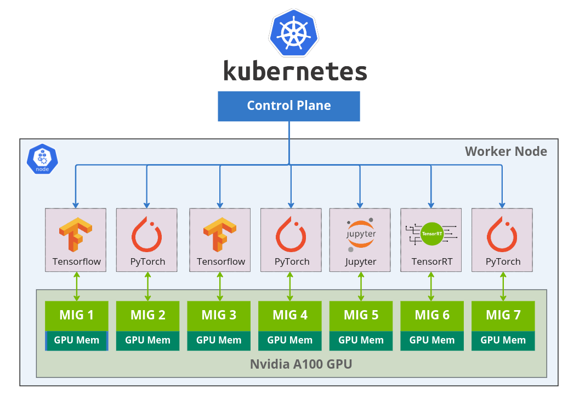
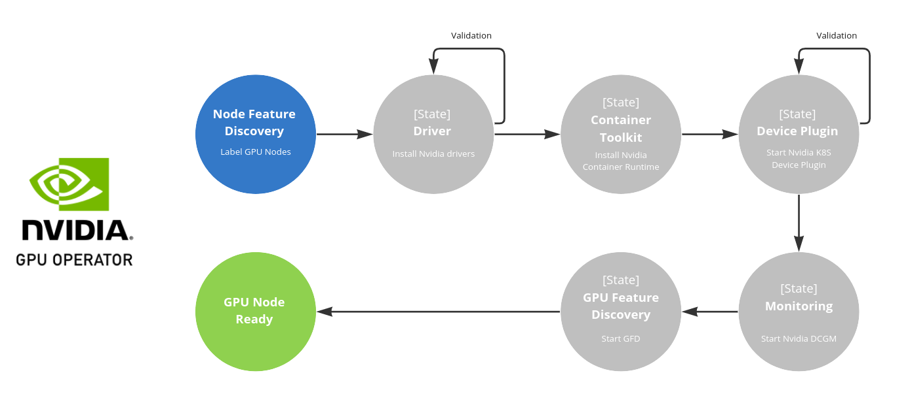
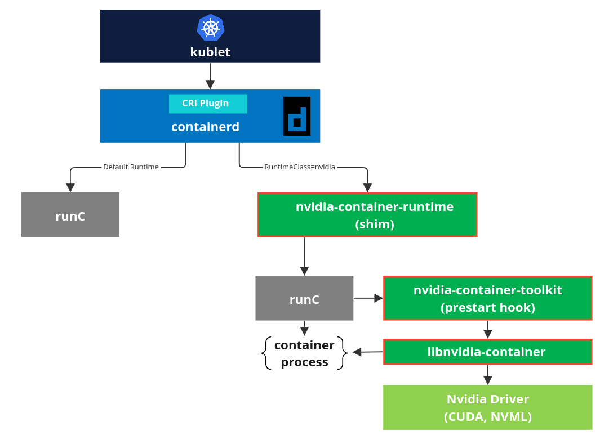

# Kubernetes 對 MIG 支持

原文: [MIG Support in Kubernetes](https://docs.nvidia.com/datacenter/cloud-native/kubernetes/mig-k8s.html)



Nvidia 多實例 GPU (MIG) 的功能允許將 NVIDIA A100 GPU 安全地劃分為最多七個用於 CUDA 應用程序的獨立 GPU 實例，為多個用戶提供獨立的 GPU 資源以實現最佳 GPU 利用率。

這個功能對於無法完全利用 GPU 計算能力的工作負載特別有幫助，因為用戶可能希望併行地運行不同的工作負載以最大限度地提高 GPU 利用率。

本文概述了為 Kubernetes 啟用 MIG 支持所需的軟體。有關技術概念、MIG 設定和 NVIDIA Container Toolkit 來使用 MIG 運行容器的更多詳細信息，請參閱 [MIG 用戶指南](https://docs.nvidia.com/datacenter/tesla/mig-user-guide/index.html)。

## 步驟 01 - 環境安裝

本教程使用了 Azure 上的 VM (O.S: Ubuntu 20.04.05)來作為練習在 Kubernetes 裡應用 MIG 的環境。

|型號	|vCPU	|記憶體：GiB	|暫存儲存體：GiB	|GPU	|GPU 記憶體：GiB	|
|----|-----|------------|---------------|-----|----------------|
|Standard_NC24ads_A100_v4|24|220|1123|1|80|

這個 VM 會搭配一張 **Nvidia A100 (80gb)** 的 GPU 卡。

參考: [NC A100 v4 系列](https://learn.microsoft.com/zh-tw/azure/virtual-machines/nc-a100-v4-series)

以下是安裝 Rancher (RKE2/K3S) 和 Nvidia GPU Operator 的步驟。

**先決條件 (一台配備著 Nvidia GPU 的機器):**

- Operating system: `Ubuntu 20.04.05 LTS`
- GPU: `Nvidia A100 (80gb)` (Nvidia GPU 顯卡)

### Step 1: 安裝 nvidia drivers

!!! tip
    根據 Nvidia GPU Operator 的內容，operator 應該可自動幫每一個 Kubernetes 節點自動設定 GPU 的 Driver。
    
    然而在驗證的過程會發現 Ubuntu 的機器會在安裝完 Nvidia GPU Operator 之後一直重覆 reboot。
    
    排查之後的結果因該是 GPU Operator 在自動安裝 GPU Driver 後所發生的現象，查找相關 Githut 與 Google 之後尚未找出根因，因此在本教程中是先手動安裝 Nvidia GPU Driver 與 Nvidia Container Toolkit 在 Ubuntu 的機器上。


我們可以先使用 `apt` 搜索可用的 Nvidia GPU 卡的驅動程式：

```bash
sudo apt update

sudo apt search nvidia-driver
```

由於許多深度學習開發工具會與 Nvidia CUDA 函式庫有相依性，在安裝 Nvidia Driver 時需要根據實際的情況來決定要安裝的 Driver 版本。

下面列出 CUDA 版本對應到 Driver 版本的兼容性:

|CUDA Toolkit	|Linux x86_64 Minimum Required Driver Version	|Windows Minimum Required Driver Version|
|-------------|---------------------------------------------|---------------------------------------|
|CUDA 12.x	|>=525.60.13	|>=527.41|
|CUDA 11.x	|>= 450.80.02*	|>=452.39*|
|CUDA 10.2	|>= 440.33	|>=441.22|
|CUDA 10.1	|>= 418.39	|>=418.96|
|CUDA 10.0	|>= 410.48	|>=411.31|

根據 Nivida 官網的資訊:

- 從 CUDA 12/R525 驅動程序開始支持 H100 GPU。
- 從 CUDA 11/R450 驅動程序開始支持 A100 和 A30 GPU。

因此在本教程會選擇驅動程式版本 `515`，所以讓我們安裝這個版本：

```bash
sudo apt install nvidia-driver-515 nvidia-dkms-515 -y
```

重新啟動 Ubuntu 的機器:

```bash
sudo shutdown now -r
```

驗證 nvidia driver 的安裝:

```bash
nvidia-smi
```

結果:

```    
+-----------------------------------------------------------------------------+
| NVIDIA-SMI 515.86.01    Driver Version: 515.86.01    CUDA Version: 11.7     |
|-------------------------------+----------------------+----------------------+
| GPU  Name        Persistence-M| Bus-Id        Disp.A | Volatile Uncorr. ECC |
| Fan  Temp  Perf  Pwr:Usage/Cap|         Memory-Usage | GPU-Util  Compute M. |
|                               |                      |               MIG M. |
|===============================+======================+======================|
|   0  NVIDIA GeForce ...  Off  | 00000000:02:00.0 Off |                  N/A |
| N/A   57C    P0    N/A /  N/A |    469MiB /  2048MiB |    100%      Default |
|                               |                      |                  N/A |
+-------------------------------+----------------------+----------------------+
```

### Step 2: 安裝 nvidia container toolkit

首先，設置包存儲庫和 GPG 密鑰：

```bash
distribution=$(. /etc/os-release;echo $ID$VERSION_ID) \
    && curl -s -L https://nvidia.github.io/libnvidia-container/gpgkey | sudo apt-key add - \
    && curl -s -L https://nvidia.github.io/libnvidia-container/$distribution/libnvidia-container.list | sudo tee /etc/apt/sources.list.d/nvidia-container-toolkit.list
```

現在，安裝 NVIDIA Container Toolkit:

```bash
sudo apt-get update \
    && sudo apt-get install -y nvidia-container-toolkit
```

### Step 3: 安裝 kubernetes

修改 Ubuntu 主機的 hostname 便於辨識 (optional):

1. 鍵入以下命令以使用 `nano` 或 `vi` 文本編輯器編輯 `/etc/hostname`:

    ```bash
    sudo nano /etc/hostname
    ```

    刪除舊名稱並設置新名稱(在 lab 中我們使用 `mlops-k8s-master`　作為 hostname)。

2. 接下來編輯 /etc/hosts 文件:

    ```bash
    sudo nano /etc/hosts
    ```

    將任何出現的原有 hostname 替換為新的 hostname。並確保在 `hosts` 中有一筆資料來映射 hostname 到 ip:

    ```
    127.0.0.1 mlops-k8s-master
    ```

3. 重新啟動系統以使更改生效:

    ```bash
    sudo reboot
    ```

創建 RKE2 設定文件 `/etc/rancher/rke2/config.yaml`：

```bash
sudo mkdir /etc/rancher/rke2 -p

cat <<EOF | sudo tee /etc/rancher/rke2/config.yaml
write-kubeconfig-mode: "0644"
write-kubeconfig: "/root/.kube/config"
cni: "calico"
tls-san:
  - mlops-k8s-master
EOF
```

下載並運行 RKE2 的安裝腳本:

```bash
sudo apt install curl -y

curl -sfL https://get.rke2.io --output install.sh

chmod +x install.sh

sudo ./install.sh
```

啟用 `rke2-server` 服務:

```bash
# Enable and activate RKE2 server
sudo systemctl enable rke2-server.service
sudo systemctl start rke2-server.service
```

檢查 `rke2-server` 運行時的狀態。

```bash
sudo systemctl status rke2-server
```

結果:

```
● rke2-server.service - Rancher Kubernetes Engine v2 (server)
     Loaded: loaded (/usr/local/lib/systemd/system/rke2-server.service; enabled; vendor preset: enabled)
     Active: active (running) since Thu 2023-02-02 08:03:53 UTC; 1min 40s ago
       Docs: https://github.com/rancher/rke2#readme
    Process: 1876 ExecStartPre=/bin/sh -xc ! /usr/bin/systemctl is-enabled --quiet nm-cloud-setup.service (code=exited, >
    Process: 1878 ExecStartPre=/sbin/modprobe br_netfilter (code=exited, status=0/SUCCESS)
    Process: 1881 ExecStartPre=/sbin/modprobe overlay (code=exited, status=0/SUCCESS)
   Main PID: 1882 (rke2)
      Tasks: 206
     Memory: 2.6G
    ...
    ...
```

將包含 Kubernetes 二進製文件的目錄添加到路徑中，然後運行 `kubectl` 命令來檢查服務器的狀態。


```bash
# copy RKE2 kubeconfig file to the default location
mkdir ~/.kube
sudo cp /etc/rancher/rke2/rke2.yaml ~/.kube/config
sudo chown $(id -u):$(id -g) $HOME/.kube/config
chmod 600 ~/.kube/config

# add RKE2 binaries to path
export PATH=$PATH:/var/lib/rancher/rke2/bin
echo "export PATH=$PATH:/var/lib/rancher/rke2/bin" >> ~/.bashrc

export KUBECONFIG=$HOME/.kube/config
echo "export KUBECONFIG=$HOME/.kube/config" | tee -a ~/.bashrc
```

請運行以下命令並檢查節點的狀態是否 `Ready`：

```bash
kubectl get nodes
```

結果:

```
NAME               STATUS   ROLES                       AGE     VERSION
mlops-k8s-master   Ready    control-plane,etcd,master   3m23s   v1.24.10+rke2r1
```

檢查 `containerd` 的設定:

```bash
sudo cat /var/lib/rancher/rke2/agent/etc/containerd/config.toml
```

```toml title="/var/lib/rancher/rke2/agent/etc/containerd/config.toml" hl_lines="25-28"
version = 2

[plugins."io.containerd.internal.v1.opt"]
  path = "/var/lib/rancher/rke2/agent/containerd"
[plugins."io.containerd.grpc.v1.cri"]
  stream_server_address = "127.0.0.1"
  stream_server_port = "10010"
  enable_selinux = false
  enable_unprivileged_ports = true
  enable_unprivileged_icmp = true
  sandbox_image = "index.docker.io/rancher/pause:3.6"

[plugins."io.containerd.grpc.v1.cri".containerd]
  snapshotter = "overlayfs"
  disable_snapshot_annotations = true


[plugins."io.containerd.grpc.v1.cri".containerd.runtimes.runc]
  runtime_type = "io.containerd.runc.v2"

[plugins."io.containerd.grpc.v1.cri".containerd.runtimes.runc.options]
  SystemdCgroup = true

[plugins."io.containerd.grpc.v1.cri".containerd.runtimes."nvidia"]
  runtime_type = "io.containerd.runc.v2"
[plugins."io.containerd.grpc.v1.cri".containerd.runtimes."nvidia".options]
  BinaryName = "/usr/bin/nvidia-container-runtime"
```

!!! tip
    在安裝 RKE2 之前若先安裝好 Nvidia Driver 與 Nvidia Container Toolkit 的話, RKE2 會自動將 `nvidia` 的容器 runtime 加入到 `containerd` 的設定檔中。

### Step 4: 安裝 gpu operator

詳細的 Nvidia GPU Operator 說明請見: [Nvidia GPU Operator 官網](https://docs.nvidia.com/datacenter/cloud-native/gpu-operator/overview.html)

首先安裝 Helm3 的二進製文件。

```bash
sudo apt install git -y

curl -fsSL -o get_helm.sh https://raw.githubusercontent.com/helm/helm/master/scripts/get-helm-3

chmod 700 get_helm.sh

sudo ./get_helm.sh
```

添加 Nvidia Helm 存儲庫。

```bash
helm repo add nvidia https://helm.ngc.nvidia.com/nvidia \
   && helm repo update
```

由於我們使用的是 `containerd` 容器 runtime，因此我們將其設置為默認值並且宣告不自動安裝 Nvidia Driver。


```bash hl_lines="4 5 6"
helm upgrade --install gpu-operator \
     -n gpu-operator --create-namespace \
     nvidia/gpu-operator \
     --set operator.defaultRuntime=containerd \
     --set driver.enabled=false \
     --set toolkit.enabled=false
```

幾分鐘後，您應該會看到 `gpu-operator` 命名空間中的 pod 正在運行, 檢查是否有運行錯誤或異常的的 pod。

```bash
kubectl get pods -n gpu-operator
```

結果:

```
NAME                                                              READY   STATUS      RESTARTS       AGE
pod/gpu-feature-discovery-s5nq9                                   1/1     Running     0              3m56s
pod/gpu-operator-5df795584-dsm5h                                  1/1     Running     3 (116s ago)   4m22s
pod/gpu-operator-node-feature-discovery-master-84c7c7c6cf-jjtk5   1/1     Running     0              4m22s
pod/gpu-operator-node-feature-discovery-worker-5vk5q              1/1     Running     0              4m22s
pod/nvidia-cuda-validator-q8xc7                                   0/1     Completed   0              3m30s
pod/nvidia-dcgm-exporter-m5pqv                                    1/1     Running     0              3m57s
pod/nvidia-device-plugin-daemonset-q8x86                          1/1     Running     0              3m57s
pod/nvidia-device-plugin-validator-fl4m4                          0/1     Completed   0              2m58s
pod/nvidia-mig-manager-mtbwd                                      1/1     Running     0              2m57s
pod/nvidia-operator-validator-q7smb                               1/1     Running     0              3m57s
```

使用 Nvidia GPU Operator 運行的 state-machine diagram 可了解它運作的順序。



### Step 5: 驗證環境

運行以下命令來取得 `runtimeclass`:

```bash
kubectl get runtimeclass
```

結果:

```
NAME     HANDLER   AGE
nvidia   nvidia    10m
```



!!! tip
    在 Nividia GPU Operator 完成安裝之後, 它也會通過 [Runtime Class](https://kubernetes.io/docs/concepts/containers/runtime-class/) 來支援一個有多個容器 runtime 的 Kubernetes。

    因為預設的 runtime 是 `runc`, 因此要使用到 Nivida GPU 與相關 GPU 相關的函式庫的應用程式需要顯示的宣告要使用 `runtimeClassName: nvidia` 來切換到 nvidia 的容器 runtime。

運行以下命令以啟動測試 job。

```bash hl_lines="9"
kubectl apply -f -<<EOF
apiVersion: batch/v1
kind: Job
metadata:
  name: gpu-test
spec:
  template:
    spec:
      runtimeClassName: nvidia
      containers:
      - name: gpu-test
        image: nvcr.io/nvidia/cuda:10.1-base-ubuntu18.04
        command: ["nvidia-smi"]
        resources:
          limits:
            nvidia.com/gpu: 1
      restartPolicy: Never
  backoffLimit: 4
EOF
```

檢查 job 的狀態:

```bash
kubectl get all
```

結果:

```
NAME                 READY   STATUS      RESTARTS   AGE
pod/gpu-test-tvl72   0/1     Completed   0          14s

NAME                 COMPLETIONS   DURATION   AGE
job.batch/gpu-test   1/1           5s         14s
```

查看 job 的結果:

```bash
kubectl logs pod/gpu-test-tvl72
```

結果:

```
Thu Feb  2 08:42:52 2023       
+-----------------------------------------------------------------------------+
| NVIDIA-SMI 515.86.01    Driver Version: 515.86.01    CUDA Version: 11.7     |
|-------------------------------+----------------------+----------------------+
| GPU  Name        Persistence-M| Bus-Id        Disp.A | Volatile Uncorr. ECC |
| Fan  Temp  Perf  Pwr:Usage/Cap|         Memory-Usage | GPU-Util  Compute M. |
|                               |                      |               MIG M. |
|===============================+======================+======================|
|   0  NVIDIA A100 80G...  Off  | 00000001:00:00.0 Off |                    0 |
| N/A   33C    P0    41W / 300W |    143MiB / 81920MiB |      0%      Default |
|                               |                      |             Disabled |
+-------------------------------+----------------------+----------------------+
                                                                               
+-----------------------------------------------------------------------------+
| Processes:                                                                  |
|  GPU   GI   CI        PID   Type   Process name                  GPU Memory |
|        ID   ID                                                   Usage      |
|=============================================================================|
+-----------------------------------------------------------------------------+
```

## 步驟 02 - MIG 策略

NVIDIA 提供了兩種在 Kubernetes 節點上公開 MIG 設備的策略。有關策略的更多詳細信息，請參閱[設計文檔](https://docs.google.com/document/d/1mdgMQ8g7WmaI_XVVRrCvHPFPOMCm5LQD5JefgAh6N8g/edit)。

本節將介紹為各種 MIG 策略部署和運行 `k8s-device-plugin` 和 `gpu-feature-discovery` 組件所需的步驟。首選的部署方法是通過 Helm。

Nivia 有三種可設定的　MIG 策略:

1. none
2. single
3. mixed

### `none` 策略

`none` 策略旨在讓 `nvidia-device-plugin` 像往常一樣運行。該插件不會區分啟用或未啟用 MIG 的 GPU，並將枚舉節點上的所有 GPU，使用者可通過宣告 `nvidia.com/gpu` 資源類型來使用 GPU。

#### 測試

為了測試這個策略，我們檢查了啟用和不啟用 MIG 的 GPU 的枚舉，並確保我們在兩種情況下都能看到它。

1. 確認 MIG 在 GPU 上沒有被啟用:

    ```
    nvidia-smi
    ```

    結果:

    ```
    +-----------------------------------------------------------------------------+
    | NVIDIA-SMI 515.86.01    Driver Version: 515.86.01    CUDA Version: 11.7     |
    |-------------------------------+----------------------+----------------------+
    | GPU  Name        Persistence-M| Bus-Id        Disp.A | Volatile Uncorr. ECC |
    | Fan  Temp  Perf  Pwr:Usage/Cap|         Memory-Usage | GPU-Util  Compute M. |
    |                               |                      |               MIG M. |
    |===============================+======================+======================|
    |   0  NVIDIA A100 80G...  Off  | 00000001:00:00.0 Off |                    0 |
    | N/A   33C    P0    41W / 300W |    143MiB / 81920MiB |      0%      Default |
    |                               |                      |             Disabled |
    +-------------------------------+----------------------+----------------------+
    ```

2. 使用 `none` 策略啟動 `gpu-operator`。如果它已經在運行，請重新啟動。

    ```bash hl_lines="7"
    helm upgrade --install gpu-operator \
        -n gpu-operator --create-namespace \
        nvidia/gpu-operator \
        --set operator.defaultRuntime=containerd \
        --set driver.enabled=false \
        --set toolkit.enabled=false \
        --set mig.strategy=none
    ```

3. 觀察資源類型為 `nvidia.com/gpu` 的節點上有 1 個 GPU 可用：

    ```bash
    kubectl describe node
    ```

    結果:

    ```
    ...
    Capacity:
      nvidia.com/gpu:          1
    ...
    Allocatable:
      nvidia.com/gpu:          1
    ...
    ```

4. 觀察是否已為該 MIG 策略應用了正確的標籤集:

    ```bash
    kubectl get node -o json | \
      jq '.items[0].metadata.labels | with_entries(select(.key | startswith("nvidia.com")))'
    ```

    結果:

    ```
    {
      "nvidia.com/cuda.driver.major": "515",
      "nvidia.com/cuda.driver.minor": "86",
      "nvidia.com/cuda.driver.rev": "01",
      "nvidia.com/cuda.runtime.major": "11",
      "nvidia.com/cuda.runtime.minor": "7",
      "nvidia.com/gfd.timestamp": "1675329034",
      "nvidia.com/gpu.compute.major": "8",
      "nvidia.com/gpu.compute.minor": "0",
      "nvidia.com/gpu.count": "1",
      "nvidia.com/gpu.deploy.container-toolkit": "true",
      "nvidia.com/gpu.deploy.dcgm": "true",
      "nvidia.com/gpu.deploy.dcgm-exporter": "true",
      "nvidia.com/gpu.deploy.device-plugin": "true",
      "nvidia.com/gpu.deploy.driver": "true",
      "nvidia.com/gpu.deploy.gpu-feature-discovery": "true",
      "nvidia.com/gpu.deploy.mig-manager": "true",
      "nvidia.com/gpu.deploy.node-status-exporter": "true",
      "nvidia.com/gpu.deploy.operator-validator": "true",
      "nvidia.com/gpu.family": "ampere",
      "nvidia.com/gpu.machine": "Virtual-Machine",
      "nvidia.com/gpu.memory": "81920",
      "nvidia.com/gpu.present": "true",
      "nvidia.com/gpu.product": "NVIDIA-A100-80GB-PCIe",
      "nvidia.com/gpu.replicas": "1",
      "nvidia.com/mig.capable": "true"
    }
    ```

5. 部署一個 job 以使用 GPU 並運行 `nvidia-smi`:

    ```bash hl_lines="9"
    kubectl apply -f -<<EOF
    apiVersion: batch/v1
    kind: Job
    metadata:
      name: mig-none-example
    spec:
      template:
        spec:
          runtimeClassName: nvidia
          containers:
          - name: mig-none-example
            image: nvidia/cuda:11.0.3-runtime-ubuntu20.04
            command: ["nvidia-smi", "-L"]
            resources:
              limits:
                nvidia.com/gpu: 1
          restartPolicy: Never
      backoffLimit: 4
    EOF
    ```

    檢查:

    ```bash
    kubectl get all
    ```

    結果:

    ```
    NAME                         READY   STATUS      RESTARTS   AGE
    pod/mig-none-example-bvqlj   0/1     Completed   0          2m22s

    NAME                         COMPLETIONS   DURATION   AGE
    job.batch/mig-none-example   1/1           106s       2m22s
    ```

    查看日誌:

    ```bash
    kubectl logs pod/mig-none-example-bvqlj
    ```

    結果:

    ```
    GPU 0: NVIDIA A100 80GB PCIe (UUID: GPU-0ac04164-2333-098a-2dc2-40b0ddac18fd)
    ```

6. 在 GPU 上啟用 MIG（需要先停止所有 GPU 客戶端）。

    設定 MIG 啟動 flag:

    ```bash
    sudo nvidia-smi -mig 1
    ```

    重新啟動主機:

    ```bash
    sudo shutdown now -r
    ```

    檢查 MIG 設定:

    ```bash
    nvidia-smi --query-gpu=mig.mode.current --format=csv,noheader
    ```

    結果:

    ```
    Enabled
    ```

7. 觀察資源類型為 `nvidia.com/gpu` 的節點上有 1 個 GPU 可用：

    ```bash
    kubectl describe node
    ```

    結果:

    ```
    ...
    Capacity:
      nvidia.com/gpu:          1
    ...
    Allocatable:
      nvidia.com/gpu:          1
    ...
    ```
  
8. 節點觀察標籤沒有改變


    ```bash
    kubectl get node -o json | \
      jq '.items[0].metadata.labels | with_entries(select(.key | startswith("nvidia.com")))'
    ```

    結果:

    ```
    {
      "nvidia.com/cuda.driver.major": "515",
      "nvidia.com/cuda.driver.minor": "86",
      "nvidia.com/cuda.driver.rev": "01",
      "nvidia.com/cuda.runtime.major": "11",
      "nvidia.com/cuda.runtime.minor": "7",
      "nvidia.com/gfd.timestamp": "1675329034",
      "nvidia.com/gpu.compute.major": "8",
      "nvidia.com/gpu.compute.minor": "0",
      "nvidia.com/gpu.count": "1",
      "nvidia.com/gpu.deploy.container-toolkit": "true",
      "nvidia.com/gpu.deploy.dcgm": "true",
      "nvidia.com/gpu.deploy.dcgm-exporter": "true",
      "nvidia.com/gpu.deploy.device-plugin": "true",
      "nvidia.com/gpu.deploy.driver": "true",
      "nvidia.com/gpu.deploy.gpu-feature-discovery": "true",
      "nvidia.com/gpu.deploy.mig-manager": "true",
      "nvidia.com/gpu.deploy.node-status-exporter": "true",
      "nvidia.com/gpu.deploy.operator-validator": "true",
      "nvidia.com/gpu.family": "ampere",
      "nvidia.com/gpu.machine": "Virtual-Machine",
      "nvidia.com/gpu.memory": "81920",
      "nvidia.com/gpu.present": "true",
      "nvidia.com/gpu.product": "NVIDIA-A100-80GB-PCIe",
      "nvidia.com/gpu.replicas": "1",
      "nvidia.com/mig.capable": "true"
    }
    ```

9. 部署一個 job 以使用 GPU 並運行 `nvidia-smi`:

    ```bash hl_lines="9"
    kubectl apply -f -<<EOF
    apiVersion: batch/v1
    kind: Job
    metadata:
      name: mig-none-example2
    spec:
      template:
        spec:
          runtimeClassName: nvidia
          containers:
          - name: mig-none-example2
            image: nvidia/cuda:11.0.3-runtime-ubuntu20.04
            command: ["nvidia-smi", "-L"]
            resources:
              limits:
                nvidia.com/gpu: 1
          restartPolicy: Never
      backoffLimit: 4
    EOF
    ```

    檢查:

    ```bash
    kubectl get all
    ```

    結果:

    ```
    NAME                          READY   STATUS      RESTARTS   AGE
    pod/mig-none-example2-p8wmr   0/1     Completed   0          9s

    NAME                         COMPLETIONS   DURATION   AGE
    job.batch/mig-none-example2   1/1           106s       2m22s
    ```

    查看日誌:

    ```bash
    kubectl logs pod/mig-none-example2-p8wmr
    ```

    結果:

    ```
    GPU 0: NVIDIA A100 80GB PCIe (UUID: GPU-0ac04164-2333-098a-2dc2-40b0ddac18fd)
    ```

### `single` 策略

`single` 策略旨在保持在 Kubernetes 中使用 GPU 的用戶體驗與以往一樣。 對用戶來說他們也是通過　`nvidia.com/gpu` 資源類型進行對 GPU 資源的請求。在 Kubernetes　中會把 MIG 設備像一張張獨立的 GPU 顯卡一樣使用 `nvidia.com/gpu` 資源類型進行管理。也就是說 `nvidia.com/gpu` 資源類型關聯的屬性是映射到該節點上可用的 MIG 設備，而不是完整的 GPU。

#### 測試

為了測試此策略，我們假定集群中單個節點上的單個 GPU 已啟用 MIG。

1. 驗證 MIG 已在 GPU 上啟用並且不存在 MIG 設備:

    ```bash
    nvidia-smi
    ```

    結果:

    ```
    +-----------------------------------------------------------------------------+
    | NVIDIA-SMI 515.86.01    Driver Version: 515.86.01    CUDA Version: 11.7     |
    |-------------------------------+----------------------+----------------------+
    | GPU  Name        Persistence-M| Bus-Id        Disp.A | Volatile Uncorr. ECC |
    | Fan  Temp  Perf  Pwr:Usage/Cap|         Memory-Usage | GPU-Util  Compute M. |
    |                               |                      |               MIG M. |
    |===============================+======================+======================|
    |   0  NVIDIA A100 80G...  Off  | 00000001:00:00.0 Off |                   On |
    | N/A   39C    P0    75W / 300W |      0MiB / 81920MiB |     N/A      Default |
    |                               |                      |              Enabled |
    +-------------------------------+----------------------+----------------------+

    +-----------------------------------------------------------------------------+
    | MIG devices:                                                                |
    +------------------+----------------------+-----------+-----------------------+
    | GPU  GI  CI  MIG |         Memory-Usage |        Vol|         Shared        |
    |      ID  ID  Dev |           BAR1-Usage | SM     Unc| CE  ENC  DEC  OFA  JPG|
    |                  |                      |        ECC|                       |
    |==================+======================+===========+=======================|
    |  No MIG devices found                                                       |
    +-----------------------------------------------------------------------------+
    ```

2. 在 GPU 上創建 7 個單片 MIG 設備:

    查看 GI 可用組合 profile。

    ```bash
    nvidia-smi mig -i 0 -lgip
    ```

    結果:

    ```
    +-----------------------------------------------------------------------------+
    | GPU instance profiles:                                                      |
    | GPU   Name             ID    Instances   Memory     P2P    SM    DEC   ENC  |
    |                              Free/Total   GiB              CE    JPEG  OFA  |
    |=============================================================================|
    |   0  MIG 1g.10gb       19     7/7        9.50       No     14     0     0   |
    |                                                             1     0     0   |
    +-----------------------------------------------------------------------------+
    |   0  MIG 1g.10gb+me    20     1/1        9.50       No     14     1     0   |
    |                                                             1     1     1   |
    +-----------------------------------------------------------------------------+
    |   0  MIG 2g.20gb       14     3/3        19.50      No     28     1     0   |
    |                                                             2     0     0   |
    +-----------------------------------------------------------------------------+
    |   0  MIG 3g.40gb        9     2/2        39.25      No     42     2     0   |
    |                                                             3     0     0   |
    +-----------------------------------------------------------------------------+
    |   0  MIG 4g.40gb        5     1/1        39.25      No     56     2     0   |
    |                                                             4     0     0   |
    +-----------------------------------------------------------------------------+
    |   0  MIG 7g.80gb        0     1/1        79.00      No     98     5     0   |
    |                                                             7     1     1   |
    +-----------------------------------------------------------------------------+
    ```

    創建 7 個單片 MIG 設備:

    ```
    sudo nvidia-smi mig -cgi 19,19,19,19,19,19,19 -C
    ```

    結果:

    ```
    Successfully created GPU instance ID  9 on GPU  0 using profile MIG 1g.10gb (ID 19)
    Successfully created compute instance ID  0 on GPU  0 GPU instance ID  9 using profile MIG 1g.10gb (ID  0)
    Successfully created GPU instance ID  7 on GPU  0 using profile MIG 1g.10gb (ID 19)
    Successfully created compute instance ID  0 on GPU  0 GPU instance ID  7 using profile MIG 1g.10gb (ID  0)
    Successfully created GPU instance ID  8 on GPU  0 using profile MIG 1g.10gb (ID 19)
    Successfully created compute instance ID  0 on GPU  0 GPU instance ID  8 using profile MIG 1g.10gb (ID  0)
    Successfully created GPU instance ID 11 on GPU  0 using profile MIG 1g.10gb (ID 19)
    Successfully created compute instance ID  0 on GPU  0 GPU instance ID 11 using profile MIG 1g.10gb (ID  0)
    Successfully created GPU instance ID 12 on GPU  0 using profile MIG 1g.10gb (ID 19)
    Successfully created compute instance ID  0 on GPU  0 GPU instance ID 12 using profile MIG 1g.10gb (ID  0)
    Successfully created GPU instance ID 13 on GPU  0 using profile MIG 1g.10gb (ID 19)
    Successfully created compute instance ID  0 on GPU  0 GPU instance ID 13 using profile MIG 1g.10gb (ID  0)
    Successfully created GPU instance ID 14 on GPU  0 using profile MIG 1g.10gb (ID 19)
    Successfully created compute instance ID  0 on GPU  0 GPU instance ID 14 using profile MIG 1g.10gb (ID  0)
    ```

    !!! info
        詳細的 MIG 切割概念與手法請參閱[MIG 切割入門](./mig-setup.md)。

    檢查 MIG 切割:

    ```bash
    nvidia-smi -L
    ```

    結果:

    ```
    GPU 0: NVIDIA A100 80GB PCIe (UUID: GPU-9f0cc172-1db7-8b47-7302-fa9b2ade0c7b)
      MIG 1g.10gb     Device  0: (UUID: MIG-5a6ef5fb-e69b-5021-a35e-ad1781308f59)
      MIG 1g.10gb     Device  1: (UUID: MIG-3ba76b8d-4677-5637-bb32-ce72da625fa2)
      MIG 1g.10gb     Device  2: (UUID: MIG-47bb5436-f317-556f-af01-ff693d020c79)
      MIG 1g.10gb     Device  3: (UUID: MIG-9b10f6c1-af1d-535f-a8ac-791cc77b8486)
      MIG 1g.10gb     Device  4: (UUID: MIG-188aade2-5922-58a0-8552-7f8e0be49350)
      MIG 1g.10gb     Device  5: (UUID: MIG-ab3c9061-ac9b-5f7c-801a-8d35188a6422)
      MIG 1g.10gb     Device  6: (UUID: MIG-8f8f1f5c-99e3-5c11-8431-492634283a5a)
    ```
  
3. 使用 `single` 策略啟動 `gpu-operator`。如果它已經在運行，請重新啟動。

    ```bash hl_lines="7"
    helm upgrade --install gpu-operator \
        -n gpu-operator --create-namespace \
        nvidia/gpu-operator \
        --set operator.defaultRuntime=containerd \
        --set driver.enabled=false \
        --set toolkit.enabled=false \
        --set mig.strategy=single
    ```

4. 觀察資源類型為 `nvidia.com/gpu` 的節點上有 7 個 MIG 設備可用:

    ```bash
    kubectl describe node
    ```

    結果:

    ```
    ...
    Capacity:
      nvidia.com/gpu:          7
    ...
    Allocatable:
      nvidia.com/gpu:          7
    ...
    ```

5. 觀察節點是否已為該 MIG 策略應用了正確的標籤集:

    ```bash
    kubectl get node -o json | \
      jq '.items[0].metadata.labels | with_entries(select(.key | startswith("nvidia.com")))'
    ```

    ```json hl_lines="10 34 35"
    {
      "nvidia.com/cuda.driver.major": "515",
      "nvidia.com/cuda.driver.minor": "86",
      "nvidia.com/cuda.driver.rev": "01",
      "nvidia.com/cuda.runtime.major": "11",
      "nvidia.com/cuda.runtime.minor": "7",
      "nvidia.com/gfd.timestamp": "1675398272",
      "nvidia.com/gpu.compute.major": "8",
      "nvidia.com/gpu.compute.minor": "0",
      "nvidia.com/gpu.count": "7",
      "nvidia.com/gpu.deploy.container-toolkit": "true",
      "nvidia.com/gpu.deploy.dcgm": "true",
      "nvidia.com/gpu.deploy.dcgm-exporter": "true",
      "nvidia.com/gpu.deploy.device-plugin": "true",
      "nvidia.com/gpu.deploy.driver": "true",
      "nvidia.com/gpu.deploy.gpu-feature-discovery": "true",
      "nvidia.com/gpu.deploy.mig-manager": "true",
      "nvidia.com/gpu.deploy.node-status-exporter": "true",
      "nvidia.com/gpu.deploy.operator-validator": "true",
      "nvidia.com/gpu.engines.copy": "1",
      "nvidia.com/gpu.engines.decoder": "0",
      "nvidia.com/gpu.engines.encoder": "0",
      "nvidia.com/gpu.engines.jpeg": "0",
      "nvidia.com/gpu.engines.ofa": "0",
      "nvidia.com/gpu.family": "ampere",
      "nvidia.com/gpu.machine": "Virtual-Machine",
      "nvidia.com/gpu.memory": "9728",
      "nvidia.com/gpu.multiprocessors": "14",
      "nvidia.com/gpu.present": "true",
      "nvidia.com/gpu.product": "NVIDIA-A100-80GB-PCIe-MIG-1g.10gb",
      "nvidia.com/gpu.replicas": "1",
      "nvidia.com/gpu.slices.ci": "1",
      "nvidia.com/gpu.slices.gi": "1",
      "nvidia.com/mig.capable": "true",
      "nvidia.com/mig.strategy": "single"
    }
    ```

6. 部署 7 個 pod，每個 pod 使用一個 MIG 設備（然後讀取它們的日誌並刪除它們）

    ```bash
    for i in $(seq 7); do

    kubectl apply -f -<<EOF
    apiVersion: v1
    kind: Pod
    metadata:
      name: mig-single-example-${i}
    spec:
      runtimeClassName: nvidia
      containers:
      - name: mig-single-example-${i}
        image: nvidia/cuda:11.0.3-runtime-ubuntu20.04
        command: ["bash"]
        args: ["-c", "nvidia-smi -L; sleep infinity"]
        resources:
          limits:
            nvidia.com/gpu: 1
    EOF

    done
    ```

    結果:

    ```
    pod/mig-single-example-1 created
    pod/mig-single-example-2 created
    pod/mig-single-example-3 created
    pod/mig-single-example-4 created
    pod/mig-single-example-5 created
    pod/mig-single-example-6 created
    pod/mig-single-example-7 created
    ```

    讀取它們的日誌:

    ```bash
    for i in $(seq 7); do

    echo "mig-single-example-${i}";
    kubectl logs mig-single-example-${i}
    echo "";

    done
    ```

    結果:

    ```
    mig-single-example-1
    GPU 0: NVIDIA A100 80GB PCIe (UUID: GPU-9f0cc172-1db7-8b47-7302-fa9b2ade0c7b)
      MIG 1g.10gb     Device  0: (UUID: MIG-3ba76b8d-4677-5637-bb32-ce72da625fa2)

    mig-single-example-2
    GPU 0: NVIDIA A100 80GB PCIe (UUID: GPU-9f0cc172-1db7-8b47-7302-fa9b2ade0c7b)
      MIG 1g.10gb     Device  0: (UUID: MIG-47bb5436-f317-556f-af01-ff693d020c79)

    mig-single-example-3
    GPU 0: NVIDIA A100 80GB PCIe (UUID: GPU-9f0cc172-1db7-8b47-7302-fa9b2ade0c7b)
      MIG 1g.10gb     Device  0: (UUID: MIG-5a6ef5fb-e69b-5021-a35e-ad1781308f59)

    mig-single-example-4
    GPU 0: NVIDIA A100 80GB PCIe (UUID: GPU-9f0cc172-1db7-8b47-7302-fa9b2ade0c7b)
      MIG 1g.10gb     Device  0: (UUID: MIG-188aade2-5922-58a0-8552-7f8e0be49350)

    mig-single-example-5
    GPU 0: NVIDIA A100 80GB PCIe (UUID: GPU-9f0cc172-1db7-8b47-7302-fa9b2ade0c7b)
      MIG 1g.10gb     Device  0: (UUID: MIG-9b10f6c1-af1d-535f-a8ac-791cc77b8486)

    mig-single-example-6
    GPU 0: NVIDIA A100 80GB PCIe (UUID: GPU-9f0cc172-1db7-8b47-7302-fa9b2ade0c7b)
      MIG 1g.10gb     Device  0: (UUID: MIG-ab3c9061-ac9b-5f7c-801a-8d35188a6422)

    mig-single-example-7
    GPU 0: NVIDIA A100 80GB PCIe (UUID: GPU-9f0cc172-1db7-8b47-7302-fa9b2ade0c7b)
      MIG 1g.10gb     Device  0: (UUID: MIG-8f8f1f5c-99e3-5c11-8431-492634283a5a)
    ```

    刪除這些 Pods:

    ```bash
    for i in $(seq 7); do
    kubectl delete pod mig-single-example-${i};
    done
    ```

    結果:

    ```
    pod "mig-single-example-1" deleted
    pod "mig-single-example-2" deleted
    pod "mig-single-example-3" deleted
    pod "mig-single-example-4" deleted
    pod "mig-single-example-5" deleted
    pod "mig-single-example-6" deleted
    pod "mig-single-example-7" deleted
    ```

### `mixed` 策略

`mixed` 策略旨在為集群中可用的每個 MIG 設備配置枚舉不同的資源類型與名稱。

#### 測試

1. 驗證 MIG 已在 GPU 上啟用並且不存在 MIG 設備:

    ```bash
    nvidia-smi
    ```

    結果:

    ```
    +-----------------------------------------------------------------------------+
    | NVIDIA-SMI 515.86.01    Driver Version: 515.86.01    CUDA Version: 11.7     |
    |-------------------------------+----------------------+----------------------+
    | GPU  Name        Persistence-M| Bus-Id        Disp.A | Volatile Uncorr. ECC |
    | Fan  Temp  Perf  Pwr:Usage/Cap|         Memory-Usage | GPU-Util  Compute M. |
    |                               |                      |               MIG M. |
    |===============================+======================+======================|
    |   0  NVIDIA A100 80G...  Off  | 00000001:00:00.0 Off |                   On |
    | N/A   39C    P0    75W / 300W |      0MiB / 81920MiB |     N/A      Default |
    |                               |                      |              Enabled |
    +-------------------------------+----------------------+----------------------+

    +-----------------------------------------------------------------------------+
    | MIG devices:                                                                |
    +------------------+----------------------+-----------+-----------------------+
    | GPU  GI  CI  MIG |         Memory-Usage |        Vol|         Shared        |
    |      ID  ID  Dev |           BAR1-Usage | SM     Unc| CE  ENC  DEC  OFA  JPG|
    |                  |                      |        ECC|                       |
    |==================+======================+===========+=======================|
    |  No MIG devices found                                                       |
    +-----------------------------------------------------------------------------+
    ```

2. 在 GPU 上創建 3 個不同大小的 MIG 設備:

    ```bash
    sudo nvidia-smi mig -cgi 9,14,19 -C
    ```

    結果:

    ```
    Successfully created GPU instance ID  1 on GPU  0 using profile MIG 3g.40gb (ID  9)
    Successfully created compute instance ID  0 on GPU  0 GPU instance ID  1 using profile MIG 3g.40gb (ID  2)
    Successfully created GPU instance ID  5 on GPU  0 using profile MIG 2g.20gb (ID 14)
    Successfully created compute instance ID  0 on GPU  0 GPU instance ID  5 using profile MIG 2g.20gb (ID  1)
    Successfully created GPU instance ID 13 on GPU  0 using profile MIG 1g.10gb (ID 19)
    Successfully created compute instance ID  0 on GPU  0 GPU instance ID 13 using profile MIG 1g.10gb (ID  0)
    ```

    檢查 MIG 切割:

    ```bash
    nvidia-smi -L
    ```

    結果:

    ```
    GPU 0: NVIDIA A100 80GB PCIe (UUID: GPU-9f0cc172-1db7-8b47-7302-fa9b2ade0c7b)
      MIG 3g.40gb     Device  0: (UUID: MIG-40ed9496-24f9-5b8b-95ca-648bfea46a9c)
      MIG 2g.20gb     Device  1: (UUID: MIG-46602d72-bafb-513e-a79c-03cd078519b4)
      MIG 1g.10gb     Device  2: (UUID: MIG-ab3c9061-ac9b-5f7c-801a-8d35188a6422)
    ```

3. 使用 `mixed` 策略啟動 `gpu-operator`。如果它已經在運行，請重新啟動。

    ```bash hl_lines="7"
    helm upgrade --install gpu-operator \
        -n gpu-operator --create-namespace \
        nvidia/gpu-operator \
        --set operator.defaultRuntime=containerd \
        --set driver.enabled=false \
        --set toolkit.enabled=false \
        --set mig.strategy=mixed
    ```

4. 觀察資源類型為 `nvidia.com/gpu` 的節點上有 3 個 MIG 設備可用:

    ```bash
    kubectl describe node
    ```

    結果:

    ```
    ...
    Capacity:
      nvidia.com/mig-1g.10gb:  1
      nvidia.com/mig-2g.20gb:  1
      nvidia.com/mig-3g.40gb:  1
    ...
    Allocatable:
      nvidia.com/mig-1g.10gb:  1
      nvidia.com/mig-2g.20gb:  1
      nvidia.com/mig-3g.40gb:  1
    ...
    ```

5. 觀察節點是否已為該 MIG 策略應用了正確的標籤集:

    ```bash
    kubectl get node -o json | \
      jq '.items[0].metadata.labels | with_entries(select(.key | startswith("nvidia.com")))'
    ```

    ```json hl_lines="26 38 50"
    {
      "nvidia.com/cuda.driver.major": "515",
      "nvidia.com/cuda.driver.minor": "86",
      "nvidia.com/cuda.driver.rev": "01",
      "nvidia.com/cuda.runtime.major": "11",
      "nvidia.com/cuda.runtime.minor": "7",
      "nvidia.com/gfd.timestamp": "1675403098",
      "nvidia.com/gpu.compute.major": "8",
      "nvidia.com/gpu.compute.minor": "0",
      "nvidia.com/gpu.count": "1",
      "nvidia.com/gpu.deploy.container-toolkit": "true",
      "nvidia.com/gpu.deploy.dcgm": "true",
      "nvidia.com/gpu.deploy.dcgm-exporter": "true",
      "nvidia.com/gpu.deploy.device-plugin": "true",
      "nvidia.com/gpu.deploy.driver": "true",
      "nvidia.com/gpu.deploy.gpu-feature-discovery": "true",
      "nvidia.com/gpu.deploy.mig-manager": "true",
      "nvidia.com/gpu.deploy.node-status-exporter": "true",
      "nvidia.com/gpu.deploy.operator-validator": "true",
      "nvidia.com/gpu.family": "ampere",
      "nvidia.com/gpu.machine": "Virtual-Machine",
      "nvidia.com/gpu.memory": "81920",
      "nvidia.com/gpu.present": "true",
      "nvidia.com/gpu.product": "NVIDIA-A100-80GB-PCIe",
      "nvidia.com/gpu.replicas": "0",
      "nvidia.com/mig-1g.10gb.count": "1",
      "nvidia.com/mig-1g.10gb.engines.copy": "1",
      "nvidia.com/mig-1g.10gb.engines.decoder": "0",
      "nvidia.com/mig-1g.10gb.engines.encoder": "0",
      "nvidia.com/mig-1g.10gb.engines.jpeg": "0",
      "nvidia.com/mig-1g.10gb.engines.ofa": "0",
      "nvidia.com/mig-1g.10gb.memory": "9728",
      "nvidia.com/mig-1g.10gb.multiprocessors": "14",
      "nvidia.com/mig-1g.10gb.product": "NVIDIA-A100-80GB-PCIe-MIG-1g.10gb",
      "nvidia.com/mig-1g.10gb.replicas": "1",
      "nvidia.com/mig-1g.10gb.slices.ci": "1",
      "nvidia.com/mig-1g.10gb.slices.gi": "1",
      "nvidia.com/mig-2g.20gb.count": "1",
      "nvidia.com/mig-2g.20gb.engines.copy": "2",
      "nvidia.com/mig-2g.20gb.engines.decoder": "1",
      "nvidia.com/mig-2g.20gb.engines.encoder": "0",
      "nvidia.com/mig-2g.20gb.engines.jpeg": "0",
      "nvidia.com/mig-2g.20gb.engines.ofa": "0",
      "nvidia.com/mig-2g.20gb.memory": "19968",
      "nvidia.com/mig-2g.20gb.multiprocessors": "28",
      "nvidia.com/mig-2g.20gb.product": "NVIDIA-A100-80GB-PCIe-MIG-2g.20gb",
      "nvidia.com/mig-2g.20gb.replicas": "1",
      "nvidia.com/mig-2g.20gb.slices.ci": "2",
      "nvidia.com/mig-2g.20gb.slices.gi": "2",
      "nvidia.com/mig-3g.40gb.count": "1",
      "nvidia.com/mig-3g.40gb.engines.copy": "3",
      "nvidia.com/mig-3g.40gb.engines.decoder": "2",
      "nvidia.com/mig-3g.40gb.engines.encoder": "0",
      "nvidia.com/mig-3g.40gb.engines.jpeg": "0",
      "nvidia.com/mig-3g.40gb.engines.ofa": "0",
      "nvidia.com/mig-3g.40gb.memory": "40192",
      "nvidia.com/mig-3g.40gb.multiprocessors": "42",
      "nvidia.com/mig-3g.40gb.product": "NVIDIA-A100-80GB-PCIe-MIG-3g.40gb",
      "nvidia.com/mig-3g.40gb.replicas": "1",
      "nvidia.com/mig-3g.40gb.slices.ci": "3",
      "nvidia.com/mig-3g.40gb.slices.gi": "3",
      "nvidia.com/mig.capable": "true",
      "nvidia.com/mig.strategy": "mixed"
    }
    ```

6. 部署 3 個 pod，每個 pod 使用一個 MIG 設備（然後讀取它們的日誌並刪除它們）

    使用 `nvidia.com/mig-1g.10gb`:

    ```bash
    kubectl apply -f -<<EOF
    apiVersion: v1
    kind: Pod
    metadata:
      name: mig-mixed-example-1g.10gb
    spec:
      runtimeClassName: nvidia
      containers:
      - name: mig-mixed-example-1g.10gb
        image: nvidia/cuda:11.0.3-runtime-ubuntu20.04
        command: ["bash"]
        args: ["-c", "nvidia-smi -L; sleep infinity"]
        resources:
          limits:
            nvidia.com/mig-1g.10gb: 1
    EOF
    ```

    使用 `nvidia.com/mig-2g.20gb`:

    ```bash
    kubectl apply -f -<<EOF
    apiVersion: v1
    kind: Pod
    metadata:
      name: mig-mixed-example-2g.20gb
    spec:
      runtimeClassName: nvidia
      containers:
      - name: mig-mixed-example-2g.20gb
        image: nvidia/cuda:11.0.3-runtime-ubuntu20.04
        command: ["bash"]
        args: ["-c", "nvidia-smi -L; sleep infinity"]
        resources:
          limits:
            nvidia.com/mig-2g.20gb: 1
    EOF
    ```

    使用 `nvidia.com/mig-3g.40gb`:

    ```bash
    kubectl apply -f -<<EOF
    apiVersion: v1
    kind: Pod
    metadata:
      name: mig-mixed-example-3g.40gb
    spec:
      runtimeClassName: nvidia
      containers:
      - name: mig-mixed-example-3g.40gb
        image: nvidia/cuda:11.0.3-runtime-ubuntu20.04
        command: ["bash"]
        args: ["-c", "nvidia-smi -L; sleep infinity"]
        resources:
          limits:
            nvidia.com/mig-3g.40gb: 1
    EOF
    ```

    結果:

    ```
    pod/mig-single-example-1 created
    pod/mig-single-example-2 created
    pod/mig-single-example-3 created
    pod/mig-single-example-4 created
    pod/mig-single-example-5 created
    pod/mig-single-example-6 created
    pod/mig-single-example-7 created
    ```

    讀取它們的日誌:

    ```bash
    for i in $(seq 7); do

    echo "mig-single-example-${i}";
    kubectl logs mig-single-example-${i}
    echo "";

    done
    ```

    結果:

    ```
    mig-single-example-1
    GPU 0: NVIDIA A100 80GB PCIe (UUID: GPU-9f0cc172-1db7-8b47-7302-fa9b2ade0c7b)
      MIG 1g.10gb     Device  0: (UUID: MIG-3ba76b8d-4677-5637-bb32-ce72da625fa2)

    mig-single-example-2
    GPU 0: NVIDIA A100 80GB PCIe (UUID: GPU-9f0cc172-1db7-8b47-7302-fa9b2ade0c7b)
      MIG 1g.10gb     Device  0: (UUID: MIG-47bb5436-f317-556f-af01-ff693d020c79)

    mig-single-example-3
    GPU 0: NVIDIA A100 80GB PCIe (UUID: GPU-9f0cc172-1db7-8b47-7302-fa9b2ade0c7b)
      MIG 1g.10gb     Device  0: (UUID: MIG-5a6ef5fb-e69b-5021-a35e-ad1781308f59)

    mig-single-example-4
    GPU 0: NVIDIA A100 80GB PCIe (UUID: GPU-9f0cc172-1db7-8b47-7302-fa9b2ade0c7b)
      MIG 1g.10gb     Device  0: (UUID: MIG-188aade2-5922-58a0-8552-7f8e0be49350)

    mig-single-example-5
    GPU 0: NVIDIA A100 80GB PCIe (UUID: GPU-9f0cc172-1db7-8b47-7302-fa9b2ade0c7b)
      MIG 1g.10gb     Device  0: (UUID: MIG-9b10f6c1-af1d-535f-a8ac-791cc77b8486)

    mig-single-example-6
    GPU 0: NVIDIA A100 80GB PCIe (UUID: GPU-9f0cc172-1db7-8b47-7302-fa9b2ade0c7b)
      MIG 1g.10gb     Device  0: (UUID: MIG-ab3c9061-ac9b-5f7c-801a-8d35188a6422)

    mig-single-example-7
    GPU 0: NVIDIA A100 80GB PCIe (UUID: GPU-9f0cc172-1db7-8b47-7302-fa9b2ade0c7b)
      MIG 1g.10gb     Device  0: (UUID: MIG-8f8f1f5c-99e3-5c11-8431-492634283a5a)
    ```

    刪除這些 Pods:

    ```bash
    for i in $(seq 7); do
    kubectl delete pod mig-single-example-${i};
    done
    ```

    結果:

    ```
    pod "mig-single-example-1" deleted
    pod "mig-single-example-2" deleted
    pod "mig-single-example-3" deleted
    pod "mig-single-example-4" deleted
    pod "mig-single-example-5" deleted
    pod "mig-single-example-6" deleted
    pod "mig-single-example-7" deleted
    ```

## 結論

MIG 的概念對大多數要支援 MLOps 平台構建的 Platform Engineer 來說並不是一件容易馬上就能夠理解並融容進現有的平台結構中。

主要的挑戰在於:

- 對 GPU 裝置的特性不熟悉 (相對於傳統的 CPU/Memory/Storage/Network)
- 對 plus AI/ML 的應用程式結構不熟悉
- 對 AI/ML 的框架與函式庫的特性不熟悉

因此在自製/自建的技術平台上要支援 MLOps 的生命週期就容易破碎，尤其是在佈署、監控、報警、除錯、優化迭代等等在 **Operation** 階段的整合。

當 Platform Engineer 能夠對底層的 GPU 的切割與 Kubernetes 平台資源管理的機制整合，對於 AI/ML 的應用程式的落地與維運就能夠有更好協作。

