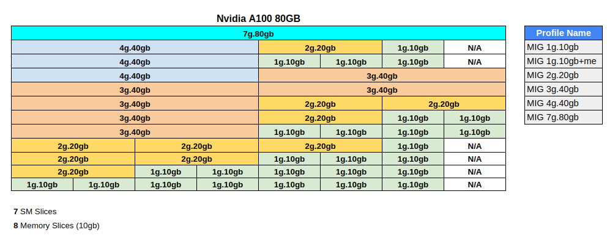

# NVIDIA GPU 的 MIG 切割編輯器

原文: [MIG Partiton Editor for NVIDIA GPUs](https://github.com/NVIDIA/mig-parted)

MIG（Multi-Instance GPU 的縮寫）是最新一代 NVIDIA Ampere GPU 中的一種操作模式。它允許將一個 GPU 劃分為一組“MIG 設備”，在使用它們的軟件看來，每個設備都像一個迷你 GPU，具有固定的內存分區和固定的計算資源分區。有關 MIG 及其提供的功能的詳細說明，請參閱 [MIG 用戶指南](https://docs.nvidia.com/datacenter/tesla/mig-user-guide/index.html)。


## 安裝 `nvidia-mig-parted`

MIG Partiton Editor (`nvidia-mig-parted`) 是一款專為系統管理員設計的工具，可讓他們更輕鬆地處理 MIG 分割。

它允許管理員以聲明方式定義一組他們希望應用於節點上所有 GPU 的可能的 MIG 配置。在運行時，將 `nvidia-mig-parted` 指向這些預先準備好的 MIG 配置，`nvidia-mig-parted` 負責應用這些配置聲明來切割 Nvidia GPU。

通過這種方式，相同的配置文件可以分佈在集群中的所有節點上，並且可以使用運行時標誌（或環境變量）來決定在任何給定時間將這些配置中的哪些實際應用於節點。

請在[此處](https://github.com/NVIDIA/mig-parted/releases)的發布頁面下載 `nvidia-mig-parted` 並安裝它們。


根據下列命令來下載 `nvidia-mig-parted`(v0.5.0):

```bash title="執行下列命令  >_"
wget https://github.com/NVIDIA/mig-parted/releases/download/v0.5.0/nvidia-mig-manager-0.5.0-1.x86_64.tar.gz

tar -xzvf nvidia-mig-manager-0.5.0-1.x86_64.tar.gz

sudo cp nvidia-mig-manager-0.5.0-1/nvidia-mig-parted /usr/local/bin
```

解壓縮的目錄裡有相關的設定範例:

``` hl_lines="9"
.
├── LICENSE
├── config-default.yaml
├── hooks-default.yaml
├── hooks-minimal.yaml
├── hooks.sh
├── install.sh
├── nvidia-mig-manager.service
├── nvidia-mig-parted
├── nvidia-mig-parted.sh
├── override.conf
├── service.sh
├── uninstall.sh
└── utils.sh
```

## 快速上手


### 環境安裝

本教程使用了 Azure 上的 VM (O.S: Ubuntu 20.04.05)來作為練習在 Kubernetes 裡應用 MIG 的環境。

|型號	|vCPU	|記憶體：GiB	|暫存儲存體：GiB	|GPU	|GPU 記憶體：GiB	|
|----|-----|------------|---------------|-----|----------------|
|Standard_NC24ads_A100_v4|24|220|1123|1|80|

這個 VM 會搭配一張 **Nvidia A100 (80gb)** 的 GPU 卡。

參考: [NC A100 v4 系列](https://learn.microsoft.com/zh-tw/azure/virtual-machines/nc-a100-v4-series)

以下是安裝 Rancher (RKE2/K3S) 和 Nvidia GPU Operator 的步驟。

**先決條件 (一台配備著 Nvidia GPU 的機器):**

- Operating system: `Ubuntu 20.04.05 LTS`
- GPU: `Nvidia A100 (80gb)` (Nvidia GPU 顯卡)

**安裝 nvidia drivers:**

!!! tip
    根據 Nvidia GPU Operator 的內容，operator 應該可自動幫每一個 Kubernetes 節點自動設定 GPU 的 Driver。
    
    然而在驗證的過程會發現 Ubuntu 的機器會在安裝完 Nvidia GPU Operator 之後一直重覆 reboot。
    
    排查之後的結果因該是 GPU Operator 在自動安裝 GPU Driver 後所發生的現象，查找相關 Githut 與 Google 之後尚未找出根因，因此在本教程中是先手動安裝 Nvidia GPU Driver 與 Nvidia Container Toolkit 在 Ubuntu 的機器上。


我們可以先使用 `apt` 搜索可用的 Nvidia GPU 卡的驅動程式：

```bash
sudo apt update

sudo apt search nvidia-driver
```

由於許多深度學習開發工具會與 Nvidia CUDA 函式庫有相依性，在安裝 Nvidia Driver 時需要根據實際的情況來決定要安裝的 Driver 版本。

下面列出 CUDA 版本對應到 Driver 版本的兼容性:

|CUDA Toolkit	|Linux x86_64 Minimum Required Driver Version	|Windows Minimum Required Driver Version|
|-------------|---------------------------------------------|---------------------------------------|
|CUDA 12.x	|>=525.60.13	|>=527.41|
|CUDA 11.x	|>= 450.80.02*	|>=452.39*|
|CUDA 10.2	|>= 440.33	|>=441.22|
|CUDA 10.1	|>= 418.39	|>=418.96|
|CUDA 10.0	|>= 410.48	|>=411.31|

根據 Nivida 官網的資訊:

- 從 CUDA 12/R525 驅動程序開始支持 H100 GPU。
- 從 CUDA 11/R450 驅動程序開始支持 A100 和 A30 GPU。

因此在本教程會選擇驅動程式版本 `515`，所以讓我們安裝這個版本：

```bash
sudo apt install nvidia-driver-515 nvidia-dkms-515 -y
```

重新啟動 Ubuntu 的機器:

```bash
sudo shutdown now -r
```

驗證 nvidia driver 的安裝:

```bash
nvidia-smi
```

結果:

```    
+-----------------------------------------------------------------------------+
| NVIDIA-SMI 515.86.01    Driver Version: 515.86.01    CUDA Version: 11.7     |
|-------------------------------+----------------------+----------------------+
| GPU  Name        Persistence-M| Bus-Id        Disp.A | Volatile Uncorr. ECC |
| Fan  Temp  Perf  Pwr:Usage/Cap|         Memory-Usage | GPU-Util  Compute M. |
|                               |                      |               MIG M. |
|===============================+======================+======================|
|   0  NVIDIA A100 80G...  Off  | 00000001:00:00.0 Off |                    0 |
| N/A   38C    P0    45W / 300W |     99MiB / 81920MiB |      0%      Default |
|                               |                      |             Disabled |
+-------------------------------+----------------------+----------------------+
```

### MIG 切割規劃

下列的練習主要以 **Nvidia A100 (80gb)** 的 GPU 卡的切割組合來思考。詳細的 MIG 切割基本概念請參考:[MIG 切割入門](./mig-setup.md)。

**檢查 MIG Mode:**

要使用 `nvidia-mig-parted` 來切割 GPU，要確認 MIG mode 是否被啟動了:

```bash
sudo nvidia-smi
```

結果:

```
+-----------------------------------------------------------------------------+
| NVIDIA-SMI 515.86.01    Driver Version: 515.86.01    CUDA Version: 11.7     |
|-------------------------------+----------------------+----------------------+
| GPU  Name        Persistence-M| Bus-Id        Disp.A | Volatile Uncorr. ECC |
| Fan  Temp  Perf  Pwr:Usage/Cap|         Memory-Usage | GPU-Util  Compute M. |
|                               |                      |               MIG M. |
|===============================+======================+======================|
|   0  NVIDIA A100 80G...  On   | 00000001:00:00.0 Off |                    0 |
| N/A   34C    P0    44W / 300W |    144MiB / 81920MiB |      0%      Default |
|                               |                      |             Disabled |
+-------------------------------+----------------------+----------------------+
```

!!! info
    注意 `MIG M.` 的設定是否是 `Enabled`!!

如果 MIG mode 尚未啟動則使用下列命令來啟動:

```bash
sudo nvidia-smi -i 0 -mig 1
```

參數說明:

- `-i`: 針對特定的 GPU, 後面接著的 GPU 的 ID
- `-mig 1`: 啟動 MIG

然後重新 reboot:

```bash
sudo shutdown now -r
```

要確認 MIG mode 是啟動的:

```bash
sudo nvidia-smi
```

結果:

```
+-----------------------------------------------------------------------------+
| NVIDIA-SMI 515.86.01    Driver Version: 515.86.01    CUDA Version: 11.7     |
|-------------------------------+----------------------+----------------------+
| GPU  Name        Persistence-M| Bus-Id        Disp.A | Volatile Uncorr. ECC |
| Fan  Temp  Perf  Pwr:Usage/Cap|         Memory-Usage | GPU-Util  Compute M. |
|                               |                      |               MIG M. |
|===============================+======================+======================|
|   0  NVIDIA A100 80G...  On   | 00000001:00:00.0 Off |                   On |
| N/A   33C    P0    43W / 300W |      0MiB / 81920MiB |     N/A      Default |
|                               |                      |              Enabled |
+-------------------------------+----------------------+----------------------+
```

**了解 GPU 的 MIG 分割組合:**

查看 GI 可用組合:

```bash
nvidia-smi mig -i 0 -lgip
```

- `-lgip` 或是 `--list-gpu-instance-profiles`: 列出支持的 GPU 實例配置 profile。

結果:

```
+-----------------------------------------------------------------------------+
| GPU instance profiles:                                                      |
| GPU   Name             ID    Instances   Memory     P2P    SM    DEC   ENC  |
|                              Free/Total   GiB              CE    JPEG  OFA  |
|=============================================================================|
|   0  MIG 1g.10gb       19     7/7        9.50       No     14     0     0   |
|                                                             1     0     0   |
+-----------------------------------------------------------------------------+
|   0  MIG 1g.10gb+me    20     1/1        9.50       No     14     1     0   |
|                                                             1     1     1   |
+-----------------------------------------------------------------------------+
|   0  MIG 2g.20gb       14     3/3        19.50      No     28     1     0   |
|                                                             2     0     0   |
+-----------------------------------------------------------------------------+
|   0  MIG 3g.40gb        9     2/2        39.25      No     42     2     0   |
|                                                             3     0     0   |
+-----------------------------------------------------------------------------+
|   0  MIG 4g.40gb        5     1/1        39.25      No     56     2     0   |
|                                                             4     0     0   |
+-----------------------------------------------------------------------------+
|   0  MIG 7g.80gb        0     1/1        79.00      No     98     5     0   |
|                                                             7     1     1   |
+-----------------------------------------------------------------------------+
```

以 NVIDIA A100 80G 為例，最大利用率的排列組合如下圖，可根據需求做選擇。

NVIDIA A100 80G 


**構建 GPU 的 MIG 分割組合設定檔:**

把想要的 MIG 分割組合寫成一個 `nvidia-mig-parted` 看的懂的設定檔。

根據上述 NVIDIA A100 80G 的 MIG 分割組合, 我們規劃成一個 `config.yaml` 的範例配置文件。

使用文字編輯器在本機創建一個 `config.yaml` 檔案:

```yaml title="config.yaml"
version: v1
mig-configs:
  all-disabled:
    - devices: all
      mig-enabled: false

  all-enabled:
    - devices: all
      mig-enabled: true
      mig-devices: {}

  all-1g.10gb:
    - devices: all
      mig-enabled: true
      mig-devices:
        "1g.10gb": 7

  all-2g.20gb:
    - devices: all
      mig-enabled: true
      mig-devices:
        "2g.20gb": 3

  all-3g.40gb:
    - devices: all
      mig-enabled: true
      mig-devices:
        "3g.40gb": 2

  all-balanced:
    - devices: all
      mig-enabled: true
      mig-devices:
        "1g.10gb": 2
        "2g.20gb": 1
        "3g.40gb": 1

  custom-config:
    - devices: [0,1,2,3]
      mig-enabled: false
    - devices: [4]
      mig-enabled: true
      mig-devices:
        "1g.10gb": 7
    - devices: [5]
      mig-enabled: true
      mig-devices:
        "2g.20gb": 3
    - devices: [6]
      mig-enabled: true
      mig-devices:
        "3g.40gb": 2
    - devices: [7]
      mig-enabled: true
      mig-devices:
        "1g.10gb": 2
        "2g.20gb": 1
        "3g.40gb": 1
```

!!! tip 
    設定說明:

    `mig-configs` 下的每個部分都是由用戶定義的 MIG 分割配置，當要啟動時可利用這些自定義標籤來引用它們。

    例如，`all-disabled` 標籤是指為節點上的所有 GPU 禁用 MIG 的 MIG 配置。同樣，`all-1g.10gb` 標籤指的是將節點上的所有 GPU 切片為 `1g.10gb` 設備的 MIG 配置。

    最後，`custom-config` 標籤定義了一個完全自定義的配置，它在節點的前 4 個 GPU 上禁用 MIG，並在其餘部分應用混合的 MIG 設備。


下面列出怎麼使用 MIG 分割組合設定檔的一些手法。

1. 從配置文件應用特定的 MIG 配置:

    ```bash
    nvidia-mig-parted apply -f config.yaml -c all-1g.10gb
    ```

2. 應用配置以僅更改配置的 MIG 模式設置:

    ```bash
    nvidia-mig-parted apply --mode-only -f config.yaml -c all-1g.10gb
    ```

3. 應用帶有調試輸出的 MIG 配置:

    ```bash
    nvidia-mig-parted -d apply -f config.yaml -c all-1g.10gb
    ```

4. 在沒有配置文件的情況下應用一次性 MIG 配置:

    ```bash
    cat <<EOF | nvidia-mig-parted apply -f -
    version: v1
    mig-configs:
      all-1g.10gb:
      - devices: all
        mig-enabled: true
        mig-devices:
          1g.10gb: 7
    EOF
    ```

5. 應用一次性 MIG 配置以僅更改 MIG 模式:

    ```bash
    cat <<EOF | nvidia-mig-parted apply --mode-only -f -
    version: v1
    mig-configs:
      whatever:
      - devices: all
        mig-enabled: true
        mig-devices: {}
    EOF
    ```

6. 導出當前的 MIG 配置:

    ```bash
    nvidia-mig-parted export
    ```

7. 檢查當前應用了特定的 MIG 配置:

    ```bash
    nvidia-mig-parted assert -f config.yaml -c all-1g.10gb
    ```

8. 檢查並執行當前應用了 MIG 配置的 MIG 模式設置:

    ```bash
    nvidia-mig-parted assert --mode-only -f config.yaml -c all-1g.10gb
    ```

9. 在沒有配置文件的情況下檢查並執行一次性 MIG 配置:

    ```bash
    cat <<EOF | nvidia-mig-parted assert -f -
    version: v1
    mig-configs:
      all-1g.5gb:
      - devices: all
        mig-enabled: true
        mig-devices: 
          1g.5gb: 7
    EOF
    ```

10. 檢查一次性 MIG 配置的 MIG 模式設置:

    ```bash
    cat <<EOF | nvidia-mig-parted assert --mode-only -f -
    version: v1
    mig-configs:
      whatever:
      - devices: all
        mig-enabled: true
        mig-devices: {}
    EOF
    ```

### MIG 切割練習

使用範例 MIG 配置檔 `config.yaml` 來對一個擁有 8　張 NVIDIA A100(80gb) 的 GPU 節點進行 MIG 切割:

```yaml title="config.yaml"
version: v1
mig-configs:
  all-disabled:
    - devices: all
      mig-enabled: false

  all-enabled:
    - devices: all
      mig-enabled: true
      mig-devices: {}

  all-1g.10gb:
    - devices: all
      mig-enabled: true
      mig-devices:
        "1g.10gb": 7

  all-2g.20gb:
    - devices: all
      mig-enabled: true
      mig-devices:
        "2g.20gb": 3

  all-3g.40gb:
    - devices: all
      mig-enabled: true
      mig-devices:
        "3g.40gb": 2

  all-balanced:
    - devices: all
      mig-enabled: true
      mig-devices:
        "1g.10gb": 2
        "2g.20gb": 1
        "3g.40gb": 1

  custom-config:
    - devices: [0,1,2,3]
      mig-enabled: false
    - devices: [4]
      mig-enabled: true
      mig-devices:
        "1g.10gb": 7
    - devices: [5]
      mig-enabled: true
      mig-devices:
        "2g.20gb": 3
    - devices: [6]
      mig-enabled: true
      mig-devices:
        "3g.40gb": 2
    - devices: [7]
      mig-enabled: true
      mig-devices:
        "1g.10gb": 2
        "2g.20gb": 1
        "3g.40gb": 1
```

使用 `nvidia-mig-parted` 工具，來運行以下命令依次應用這些配置:

```bash
sudo nvidia-mig-parted apply -f config.yaml -c all-disabled
```

結果:

```
MIG configuration applied successfully
```

用 `nvidia-smi` 查看:

```
+-----------------------------------------------------------------------------+
| NVIDIA-SMI 515.86.01    Driver Version: 515.86.01    CUDA Version: 11.7     |
|-------------------------------+----------------------+----------------------+
| GPU  Name        Persistence-M| Bus-Id        Disp.A | Volatile Uncorr. ECC |
| Fan  Temp  Perf  Pwr:Usage/Cap|         Memory-Usage | GPU-Util  Compute M. |
|                               |                      |               MIG M. |
|===============================+======================+======================|
|   0  NVIDIA A100 80G...  On   | 00000001:00:00.0 Off |                   On |
| N/A   35C    P0    45W / 300W |      0MiB / 81920MiB |     N/A      Default |
|                               |                      |            Disabled* |
+-------------------------------+----------------------+----------------------+
```

由 MIG M. 是 `Disabled*` 可了解必需要重新開機才會生效。

```bash
sudo shutdown now -r
```

重新用`nvidia-smi` 查看:

```bash
+-----------------------------------------------------------------------------+
| NVIDIA-SMI 515.86.01    Driver Version: 515.86.01    CUDA Version: 11.7     |
|-------------------------------+----------------------+----------------------+
| GPU  Name        Persistence-M| Bus-Id        Disp.A | Volatile Uncorr. ECC |
| Fan  Temp  Perf  Pwr:Usage/Cap|         Memory-Usage | GPU-Util  Compute M. |
|                               |                      |               MIG M. |
|===============================+======================+======================|
|   0  NVIDIA A100 80G...  On   | 00000001:00:00.0 Off |                    0 |
| N/A   35C    P0    45W / 300W |     99MiB / 81920MiB |      0%      Default |
|                               |                      |             Disabled |
+-------------------------------+----------------------+----------------------+
```

接下來要來配置 MIG 的相關配置, 由於之後我們把 MIG mode 給停用了先啟用起來:

```bash
sudo nvidia-smi -mig 1
```

重新開機才會生效。

```bash
sudo shutdown now -r
```

啟用 `all-1g.10gb` 的配置:

```bash
sudo nvidia-mig-parted apply -f config.yaml -c all-1g.10gb
```

用 `nvidia-smi` 查看:

```bash
+-----------------------------------------------------------------------------+
| NVIDIA-SMI 515.86.01    Driver Version: 515.86.01    CUDA Version: 11.7     |
|-------------------------------+----------------------+----------------------+
| GPU  Name        Persistence-M| Bus-Id        Disp.A | Volatile Uncorr. ECC |
| Fan  Temp  Perf  Pwr:Usage/Cap|         Memory-Usage | GPU-Util  Compute M. |
|                               |                      |               MIG M. |
|===============================+======================+======================|
|   0  NVIDIA A100 80G...  On   | 00000001:00:00.0 Off |                   On |
| N/A   34C    P0    44W / 300W |     45MiB / 81920MiB |     N/A      Default |
|                               |                      |              Enabled |
+-------------------------------+----------------------+----------------------+

+-----------------------------------------------------------------------------+
| MIG devices:                                                                |
+------------------+----------------------+-----------+-----------------------+
| GPU  GI  CI  MIG |         Memory-Usage |        Vol|         Shared        |
|      ID  ID  Dev |           BAR1-Usage | SM     Unc| CE  ENC  DEC  OFA  JPG|
|                  |                      |        ECC|                       |
|==================+======================+===========+=======================|
|  0    7   0   0  |      6MiB /  9728MiB | 14      0 |  1   0    0    0    0 |
|                  |      0MiB / 16383MiB |           |                       |
+------------------+----------------------+-----------+-----------------------+
|  0    8   0   1  |      6MiB /  9728MiB | 14      0 |  1   0    0    0    0 |
|                  |      0MiB / 16383MiB |           |                       |
+------------------+----------------------+-----------+-----------------------+
|  0    9   0   2  |      6MiB /  9728MiB | 14      0 |  1   0    0    0    0 |
|                  |      0MiB / 16383MiB |           |                       |
+------------------+----------------------+-----------+-----------------------+
|  0   10   0   3  |      6MiB /  9728MiB | 14      0 |  1   0    0    0    0 |
|                  |      0MiB / 16383MiB |           |                       |
+------------------+----------------------+-----------+-----------------------+
|  0   11   0   4  |      6MiB /  9728MiB | 14      0 |  1   0    0    0    0 |
|                  |      0MiB / 16383MiB |           |                       |
+------------------+----------------------+-----------+-----------------------+
|  0   12   0   5  |      6MiB /  9728MiB | 14      0 |  1   0    0    0    0 |
|                  |      0MiB / 16383MiB |           |                       |
+------------------+----------------------+-----------+-----------------------+
|  0   13   0   6  |      6MiB /  9728MiB | 14      0 |  1   0    0    0    0 |
|                  |      0MiB / 16383MiB |           |                       |
+------------------+----------------------+-----------+-----------------------+
```

啟用 `all-2g.20gb` 的配置:

```bash
sudo nvidia-mig-parted apply -f config.yaml -c all-2g.20gb
```

用 `nvidia-smi` 查看:

```
+-----------------------------------------------------------------------------+
| NVIDIA-SMI 515.86.01    Driver Version: 515.86.01    CUDA Version: 11.7     |
|-------------------------------+----------------------+----------------------+
| GPU  Name        Persistence-M| Bus-Id        Disp.A | Volatile Uncorr. ECC |
| Fan  Temp  Perf  Pwr:Usage/Cap|         Memory-Usage | GPU-Util  Compute M. |
|                               |                      |               MIG M. |
|===============================+======================+======================|
|   0  NVIDIA A100 80G...  On   | 00000001:00:00.0 Off |                   On |
| N/A   35C    P0    45W / 300W |     39MiB / 81920MiB |     N/A      Default |
|                               |                      |              Enabled |
+-------------------------------+----------------------+----------------------+

+-----------------------------------------------------------------------------+
| MIG devices:                                                                |
+------------------+----------------------+-----------+-----------------------+
| GPU  GI  CI  MIG |         Memory-Usage |        Vol|         Shared        |
|      ID  ID  Dev |           BAR1-Usage | SM     Unc| CE  ENC  DEC  OFA  JPG|
|                  |                      |        ECC|                       |
|==================+======================+===========+=======================|
|  0    3   0   0  |     13MiB / 19968MiB | 28      0 |  2   0    1    0    0 |
|                  |      0MiB / 32767MiB |           |                       |
+------------------+----------------------+-----------+-----------------------+
|  0    4   0   1  |     13MiB / 19968MiB | 28      0 |  2   0    1    0    0 |
|                  |      0MiB / 32767MiB |           |                       |
+------------------+----------------------+-----------+-----------------------+
|  0    5   0   2  |     13MiB / 19968MiB | 28      0 |  2   0    1    0    0 |
|                  |      0MiB / 32767MiB |           |                       |
+------------------+----------------------+-----------+-----------------------+
```

啟用 `all-3g.40gb` 的配置:

```bash
sudo nvidia-mig-parted apply -f config.yaml -c all-3g.40gb
```

用 `nvidia-smi` 查看:

```
+-----------------------------------------------------------------------------+
| NVIDIA-SMI 515.86.01    Driver Version: 515.86.01    CUDA Version: 11.7     |
|-------------------------------+----------------------+----------------------+
| GPU  Name        Persistence-M| Bus-Id        Disp.A | Volatile Uncorr. ECC |
| Fan  Temp  Perf  Pwr:Usage/Cap|         Memory-Usage | GPU-Util  Compute M. |
|                               |                      |               MIG M. |
|===============================+======================+======================|
|   0  NVIDIA A100 80G...  On   | 00000001:00:00.0 Off |                   On |
| N/A   35C    P0    45W / 300W |     38MiB / 81920MiB |     N/A      Default |
|                               |                      |              Enabled |
+-------------------------------+----------------------+----------------------+

+-----------------------------------------------------------------------------+
| MIG devices:                                                                |
+------------------+----------------------+-----------+-----------------------+
| GPU  GI  CI  MIG |         Memory-Usage |        Vol|         Shared        |
|      ID  ID  Dev |           BAR1-Usage | SM     Unc| CE  ENC  DEC  OFA  JPG|
|                  |                      |        ECC|                       |
|==================+======================+===========+=======================|
|  0    1   0   0  |     19MiB / 40192MiB | 42      0 |  3   0    2    0    0 |
|                  |      0MiB / 65535MiB |           |                       |
+------------------+----------------------+-----------+-----------------------+
|  0    2   0   1  |     19MiB / 40192MiB | 42      0 |  3   0    2    0    0 |
|                  |      0MiB / 65535MiB |           |                       |
+------------------+----------------------+-----------+-----------------------+
```

啟用 `all-balanced` 的配置:

```bash
sudo nvidia-mig-parted apply -f config.yaml -c all-balanced
```

用 `nvidia-smi` 查看:

```
+-----------------------------------------------------------------------------+
| NVIDIA-SMI 515.86.01    Driver Version: 515.86.01    CUDA Version: 11.7     |
|-------------------------------+----------------------+----------------------+
| GPU  Name        Persistence-M| Bus-Id        Disp.A | Volatile Uncorr. ECC |
| Fan  Temp  Perf  Pwr:Usage/Cap|         Memory-Usage | GPU-Util  Compute M. |
|                               |                      |               MIG M. |
|===============================+======================+======================|
|   0  NVIDIA A100 80G...  On   | 00000001:00:00.0 Off |                   On |
| N/A   35C    P0    45W / 300W |     45MiB / 81920MiB |     N/A      Default |
|                               |                      |              Enabled |
+-------------------------------+----------------------+----------------------+

+-----------------------------------------------------------------------------+
| MIG devices:                                                                |
+------------------+----------------------+-----------+-----------------------+
| GPU  GI  CI  MIG |         Memory-Usage |        Vol|         Shared        |
|      ID  ID  Dev |           BAR1-Usage | SM     Unc| CE  ENC  DEC  OFA  JPG|
|                  |                      |        ECC|                       |
|==================+======================+===========+=======================|
|  0    2   0   0  |     19MiB / 40192MiB | 42      0 |  3   0    2    0    0 |
|                  |      0MiB / 65535MiB |           |                       |
+------------------+----------------------+-----------+-----------------------+
|  0    3   0   1  |     13MiB / 19968MiB | 28      0 |  2   0    1    0    0 |
|                  |      0MiB / 32767MiB |           |                       |
+------------------+----------------------+-----------+-----------------------+
|  0    9   0   2  |      6MiB /  9728MiB | 14      0 |  1   0    0    0    0 |
|                  |      0MiB / 16383MiB |           |                       |
+------------------+----------------------+-----------+-----------------------+
|  0   10   0   3  |      6MiB /  9728MiB | 14      0 |  1   0    0    0    0 |
|                  |      0MiB / 16383MiB |           |                       |
+------------------+----------------------+-----------+-----------------------+
```

然後可以通過以下方式查找當前應用的配置:

```bash
sudo nvidia-mig-parted export
```

結果:

```
version: v1
mig-configs:
  current:
  - devices: all
    mig-enabled: true
    mig-devices:
      1g.10gb: 2
      2g.20gb: 1
      3g.40gb: 1
```

檢查設定檔的格式與內容:

```bash
sudo nvidia-mig-parted assert -f config.yaml -c all-balanced -m
```

參數：

- `-f config.yaml` 配置文件的路徑
- `-c all-balanced` 設定要應用於節點的配置文件 mig-config 裡的設定標籤
- `-m` 僅驗證來自所選配置的 MIG 模式設置的正確性，而不會配置 MIG 設備

!!! info
    注意：單獨的 `nvidia-mig-parted` 工具無法確保您的節點處於 MIG 模式更改和 MIG 設備配置將乾淨地應用的狀態。此外，它不能確保 MIG 設備配置在節點重新啟動後仍然存在。

    為了解決這個問題，開發了一個 `systemd` 服務和一組支持腳本來包裝 `nvidia-mig-parted` 並提供這些非常需要的功能。請參閱 [deployments/systemd](https://github.com/NVIDIA/mig-parted/tree/main/deployments/systemd) 下的 README.md 以獲取更多詳細信息。

    如果是使用 Nvidia GPU Operator 在 Kubernetes 裡來管理 mig 配置的話, MIG 配置的保存手法會利用 Kubernetes 的機制來進行。詳情見:[GPU Operator 與 MIG 配置](./gpu-operator-mig.md)
