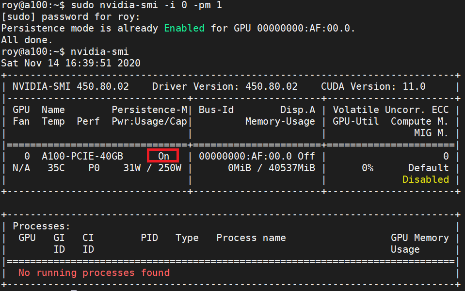

# NVIDIA GPU 持久化模式

原文: https://docs.nvidia.com/deploy/driver-persistence/index.html


## 背景

NVIDIA GPU 驅動程序歷來遵循 Unix 設計哲學，僅在用戶配置系統時才初始化軟件和硬件狀態。傳統上，這種配置是通過 X 服務器完成的，GPU 僅在 X 服務器（代表用戶）請求啟用時才初始化。這對於無需重啟即可重新配置 GPU 的能力非常重要（例如，更改 SLI 模式或總線設置，尤其是在 AGP 時代）。

最近，這已被證明是純計算環境中的一個問題，其中不使用 X 並且通過 Cuda 庫的瞬態實例訪問 GPU。這導致 GPU 狀態的初始化和取消初始化比用戶真正想要的更頻繁，並導致每個 Cuda 作業的加載時間很長，大約幾秒。

NVIDIA 之前提供了 Persistence Mode 來解決這個問題。這是一個可以使用 nvidia-smi 配置的內核級解決方案。當沒有用戶軟件使用 GPU 時，這種方法會阻止內核模塊完全卸載軟件和硬件狀態。但是，這種方法會與系統的其餘部分產生微妙的交互問題，從而使維護變得困難。

NVIDIA Persistence Daemon 的目的是用更強大的用戶空間解決方案取代這個內核級解決方案。這使得純計算環境更接近於 NVIDIA GPU 驅動程序設計的歷史典型圖形環境。

## 概述

NVIDIA 內核模式驅動程序必須正在運行並連接到目標 GPU 設備，然後用戶才能與該設備進行任何交互。NVIDIA 驅動程序行為因操作系統而異。通常，如果內核模式驅動程序尚未運行或連接到目標 GPU，則調用任何試圖與該 GPU 交互的程序將導致驅動程序加載和/或初始化 GPU。當所有 GPU 客戶端終止時，驅動程序將取消初始化 GPU。驅動程序加載行為對最終用戶的重要性體現在兩個方面：

- 應用程序啟動延遲:

    由於 ECC 清理行為，觸發 GPU 初始化的應用程序可能會導致每個 GPU 的啟動成本(大約 1-3 秒)。如果 GPU 已經初始化，則不會進行此清理。

- 保存驅動程序狀態

    如果驅動程序取消初始化 GPU，則與該 GPU 關聯的一些非持久狀態將丟失，並在下次 GPU 初始化時恢復為預設值。請參閱[數據持久性](https://docs.nvidia.com/deploy/driver-persistence/index.html#data-persistence)。為避免這種情況，GPU 應保持初始化狀態。

!!! info
    修正錯誤記憶體 ECC (Error-Correcting Code menmory) 指能夠實現錯誤檢查和糾正錯誤技術的記憶體。

不同的操作系統之間的預設的驅動程式行為不同:

1. **Windows**: 
    在 Windows 上，內核模式驅動程序在 Windows 啟動時加載，並一直加載到 Windows 關閉。因此，Windows 用戶大多可以忽略本文檔中描述的驅動程序持久性影響。

2. **Linux**: 

    在 Linux　系統 UI 守護程式 X window 預設會在目標 GPU 上運行，內核模式驅動程序通常會在機器啟動到關閉期間被初始化並保持活動狀態。
    
    在無頭系統或沒有長期存在的類 X window 客戶端維護目標 GPU handler 的情況下，內核模式驅動程序將在每次目標 GPU 應用程序啟動和停止時初始化和取消初始化目標 GPU。
    
    在 HPC 環境中，這種情況很常見。由於在這些情況下通常希望保持 GPU 初始化，NVIDIA 提供了兩個選項來更改驅動程序行為： Persistence Mode (Legacy) 和 Persistence Daemon。

## GPU 設定/狀態持久化

不同類別的驅動程序狀態具有不同的生命週期。理解差異很重要，因為這會影響 GPU 管理功能的行為，如時鐘設置、ECC 模式等。通常，驅動程序狀態分為以下類別。這並不是一個詳盡的清單，但將涵蓋常見情況：

1. GPU Initialization Lifecycle:

    這種類型的狀態從驅動程序初始化 GPU 開始一直持續到 GPU 被單元化為止。這是最窄的生命週期，因為內核驅動程序本身仍在加載並且可能正在管理其他 GPU。如果客戶端應用程序嘗試訪問 GPU，GPU 通常會初始化 GPU。 GPU 通常在最後一個客戶端退出後被取消初始化。

    狀態：

    - Compute Mode, Accounting Mode, Persistence Mode
    - Application Clocks, Application Clocks Permission Settings
    - SW-Based Power Capping Limit
    - Volatile ECC errors, Pending Retired Pages

2. Kernel Driver Lifecycle:

    這種類型的狀態從驅動程序加載一直持續到驅動程序卸載（例如 rmmod）。在大多數環境中，這是整個機器啟動週期。例外情況包括 GPU 重置事件和驅動程序安裝。

    狀態：

    - Accounting process data

3. GPU Board Lifecycle:

    這種類型的狀態持續整個啟動週期，因為它存儲在 GPU 板卡上的持久性信息中。在某些情況下，可以明確清除此類狀態，但通常認為此狀態在板的整個生命週期內都是持久的——或者直到用戶下一次更改為止。

    狀態：

    - ECC Mode, Aggregate ECC errors, Retired Pages
    - GPU Operation Mode, Driver Model

## 練習

### 環境安裝

本教程使用了 Azure 上的 VM (O.S: Ubuntu 20.04.05)來作為練習在 Kubernetes 裡應用 MIG 的環境。

|型號	|vCPU	|記憶體：GiB	|暫存儲存體：GiB	|GPU	|GPU 記憶體：GiB	|
|----|-----|------------|---------------|-----|----------------|
|Standard_NC24ads_A100_v4|24|220|1123|1|80|

這個 VM 會搭配一張 **Nvidia A100 (80gb)** 的 GPU 卡。

參考: [NC A100 v4 系列](https://learn.microsoft.com/zh-tw/azure/virtual-machines/nc-a100-v4-series)

以下是安裝 Rancher (RKE2/K3S) 和 Nvidia GPU Operator 的步驟。

**先決條件 (一台配備著 Nvidia GPU 的機器):**

- Operating system: `Ubuntu 20.04.05 LTS`
- GPU: `Nvidia A100 (80gb)` (Nvidia GPU 顯卡)

**安裝 nvidia drivers:**

!!! tip
    根據 Nvidia GPU Operator 的內容，operator 應該可自動幫每一個 Kubernetes 節點自動設定 GPU 的 Driver。
    
    然而在驗證的過程會發現 Ubuntu 的機器會在安裝完 Nvidia GPU Operator 之後一直重覆 reboot。
    
    排查之後的結果因該是 GPU Operator 在自動安裝 GPU Driver 後所發生的現象，查找相關 Githut 與 Google 之後尚未找出根因，因此在本教程中是先手動安裝 Nvidia GPU Driver 與 Nvidia Container Toolkit 在 Ubuntu 的機器上。


我們可以先使用 `apt` 搜索可用的 Nvidia GPU 卡的驅動程式：

```bash
sudo apt update

sudo apt search nvidia-driver
```

由於許多深度學習開發工具會與 Nvidia CUDA 函式庫有相依性，在安裝 Nvidia Driver 時需要根據實際的情況來決定要安裝的 Driver 版本。

下面列出 CUDA 版本對應到 Driver 版本的兼容性:

|CUDA Toolkit	|Linux x86_64 Minimum Required Driver Version	|Windows Minimum Required Driver Version|
|-------------|---------------------------------------------|---------------------------------------|
|CUDA 12.x	|>=525.60.13	|>=527.41|
|CUDA 11.x	|>= 450.80.02*	|>=452.39*|
|CUDA 10.2	|>= 440.33	|>=441.22|
|CUDA 10.1	|>= 418.39	|>=418.96|
|CUDA 10.0	|>= 410.48	|>=411.31|

根據 Nivida 官網的資訊:

- 從 CUDA 12/R525 驅動程序開始支持 H100 GPU。
- 從 CUDA 11/R450 驅動程序開始支持 A100 和 A30 GPU。

因此在本教程會選擇驅動程式版本 `515`，所以讓我們安裝這個版本：

```bash
sudo apt install nvidia-driver-515 nvidia-dkms-515 -y
```

重新啟動 Ubuntu 的機器:

```bash
sudo shutdown now -r
```

驗證 nvidia driver 的安裝:

```bash
nvidia-smi
```

結果:

```    
+-----------------------------------------------------------------------------+
| NVIDIA-SMI 515.86.01    Driver Version: 515.86.01    CUDA Version: 11.7     |
|-------------------------------+----------------------+----------------------+
| GPU  Name        Persistence-M| Bus-Id        Disp.A | Volatile Uncorr. ECC |
| Fan  Temp  Perf  Pwr:Usage/Cap|         Memory-Usage | GPU-Util  Compute M. |
|                               |                      |               MIG M. |
|===============================+======================+======================|
|   0  NVIDIA A100 80G...  Off  | 00000001:00:00.0 Off |                    0 |
| N/A   38C    P0    45W / 300W |     99MiB / 81920MiB |      0%      Default |
|                               |                      |             Disabled |
+-------------------------------+----------------------+----------------------+
```

!!! info
    特別注意的資訊是 `Persistence-M` 的預設狀態是 `Off`!!

要啟動 Persistence, Nvidia 官方有建議下列兩種方法:

- 手動啟停　Persistence Mode
- 使用 Persistence Daemon (守護進程)

### 手動啟動 Persistence Mode

**持久模式** 是用戶可設置的驅動程序屬性的術語，即使沒有客戶端連接到目標 GPU，它也能使目標 GPU 保持初始化狀態。此解決方案已接近生命週期結束，最終將被棄用，取而代之的是 Persistence Daemon。

可以使用 `nvidia-smi` 或通過 `NVML API` 以可程式化方式設置持久性模式。

使用 nvidia-smi（作為 root）啟用持久模式:

```bash title="範本"
nvidia-smi -i <target gpu> -pm 1
```

執行下列命令:

```bash title="執行下列命令  >_"
sudo nvidia-smi -i 0 -pm 1
```

結果:

```
Enabled persistence mode for GPU 00000001:00:00.0.
All done.
```

使用 `nvidia-smi` 查看當前持久化模式：

```bash title="範本"
nvidia-smi -i <target gpu> -q
```

```bash title="執行下列命令  >_"
sudo nvidia-smi -i 0 -q
```

結果:

```hl_lines="11"
    ==============NVSMI LOG==============

    Timestamp                           : ----
    Driver Version                      : ----

    Attached GPUs                       : ----
    GPU 0000:01:00.0
        Product Name                    : ----
        Display Mode                    : ----
        Display Active                  : ----
        Persistence Mode                : Enabled
        Accounting Mode                 : ----
        ...
```



使用 nvidia-smi（作為 root）停用持久模式:

```bash title="範本"
nvidia-smi -i <target gpu> -pm 0
```

執行下列命令:

```bash title="執行下列命令  >_"
sudo nvidia-smi -i 0 -pm 0
```

結果:

```
Disabled persistence mode for GPU 00000001:00:00.0.
All done.
```

### 使用 Persistence Daemon

NVIDIA 在 Linux 上提供了一個用戶空間守護進程，以支持跨 Cuda 作業運行的驅動程序狀態持久化。守護進程方法為這個問題提供了比持久模式更優雅和健壯的解決方案。

守護進程安裝在 `/usr/bin` 中，而範安裝和初始化腳本包含在驅動程序的文檔目錄中。這些腳本作為安裝守護進程的指南提供，以便在一些常見的初始化系統的系統啟動時運行；由於 init 系統配置的多樣性，它們可能需要對某些發行版進行一些更改。

NVIDIA 建議使用守護程序方法來設定驅動程序狀態持久化。

#### 實施細節

在運行 NVIDIA GPU 驅動程序的 Linux 系統上，客戶端通過打開其設備文件來附加 GPU。相反，通過關閉設備文件來分離 GPU。只要一個或多個客戶端打開設備文件，GPU 狀態就會保持加載到驅動程序中。一旦所有客戶端都關閉了設備文件，除非啟用持久模式，否則 GPU 狀態將被卸載。

為了在不產生用戶空間圖形驅動程序開銷的情況下模擬圖形環境，Nvidia 提供了 NVIDIA Persistence Daemon，它基本上在後台運行並在設備文件打開時休眠。該守護進程使用 巷`libnvidia-cfg` 根據其 PCI 總線地址打開和關閉正確的設備文件，並提供一個 RPC 接口來單獨控制每個 GPU 的持久化模式。因此，當守護進程保持設備文件打開時，至少有一個客戶端（守護進程）連接了 GPU，並且驅動程序不會卸載 GPU 狀態。一旦守護進程開始運行，它將一直在後台運行直到被移除。

Persistence Daemon 可以用作我們現在稱為 Persistence Mode 的替代品，如在 NVIDIA 內核模式驅動程序中實現的那樣。 NVIDIA SMI 已在驅動程序版本 319 中更新，以使用守護程序的 RPC 接口在守護程序運行時使用守護程序設置持久性模式，如果守護程序未運行，將回退到在內核模式驅動程序中設置遺留持久性模式來運行。這一切都由 NVIDIA SMI 處理，因此持久模式的配置方式應該沒有變化。最終，一旦 NVIDIA Persistence Daemon 在相關用例中得到廣泛採用，舊的持久性模式將被棄用和刪除。


#### 權限和安全

NVIDIA Persistence Daemon 在 Linux 上提供了更強大的持久模式實現，因為它只是模擬 GPU 的外部客戶端，但實際上並不使用 GPU 進行任何工作。通過這種方式，它使 NVIDIA GPU 驅動程序在其原始設計的假設範圍內運行。

守護進程運行後，保持持久模式啟用的開銷很小。守護進程將簡單地睡眠等待命令。

守護進程不需要超級用戶權限即可運行 - 但是，它確實需要超級用戶權限才能在 `/var/run` 中設置一些運行時數據。守護進程允許兩種機制以沒有超級用戶權限的用戶身份運行:

- 管理員（或以超級用戶權限運行的腳本）可以創建 `/var/run/nvidia-persistenced` 目錄並將其 `chown` 給守護進程將運行的用戶。然後可以使用 `su` 或類似的方式以預期用戶身份運行守護進程。在這種情況下，`/var/run/nvidia-persistenced` 目錄不會在守護進程被終止時被刪除。

- 守護進程可以以超級用戶權限啟動並使用 `--user` 選項。這將強制守護進程在創建 `/var/run/nvidia-persistenced` 目錄並以指定用戶身份運行後儘快放棄其超級用戶權限。請注意，使用此機制，守護進程在被終止時可能無法刪除 `/var/run/nvidia-persistenced` 目錄，因為用戶可能沒有對 `/var/run` 的寫入權限。


請注意，在這兩種情況下，守護進程在被終止時可能無法刪除其運行時數據目錄，因此該任務通常應由守護進程的初始化腳本或服務處理。

#### 範例

啟動 NVIDIA Persistence Daemon，並為所有 NVIDIA GPU 裝置禁用持久模式。

```bash
sudo nvidia-persistenced
```

啟動 NVIDIA Persistence Daemon，並為所有 NVIDIA GPU 裝置啟用持久模式。

```bash
sudo nvidia-persistenced --persistence-mode
```

#### 啟用 Service 以及檢查測試

通常安裝完 Nvidia Driver 後 `nvidia-persistenced` 的服務也被啟動。

檢查　`nvidia-persistenced` 服務狀態:

```bash
sudo systemctl status nvidia-persistenced
```

結果:

```hl_lines="4"
● nvidia-persistenced.service - NVIDIA Persistence Daemon
     Loaded: loaded (/lib/systemd/system/nvidia-persistenced.service; static; vendor preset: enabled)
     Active: active (running) since Fri 2023-02-17 05:03:58 UTC; 10min ago
    Process: 911 ExecStart=/usr/bin/nvidia-persistenced --user nvidia-persistenced --no-persistence-mode --verbose (code=exited, status=0/SUCCESS)
   Main PID: 912 (nvidia-persiste)
      Tasks: 1 (limit: 265743)
     Memory: 784.0K
     CGroup: /system.slice/nvidia-persistenced.service
             └─912 /usr/bin/nvidia-persistenced --user nvidia-persistenced --no-persistence-mode --verbose

Feb 17 05:03:58 aiml-server-0 nvidia-persistenced[912]: Started (912)
Feb 17 05:03:58 aiml-server-0 nvidia-persistenced[912]: device 0001:00:00.0 - registered
Feb 17 05:03:58 aiml-server-0 nvidia-persistenced[912]: Local RPC services initialized
Feb 17 05:03:58 aiml-server-0 systemd[1]: Started NVIDIA Persistence Daemon.
Feb 17 05:05:36 aiml-server-0 nvidia-persistenced[912]: device 0001:00:00.0 - persistence mode enabled.
Feb 17 05:05:36 aiml-server-0 nvidia-persistenced[912]: device 0001:00:00.0 - NUMA memory onlined.
Feb 17 05:06:45 aiml-server-0 nvidia-persistenced[912]: device 0001:00:00.0 - persistence mode disabled.
Feb 17 05:06:45 aiml-server-0 nvidia-persistenced[912]: device 0001:00:00.0 - NUMA memory offlined.
Feb 17 05:07:06 aiml-server-0 nvidia-persistenced[912]: device 0001:00:00.0 - persistence mode enabled.
Feb 17 05:07:06 aiml-server-0 nvidia-persistenced[912]: device 0001:00:00.0 - NUMA memory onlined.
```

!!! tip
    如果機器上沒找到 `nvidia-persistenced` 服務進程, 那麼建議使用下列的手法來啟用 `nvidia-persistenced`:

    ```bash
    # 啟用 nvidia-persistenced 
    systemctl start nvidia-persistenced

    # 開機自動啟用 nvidia-persistenced
    systemctl enable nvidia-persistenced

    # 檢查 driver 版本
    cat /proc/driver/nvidia/version

    # 測試基本指定能否正常執行和顯示
    nvidia-smi 

    # 如果有異常，可能需要重開機
    systemctl reboot
    ```

從上述的 systemd 的設定的來看 Persistent Mode 預設是停用的。修改 `/lib/systemd/system/nvidia-persistenced.service` 命令稿:

```bash
sudo nano /lib/systemd/system/nvidia-persistenced.service
```

修改下列內容:

```hl_lines="9"
[Unit]
Description=NVIDIA Persistence Daemon
Wants=syslog.target
StopWhenUnneeded=true
Before=systemd-backlight@backlight:nvidia_0.service

[Service]
Type=forking
ExecStart=/usr/bin/nvidia-persistenced --persistence-mode --verbose
ExecStopPost=/bin/rm -rf /var/run/nvidia-persistenced
```

重新 reboot 機器:

```bash
sudo shutdown now -r
```

執行下列命令來檢查:

```bash
sudo systemctl status nvidia-persistenced
```

結果:

```hl_lines="4 15"
● nvidia-persistenced.service - NVIDIA Persistence Daemon
     Loaded: loaded (/lib/systemd/system/nvidia-persistenced.service; static; vendor preset: enabled)
     Active: active (running) since Fri 2023-02-17 05:20:43 UTC; 33s ago
    Process: 907 ExecStart=/usr/bin/nvidia-persistenced --persistence-mode --verbose (code=exited, status=0/SUCCESS)
   Main PID: 909 (nvidia-persiste)
      Tasks: 1 (limit: 265743)
     Memory: 33.1M
     CGroup: /system.slice/nvidia-persistenced.service
             └─909 /usr/bin/nvidia-persistenced --persistence-mode --verbose

Feb 17 05:20:41 aiml-server-0 systemd[1]: Starting NVIDIA Persistence Daemon...
Feb 17 05:20:41 aiml-server-0 nvidia-persistenced[909]: Verbose syslog connection opened
Feb 17 05:20:41 aiml-server-0 nvidia-persistenced[909]: Started (909)
Feb 17 05:20:41 aiml-server-0 nvidia-persistenced[909]: device 0001:00:00.0 - registered
Feb 17 05:20:43 aiml-server-0 nvidia-persistenced[909]: device 0001:00:00.0 - persistence mode enabled.
Feb 17 05:20:43 aiml-server-0 nvidia-persistenced[909]: device 0001:00:00.0 - NUMA memory onlined.
Feb 17 05:20:43 aiml-server-0 nvidia-persistenced[909]: Local RPC services initialized
Feb 17 05:20:43 aiml-server-0 systemd[1]: Started NVIDIA Persistence Daemon.
```

使用 `nvidia-smi` 來檢查:

```
+-----------------------------------------------------------------------------+
| NVIDIA-SMI 515.86.01    Driver Version: 515.86.01    CUDA Version: 11.7     |
|-------------------------------+----------------------+----------------------+
| GPU  Name        Persistence-M| Bus-Id        Disp.A | Volatile Uncorr. ECC |
| Fan  Temp  Perf  Pwr:Usage/Cap|         Memory-Usage | GPU-Util  Compute M. |
|                               |                      |               MIG M. |
|===============================+======================+======================|
|   0  NVIDIA A100 80G...  On   | 00000001:00:00.0 Off |                    0 |
| N/A   34C    P0    44W / 300W |     99MiB / 81920MiB |      0%      Default |
|                               |                      |             Disabled |
+-------------------------------+----------------------+----------------------+
```
