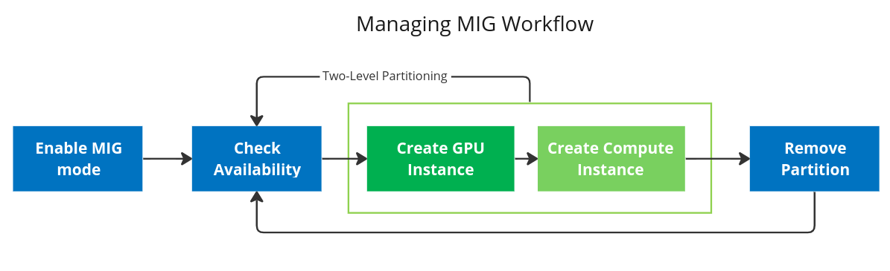
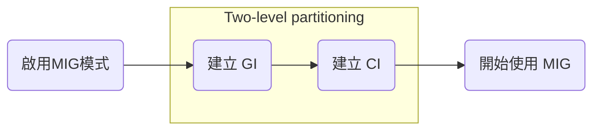
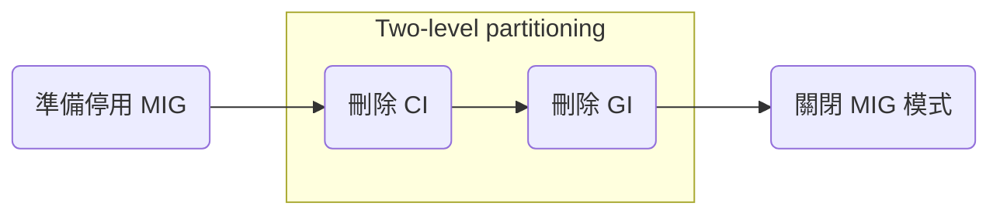

# MIG 切割入門


## 練習環境

本教程使用了 Azure 上的 VM (O.S: Ubuntu 20.04.05)來作為練習 MIG 切割的環境。

|型號	|vCPU	|記憶體：GiB	|暫存儲存體：GiB	|GPU	|GPU 記憶體：GiB	|
|----|-----|------------|---------------|-----|----------------|
|Standard_NC24ads_A100_v4|24|220|1123|1|80|

這個 VM 會搭配一張 **Nvidia A100 (80gb)** 的 GPU 卡。

參考: [NC A100 v4 系列](https://learn.microsoft.com/zh-tw/azure/virtual-machines/nc-a100-v4-series)

## MIG 切割管理流程

本節概述如何在 GPU 上創建各種分區。出於說明目的，本文將以 A100-80GB 的 GPU 顯卡為例，但其他支持 MIG 的 GPU 的切割過程類似。



## MIG 設定流程

接下來我們會使用下列的流程來啟動 MIG 並練習切割。



### 啟用 MIG 模式

默認情況下，GPU 上未啟用 MIG 模式。例如，運行 `nvidia-smi` 顯示 MIG 模式未啟用:

```bash
nvidia-smi -i 0
```

參數說明:

- `-i`: 針對特定的 GPU, 後面接著的 GPU 的 ID

結果:

```  
+-----------------------------------------------------------------------------+
| NVIDIA-SMI 515.86.01    Driver Version: 515.86.01    CUDA Version: 11.7     |
|-------------------------------+----------------------+----------------------+
| GPU  Name        Persistence-M| Bus-Id        Disp.A | Volatile Uncorr. ECC |
| Fan  Temp  Perf  Pwr:Usage/Cap|         Memory-Usage | GPU-Util  Compute M. |
|                               |                      |               MIG M. |
|===============================+======================+======================|
|   0  NVIDIA A100 80G...  Off  | 00000001:00:00.0 Off |                    0 |
| N/A   33C    P0    46W / 300W |    148MiB / 81920MiB |      0%      Default |
|                               |                      |             Disabled |
+-------------------------------+----------------------+----------------------+
```

指定 GPU 來啟用 MIG:

```bash
sudo nvidia-smi -i 0 -mig 1
```

結果:

```
+-----------------------------------------------------------------------------+
| NVIDIA-SMI 515.86.01    Driver Version: 515.86.01    CUDA Version: 11.7     |
|-------------------------------+----------------------+----------------------+
| GPU  Name        Persistence-M| Bus-Id        Disp.A | Volatile Uncorr. ECC |
| Fan  Temp  Perf  Pwr:Usage/Cap|         Memory-Usage | GPU-Util  Compute M. |
|                               |                      |               MIG M. |
|===============================+======================+======================|
|   0  NVIDIA A100 80G...  Off  | 00000001:00:00.0 Off |                   On |
| N/A   37C    P0    69W / 300W |      0MiB / 81920MiB |     N/A      Default |
|                               |                      |              Enabled |
+-------------------------------+----------------------+----------------------+

+-----------------------------------------------------------------------------+
| MIG devices:                                                                |
+------------------+----------------------+-----------+-----------------------+
| GPU  GI  CI  MIG |         Memory-Usage |        Vol|         Shared        |
|      ID  ID  Dev |           BAR1-Usage | SM     Unc| CE  ENC  DEC  OFA  JPG|
|                  |                      |        ECC|                       |
|==================+======================+===========+=======================|
|  No MIG devices found                                                       |
+-----------------------------------------------------------------------------+
```

!!! tip

    如果在啟動 MIG 時有看到下面的警告訊息，代表著這個 GPU 有進程在使用中。

    ```
    Warning: MIG mode is in pending enable state for GPU 00000001:00:00.0:In use by another client
    00000001:00:00.0 is currently being used by one or more other processes (e.g. CUDA application or a monitoring application such as another instance of nvidia-smi). Please first kill all processes using the device and retry the command or reboot the system to make MIG mode effective.
    All done.
    ```

    解決方法 1:

    重新 reboot。

    ```bash
    sudo shutdown now -r
    ```

    解決方法 2:

    把相關的進程找出來並 kill/gpu-reset，然後再設定。

    ```bash
    sudo killall nvidia-persistenced

    sudo nvidia-smi --gpu-reset
    ```

    參考:

    - [nvidia-persistenced keeps a handle on the GPU and blocks --gpu-reset #118](https://github.com/NVIDIA/gpu-operator/issues/118)


### 查看 GI 可用組合

```bash
nvidia-smi mig -i 0 -lgip
```

- `-lgip` 或是 `--list-gpu-instance-profiles`: 列出支持的 GPU 實例配置 profile。

結果:

```
+-----------------------------------------------------------------------------+
| GPU instance profiles:                                                      |
| GPU   Name             ID    Instances   Memory     P2P    SM    DEC   ENC  |
|                              Free/Total   GiB              CE    JPEG  OFA  |
|=============================================================================|
|   0  MIG 1g.10gb       19     7/7        9.50       No     14     0     0   |
|                                                             1     0     0   |
+-----------------------------------------------------------------------------+
|   0  MIG 1g.10gb+me    20     1/1        9.50       No     14     1     0   |
|                                                             1     1     1   |
+-----------------------------------------------------------------------------+
|   0  MIG 2g.20gb       14     3/3        19.50      No     28     1     0   |
|                                                             2     0     0   |
+-----------------------------------------------------------------------------+
|   0  MIG 3g.40gb        9     2/2        39.25      No     42     2     0   |
|                                                             3     0     0   |
+-----------------------------------------------------------------------------+
|   0  MIG 4g.40gb        5     1/1        39.25      No     56     2     0   |
|                                                             4     0     0   |
+-----------------------------------------------------------------------------+
|   0  MIG 7g.80gb        0     1/1        79.00      No     98     5     0   |
|                                                             7     1     1   |
+-----------------------------------------------------------------------------+
```

總共有 6 種 `profile` 可以選擇，其中 `Instances` 可查詢剩餘可切割的數量。

以 NVIDIA A100 80G 為例，最大利用率的排列組合如下圖，可根據需求做選擇。


!!! info
    在建立 GI 的順序很重要，建議由大建到小 (如上圖須由左到右)，以免發生記憶體破碎的問題。


### 創建 GPU Instance (GI)

在開始使用 MIG 之前，用戶需要使用 `-cgi` 選項創建 GPU 實例。可以使用三個選項之一來指定要創建的實例配置文件:

- Profile ID (例如 9, 14, 5)
- Short name of the profile (例如 3g.20gb)
- Full profile name of the instance (例如 MIG 3g.20gb)

創建 GPU 實例(GI)後，需要創建相應的計算實例(CI)。通過使用 `-C` 選項，`nvidia-smi` 會創建這些實例。當然也可把它分成兩個步驟來進行。

**建立 GI:**

假設我要建立兩個 `3g.40gb` 的 GI，建立指令可以用 profile 的 Name 或 ID。

```bash
sudo nvidia-smi mig -i 0 -cgi 3g.40gb
```

或

```bash
sudo nvidia-smi mig -i 0 -cgi 9
```

執行下列命令:

```bash
sudo nvidia-smi mig -i 0 -cgi 3g.40gb,3g.40gb
```

結果:

```
Successfully created GPU instance ID  1 on GPU  0 using profile MIG 3g.40gb (ID  9)
Successfully created GPU instance ID  2 on GPU  0 using profile MIG 3g.40gb (ID  9)
```

**查詢已經建立的 GI:**

```bash
sudo nvidia-smi mig -i 0 -lgi
```

結果:

```
+-------------------------------------------------------+
| GPU instances:                                        |
| GPU   Name             Profile  Instance   Placement  |
|                          ID       ID       Start:Size |
|=======================================================|
|   0  MIG 3g.40gb          9        1          4:4     |
+-------------------------------------------------------+
|   0  MIG 3g.40gb          9        2          0:4     |
+-------------------------------------------------------+
```

### 創建 Compute Instance (CI)

**查看 CI 可用組合:**

指定 GI (GI Instance ID)，來查詢其 CI 可用的組合，* 為預設 CI。

```bash
sudo nvidia-smi mig -i 0 -gi 1 -lcip
```

結果:

```
+--------------------------------------------------------------------------------------+
| Compute instance profiles:                                                           |
| GPU     GPU       Name             Profile  Instances   Exclusive       Shared       |
|       Instance                       ID     Free/Total     SM       DEC   ENC   OFA  |
|         ID                                                          CE    JPEG       |
|======================================================================================|
|   0      1       MIG 1c.3g.40gb       0      3/3           14        2     0     0   |
|                                                                      3     0         |
+--------------------------------------------------------------------------------------+
|   0      1       MIG 2c.3g.40gb       1      1/1           28        2     0     0   |
|                                                                      3     0         |
+--------------------------------------------------------------------------------------+
|   0      1       MIG 3g.40gb          2*     1/1           42        2     0     0   |
|                                                                      3     0         |
+--------------------------------------------------------------------------------------+
```

**建立 CI:**

假設我要建立兩個 1c.3g.40gb 的 GI，建立指令可以用 Name 或 ID。

```bash
sudo nvidia-smi mig -i 0 -gi 1 -cci 1c.3g.40gb,1c.3g.40gb
```

結果:

```
Successfully created compute instance ID  0 on GPU  0 GPU instance ID  1 using profile MIG 1c.3g.40gb (ID  0)
Successfully created compute instance ID  1 on GPU  0 GPU instance ID  1 using profile MIG 1c.3g.40gb (ID  0)
```

**查詢已經建立的 CI (指定 GI):**

```bash
sudo nvidia-smi mig -i 0 -gi 1 -lci
```

結果:

```
+--------------------------------------------------------------------+
| Compute instances:                                                 |
| GPU     GPU       Name             Profile   Instance   Placement  |
|       Instance                       ID        ID       Start:Size |
|         ID                                                         |
|====================================================================|
|   0      1       MIG 1c.3g.40gb       0         0          0:1     |
+--------------------------------------------------------------------+
|   0      1       MIG 1c.3g.40gb       0         1          1:1     |
+--------------------------------------------------------------------+
```

使用 `nvidia-smi` 來查看:

```bash
sudo nvidia-smi
```

結果:

```
+-----------------------------------------------------------------------------+
| NVIDIA-SMI 515.86.01    Driver Version: 515.86.01    CUDA Version: 11.7     |
|-------------------------------+----------------------+----------------------+
| GPU  Name        Persistence-M| Bus-Id        Disp.A | Volatile Uncorr. ECC |
| Fan  Temp  Perf  Pwr:Usage/Cap|         Memory-Usage | GPU-Util  Compute M. |
|                               |                      |               MIG M. |
|===============================+======================+======================|
|   0  NVIDIA A100 80G...  Off  | 00000001:00:00.0 Off |                   On |
| N/A   40C    P0    59W / 300W |     38MiB / 81920MiB |     N/A      Default |
|                               |                      |              Enabled |
+-------------------------------+----------------------+----------------------+

+-----------------------------------------------------------------------------+
| MIG devices:                                                                |
+------------------+----------------------+-----------+-----------------------+
| GPU  GI  CI  MIG |         Memory-Usage |        Vol|         Shared        |
|      ID  ID  Dev |           BAR1-Usage | SM     Unc| CE  ENC  DEC  OFA  JPG|
|                  |                      |        ECC|                       |
|==================+======================+===========+=======================|
|  0    1   0   0  |     19MiB / 40192MiB | 14      0 |  3   0    2    0    0 |
|                  |      0MiB / 65535MiB |           |                       |
+------------------+                      +-----------+-----------------------+
|  0    1   1   1  |                      | 14      0 |  3   0    2    0    0 |
|                  |                      |           |                       |
+------------------+----------------------+-----------+-----------------------+
                                                                               
+-----------------------------------------------------------------------------+
| Processes:                                                                  |
|  GPU   GI   CI        PID   Type   Process name                  GPU Memory |
|        ID   ID                                                   Usage      |
|=============================================================================|
|  No running processes found                                                 |
+-----------------------------------------------------------------------------+
```

!!! tip
    如果在建 GI 時，想要用預設的 CI，在建 GI 時加入 `-C` 參數即可。這個功能要在 GPU Driver > 450.80.02 才有。

    範例:

    ```bash
    sudo nvidia-smi mig -i 0 -cgi 3g.40gb,3g.40gb -C
    ```

## MIG 移除流程

接下來我們會使用下列的流程來停止 MIG 模式並移除切割。



### 移除 Compute Instance (CI)

指定 GI 及 CI 來移除 CI。

```bash
sudo nvidia-smi mig -i 0 -gi 1 -ci 0,1 -dci
```

結果:

```
Successfully destroyed compute instance ID  0 from GPU  0 GPU instance ID  1
Successfully destroyed compute instance ID  1 from GPU  0 GPU instance ID  1
```

### 移除 GPU Instance (GI)

指定 GI 來移除 GI。

```bash
sudo nvidia-smi mig -i 0 -gi 1 -dgi
```

結果:

```
Successfully destroyed GPU instance ID  1 from GPU  0
```

### 關閉 MIG 模式

```bash
sudo nvidia-smi -i 0 -mig 0
```

結果:

```
Disabled MIG Mode for GPU 00000001:00:00.0

Warning: persistence mode is disabled on device 00000001:00:00.0. See the Known Issues section of the nvidia-smi(1) man page for more information. Run with [--help | -h] switch to get more information on how to enable persistence mode.
All done.
```

使用 `nvidia-smi` 來查看:

```bash
sudo nvidia-smi
```

結果:

```
+-----------------------------------------------------------------------------+
| NVIDIA-SMI 515.86.01    Driver Version: 515.86.01    CUDA Version: 11.7     |
|-------------------------------+----------------------+----------------------+
| GPU  Name        Persistence-M| Bus-Id        Disp.A | Volatile Uncorr. ECC |
| Fan  Temp  Perf  Pwr:Usage/Cap|         Memory-Usage | GPU-Util  Compute M. |
|                               |                      |               MIG M. |
|===============================+======================+======================|
|   0  NVIDIA A100 80G...  Off  | 00000001:00:00.0 Off |                    0 |
| N/A   36C    P0    40W / 300W |     99MiB / 81920MiB |      0%      Default |
|                               |                      |             Disabled |
+-------------------------------+----------------------+----------------------+
```

## 結論

MIG 切割的官方文件很豐富也很完整，不過剛開始去理解的過程有點抓不到切割的考量點與切割的組合。

經過實際練習與操作能夠更如何規劃 GPU 的切割有了更進一步的理解與相關要注意的細節。

參考:

- [不務正業工程師的家: Multi-Instance GPU (MIG) 設定](https://roychou121.github.io/2020/10/29/nvidia-A100-MIG/)
- [NVIDIA Multi-Instance GPU User Guide](https://docs.nvidia.com/datacenter/tesla/mig-user-guide/#running-with-mig)