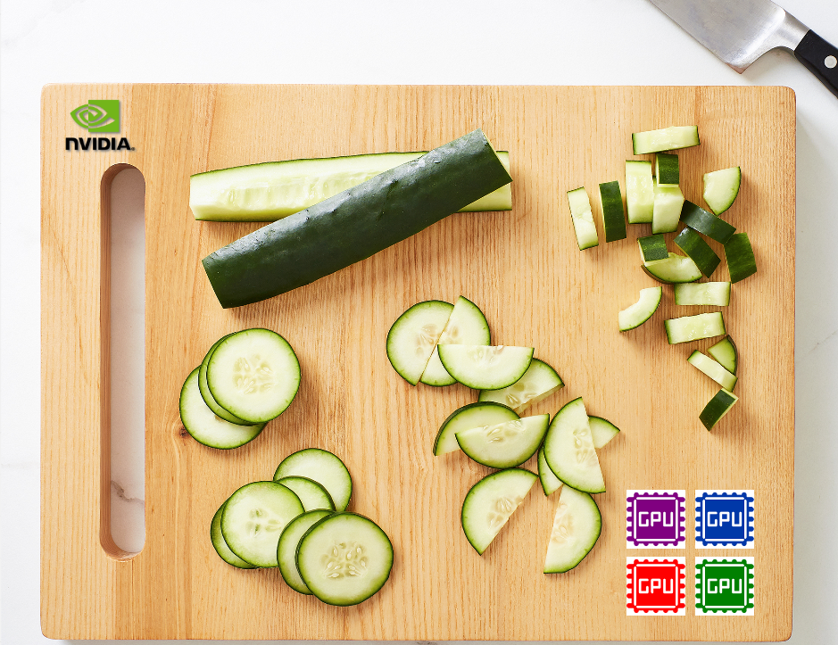
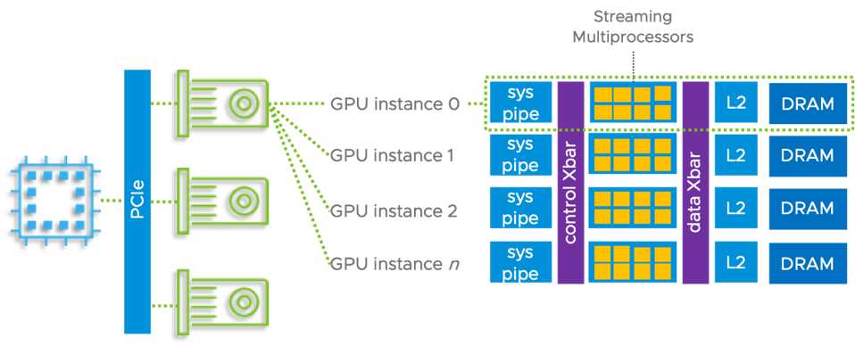
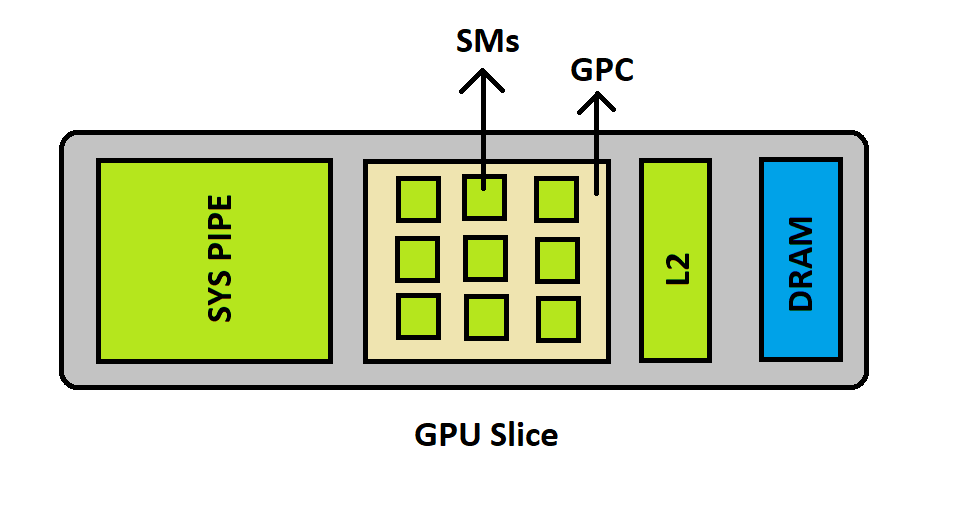
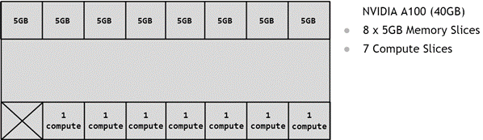
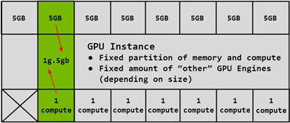
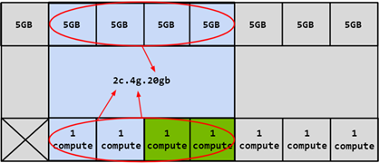
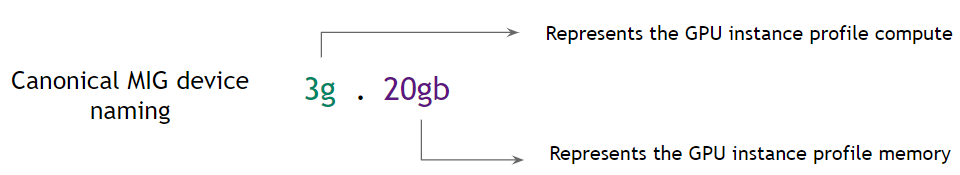
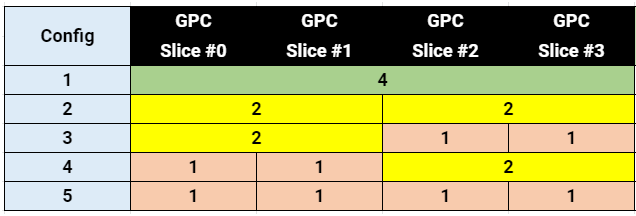
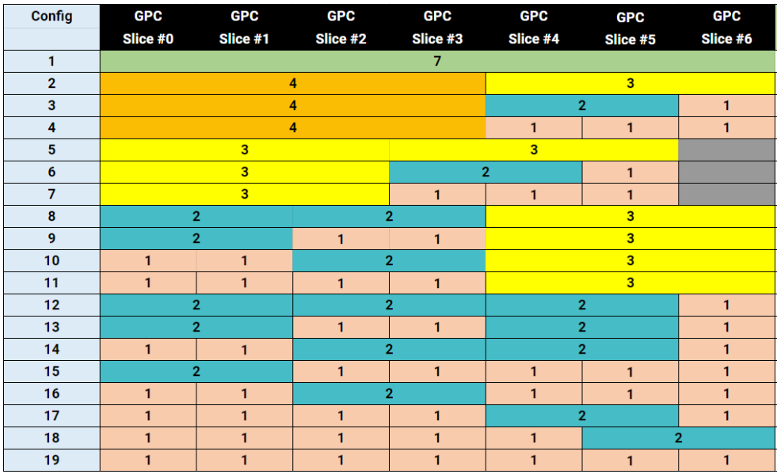
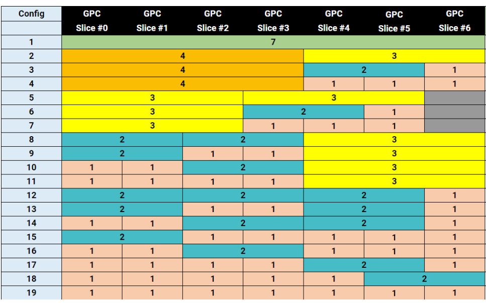

# Nvidia GPU 切割 - MIG(Multi-Instance GPU)

原文: [NVIDIA Multi-Instance GPU User Guide](https://docs.nvidia.com/datacenter/tesla/mig-user-guide/index.html)

Multi-Instance GPU（MIG）功能使 NVIDIA A100 GPU 可以安全地切割為多達七個用於 CUDA 應用的獨立 GPU 實例 (把 1 張 GPU 卡切割成 7 張)，從而為多個用戶提供獨立的 GPU 資源，以優化 GPU 的利用率。

此功能對於 GPU 工作負載利用率低下的情境特別有用，因此使用 MIG 技術，可在單張 GPU 上並行運行不同的工作負載以最大化昂貴的 GPU 利用率。

## 支援 MIG 的 GPU

從 NVIDIA Ampere 這一代開始的 GPU（即計算能力 >= 8.0 的 GPU）支持 MIG。下表提供了支持的 GPU 列表:

|產品	|GPU 架構|Microarchitecture	|計算能力|顯卡記憶體大小|最大可切割實例數|
|----|-------|-------------------|------|------------|-------------|
|H100-SXM5	|Hopper	|GH100	|9.0	|80GB	|7|
|H100-PCIE	|Hopper	|GH100	|9.0	|80GB	|7|
|A100-SXM4	|Ampere	|GA100	|8.0	|40GB|7|
|A100-SXM4	|Ampere	|GA100	|8.0	|80GB|7|
|A100-PCIE	|Ampere	|GA100	|8.0	|40GB|7|
|A100-PCIE	|Ampere	|GA100	|8.0	|80GB|7|
|A30	|Ampere	|GA100	|8.0	|24GB	|4|

## 名詞解釋

- **Streaming Multiprocessor**: 流式多工處理器 (SM) 在 GPU 上執行計算指令。
- **GPU Engine**: GPU Engine 是 GPU 上的工作引擎，如 copy engine (CE)、DMAs、NVDEC、NVENC 等等。
- **GPU Memory Slice**: GPU Memory Slice 是 GPU 顯卡記憶體的最小單位，一張 GPU 的顯卡記憶體總共由 **8** 個 GPU Memory Slice 所組成。
- **GPU SM Slice**: GPU SM Slice 是 GPU SM 的最小單位，一張 GPU 的 SM 總共由 **7** 個 GPU SM Slice 所組成。
- **GPU Slice**: GPU Slice 是 GPU 的最小單位，它是由一個 GPU Memory Slice 和一個 GPU SM Slice 所組成。
- **GPU Instance (GI)**: GPU Instance 是 GPU slices 和 GPU engine 的組合，GPU Instance 中會共享所有 GPU slices 和 GPU engine。其中每個 GPU Instance 可再進一步細分為 Compute Instance。
- **Compute Instance (CI)**: 一個 GPU Instance 可被細分成多個 Compute Instance。

## GPU 切割概念

本節概述如何在 GPU 上創建各種分區。出於說明目的，本文將以 `A100-40GB` 的 GPU 顯卡為例，但其他支持 MIG 的 GPU 的切割過程類似。

### GPU Instance (GI)

GPU 的分區根據 `GPU Memory Slice` 來規劃進行，因此 `A100-40GB` GPU 可以被認為具有 **8x5GB** 個 `Memory Slice` 和 7 個 `SM Slice`，如下圖所示

如上所述，創建 GPU Instance (GI) 需要將一定數量的 `Memory Slice` 與一定數量的 `SM Slice` 組合起來。在下圖中，一個 5GB 的 `Memory Slice` 與 1 個 `SM Slice` 相結合，創建了一個 `1g.5gb` 的 GI 配置 profile:

同樣，**4x5GB** 的 `Memory Slice` 可以與 **4x1** 的 `SM Slice` 組合以創建 `4g.5gb` GI 配置 profile:

### Compute Instance (CI)

GPU Instance 可以進一步細分為多個 Compute Instances (CI)，CI 共享父 GI 的引擎和顯卡記憶體，但每個 CI 都有專用的 SM 資源。

使用上面相同的 `4g.20gb` 示例，可以創建一個 CI 以僅使用第一個 `SM Slice`，如下所示：

在這種情況下，可以通過選擇任何 `SM Slice` 來創建 4 個不同的 CI。也可以將兩個 `SM Slice` 組合在一起以創建 `2c.4g.20gb` 配置 profile:

在此示例中，還可以把右邊那 3 個 `SM Slice` 組合起來創建 `3c.4g.20gb` 配置，或者可以組合所有 4 個 `SM Slice` 來創建 `4c.4g.20gb` 配置文件。當所有 4 個計算切片組合在一起時，配置文件簡稱為 `4g.20gb` 配置文件。

## MIG 設備名稱

默認情況下，一個 MIG 設備由一個 GPU Instance (GI) 和一個 Compute Instance (CI) 組成。下表突出顯示了一種命名約定，通過其 GPU 實例的 `SM Slice` 數量和以 GB 為單位的總顯卡記憶體（而不僅僅是其 `Memory Slice` 數）來代表該 MIG 設備。

當僅創建單個 CI（消耗 GI 的全部計算容量）時，CI 大小將隱含在設備名稱中。

## MIG 切割部署注意事項

MIG 功能作為 NVIDIA GPU 驅動程序的一部分提供，因此需要根據 GPU 的型號來安裝對應的 Drvier:

- 從 CUDA 12/R525 驅動程序開始支持 H100 GPU。
- 從 CUDA 11/R450 驅動程序開始支持 A100 和 A30 GPU。

### System Considerations

以下是當系統要啟動 MIG 模式的相關注意事項:

- MIG 僅在 CUDA 支持的 **Linux** 操作系統發行版上被支持。
- MIG 支持的部署配置包括:
    - 裸機，包括容器和 Kubernetes
    - GPU pass-through 虛擬化到受支持 的hypervisor 之上的 Linux guest O.S
    - vGPU 在受支持的 hypervisor 之上
- 在 A100/A30 上設置 MIG 模式需要重置 GPU（因此需要超級用戶權限）。一旦 GPU 處於 MIG 模式，實例管理就是動態的。
- 在 NVIDIA Ampere GPU 上，MIG 模式設置在重新啟動後保持不變，直到用戶明確切換設置
- 在啟用 MIG 之前，需要停止所有持有驅動程序模塊 Handler 的守護進程(比如 `kublet`)。
- 切換 MIG 模式需要 `CAP_SYS_ADMIN` 能力。其他 MIG 管理，例如創建和銷毀實例，默認情況下需要超級用戶，但可以通過調整 `/proc/` 中對 MIG 功能的權限委託給非特權用戶。

### Application Considerations

當 A100 處於 MIG 模式時，用戶應注意以下注意事項:

- 不支持圖形 API（例如 OpenGL、Vulkan 等）
- 不支持 GPU 到 GPU P2P（PCIe 或 NVLink）
- CUDA 應用程序將 Compute Instance (CI)及其父 GPU Instance (GI) 視為單個 CUDA 設備。
- 不支持跨 GPU 實例的 CUDA IPC。支持跨 Compute Instance (CI) 的 CUDA IPC
- 支持 CUDA 調試（例如使用 cuda-gdb）和內存/競爭檢查（例如使用 cuda-memcheck 或 compute-sanitizer）
- MIG 之上支持 CUDA MPS。唯一的限制是最大客戶端數 (48) 與 Compute Instance (CI) 大小成比例地降低
- 從 GPU 實例使用時支持 GPUDirect RDMA

## 支持 MIG 的配置範本

本節概述了支持 MIG 配置設定在受支持的 GPU 上的設定組合。

### A30 MIG 配置範本

下表顯示了 A30-24GB 產品支持的配置文件。

|Profile Name	|Fraction of Memory	|Fraction of SMs	|Hardware Units	|L2 Cache Size	|Copy Engines	|Number of Instances Available|
|-------------|-------------------|-----------------|---------------|---------------|-------------|-----------------------------|
|MIG 1g.6gb|1/4|1/4|0 NVDECs /0 JPEG /0 OFA|1/4|1|4|
|MIG 1g.6gb+me|1/4|1/4|1 NVDEC /1 JPEG /1 OFA|1/4|1|1 (A single 1g profile can include media extensions)|
|MIG 2g.12gb|2/4|2/4|2 NVDECs /0 JPEG /0 OFA|2/4|2|2|
|MIG 2g.12gb+me|2/4|2/4|2 NVDECs /1 JPEG /1 OFA	|2/4	|2	|1 (A single 2g profile can include media extensions)|
|MIG 4g.24gb	|Full	|4/4	|4 NVDECs /1 JPEG /1 OFA	|Full	|4	|1|

### A100 MIG 配置範本

下表顯示了 A100-SXM4-40GB 產品支持的配置文件。

|Profile Name	|Fraction of Memory	|Fraction of SMs	|Hardware Units	|L2 Cache Size	|Copy Engines	|Number of Instances Available|
|-------------|-------------------|-----------------|---------------|---------------|-------------|-----------------------------|
|MIG 1g.5gb	|1/8	|1/7	|0 NVDECs /0 JPEG /0 OFA	|1/8	|1	|7|
|MIG 1g.5gb+me	|1/8	|1/7	|1 NVDEC /1 JPEG /1 OFA	|1/8	|1	|1 (A single 1g profile can include media extensions)|
|MIG 1g.10gb	|1/8	|1/7	|1 NVDECs /0 JPEG /0 OFA	|1/8	|1	|4|
|MIG 2g.10gb	|2/8	|2/7	|1 NVDECs /0 JPEG /0 OFA	|2/8	|2	|3|
|MIG 3g.20gb	|4/8	|3/7	|2 NVDECs /0 JPEG /0 OFA	|4/8	|3	|2|
|MIG 4g.20gb	|4/8	|4/7	|2 NVDECs /0 JPEG /0 OFA	|4/8	|4	|1|
|MIG 7g.40gb	|Full	|7/7	|5 NVDECs /1 JPEG /1 OFA	|Full	|7	|1|

### H100 MIG 配置範本

下表顯示了 H100-SXM8-80GB 產品支持的配置文件。

|Profile Name	|Fraction of Memory	|Fraction of SMs	|Hardware Units	|L2 Cache Size	|Copy Engines	|Number of Instances Available|
|-------------|-------------------|-----------------|---------------|---------------|-------------|-----------------------------|
|MIG 1g.10gb	|1/8	|1/7	|1 NVDECs /1 JPEG /0 OFA	|1/8	|1	|7|
|MIG 1g.10gb+me	|1/8	|1/7	|1 NVDEC /1 JPEG /1 OFA	|1/8	|1	|1 (A single 1g profile can include media extensions)|
|MIG 1g.20gb	|1/4	|1/7	|1 NVDECs /1 JPEG /0 OFA	|1/8	|1	|4|
|MIG 2g.20gb	|2/8	|2/7	|2 NVDECs /2 JPEG /0 OFA	|2/8	|2	|3|
|MIG 3g.40gb	|4/8	|3/7	|3 NVDECs /3 JPEG /0 OFA	|4/8	|3	|2|
|MIG 4g.40gb	|4/8	|4/7	|4 NVDECs /4 JPEG /0 OFA	|4/8	|4	|1|
|MIG 7g.80gb	|Full	|7/7	|7 NVDECs /7 JPEG /1 OFA	|Full	|8	|1|

參考:

- [NVIDIA Multi-Instance GPU User Guide](https://docs.nvidia.com/datacenter/tesla/mig-user-guide/index.html)
- [Multi-Instance GPU (MIG) 設定](https://roychou121.github.io/2020/10/29/nvidia-A100-MIG/)