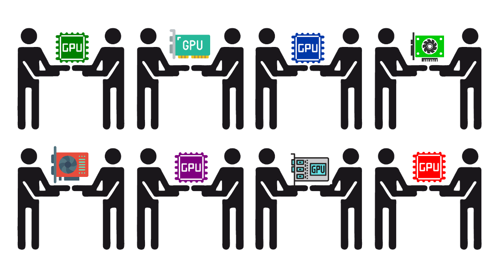
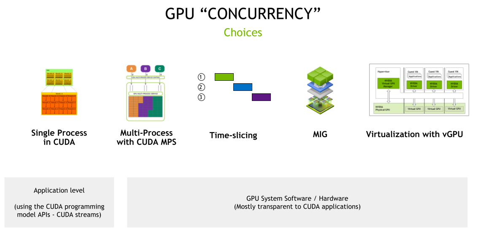

# 探索 Nvidia GPU 共享的機制

原文: [Improving GPU Utilization in Kubernetes](https://developer.nvidia.com/blog/improving-gpu-utilization-in-kubernetes/)



## 背景

為了實現可擴展的數據中心性能，NVIDIA GPU 已成為重要的運算資源。

NVIDIA GPU 由數千個計算核心支持的並行處理能力對加速許多人工智能的應用至關重要。目前，跨多個行業的計算密集型應用程序使用 GPU:

- 高性能計算，如航空航天、生物科學研究或天氣預報
- 使用 AI 改進搜索、推薦、語言翻譯或交通（如自動駕駛）的消費者應用程序
- 醫療保健，如增強型醫療成像
- 財務，如欺詐檢測
- 娛樂，如視覺效果

不同應用程序可能有不同的計算要求。訓練巨型人工智能模型，其中 GPU 批處理並行處理數百個數據樣本，使 GPU 在訓練過程中得到充分利用。然而，許多其他應用程序類型可能只需要 GPU 計算的一小部分，從而導致大量計算能力的利用率低下。

在這種情況下，{==為每個工作負載提供適當大小的 GPU 加速是提高利用率和降低部署運營成本的關鍵==}，無論是在地端還是在雲端。

為了解決 GPU 利用率的挑戰，NVIDIA 提供了多種 GPU 併發和共享機制，以適應廣泛的用例。本文說明了一些關於共享 GPU 的用例的背景知識，並概述了相關可用的技術。

## 共享 NVIDIA GPU 的情境

以下是共享 GPU 資源以提高利用率的一些示例工作負載:

- **低批量推理服務**，它只能在 GPU 上處理一個輸入樣本
- **高性能計算 (HPC) 應用**，例如模擬光子傳播，在 CPU (讀取和處理輸入) 和 GPU (執行計算) 之間平衡計算。由於 CPU 核心性能的瓶頸，一些 HPC 應用程序可能無法在 GPU 部分實現高吞吐量。
- **ML 模型探索的交互式開發**，例如使用 Jupyter notebook
- **基於 Spark 的數據分析應用程序**，其中一些任務或最小的工作單元同時運行，並受益於更好的 GPU 利用率
- **可視化或脫機渲染應用程序**，這可能是突發性的
- 希望使用任何可用的 GPU 進行測試的 **連續集成/連續交付 (CICD) 管道**

在本文中，我們將探討在 Kubernetes 集群中共享 NVIDIA GPU 的各種技術，包括如何使用這些技術以及在選擇正確方法時需要考慮的權衡。

## GPU 併發機制

NVIDIA GPU 硬件結合 CUDA 編程模型，提供了許多不同的併發機制，以提高 GPU 的利用率。這些機制包括從編程模型 API （應用程序需要更改代碼以利用併發）到系統軟件和硬件分區（包括虛擬化），這對應用程序是透明的。


<figure markdown>
  
  <figcaption>GPU 併發機制</figcaption>
</figure>

### CUDA streams

CUDA 的異步模型意味著您可以使用 CUDA stream，通過單個 CUDA 上下文（類似於 GPU 端的主機進程）並發執行許多操作。

`stream` 是一種軟件抽象，它表示一系列命令，這些命令可能是按順序執行的計算內核、內存拷貝等的組合。在兩個不同流中啟動的工作可以同時執行。應用程序可以使用 CUDA streams 和 [stream priorities](https://docs.nvidia.com/cuda/cuda-runtime-api/group__CUDART__STREAM.html) 來管理併行性。

CUDA streams 最大限度地提高推理服務的 GPU 利用率，例如，通過使用流並行運行多個模型。您要么擴展相同的模型，要么為不同的模型提供服務。有關詳細信息，請參閱[Asynchronous Concurrent Execution](https://docs.nvidia.com/cuda/cuda-c-programming-guide/index.html#asynchronous-concurrent-execution)。

使用 CUDA streams 的考量是這些 API 只能在{==單個應用程序==}中使用，因此提供有限的硬件隔離，因為所有資源都是共享的，但是它支援在各個 stream 之間的錯誤隔離。

### Time-slicing

在處理多個 CUDA 應用程序時，每個應用程序都可能沒有充分利用 GPU 的資源，您可以使用簡單的 {==超額訂閱策略==} 來利用 GPU 的時間切片調度器。這種技術有時被稱為 temporal GPU sharing，雖然在不同的 CUDA 應用程序之間切換上下文確實會帶來成本開銷，但一些未充分利用 GPU 的應用程序仍然可以從該策略中受益。

從 CUDA 11.1 (R455+驅動程序) 起，CUDA 應用程序的 time-slice duration 可通過 `nvidia-smi` 工具程序來進行設定:

```bash
$ nvidia-smi compute-policy --help

    Compute Policy -- Control and list compute policies.

    Usage: nvidia-smi compute-policy [options]

    Options include:
    [-i | --id]: GPU device ID's. Provide comma
                 separated values for more than one device

    [-l | --list]: List all compute policies

    [ | --set-timeslice]: Set timeslice config for a GPU:
                          0=DEFAULT, 1=SHORT, 2=MEDIUM, 3=LONG

    [-h | --help]: Display help information
```

當許多不同的應用程序在 GPU 上進行 time-slicing 時，time-slicing 會增加延遲、抖動和潛在的內存不足 (OOM) 情況。GPU Time-slicing 機制是我們在另一篇[提高 Kubernetes 的 GPU 利用率- Time Slicing](./improving-gpu-utilization-in-kubernetes.md)會重點關注並驗證。

### CUDA Multi-Process Service

您可以進一步使用前面描述的超額預訂策略來應用在 CUDA MPS。當每個進程太小而無法使 GPU 的計算資源飽和時，MPS 允許來自不同進程 (通常是 MPI ranks) 的 CUDA 內核在 GPU 上併發處理。與 time-slicing 不同的是 MPS 允許來自不同進程的 CUDA 內核在 GPU 上並行執行。

使用 MPS 需要考量的是它對錯誤隔離、內存保護和服務質量(QoS)的限制。因為 GPU 硬件資源仍由所有 MPS 客戶端共享。

### Multi-instance GPU (MIG)

迄今為止討論的機制要么依賴於使用 CUDA 編程模型 API (如 CUDA streams) 對應用程序進行修改，要麼依賴於 CUDA 系統軟件 (如 time-slicing 或 MPS)。

**MIG** 可應用於 NVIDIA Ampere Architecture 的 GPU，例如 NVIDIA A100。

通過 MIG 可以為 CUDA 應用程序安全劃分多達 **七** 個獨立的 GPU 實例，為多個應用程序提供專用的 GPU 資源。這些包括 streaming multiprocessors (SMs) 和 GPU 引擎，MIG 可為不同的客戶端 (如進程、容器或虛擬機) 提供定義的 QoS 和故障隔離。

當對 GPU 進行分區時，可以在單個 MIG 實例中使用之前提到的 CUDA streams、CUDA MPS 和 Time-slicing 機制。

有關更多信息，請參閱 [MIG 用戶指南](https://docs.nvidia.com/datacenter/tesla/mig-user-guide/) 和 [MIG Support in Kubernetes](https://docs.nvidia.com/datacenter/cloud-native/kubernetes/mig-k8s.html)。

### Virtualization with vGPU

NVIDIA vGPU 使具有完全輸入輸出內存管理單元 (IOMMU) 保護的虛擬機能夠同時直接訪問單個物理 GPU。除了安全性之外，NVIDIA vGPU 還帶來了其他好處，比如通過實時虛擬機遷移進行虛擬機管理，能夠運行混合的 VDI 和計算工作負載，以及與許多虛擬機監控程序的集成。

在支持 MIG 的 GPU 上，每個 GPU 分區都可作為 VM 的單根 I/O 虛擬化 (SR-IOV) 虛擬功能來公開。所有虛擬機都可以並行運行，而不是分時間運行 (在不支持 MIG 的 GPU 上)。

!!! info
    要使用 vGPU 的手法來進行 GPU 共享需要 NVIDIA 資料中心等級的 GPU 與虛擬化 GPU 軟體授權。

    硬體:

      - vGPU 認證伺服器: https://www.nvidia.com/zh-tw/data-center/resources/vgpu-certified-servers/

    軟體:

      - NVIDIA 虛擬化 GPU 解決方案: https://www.nvidia.com/zh-tw/data-center/buy-grid/

下表整理了上述相關的 GPU sharing 技術，包括採用這些併發機制、考慮因子與場景。

|    |Streams	|MPS	|Time-Slicing	|MIG	|vGPU|
|----|--------|-----|-------------|-----|----|
|分割類型|Single process	|Logical	|Temporal (Single process)	|Physical	|Temporal & Physical – VMs|
|最大分割數|Unlimited	|48	|Unlimited	|7	|Variable|
|SM 性能隔離|No	|Yes (by percentage, not partitioning)	|Yes	|Yes	|Yes|
|記憶體保護|No	|Yes	|Yes	|Yes	|Yes|
|記憶體帶寬 QoS|No	|No	|No	|Yes	|Yes|
|錯誤隔離|No	|No	|Yes	|Yes	|Yes|
|跨分割交互|Interop	|Always	|IPC	|Limited IPC	|Limited IPC	|No|
|重新配置|Dynamic	|At process launch	|N/A	|When idle	|N/A|
|GPU 管理(telemetry)|N/A	|Limited GPU metrics	|N/A	|Yes – GPU metrics, support for containers	|Yes – live migration and other industry virtualization tools|
|使用情境|優化單個應用程序中的並發性<br/><br/>Optimize for concurrency within a single application|並行運行多個應用程序，但可以處理有限的彈性<br/><br/>Run multiple applications in parallel but can deal with limited resiliency|運行多個對延遲不敏感或可以容忍抖動的應用程序<br/><br/>Run multiple applications that are not latency-sensitive or can tolerate jitter	|並行運行多個應用程序但需要彈性和 QoS<br/><br/>Run multiple applications in parallel but need resiliency and QoS	|通過虛擬化支持 GPU 上的多租戶並需要 VM 管理優勢<br/><br/>Support multi-tenancy on the GPU through virtualization and need VM management benefits|