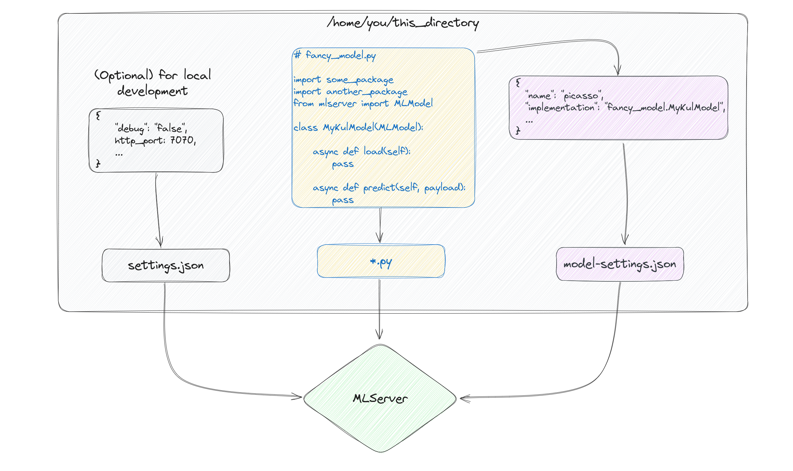
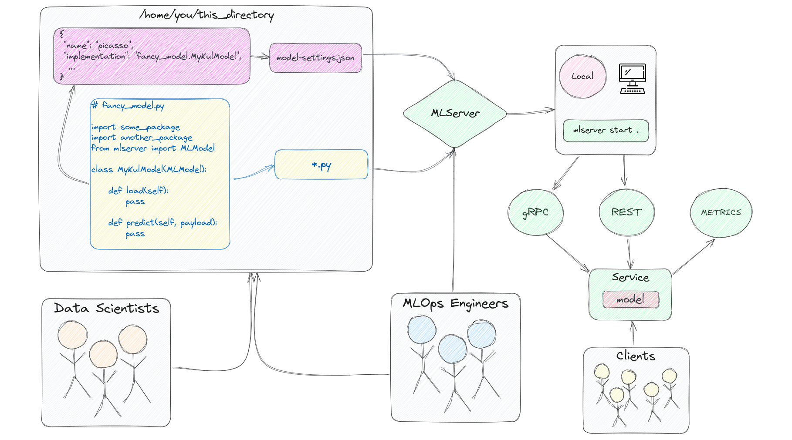
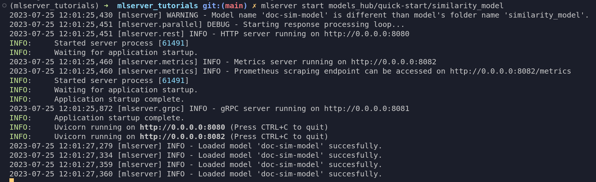
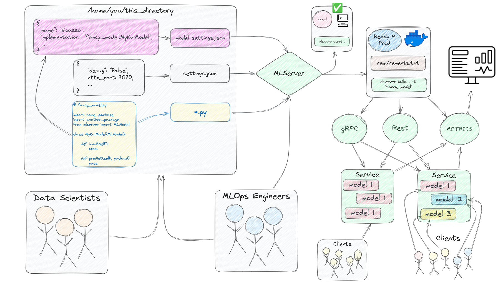

# MLServer 入門

本指南將協助您在 30 分鐘內開始使用 MLServer 建立機器學習微服務。我們的用例是建立一項服務來幫助我們比較兩個文件之間的相似性。想一想，每當您比較接下來要閱讀的書籍、新聞文章、部落格文章或教學時，如果有一種方法可以與您已經閱讀和喜歡的類似內容進行比較（而無需依賴推薦系統）？這就是本指南的重點，即建立文件相似性服務。

程式碼的顯示方式就好像筆記本中的單元格一樣，但您可以輕鬆地在 Python 文件中運行每個步驟。

## 什麼是 MLServer?

MLServer 是一個開源 Python 函式庫，用於為機器學習模型建立生產就緒的非同步 API。

## 依賴函式庫

第一步是安裝 ``mlserver`, `spacy` 函式庫以及我們的用例所需的 [spacy 語言模型](https://spacy.io/models/en#en_core_web_lg)。我們還將下載 `wikipedia-api` 庫，透過一些有趣的摘要來測試我們的用例。

如果您以前從未聽說過 [spaCy](https://spacy.io/)，它是一個用於高級自然語言處理的開源 Python 庫，擅長大規模資訊提取和檢索任務等。我們將使用的模型是針對網路英語文本進行預先訓練的模型。與必須為用例從頭開始訓練模型相比，該模型將幫助我們更快地開始使用用例。

我們首先安裝這些函式庫。

```bash
pip install mlserver spacy wikipedia-api
```

一旦我們的虛擬環境中有 spaCy，我們還需要單獨下載語言模型。

```bash
python -m spacy download en_core_web_lg
```

如果您要在筆記本中查看本指南，請不要忘記添加感嘆號！在上面兩個指令的前面。如果您在 VSCode 中，則可以保持它們不變並將儲存格類型變更為 bash。

## 設定



從本質上講，MLServer 要求用戶提供 3 件事：

- 一個包含模型資訊的 `model-settings.json` 文件
- 一個（可選）`settings.json` 文件，其中包含與您要設定的伺服器相關的信息
- 一個 `.py` 文件，其中包含模型載入其預測方法的手法

讓我們為我們的模型建立一個目錄。

```bash
mkdir -p similarity_model
```

在創建允許我們比較兩個文件之間相似性的服務之前，最好先測試我們的解決方案是否有效，特別是如果我們使用預先訓練的模型和/或管道。

```python
import spacy

nlp = spacy.load("en_core_web_lg")
```

現在我們已經載入了模型，讓我們使用 `wikipedia-api` Python 函式庫來看看 [Barbieheimer](https://en.wikipedia.org/wiki/Barbenheimer) 摘要的相似性。 API 的主要要求是我們傳入主類別 Wikipedia()、項目名稱、電子郵件和我們想要返回資訊的語言。 () 方法並使用 `.summary` 屬性存取其摘要。

請隨意將電影更改為您可能感興趣的其他主題。

您可以在筆記本中運行以下行，或者相反，將它們添加到 `app.py` 檔案中。

```python
import wikipediaapi

wiki_wiki = wikipediaapi.Wikipedia('MyMovieEval (example@example.com)', 'en')

barbie = wiki_wiki.page('Barbie_(film)').summary

oppenheimer = wiki_wiki.page('Oppenheimer_(film)').summary

print(barbie)
print()
print(oppenheimer)
```

如果您使用上面的程式碼建立了 `app.py` 文件，請確保從終端機執行 `python app.py`。

```bash
Barbie is a 2023 American fantasy comedy film directed by Greta Gerwig and written by Gerwig and Noah Baumbach. Based on the Barbie fashion dolls by Mattel, it is the first live-action Barbie film after numerous computer-animated direct-to-video and streaming television films. The film stars Margot Robbie as Barbie and Ryan Gosling as Ken, and follows the two on a journey of self-discovery following an existential crisis. The film also features an ensemble cast that includes America Ferrera, Kate McKinnon, Issa Rae, Rhea Perlman, and Will Ferrell...

Oppenheimer is a 2023 biographical thriller film written and directed by Christopher Nolan. Based on the 2005 biography American Prometheus by Kai Bird and Martin J. Sherwin, the film chronicles the life of J. Robert Oppenheimer, a theoretical physicist who was pivotal in developing the first nuclear weapons as part of the Manhattan Project, and thereby ushering in the Atomic Age. Cillian Murphy stars as Oppenheimer, with Emily Blunt as Oppenheimer's wife Katherine "Kitty" Oppenheimer; Matt Damon as General Leslie Groves, director of the Manhattan Project; and Robert Downey Jr. as Lewis Strauss, a senior member of the United States Atomic Energy Commission. The ensemble supporting cast includes Florence Pugh, Josh Hartnett, Casey Affleck, Rami Malek, Gary Oldman and Kenneth Branagh...
```

現在我們有了兩個摘要，讓我們使用 spacy 來比較它們。

```python
doc1 = nlp(barbie)
doc2 = nlp(oppenheimer)

print(doc1.similarity(doc2))
```

結果:

```bash
0.9866910567224084
```

請注意，兩個摘要都包含有關另一部電影的資訊、有關「電影」的一般資訊以及每個播放日期的資訊（相同）。現實情況是，該模型沒有看過任何這些電影，因此它可能會概括為每篇文章的上下文“電影”，而不是其內容“娃娃作為人類和原子彈”。

當然，您應該嘗試不同的頁面，看看您得到的結果是否與您期望的一致。

是時候為我們的用例建立機器學習 API 了。 😎

## 建立服務

MLServer 允許我們將機器學習模型包裝到 API 中，並使用單一模型或不同模型的副本建立微服務。

要使用 MLServer 建立服務，我們將定義一個具有兩個非同步函數的類別，一個用於載入模型，另一個用於運行推理（或預測）。前者將載入我們在上一節中測試的 spacy 模型，後者將取得包含我們要比較的兩個文件的清單。最後，我們的函數將傳回一個帶有單一值的 `numpy` 陣列，即我們的相似度分數。我們將該檔案寫入相似度模型目錄並將其命名為 `my_model.py`。

```python title="similarity_model/my_model.py"
# similarity_model/my_model.py

from mlserver.codecs import decode_args
from mlserver import MLModel
from typing import List
import numpy as np
import spacy

class MyKulModel(MLModel):

    async def load(self):
        self.model = spacy.load("en_core_web_lg")

    @decode_args
    async def predict(self, docs: List[str]) -> np.ndarray:

        doc1 = self.model(docs[0])
        doc2 = self.model(docs[1])

        return np.array(doc1.similarity(doc2))
```

現在我們已經準備好了模型文件，最後一個難題是告訴 MLServer 一些有關它的資訊。特別是，它想要（或需要）知道模型的名稱以及如何實現它。前者可以是您想要的任何內容（它將成為 API URL 的一部分），後者將遵循 `name_of_py_file_with_your_model.class_with_your_model` 的配方。

讓我們在相似度模型目錄中建立 MLServer 期望的 `model-settings.json` 文件，並在其中加入模型的名稱和實作。

```json title="similarity_model/model-settings.json"
{
    "name": "doc-sim-model",
    "implementation": "my_model.MyKulModel"
}
```

現在一切都已就緒，我們可以開始在本地提供預測，以測試未來用戶的情況如何。我們將透過命令列啟動伺服器，稍後我們將了解如何透過 Python 檔案執行相同的操作。這就是我們現在使用 MLServer 開發微服務的過程。



如圖所示，我們的伺服器將使用三個入口點進行初始化，一個用於 HTTP 請求，另一個用於 gRPC，另一個用於指標。要了解有關 MLServer 強大指標功能的更多信息，請訪問[此處](https://mlserver.readthedocs.io/en/latest/user-guide/metrics.html)的相關文件頁面。要了解有關 gRPC 的更多信息，請參閱[此處](https://realpython.com/python-microservices-grpc/)的本教程。

要啟動我們的服務，請打開終端機並執行以下命令。

```bash
mlserver start similarity_model/
```

注意：如果這是一個新終端，請確保在運行上述命令之前啟動您的環境。如果您從筆記本運行上面的命令（例如！mlserver start相似性_模型/），您將必須從另一個筆記本或終端發送下方的請求，因為單元將繼續運行，直到您將其關閉。

## 測試服務

是時候成為我們服務的客戶並測試它了。為此，我們將設定發送到服務的有效負載，並使用請求庫來發布我們的請求。

```python
from mlserver.codecs import StringCodec
import requests
```

請注意，以下的請求使用了我們先前根據 Barbie 和 Oppenheimer 的摘要建立的變數。如果您從新的 python 檔案發送此 POST 請求，請確保將上面的這些程式碼行移至請求檔案中。

```python title="app_infer.py"
inference_request = {
    "inputs": [
        StringCodec.encode_input(name='docs', payload=[barbie, oppenheimer], use_bytes=False).model_dump()
    ]
}

print(inference_request)
```

結果:

```json
{'inputs': [{'name': 'docs',
   'shape': [2, 1],
   'datatype': 'BYTES',
   'parameters': {'content_type': 'str'},
   'data': [
        'Barbie is a 2023 American fantasy comedy...',
        'Oppenheimer is a 2023 biographical thriller...'
        ]
    }]
}
```

接下來讓我們來呼叫 API:

```python
r = requests.post('http://0.0.0.0:8080/v2/models/doc-sim-model/infer', json=inference_request)

print(r.json())
```

結果:

```json
{'model_name': 'doc-sim-model',
    'id': 'a4665ddb-1868-4523-bd00-a25902d9b124',
    'parameters': {},
    'outputs': [{'name': 'output-0',
    'shape': [1],
    'datatype': 'FP64',
    'parameters': {'content_type': 'np'},
    'data': [0.9866910567224084]}]}

```

打印最後的比對的結果:

```python
print(f"Our movies are {round(r.json()['outputs'][0]['data'][0] * 100, 4)}% similar!")
```

結果:

```bash
Our movies are 98.6691% similar
```

讓我們分解一下剛剛發生的事情。

如果您從未聽說過 [V2/Open Inference Protocol (OIP)](https://mlserver.readthedocs.io/en/latest/getting-started/index.html#:~:text=V2/Open%20Inference%20Protocol%20(OIP))，我們服務的 URL 可能看起來有點奇怪。該協定是一組規範，允許以標準化方式共享和部署機器學習模型。該協議允許在各種平台和設備上使用機器學習模型，而無需更改模型或其程式碼。 OIP 很有用，因為它允許我們以標準方式將機器學習整合到廣泛的應用程式中。

該協定是一組規範，允許以標準化方式共享和部署機器學習模型。該協議允許在各種平台和設備上使用機器學習模型，而無需更改模型或其程式碼。 OIP 很有用，因為它允許我們以標準方式將機器學習整合到廣泛的應用程式中。

您使用 MLServer 建立的所有 URL 將具有以下結構。


這種協議是 NVIDIA, Tensorflow Serving, KServe 等不同公司採用的標準，以使每個人都達成共識。如果您考慮在全球範圍內駕駛汽車，您所在的國家/地區必須應用在道路特定一側行駛的標準，這可以確保您和其他人保持在左側（或右側，具體取決於您所在的位置）。採用這一點意味著，當您開車並準備轉彎時，您不必擔心下一個司機將從哪裡出來，而是可以專注於到達您要去的地方，而不必擔心。

讓我們來描述一下 **inference_request** 的每個元件的作用。

- `name`: 這將一對一映射到 `predict()` 函數中的參數名稱。
- `shape`: 代表我們資料中元素的形狀。在我們的例子中，它是一個包含 [2] string 的清單。
- `datatype`: 伺服器期望的不同資料類型，例如 str, numpy array, pandas dataframe, bytes, 等。
- `parameters`: 允許我們指定資料類型以外的 `content_type`
- `data`: 我們的預測函數的輸入。

要了解有關 OIP 以及 MLServer 內容類型如何運作的更多信息，請在此處查看他們的[文件頁面](https://mlserver.readthedocs.io/en/latest/user-guide/content-type.html)。

## 建立模型副本

假設您需要滿足大量使用者的需求，而一種模型可能還不夠，或者沒有使用分配給它的虛擬機器實例的所有資源。在這種情況下，我們可以做的是建立模型的多個副本，以增加傳入請求的吞吐量。為此，我們需要透過 `settings.json` 檔案調整伺服器的設定。在其中，我們將向參數 `parallel_workers`添加我們想要的獨立模型的數量：`3`。

讓我們停止我們的伺服器，更改它的設置，再次啟動它，然後測試它。

```json title="settings.json"
{
    "parallel_workers": 3
}
```



正如您在上圖中終端的輸出中看到的，我們現在有 `3` 個模型並行運行。您可能會看到 `4` 的原因是，預設情況下，MLServer 將打印初始化模型的名稱（如果它是一個或多個），並且還會為設定中指定的每個副本列印名稱。

讓我們再取得一些[雙胞胎電影](https://en.wikipedia.org/wiki/Twin_films)範例來測試我們的伺服器。隨心所欲發揮創意。 💡

```python
deep_impact    = wiki_wiki.page('Deep_Impact_(film)').summary
armageddon     = wiki_wiki.page('Armageddon_(1998_film)').summary

antz           = wiki_wiki.page('Antz').summary
a_bugs_life    = wiki_wiki.page("A_Bug's_Life").summary

the_dark_night = wiki_wiki.page('The_Dark_Knight').summary
mamma_mia      = wiki_wiki.page('Mamma_Mia!_(film)').summary

def get_sim_score(movie1, movie2):
    response = requests.post(
        'http://0.0.0.0:8080/v2/models/doc-sim-model/infer',
        json={
            "inputs": [
                StringCodec.encode_input(name='docs', payload=[movie1, movie2], use_bytes=False).model_dump()
            ]
        })
    return response.json()['outputs'][0]['data'][0]
```

我們首先測試該函數是否按預期工作。

```python
get_sim_score(deep_impact, armageddon)
```

結果:

```bash
0.9569279450151813
```

現在讓我們同時對應三個 POST 請求。

```python
results = list(
    map(get_sim_score, (deep_impact, antz, the_dark_night), (armageddon, a_bugs_life, mamma_mia))
)

print(results)
```

結果:

```bash
[0.9569279450151813, 0.9725374771538605, 0.9626173937217876]
```

我們也可以一一測試。

```python
for movie1, movie2 in zip((deep_impact, antz, the_dark_night), (armageddon, a_bugs_life, mamma_mia)):
    print(get_sim_score(movie1, movie2))
```

結果:

```bash
0.9569279450151813
0.9725374771538605
0.9626173937217876
```

## 服務打包



對於本指南的最後一步，我們將把我們的模型和服務打包到一個 Docker 映像中，我們可以在另一個專案中重複使用該映像或立即與同事共用。此步驟要求我們在 PC 中安裝並設定 docker，因此如果您需要設定 docker，可以按照此處文件中的說明進行操作。

第一步是建立一個包含所有依賴項的 `requirements.txt` 文件，並將其新增至我們用於服務的目錄 `(similarity_model)`。

```txt title="similarity_model/requirements.txt"
mlserver
spacy==3.6.0
https://github.com/explosion/spacy-models/releases/download/en_core_web_lg-3.6.0/en_core_web_lg-3.6.0-py3-none-any.whl
```

下一步是使用我們的模型、其依賴項和我們的伺服器來建立 Docker 映像。

MLServer 有一個方便的功能，可以讓我們使用我們的服務建立 docker 映像。讓我們使用它。

```bash
mlserver build similarity_model/ -t 'fancy_ml_service'
```

我們不僅可以透過查看上一個命令的日誌，還可以使用 docker images 命令來檢查我們的映像是否已成功建置。

```bash
docker images
```

讓我們使用以下命令測試我們的容器鏡像是否按預期工作。確保您已在終端機中使用 `CTRL + C` 關閉了先前的伺服器。

```bash
docker run -it --rm -p 8080:8080 fancy_ml_service
```

現在您已經擁有了帶有我們模型的打包且功能齊全的微服務，我們可以將容器部署到像Seldon Core 這樣的生產服務平台，或者透過許多雲端供應商提供的不同產品（例如AWS Lambda、Google Cloud Run、 ETC。您也可以在 KServe（一種用於模型服務的 Kubernetes 本機工具）上執行此映像，或在您可以隨身攜帶 docker 映像的任何其他地方執行此映像。

要了解有關 MLServer 以及使用它的不同方式的更多信息，請參閱[範例](https://mlserver.readthedocs.io/en/latest/examples/index.html)部分或[使用者指南](https://mlserver.readthedocs.io/en/latest/user-guide/index.html)。若要了解一些可用的部署選項，請造訪[此處](https://mlserver.readthedocs.io/en/stable/user-guide/deployment/index.html)的文件。