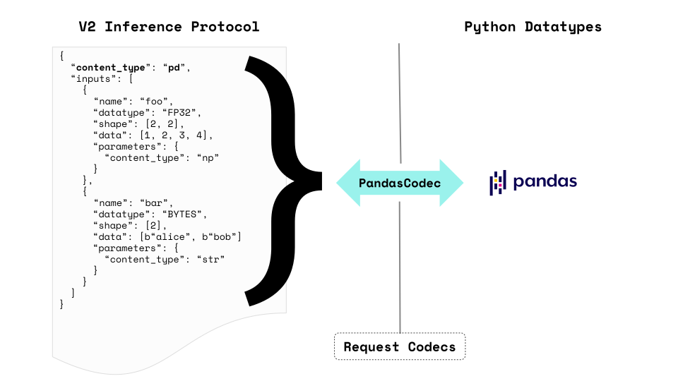
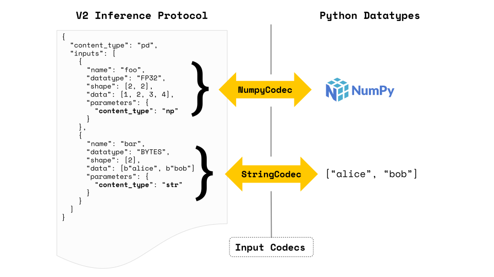

# Content Types 與 Codecs

機器學習模型通常期望它們的輸入會作為特定的 Python 類型傳遞下來。最常見的是，這種類型的範圍從通用的 `NumPy array` 或 `Pandas DataFrame` 到更精細的定義，例如日期時間物件、Pillow 影像等。不幸的是，V2 Inference Protocol 的定義並未涵蓋任何特定用例。該協定可以被認為是更廣泛的 “lower level” 規範，它僅定義有效負載應具有哪些欄位。

為了彌補這一差距，MLServer 引入了對 **content types** 的支持，這提供了一種方法讓 MLServer 知道它應該如何解碼(decode) V2-compatible payloads。當以正確的方式形成時，這些有效負載應該編碼(encode)提取模型所需的更高層級 Python 類型所需的所有資訊。

為了說明上述內容，我們可以考慮一個 Scikit-Learn 管道，它接收 `Pandas DataFrame` 並傳回 `NumPy array`。如果不使用 **content types** V2 payload 本身可能會缺乏有關 MLServer 應如何處理此 payload 的資訊。在這種情況下，內容類型的使用允許我們指定有關 V2 協定有效負載中編碼的實際 “higher level” 資訊的資訊。


## 用法

為了讓 MLServer 知道特定的 payload 必須被解碼/編碼為不同的 Python 資料類型（例如 `NumPy Array`, `Pandas DataFrame` 等），您可以透過請求的參數部分的 `content_type` 欄位來指定它。

作為範例，我們可以考慮以下資料框，其中包含兩列：Age 和 First Name。

|First Name|Age|
|----------|---|
|Joanne|34|
|Michael|22|

該表可以在 V2 協定中指定為以下有效負載，我們在其中聲明：

- 整個輸入集應解碼為 `Pandas Dataframe`（即將內容類型設定為 `pd`）。
- `First Name` 欄位應解碼為 UTF-8 字串（即將內容類型設為 `str`）。

```json
{
  "parameters": {
    "content_type": "pd"
  },
  "inputs": [
    {
      "name": "First Name",
      "datatype": "BYTES",
      "parameters": {
        "content_type": "str"
      },
      "shape": [2],
      "data": ["Joanne", "Michael"]
    },
    {
      "name": "Age",
      "datatype": "INT32",
      "shape": [2],
      "data": [34, 22]
    },
  ]
}
```

要了解有關可用內容類型以及如何使用它們的更多信息，您可以在下面的可用內容類型部分中查看所有[可用內容類型](https://mlserver.readthedocs.io/en/latest/user-guide/content-type.html#available-content-types)。

!!! info
    請務必記住，可以在 request level 和 input level 指定 content types。前者將應用於整個輸入集，而後者將僅應用於有效負載的特定輸入。


### Codecs

在背後，content type 之間的轉換是使用編解碼器(codecs)實現的。在 MLServer 架構中，編解碼器是一個抽象，它知道如何在 V2 推理協定之間對高階 Python 類型進行編碼和解碼。

根據進階 Python 類型，編碼/解碼操作可能需要存取多個輸入或輸出。例如，Pandas dataframe 需要聚合 V2 推理協定回應中存在的所有輸入/輸出。



但是，Numpy 陣列或字串清單可以直接編碼為較大請求中的輸入。



考慮到這一點，編解碼器可以在請求/回應層級（稱為請求編解碼器）或輸入/輸出層級（稱為輸入編解碼器）工作。這些編解碼器中的每一個都公開以下公共接口，其中 Any 表示高級 Python 資料類型（例如 Pandas Dataframe、Numpy Array 等）：

- Request Codecs
    - encode_request()
    - decode_request()
    - encode_response()
    - decode_response()

- Input Codecs
    - encode_input()
    - decode_input()
    - encode_output()
    - decode_output()

請注意，這些方法也可以用作在客戶端對請求進行編碼和對回應進行解碼的幫助程序。這有助於從使用者中抽像出有關 V2 相容有效負載底層結構的大部分細節。

例如，在上面的範例中，我們可以使用編解碼器將 DataFrame 編碼為 V2 相容的請求，如下所示：

```python
import pandas as pd

from mlserver.codecs import PandasCodec

dataframe = pd.DataFrame({'First Name': ["Joanne", "Michael"], 'Age': [34, 22]})

inference_request = PandasCodec.encode_request(dataframe)

print(inference_request)
```

有關內容類型和編解碼器如何在背景工作的完整端到端範例，請隨時查看此內[容類型解碼範例](https://mlserver.readthedocs.io/en/latest/examples/content-type/README.html)。

#### 轉換 to/from JSON

使用 MLServer 的請求編解碼器時，編碼有效負載的輸出將始終是 `mlserver.types` 套件中的類別之一（即 [InferenceRequest](https://mlserver.readthedocs.io/en/latest/reference/api/types.html#mlserver.types.InferenceRequest) 或 [InferenceResponse](https://mlserver.readthedocs.io/en/latest/reference/api/types.html#mlserver.types.InferenceResponse)）。因此，如果您想將它們與 `requests`（或 MLServer 以外的其他套件）一起使用，您需要將它們轉換為 Python 字典或 JSON 字串。

幸運的是，這些類別在底層利用了 [Pydantic](https://docs.pydantic.dev/latest/)。因此，您可以呼叫 `.model_dump()` 或 `.model_dump_json()` 方法來轉換它們。

例如，如果我們想向模型 foo 發送推理請求，我們可以按照以下方式執行操作：

```python
import pandas as pd
import requests

from mlserver.codecs import PandasCodec

dataframe = pd.DataFrame({'First Name': ["Joanne", "Michael"], 'Age': [34, 22]})

inference_request = PandasCodec.encode_request(dataframe)

# raw_request will be a Python dictionary compatible with `requests`'s `json` kwarg
raw_request = inference_request.dict()

response = requests.post("localhost:8080/v2/models/foo/infer", json=raw_request)

# raw_response will be a dictionary (loaded from the response's JSON),
# therefore we can pass it as the InferenceResponse constructors' kwargs
raw_response = response.json()

inference_response = InferenceResponse(**raw_response)
```

#### 支持 NaN values

NaN（非數字）值在 Numpy 和其他科學庫中用於描述無效或缺失值（例如除以零）。在某些情況下，可能需要讓模型接收和/或輸出 NaN 值（例如，這些值有時對於 GBT 很有用，例如 XGBoost 模型）。這就是為什麼 MLServer 在某些情況下支援在請求/回應負載上編碼 NaN 值。

為了發送/接收 NaN 值，您必須確保：

- 您正在使用 REST 介面。
- 包含 NaN 值的輸入/輸出條目使用 `FP16`, `FP32` 或 `FP64` 資料類型。
- 您正在使用 [Pandas codec](https://mlserver.readthedocs.io/en/latest/user-guide/content-type.html#pandas-dataframe) 或 [Numpy codec](https://mlserver.readthedocs.io/en/latest/user-guide/content-type.html#numpy-array)。

假設滿足這些條件，tensor payload 中的任何空值都會轉換為 NaN。

例如，如果您採用以下 Numpy 陣列：

```python
import numpy as np

foo = np.array([[1.2, 2.3], [np.NaN, 4.5]])


from mlserver.codecs import NumpyCodec

inference_request = {
    "inputs": [
        NumpyCodec.encode_input(name="foo", payload=foo).model_dump()
    ]
}

print(inference_request)
```

我們可以將其編碼為：

```json
{
  "inputs": [
    {
      "name": "foo",
      "parameters": {
        "content_type": "np"
      },
      "data": [1.2, 2.3, null, 4.5]
      "datatype": "FP64",
      "shape": [2, 2],
    }
  ]
}
```

### Model Metadata

內容類型(Content types)也可以定義為[模型元資料](https://mlserver.readthedocs.io/en/latest/reference/model-settings.html)的一部分。這使用戶可以預先配置模型預設使用哪些內容類型來解碼/編碼其請求/回應，而無需在每個請求上指定它。

例如，要配置上面範例的內容類型值，可以建立一個 `model-settings.json` 文件，如下所示：

```json title="model-settings.json"
{
  "parameters": {
    "content_type": "pd"
  },
  "inputs": [
    {
      "name": "First Name",
      "datatype": "BYTES",
      "parameters": {
        "content_type": "str"
      },
      "shape": [-1],
    },
    {
      "name": "Age",
      "datatype": "INT32",
      "shape": [-1],
    },
  ]
}
```

請務必記住，作為請求的一部分明確傳遞的內容類型將始終優先於模型的元資料。因此，我們可以在需要時利用它來覆蓋模型的元資料。

## 可用的內容類型

MLServer 開箱即用，支援以下內容類型清單。但是，這可以透過使用第三方或自訂運行時來擴展。

|Python Type|Content Type|Request Level|Request Codec|Input Level|Input Codec|
|-----------|------------|-------------|-------------|-----------|-----------|
|[NumPy Array](https://mlserver.readthedocs.io/en/latest/user-guide/content-type.html#numpy-array)|`np`|✅|`mlserver.codecs.NumpyRequestCodec`|✅|`mlserver.codecs.NumpyCodec`|
|[Pandas DataFrame](https://mlserver.readthedocs.io/en/latest/user-guide/content-type.html#pandas-dataframe)|`pd`|✅|`mlserver.codecs.PandasCodec`|❌||
|[UTF-8 String](https://mlserver.readthedocs.io/en/latest/user-guide/content-type.html#utf-8-string)|`str`|✅|`mlserver.codecs.string.StringRequestCodec`|✅|`mlserver.codecs.StringCodec`|
|[Base64](https://mlserver.readthedocs.io/en/latest/user-guide/content-type.html#base64)|`base64`|❌||✅|`mlserver.codecs.Base64Codec`|
|[Datetime](https://mlserver.readthedocs.io/en/latest/user-guide/content-type.html#datetime)|``datetime`|❌||✅|`mlserver.codecs.DatetimeCodec`|

### NumPy Array

!!! info
     V2 Inference Protocol 期望每個輸入的資料作為lat array 發送。因此， `np` 內容類型將期望張量被展平(flatten)發送。然後，`shape` 欄位中的信息將用於將 tensor 重塑為正確的維度。

np 內容類型會將 V2 有效負載解碼/編碼為 NumPy 數組，同時考慮以下因素：

- The `datatype` field will be matched to the closest NumPy `dtype`.
- The `shape` field will be used to reshape the flattened array expected by the V2 protocol into the expected tensor shape.

例如，如果我們考慮以下 NumPy 陣列：

```python
import numpy as np

foo = np.array([[1, 2], [3, 4]])
```

我們可以將其編碼為 V2 協定請求中的輸入 foo：

=== "JSON payload"

    ```json
    {
    "inputs": [
        {
        "name": "foo",
        "parameters": {
            "content_type": "np"
        },
        "data": [1, 2, 3, 4]
        "datatype": "INT32",
        "shape": [2, 2],
        }
    ]
    }
    ```

=== "Numpy Request Codec"

    ```python
    from mlserver.codecs import NumpyRequestCodec

    # Encode an entire V2 request
    inference_request = NumpyRequestCodec.encode_request(foo)
    ```

=== "NumPy Input Codec"

    ```python
    from mlserver.types import InferenceRequest
    from mlserver.codecs import NumpyCodec

    # We can use the `NumpyCodec` to encode a single input head with name `foo`
    # within a larger request
    inference_request = InferenceRequest(
        inputs=[
            NumpyCodec.encode_input("foo", foo)
        ]
    )
    ```

### Pandas DataFrame

`pd` 內容類型會將 V2 請求解碼/編碼為 Pandas DataFrame。為此，它期望 DataFrame 以 columnar 方式形成。

- Each entry of the `inputs` list (or `outputs`, in the case of responses), will represent a column of the DataFrame.
- Each of these entires, will contain all the row elements for that particular column.
- The `shape` field of each `input` (or `output`) entry will contain (at least) the amount of rows included in the dataframe.

例如，如果我們考慮以下 dataframe：

|A|B|C|
|--|--|--|
|a1|b1|c1|
|a2|b2|c2|
|a3|b3|c3|
|a4|b4|c4|


我們可以將其編碼為  V2 Inference Protocol：

=== "JSON Payload"

    ```json
    {
    "parameters": {
        "content_type": "pd"
    },
    "inputs": [
        {
        "name": "A",
        "data": ["a1", "a2", "a3", "a4"]
        "datatype": "BYTES",
        "shape": [4],
        },
        {
        "name": "B",
        "data": ["b1", "b2", "b3", "b4"]
        "datatype": "BYTES",
        "shape": [4],
        },
        {
        "name": "C",
        "data": ["c1", "c2", "c3", "c4"]
        "datatype": "BYTES",
        "shape": [4],
        },
    ]
    }
    ```

=== "Pandas Request Codec"

```python
import pandas as pd

from mlserver.codecs import PandasCodec

foo = pd.DataFrame({
  "A": ["a1", "a2", "a3", "a4"],
  "B": ["b1", "b2", "b3", "b4"],
  "C": ["c1", "c2", "c3", "c4"]
})

inference_request = PandasCodec.encode_request(foo)
```

### UTF-8 String

`str` 內容類型可讓您將 V2 輸入編碼/解碼為 UTF-8 Python 字串，同時考慮以下因素：

- The expected `datatype` is `BYTES`.
- The `shape` field represents the number of “strings” that are encoded in the payload (e.g. the ["hello world", "one more time"] payload will have a shape of 2 elements).

例如，如果我們考慮以下字串列表：

```python
foo = ["bar", "bar2"]
```

我們可以將其編碼為  V2 Inference Protocol：

=== "JSON Payload"

    ```json
    {
    "parameters": {
        "content_type": "str"
    },
    "inputs": [
        {
        "name": "foo",
        "data": ["bar", "bar2"]
        "datatype": "BYTES",
        "shape": [2],
        }
    ]
    }
    ```

=== "String Request Codec"

    ```python
    from mlserver.codecs.string import StringRequestCodec

    # Encode an entire V2 request
    inference_request = StringRequestCodec.encode_request(foo, use_bytes=False)
    ```

=== "String Input Codec"

    ```python
    from mlserver.types import InferenceRequest
    from mlserver.codecs import StringCodec

    # We can use the `StringCodec` to encode a single input head with name `foo`
    # within a larger request
    inference_request = InferenceRequest(
      inputs=[
          StringCodec.encode_input("foo", foo, use_bytes=False)
      ]
    )
    ```

### Base64

`Base64` 內容類型會將二進位 V2 有效負載解碼為 Base64 編碼的字串（反之亦然），同時考慮以下因素：

- The expected datatype is `BYTES`.
- The `data` field should contain the base64-encoded binary strings.
- The `shape` field represents the number of binary strings that are encoded in the payload.

例如，如果我們考慮以下 "bytes array"：

```python
foo = b"Python is fun"
```

我們可以將其編碼為  V2 Inference Protocol：

=== "JSON Payload"

    ```json
    {
    "inputs": [
        {
        "name": "foo",
        "parameters": {
            "content_type": "base64"
        },
        "data": ["UHl0aG9uIGlzIGZ1bg=="]
        "datatype": "BYTES",
        "shape": [1],
        }
    ]
    }
    ```

=== "Base64 Input Codec"

    ```python
    from mlserver.types import InferenceRequest
    from mlserver.codecs import Base64Codec

    # We can use the `Base64Codec` to encode a single input head with name `foo`
    # within a larger request
    inference_request = InferenceRequest(
    inputs=[
        Base64Codec.encode_input("foo", foo, use_bytes=False)
    ]
    )
    ```

### Datetime

`datetime` 內容類型會將 V2 輸入解碼為 Python `datetime.datetime` 對象，同時考慮以下因素：

- The expected `datatype` is `BYTES`.
- The `data` field should contain the dates serialised following the ISO 8601 standard.
- The `shape` field represents the number of datetimes that are encoded in the payload.

例如，如果我們考慮以下日期時間物件：

```python
import datetime

foo = datetime.datetime(2022, 1, 11, 11, 0, 0)
```

我們可以將其編碼為  V2 Inference Protocol：

=== "JSON Payload"

```json
{
  "inputs": [
    {
      "name": "foo",
      "parameters": {
        "content_type": "datetime"
      },
      "data": ["2022-01-11T11:00:00"]
      "datatype": "BYTES",
      "shape": [1],
    }
  ]
}
```

=== "Datetime Input Codec"

```python
from mlserver.types import InferenceRequest
from mlserver.codecs import DatetimeCodec

# We can use the `DatetimeCodec` to encode a single input head with name `foo`
# within a larger request
inference_request = InferenceRequest(
  inputs=[
    DatetimeCodec.encode_input("foo", foo, use_bytes=False)
  ]
)
```

