# Nano Banana Pro 使用黃金法則

Google DeepMind 大師揭露9種 Nano Banana Pro 實用功能，包含財報視覺化、角色一致性、2D轉3D設計，教你用 AI 完成複雜任務。

Google DeepMind 開發者推廣大師維納德（Guillaume Vernade）在社群平台X上，[發布了該模型的完整指南](https://x.com/googleaistudio/status/1994480371061469306?s=12)，強調 Nano-Banana Pro 已從上一代好玩性質的圖像生成，躍升為具備功能性的專業資產生產工具，適用於多種實用情境，從財報視覺統整、電影分鏡、房屋裝修等都能夠自己DIY。

## 提示詞4個黃金法則

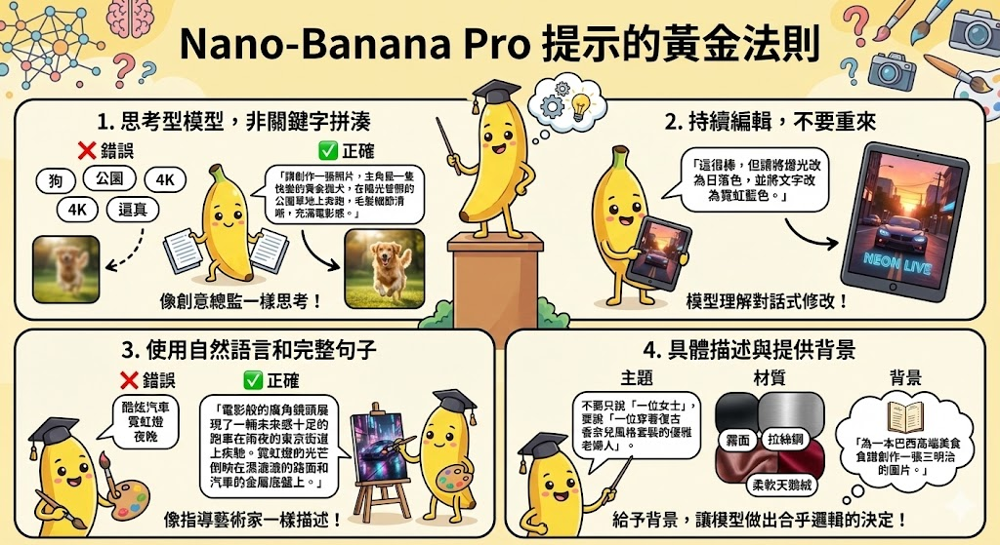

Nano-Banana Pro 是思考型模型，能理解意圖與物理規則，維納德認為，**要達到最好的產圖效果，必須捨棄傳統零碎的關鍵字堆疊（Tag Soups），像是只寫狗、公園、4K、真實感等關鍵字，而是以創意總監的思維下達清晰、具體且帶有上下文的指令** 。

維納德也提供4個提示詞的黃金法則:

1. **用對話修改而非重新生成**： 若圖像已有 80% 符合需求，請勿重新生成，直接以對話方式要求修改。
    - 例如：「很好，但請把燈光改為夕陽，並將文字改為霓虹藍」

2. **以自然語言和完整的句子溝通**: 像對人類藝術家進行指導一樣，使用完整的句子與正確語法，避免破碎的關鍵字。
    - 例如：不要寫「帥氣跑車、霓虹燈、8K」，改成「電影廣角鏡頭下，一輛未來感跑車在雨夜東京街頭奔馳，霓虹燈反射在濕滑路面與車身金屬底盤上」。

    |**提示詞-修改前**|**提示詞-修改後**|
    |:-----------:|:-----------:|
    |`帥氣跑車、霓虹燈、8K`|`電影廣角鏡頭下，一輛未來感跑車在雨夜東京街頭奔馳，霓虹燈反射在濕滑路面與車身金屬底盤上`|
    |<figure markdown="span">{ width="400"}</figure>|<figure markdown="span">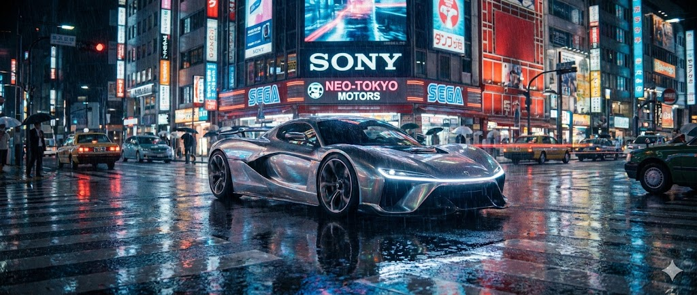{ width="400" }</figure>|

3. **具體描述材質**： 定義主體、場景與光影，對於材質應具體描述。
    - 例如: 不要寫「一位女士」，改成「一位穿著復古香奈兒風格套裝的優雅老婦」的女士。

    |**提示詞-修改前**|**提示詞-修改後**|
    |:-----------:|:-----------:|
    |`一位女士`|`一位穿著復古香奈兒風格套裝的優雅老婦`|
    |<figure markdown="span">{ width="400"}</figure>|<figure markdown="span">{ width="400" }</figure>|

    - 例如: 不要寫「一張紙」，改成「一張揉皺而且折角的紙」。

    |**提示詞-修改前**|**提示詞-修改後**|
    |:-----------:|:-----------:|
    |`一張紙`|`一張揉皺而且折角的紙`|
    |<figure markdown="span">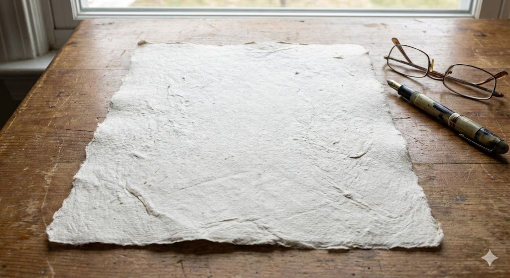{ width="400"}</figure>|<figure markdown="span">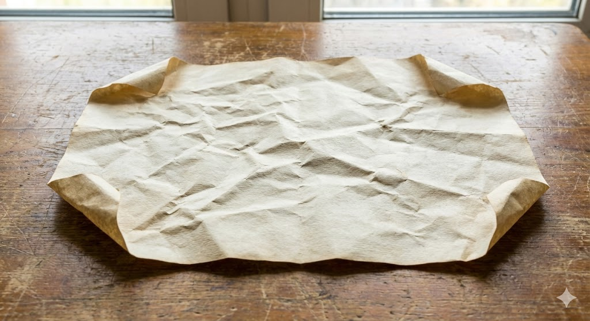{ width="400" }</figure>|

    - 例如: 不要寫「馬克杯」，改成「有霧面質感、髮絲紋金屬的馬克杯」。

    |**提示詞-修改前**|**提示詞-修改後**|
    |:-----------:|:-----------:|
    |`馬克杯`|`有霧面質感、髮絲紋金屬的馬克杯`|
    |<figure markdown="span">{ width="400"}</figure>|<figure markdown="span">{ width="400" }</figure>|

4. **提供情境**: 告知AI模型圖片的用途，模型便會自動啟動「思考」模式。
    - 例如：「為一本巴西高級食譜製作的三明治圖片」，模型將自動推斷出專業的擺盤與景深。

    |**提示詞**|
    |:-----------:|
    |`為一本巴西高級食譜製作的三明治圖片`|
    |<figure markdown="span">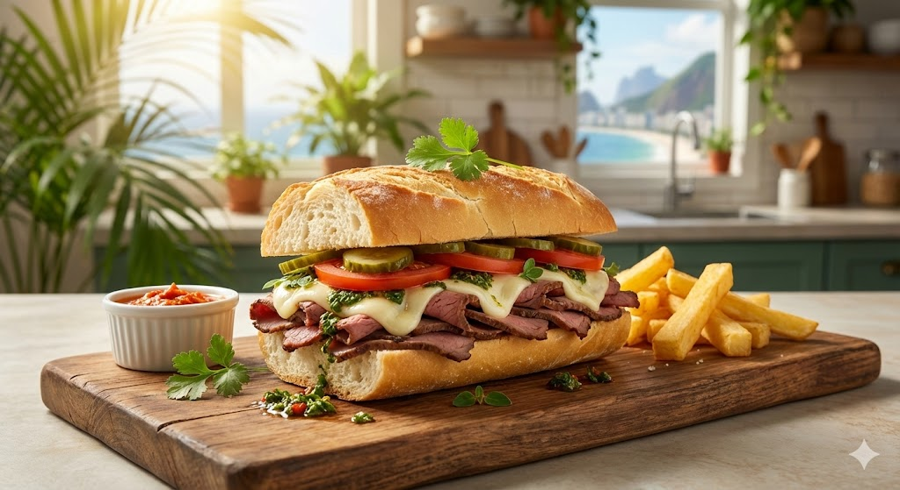{ width="400"}</figure>|

## 提示詞9招實用指南

### 文字渲染、資訊圖表與視覺合成

Nano-Banana Pr o模型具備 SOTA 等級的文字處理能力，能將資訊轉化為清晰的視覺內容。

**提示詞寫作技巧**:

- **資訊壓縮**： 手動上傳財報、數據等文字或PDF檔後，指示模型將數據「壓縮」為現代化資訊圖表。
- **指定風格**： 明確指定風格為雜誌排版、技術藍圖或手繪白板。
- **引言標註**： 明確列出需要在圖片中精準顯示的文字內容。

▶ 財報資訊圖表（須先上傳財報文件）

|官方提示詞範例（英）|官方提示詞範例（中）|
|-----------------|----------------|
|Generate a clean, modern infographic summarizing the key financial highlights from this earnings report. Include charts for 'Revenue Growth' and 'Net Income', and highlight the CEO's key quote in a stylized pull-quote box.|製作一張乾淨、現代的資訊圖表，總結這份財報的關鍵財務亮點，包含營收成長與淨利的圖表，並用風格化的引用框強調執行長的關鍵名言。|

<figure markdown="span">
  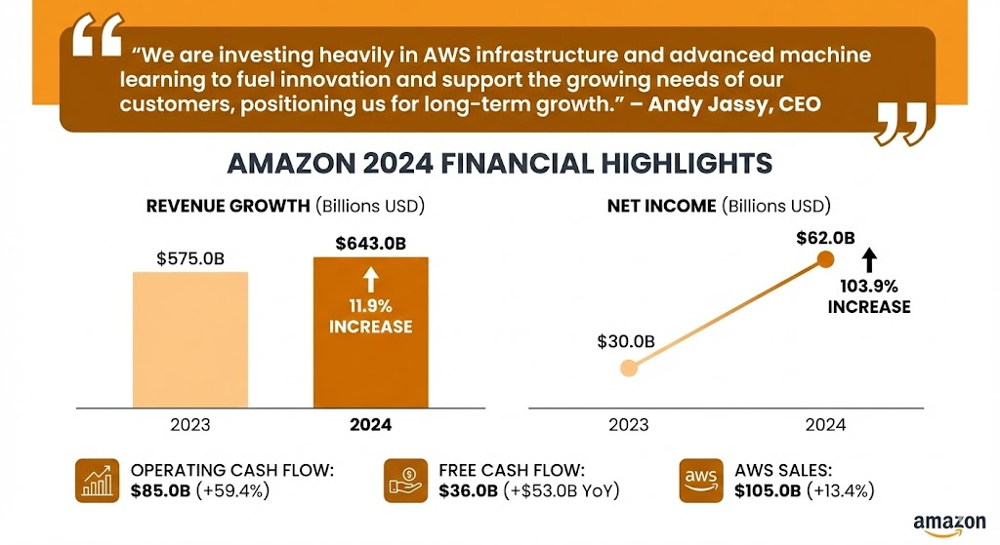{ width="800" }
  <figcaption>文本為亞馬遜2024年財報，AI能快速產出提示中要求的內容。</figcaption>
</figure>

參考: [Amazon-2024-Annual-Report.pdf](https://s2.q4cdn.com/299287126/files/doc_financials/2025/ar/Amazon-2024-Annual-Report.pdf)

▶ 復古風格儀表板

|官方提示詞範例（英）|官方提示詞範例（中）|
|-----------------|----------------|
|Make a retro, 1950s-style infographic about the history of the American diner. Include distinct sections for 'The Food,' 'The Jukebox,' and 'The Decor.' Ensure all text is legible and stylized to match the period.|製作一張復古 50 年代風格的資訊圖表，介紹「美式餐廳」的歷史。包含「食物」、「點唱機」和「裝潢」等不同區塊。確保所有文字清晰可讀，並符合當時的風格。|

<figure markdown="span">
  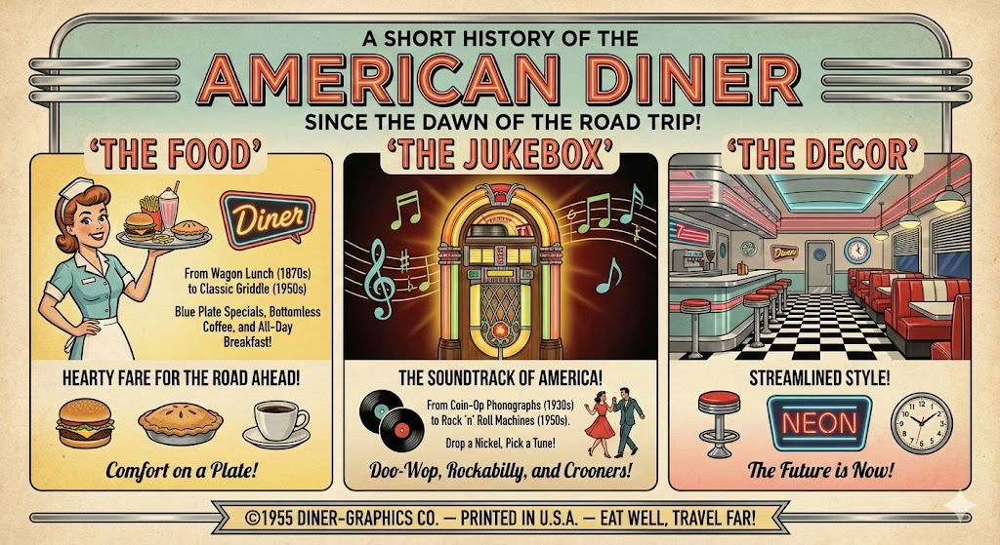{ width="800" }
  <figcaption>復古風格</figcaption>
</figure>

|官方提示詞範例（英）|官方提示詞範例（中）|
|-----------------|----------------|
|Create a retro 1950s-style infographic introducing the history of "Japanese sushi culture." Include different sections such as "type of sushi," "the craft & etiquette," and "the setting." Ensure all text is clear, legible, and consistent with the style of the time.|創建一個復古 1950 年代風格的資訊圖，介紹「日本壽司文化」的歷史。包括不同的部分，例如“壽司的類型”、“工藝和禮儀”和“設置”。確保所有文字清晰易讀，並符合當時的風格。|

<figure markdown="span">
  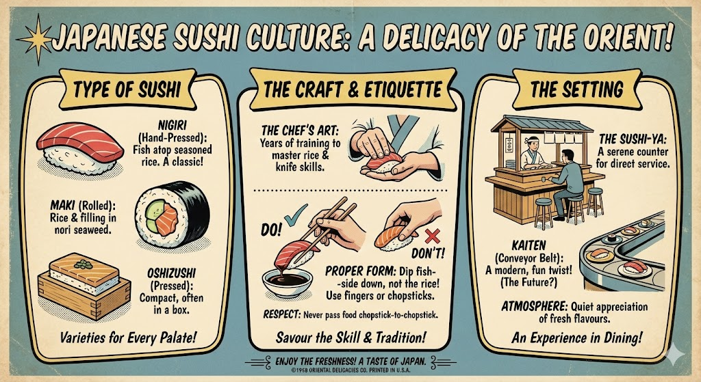{ width="800" }
  <figcaption>復古風格</figcaption>
</figure>

▶ 技術藍圖（須先上傳建築照片）

|官方提示詞範例（英）|官方提示詞範例（中）|
|-----------------|----------------|
|Create an orthographic blueprint that describes this building in plan, elevation, and section. Label the 'North Elevation' and 'Main Entrance' clearly in technical architectural font. Format 16:9.|繪製一張正投影藍圖，描述這棟建築的平面、立面和剖面。使用技術建築字體清晰標示「北向立面」和「主要入口」。格式為「16:9」。|

<figure markdown="span">
  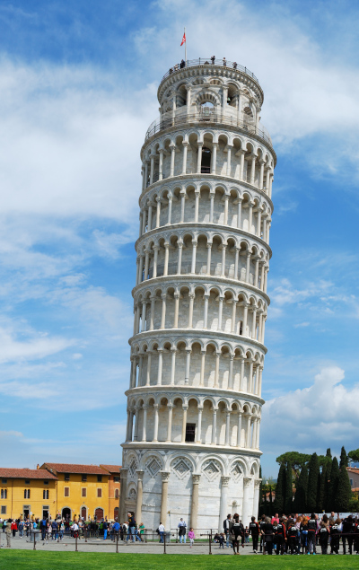{ height="400" }
  <figcaption>上傳的建築物圖片</figcaption>
</figure>

<figure markdown="span">
  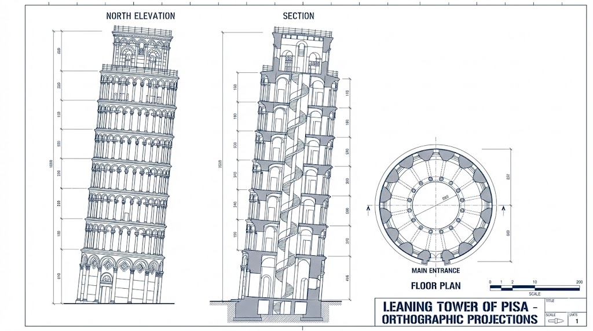{ width="800" }
  <figcaption>AI 生成的圖片</figcaption>
</figure>

▶ 手繪白板教學圖

|官方提示詞範例（英）|官方提示詞範例（中）|
|-----------------|----------------|
|Summarize the concept of 'Transformer Neural Network Architecture' as a hand-drawn whiteboard diagram suitable for a university lecture. Use different colored markers for the Encoder and Decoder blocks, and include legible labels for 'Self-Attention' and 'Feed Forward'.|將「Transformer 神經網路架構」的概念總結為一張適合大學講課的手繪白板圖。使用不同顏色的麥克筆「繪製編碼器」和「解碼器區塊」，並加上清晰的「自注意力機制」和「前饋」標籤。|

<figure markdown="span">
  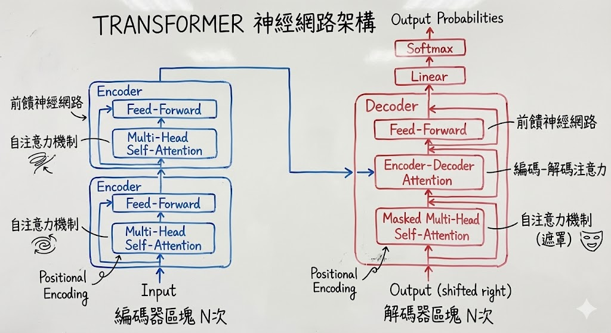{ width="800" }
  <figcaption>手繪白板</figcaption>
</figure>

|官方提示詞範例（英）|官方提示詞範例（中）|
|-----------------|----------------|
|The concept of "multiple applications of chlorophyll" is summarized into a hand-drawn whiteboard diagram suitable for university lectures.|將「葉綠素的多元應用」的概念總結為一張適合大學講課的手繪白板圖。|

<figure markdown="span">
  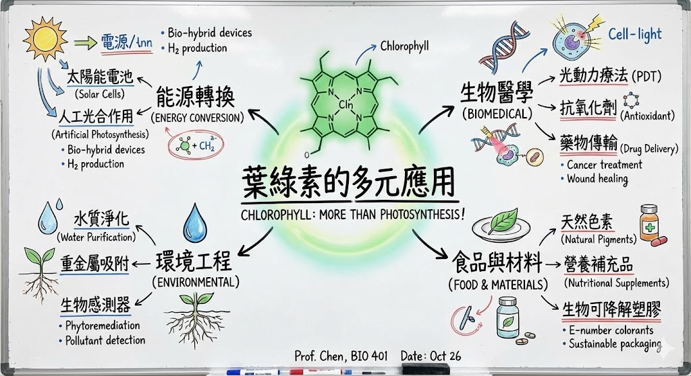{ width="800" }
  <figcaption>手繪白板</figcaption>
</figure>

### 角色一致性與病毒式縮圖

Nano banana 模型支援最多 14 張參考圖像（6 張高解析），實現「身分鎖定 (Identity Locking)」。

**提示詞操作技巧**:

- **身分鎖定**: 提示詞需包含「保持人物臉部特徵與自行上傳的圖片1完全一致」。
- **表情與動作**: 指定人物在保持身分的同時，改變表情或動作（如驚訝並指向右側）。
- **病毒式構圖**: 適合製作 YouTube 縮圖，一次結合人物、誇張圖形與粗體文字標題。

▶ 病毒式影片縮圖（須先上傳一張參考圖1）

|官方提示詞範例（英）|官方提示詞範例（中）|
|-----------------|----------------|
|The "Viral Thumbnail" (Identity + Text + Graphics):Design a viral video thumbnail using the person from Image 1. Face Consistency: Keep the person's facial features exactly the same as Image 1, but change their expression to look excited and surprised. Action: Pose the person on the left side, pointing their finger towards the right side of the frame. Subject: On the right side, place a high-quality image of a delicious avocado toast. Graphics: Add a bold yellow arrow connecting the person's finger to the toast. Text: Overlay massive, pop-style text in the middle: '3分钟搞定!' (Done in 3 mins!). Use a thick white outline and drop shadow. Background: A blurred, bright kitchen background. High saturation and contrast.|使用圖片 1 的人物設計一張病毒式影片縮圖。臉部一致性：保持人物臉部特徵與圖片 1 完全相同，但表情改為興奮和驚訝。動作：將人物置於左側，手指指向畫面右側。主體：在右側放置一張高品質的「酪梨吐司」圖片。圖形：加入一個醒目的黃色箭頭連接人物手指與吐司。文字：在中間疊加巨大的普普風文字：「3分鐘搞定!」。使用粗白框和陰影。背景：模糊、明亮的廚房背景。高飽和度與對比度。|

<figure markdown="span">
  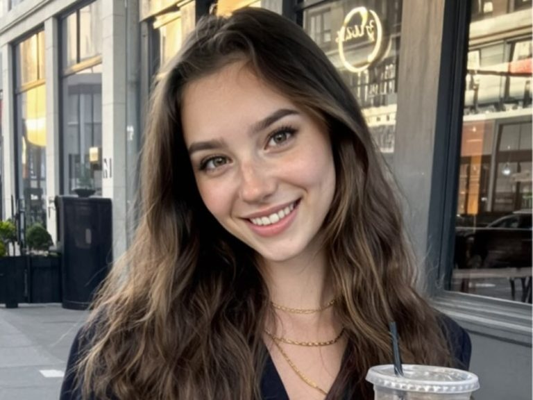{ height="800" }
  <figcaption>上傳的人物圖片</figcaption>
</figure>

<figure markdown="span">
  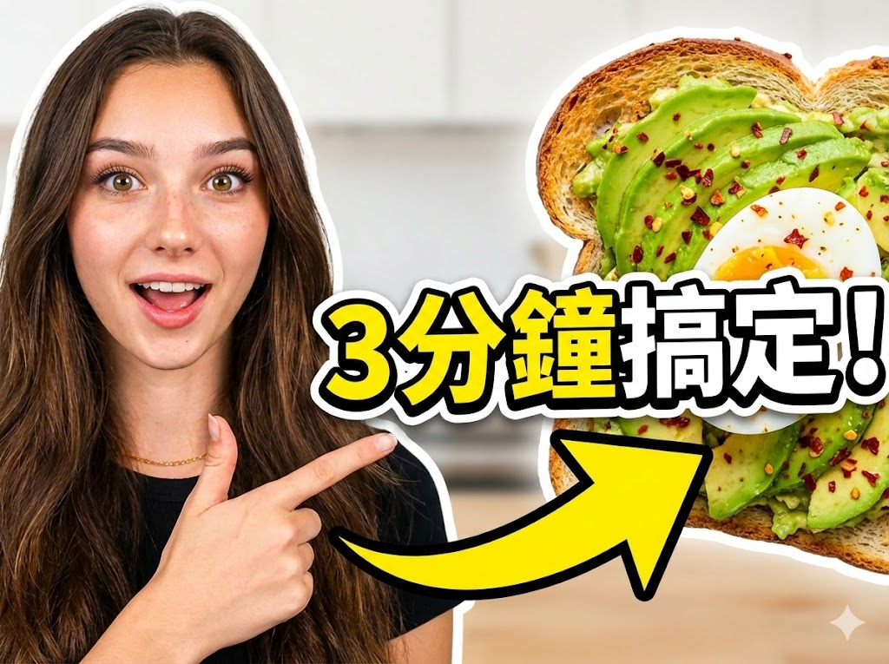{ width="800" }
  <figcaption>AI 生成的圖片</figcaption>
</figure>

▶ 角色故事系列（須先上傳一張角色參考圖）

|官方提示詞範例（英）|官方提示詞範例（中）|
|-----------------|----------------|
|Create a funny 10-part story with these 3 fluffy friends going on a tropical vacation. The story is thrilling throughout with emotional highs and lows and ends in a happy moment. Keep the attire and identity consistent for all 3 characters, but their expressions and angles should vary throughout all 10 images. Make sure to only have one of each character in each image.|創作一個包含 10 張圖片的有趣故事，描述3 個毛茸茸的朋友去「熱帶地區度假」。故事要有驚險刺激的情節與情緒起伏，最後以快樂的時刻結尾。保持 3 個角色的服裝和身分一致，但在這 10 張圖片中，他們的表情和角度應有所變化。確保每張圖片中每個角色只出現一次。|

<figure markdown="span">
  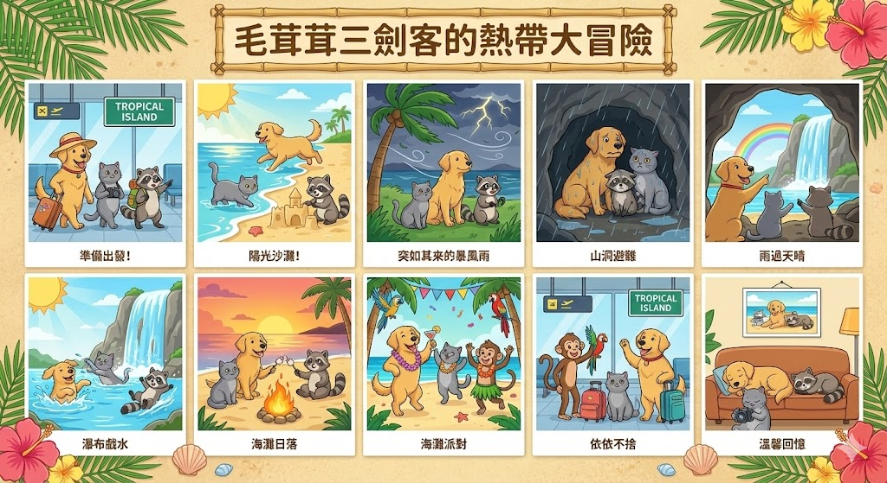{ width="800" }
  <figcaption>AI 生成的圖片</figcaption>
</figure>

▶ 品牌形象生成（須先上傳一張參考圖）

|官方提示詞範例（英）|官方提示詞範例（中）|
|-----------------|----------------|
|Create 9 stunning fashion shots as if they’re from an award-winning fashion editorial. Use this reference as the brand style but add nuance and variety to the range so they convey a professional design touch. Please generate nine images, one at a time.|創作 9 張令人驚豔的時尚照片，就像獲獎的時尚社論一樣。使用此參考圖作為品牌風格，但在系列中加入細微變化和多樣性，以傳達專業的設計感。請逐一生成這9張圖片并最後合併成1張。|

<figure markdown="span">
  { width="200" }
  <figcaption>上傳的圖片</figcaption>
</figure>

<figure markdown="span">
  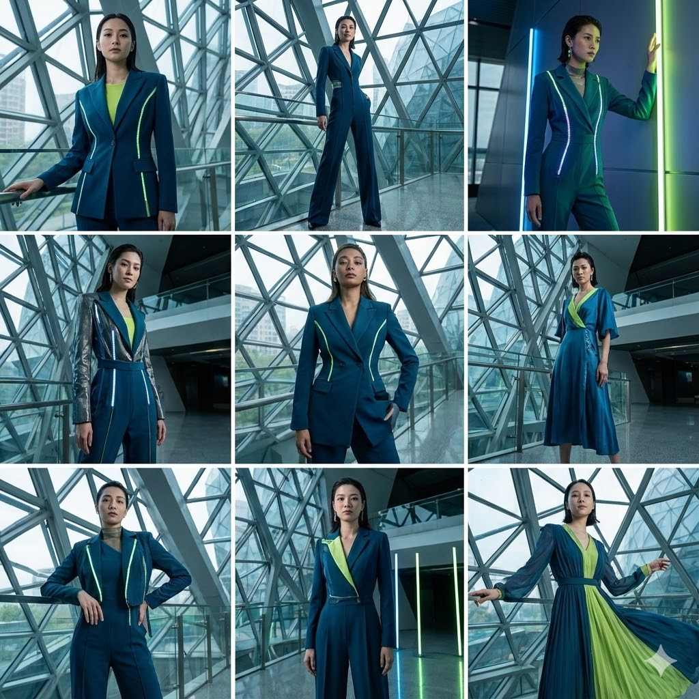{ width="800" }
  <figcaption>AI 生成的圖片</figcaption>
</figure>

### 結合 Google 搜尋的基礎學習

利用 Google Search 獲取即時數據，減少AI幻覺並顯示真實世界資訊。

**提示詞寫作技巧**:

- **動態數據視覺化**：要求模型根據即時資訊（如天氣、股價、新聞）生成圖表。
- **邏輯驗證**：模型會在生成圖像前，先透過搜尋結果進行推理，確保內容符合事實。

▶ 活動視覺化

|官方提示詞範例（英）|官方提示詞範例（中）|
|-----------------|----------------|
|Generate an infographic of the best times to visit the Taiwan, Taipei in 2025 based on current travel trends.|根據目前的旅遊趨勢，生成一張 2025 年造訪台灣台北的最佳時機資訊圖表。|

<figure markdown="span">
  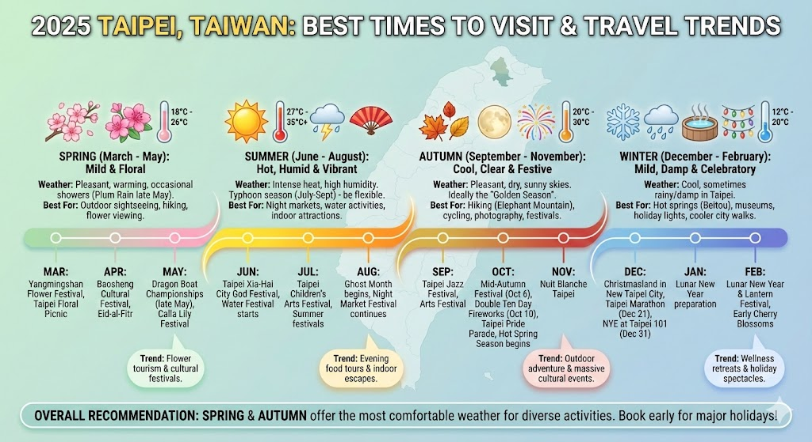{ width="800" }
  <figcaption>AI 生成的圖片</figcaption>
</figure>

### 進階編輯、修復與上色

透過對話式指令進行複雜修圖，無需手動繪製遮罩。

**提示詞寫作技巧**:

- **語意編輯**：直接描述修改內容，例如：「移除背景遊客，填補符合周圍環境的鵝卵石紋理」。
- **風格轉換與修復**：上傳黑白漫畫或舊照片進行上色，或進行風格置換（Style Swapping）。
- **在地化**：上傳廣告圖片，指令模型將背景改為不同國家（如東京），並自動翻譯圖中文字。

▶ 物件移除與畫面修補（須先上傳照片）

|官方提示詞範例（英）|官方提示詞範例（中）|
|-----------------|----------------|
|Remove the tourists from the background of this photo and fill the space with logical textures (cobblestones and storefronts) that match the surrounding environment.|移除背景中的遊客，並用符合周圍環境的邏輯紋理（鵝卵石和店面）填補空白。|

|原始參考圖片|AI生成的圖片|
|-----------------|----------------|
|<figure markdown="span">{ width="400"}</figure>|<figure markdown="span">{ width="400" }</figure>|

▶ 漫畫上色（須先上傳黑白漫畫）

|官方提示詞範例（英）|官方提示詞範例（中）|
|-----------------|----------------|
|Colorize this manga panel. Use a vibrant anime style palette. Ensure the lighting effects on the energy beams are glowing neon blue and the character's outfit is consistent with their official colors.|將這格漫畫上色。使用鮮豔的動漫風格配色。確保能量光束的光效是發光的霓虹藍，且角色的服裝符合其官方設定顏色。|

|原始參考圖片|AI生成的圖片|
|-----------------|----------------|
|<figure markdown="span">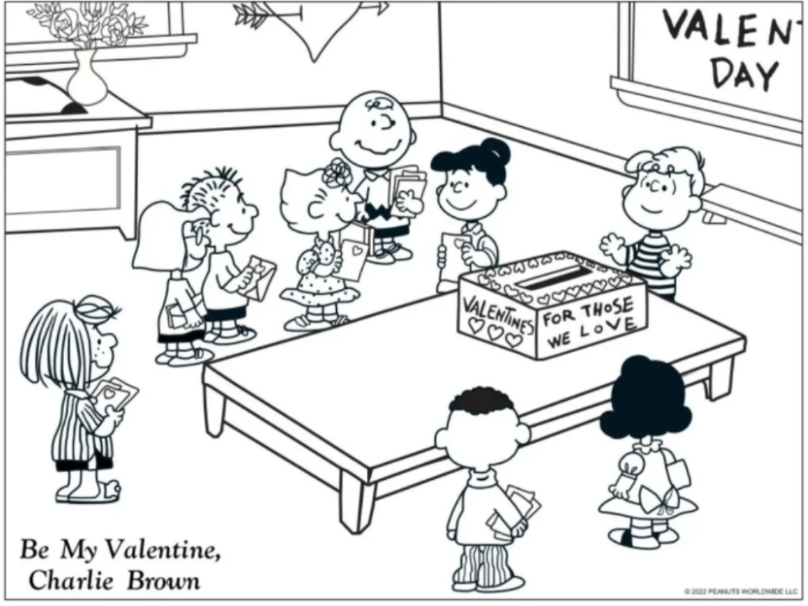{ width="400"}</figure>|<figure markdown="span">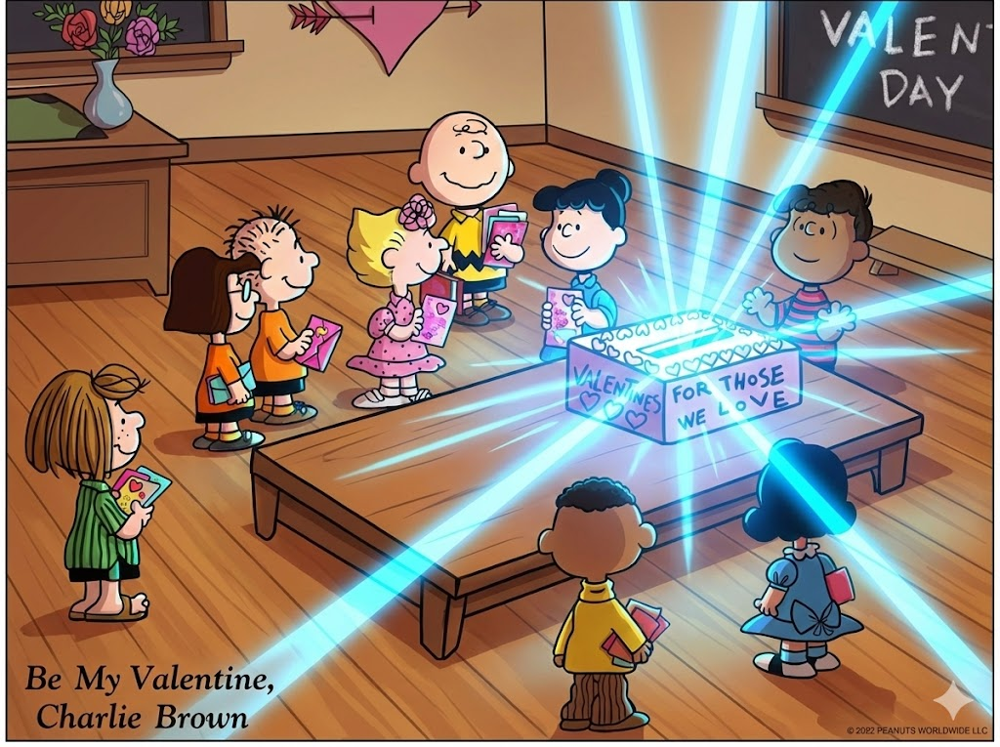{ width="400" }</figure>|

▶ 在地化與翻譯（須先上傳參考照片）

|官方提示詞範例（英）|官方提示詞範例（中）|
|-----------------|----------------|
|Take this concept and localize it to a Tokyo setting, including translating the tagline into Japanese. Change the background to a bustling Shibuya street at night.|以此照片概念為基礎，將其在地化為東京場景，包括將標語翻譯成日文。將背景改為夜晚繁忙的涉谷街頭。|

|原始參考圖片|AI生成的圖片|
|-----------------|----------------|
|<figure markdown="span">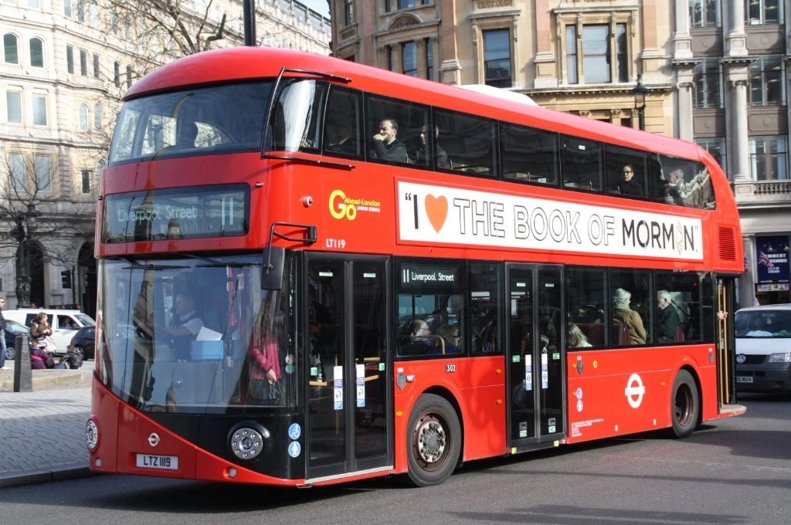{ width="400"}</figure>|<figure markdown="span">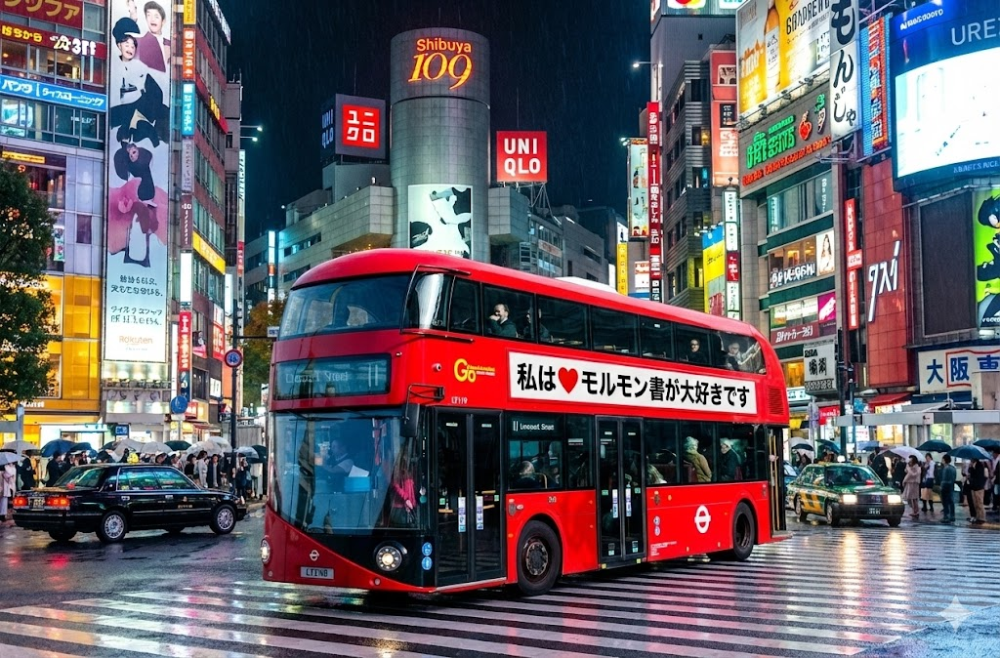{ width="400" }</figure>|

▶ 季節與光影控制（須先上傳參考照片）

|官方提示詞範例（英）|官方提示詞範例（中）|
|-----------------|----------------|
|Turn this scene into winter time. Keep the house architecture exactly the same, but add snow to the roof and yard, and change the lighting to a cold, overcast afternoon.|將原本場景轉變為冬季。保持房屋建築結構完全不變，但在屋頂和庭院加上積雪，並將光線改為寒冷、陰沉的午後。|

|原始參考圖片|AI生成的圖片|
|-----------------|----------------|
|<figure markdown="span">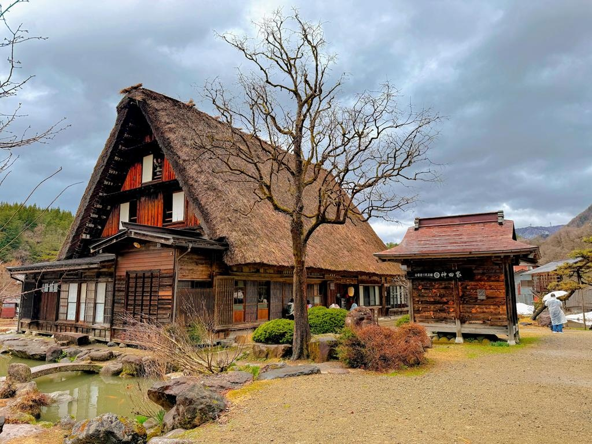{ width="400"}</figure>|<figure markdown="span">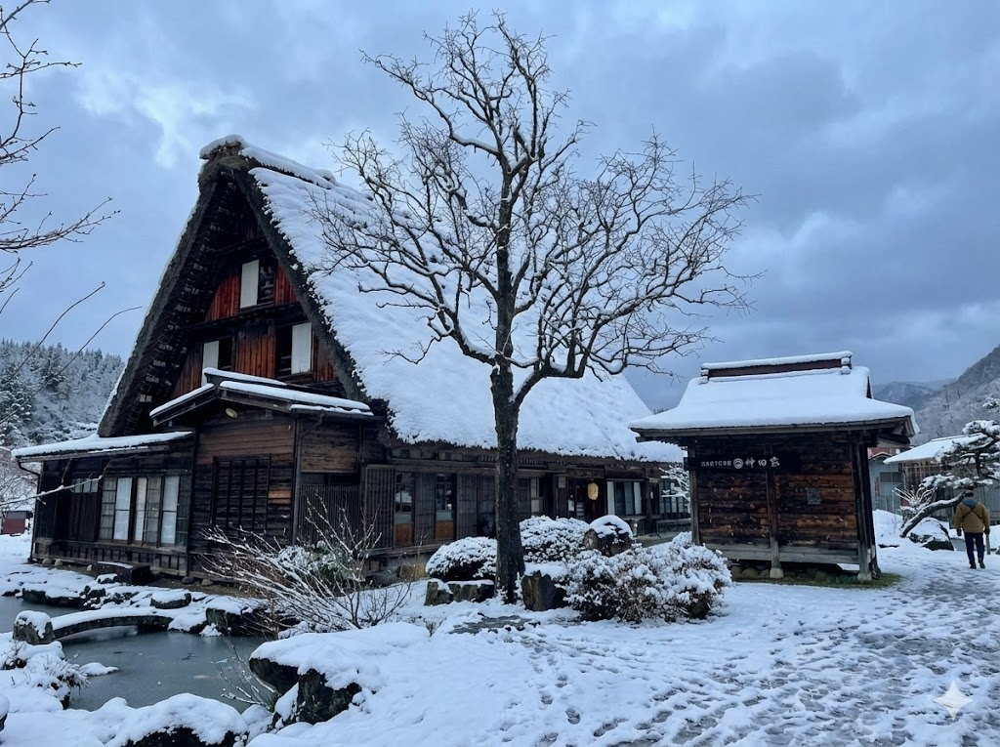{ width="400" }</figure>|

### 維度轉換 (2D ↔ 3D)

跨維度理解能力，適用於建築、設計與迷因創作。

**提示詞寫作技巧**:

- **2D 轉 3D**：上傳平面配置圖，指令生成擬真的 3D 室內設計簡報板。
- **3D 轉 2D**：將 3D 渲染圖轉換為像素藝術 (Pixel Art) 或技術線稿。

▶ 2D 平面圖轉 3D 室內設計（須先上傳2D 平面圖）

|官方提示詞範例（英）|官方提示詞範例（中）|
|-----------------|----------------|
|Based on the uploaded 2D floor plan, generate a professional interior design presentation board in a single image. Layout: A collage with one large main image at the top (wide-angle perspective of the living area), and three smaller images below (Master Bedroom, Home Office, and a 3D top-down floor plan). Style: Apply a Modern Minimalist style with warm oak wood flooring and off-white walls across ALL images. Quality: Photorealistic rendering, soft natural lighting.|根據上傳的 2D 平面圖，生成一張專業的室內設計提案板。版面配置：拼貼形式，上方為一張大的主圖（起居區的廣角透視），下方為三張小圖（主臥室、家庭辦公室和 3D 俯視平面圖）。風格：在所有圖片中套用現代極簡風格，搭配溫暖的橡木地板和米白色牆面。品質：照片級渲染，柔和的自然光。|

|原始參考圖片|AI生成的圖片|
|-----------------|----------------|
|<figure markdown="span">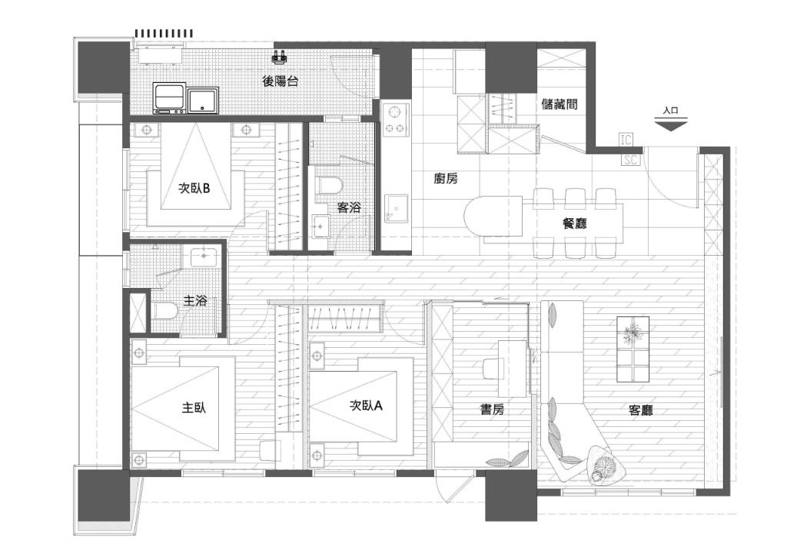{ width="400"}</figure>|<figure markdown="span">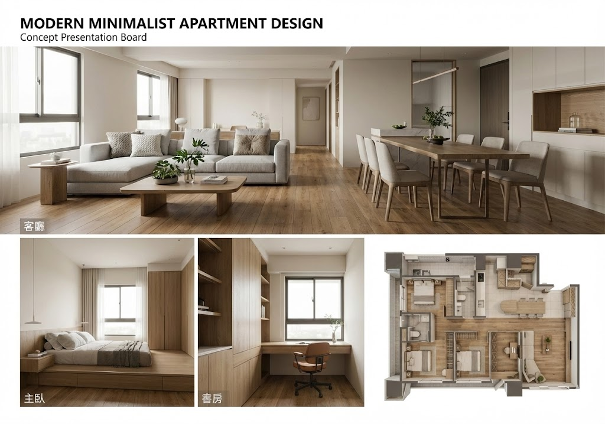{ width="400" }</figure>|

▶ 2D 轉 3D 迷因圖

|官方提示詞範例（英）|官方提示詞範例（中）|
|-----------------|----------------|
|Turn the 'This is Fine' dog meme into a photorealistic 3D render. Keep the composition identical but make the dog look like a plush toy and the fire look like realistic flames.|將「This is Fine」狗狗迷因圖轉變為照片級真實的 3D 渲染圖。保持構圖完全相同，但讓狗狗看起來像毛絨玩具，火看起來像真實的火焰。|

|原始參考圖片|AI生成的圖片|
|-----------------|----------------|
|<figure markdown="span">{ width="400"}</figure>|<figure markdown="span">{ width="400" }</figure>|

??? info "什麼是迷因圖"
    **迷因圖（Meme image）** 是網路流行文化中一種幽默、諷刺或引人共鳴的圖片（或影片、文字），透過社群媒體快速傳播與模仿，常以名人、影視截圖或社會現象為素材，加上創意文字，內容易於理解且能被大量二次創作，是「網路迷因」最常見的形式。 
    
    迷因圖的特點:
      - 內容性：通常帶有幽默、嘲諷、自嘲或能引發共鳴的點。
      - 可傳播性：容易被分享，並能像病毒般快速擴散。
      - 可模仿性：基於原素材再創作，易於改編和延伸（例如「黑人問號」梗圖）。
      - 多樣性：不限於圖片，也可是影片、短語、行為等，但梗圖最為主流。 
    
    迷因圖的來源與例子:
      - 名人或事件：例如「黑人問號」來自演員尼克楊的表情；「同鮭魚盡」源於改名潮事件。
      - 影視片段：鄉土劇《台灣龍捲風》的台詞被後製成洗腦的迷因。
      - 流行文化：如「佛系」生活態度被配上各種搞笑文字。 
    
    迷因（Meme）的定義:
      - Meme（迷因）一詞由演化生物學家理查．道金斯提出，指文化中能自我複製並傳播的單位。
      - 網路迷因是此概念的延伸，泛指在網路中迅速爆紅並傳播的人、事、物。
      - 梗圖（或稱「哏圖」）就是最典型的網路迷因之一。 
    
    總之，迷因圖就是網路上那些會讓你心一笑、能快速分享、又可以被大家發揮創意的搞笑圖片。 

### 高解析度與材質紋理

**提示詞寫作技巧**:

- **指定解析度**：明確要求「4K 解析度」或「高保真輸出」。
- **細節描述**：描述微觀細節，如：「青苔森林地面的光影」或「漢堡麵包的焦脆紋理」。

▶ 4K 材質生成

|官方提示詞範例（英）|官方提示詞範例（中）|
|-----------------|----------------|
|Harness native high-fidelity output to craft a breathtaking, atmospheric environment of a mossy forest floor. Command complex lighting effects and delicate textures, ensuring every strand of moss and beam of light is rendered in pixel-perfect resolution suitable for a 4K wallpaper.|運用原生高保真輸出，打造一張令人屏息、充滿氛圍感的長滿青苔的森林地面環境圖。控制複雜的光效和細緻的紋理，確保每一縷青苔和光束都以適合 4K 桌布的像素級解析度呈現。|

<figure markdown="span">
  { width="800" }
  <figcaption>AI 生成的圖片</figcaption>
</figure>

▶ 複雜邏輯材質

|官方提示詞範例（英）|官方提示詞範例（中）|
|-----------------|----------------|
|Create a hyper-realistic infographic of a gourmet cheeseburger, deconstructed to show the texture of the toasted brioche bun, the seared crust of the patty, and the glistening melt of the cheese. Label each layer with its flavor profile.|製作一張美味起司漢堡的超寫實資訊圖表，以解構方式展示烤布里歐麵包的質地、肉餅的焦脆表皮以及起司融化時的光澤。標註每一層的風味輪廓。|

<figure markdown="span">
  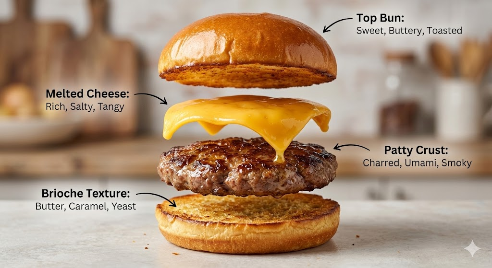{ width="800" }
  <figcaption>AI 生成的圖片</figcaption>
</figure>

### 思考與推理能力

**提示詞寫作技巧**:

- **數學解題**：指令模型在白板圖像上列出數學公式的解題步驟。
- **視覺推理**：上傳完工照片，要求模型逆向生成「施工期間」的畫面（如顯露框架與未完工牆面）。

▶ 數學解題

|官方提示詞範例（英）|官方提示詞範例（中）|
|-----------------|----------------|
|Solve log_{x^2+1}(x^4-1)=2 in C on a white board. Show the steps clearly.|用繁體中文在白板上解出 log_{x^2+1}(x^4-1)=2$ in $C$。清楚展示步驟。|

<figure markdown="span">
  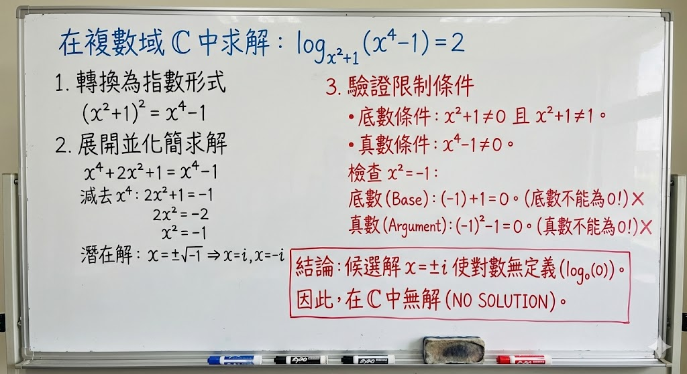{ width="800" }
  <figcaption>AI 生成的圖片</figcaption>
</figure>

▶ 視覺推理

|官方提示詞範例（英）|官方提示詞範例（中）|
|-----------------|----------------|
|Analyze this image of a room and generate a 'before' image that shows what the room might have looked like during construction, showing the framing and unfinished drywall.|分析這張房間的圖片，並生成一張「施工前」的圖片，顯示房間在建造過程中，僅有框架和未完工乾式牆的樣子。|

|原始參考圖片|AI生成的圖片|
|-----------------|----------------|
|<figure markdown="span">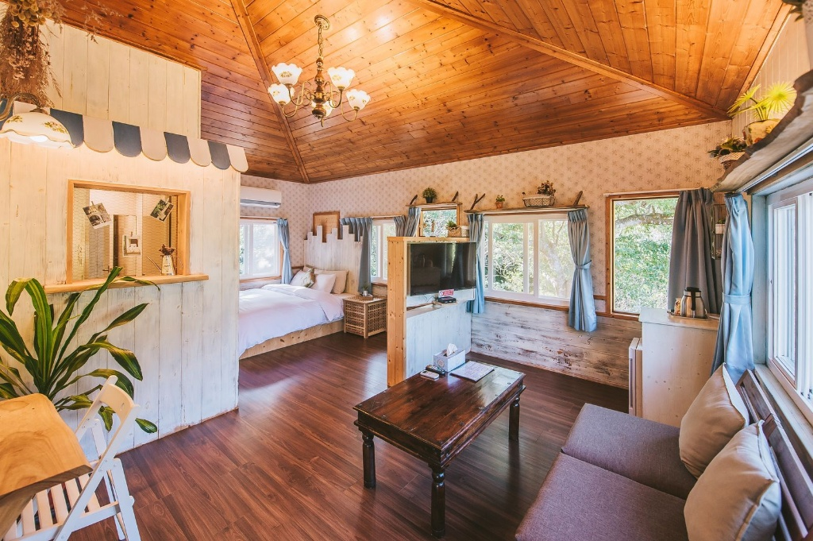{ width="400"}</figure>|<figure markdown="span">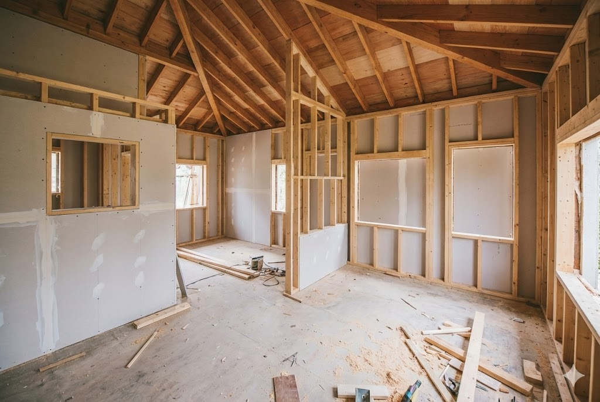{ width="400" }</figure>|

### 單次分鏡腳本與概念藝術

無需網格輔助，單次生成連貫敘事的多張圖像。

**提示詞寫作技巧**:

- **連貫敘事**：指令生成 9 張連續圖像（如廣告分鏡），並要求「身分與服裝在所有圖片中保持一致」。
- **多角度呈現**：允許角色在不同鏡頭中呈現不同角度與距離。

▶ 電影廣告分鏡

|官方提示詞範例（英）|官方提示詞範例（中）|
|-----------------|----------------|
|Create an addictively intriguing 9-part story with 9 images featuring a woman and man in an award-winning luxury luggage commercial. The story should have emotional highs and lows, ending on an elegant shot of the woman with the logo. The identity of the woman and man and their attire must stay consistent throughout but they can and should be seen from different angles and distances. Please generate images one at a time. Make sure every image is in a 16:9 landscape format.|創作一個包含 9 張圖片、令人著迷的 9 部曲故事，主角是一男一女，拍攝一支獲獎的豪華行李箱廣告。故事應有情緒起伏，並以女性與 Logo 的優雅鏡頭作結。男女主角的身分和服裝必須全程保持一致，但應從不同角度和距離拍攝。請逐一生成圖片。確保每張圖片皆為 16:9 橫向格式。|

<figure markdown="span">
  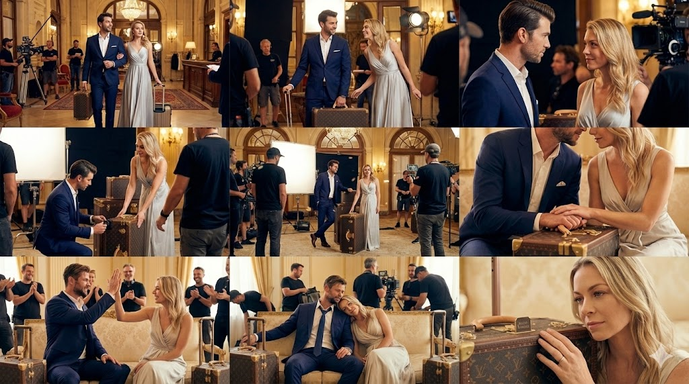{ width="800" }
  <figcaption>AI 生成的圖片</figcaption>
</figure>

### 結構控制與版面引導

利用參考圖像嚴格控制最終輸出的構圖與版面。

**提示詞寫作技巧**:

- **草圖轉完稿**：上傳手繪草稿，要求模型嚴格依照位置生成產品廣告。
- **線框圖轉 UI**：上傳 Wireframe 截圖，生成高保真的 App 使用者介面。
- **網格應用**：配合網格圖片生成像素精靈 (Sprites)，便於後續程式開發應用。

▶ 草圖轉廣告（須先上傳手繪草圖）

|官方提示詞範例（英）|官方提示詞範例（中）|
|-----------------|----------------|
|Create a ad for a [product] following this sketch.|依照此草圖，為 [產品名稱] 製作一則廣告。|

|原始參考圖片|AI生成的圖片|
|-----------------|----------------|
|<figure markdown="span">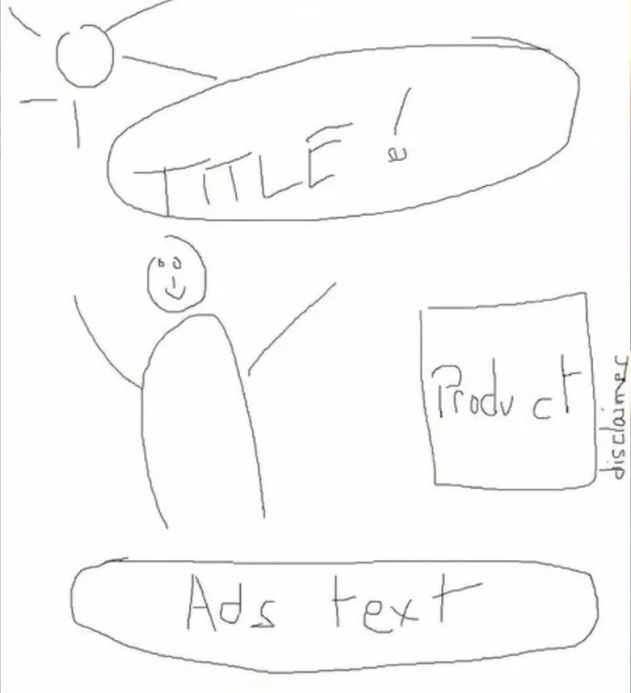{ width="400"}</figure>|<figure markdown="span">{ width="400" }</figure>|

▶ 線框圖轉 UI（須先上傳手繪草圖）

|官方提示詞範例（英）|官方提示詞範例（中）|
|-----------------|----------------|
|Create a mock-up for a [product] following these guidelines.|依照這些準則，為 [產品名稱] 製作模型圖 (Mock-up)。|

|原始參考圖片|AI生成的圖片|
|-----------------|----------------|
|<figure markdown="span">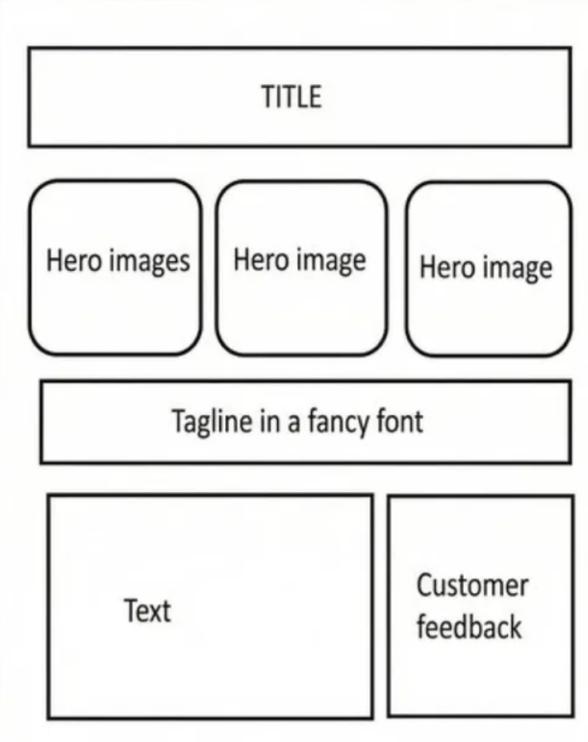{ width="200"}</figure><figure markdown="span">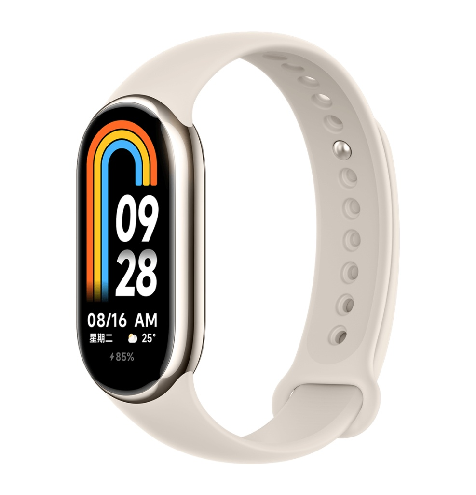{ width="200"}</figure>|<figure markdown="span">{ width="400" }</figure>|

▶ 像素藝術與網格（須先上傳 64x64 網格圖片）

|官方提示詞範例（英）|官方提示詞範例（中）|
|-----------------|----------------|
|Generate a pixel art sprite of a unicorn that fits perfectly into this 64x64 grid image. Use high contrast colors.(Tip: Developers can then programmatically extract the center color of each cell to drive a connected 64x64 LED matrix display).|生成一個獨角獸的像素藝術精靈 (Sprite)，使其完美填入此 64x64 網格圖片中。使用高對比配色。|

<figure markdown="span">
  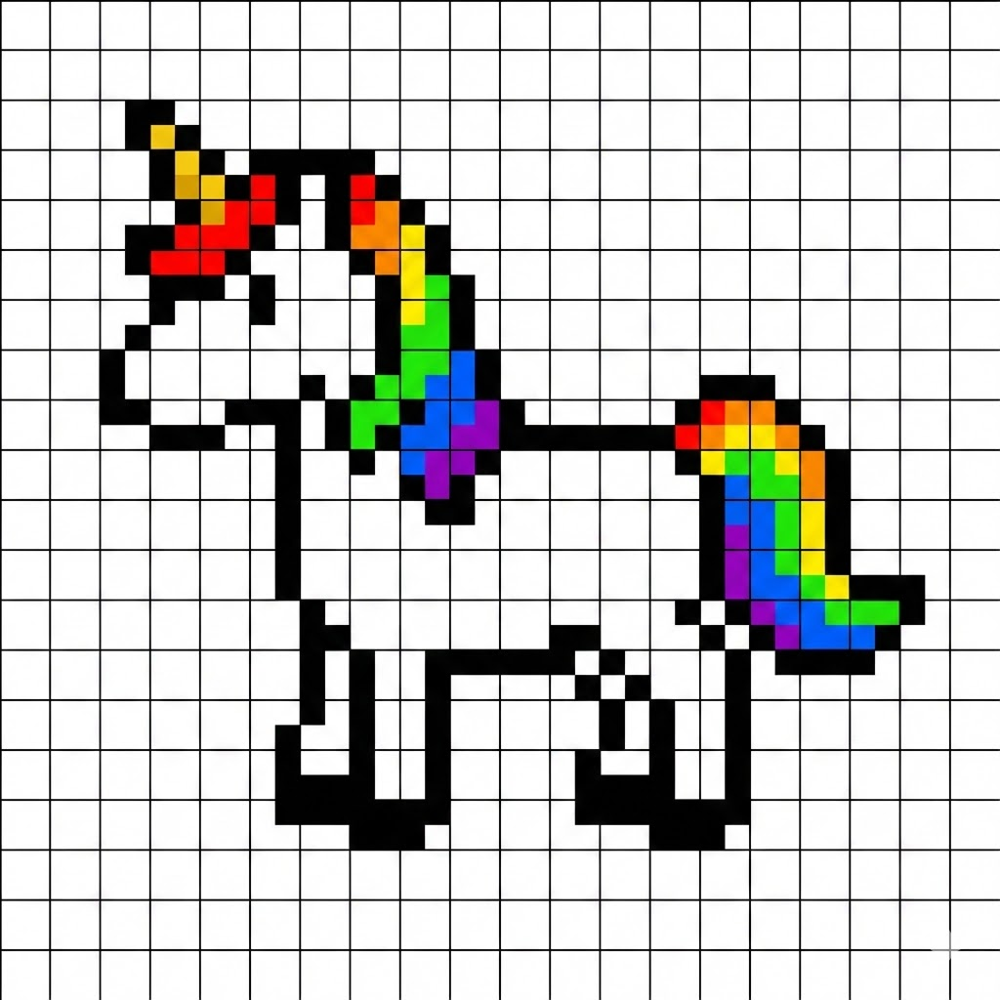{ width="800" }
  <figcaption>AI 生成的圖片</figcaption>
</figure>

▶ 精靈圖表（須先上傳 64x64 網格圖片）

|官方提示詞範例（英）|官方提示詞範例（中）|
|-----------------|----------------|
|Sprite sheet of a woman doing a backflip on a drone, 3x3 grid, sequence, frame by frame animation, square aspect ratio. Follow the structure of the attached reference image exactly.|一張女子後空翻的精靈圖表 (Sprite sheet)，3x3 網格，連續動作，逐幀動畫，正方形比例。嚴格遵循附件參考圖的結構。|

<figure markdown="span">
  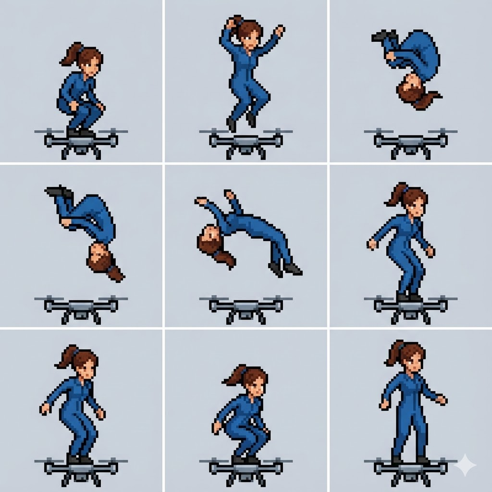{ width="800" }
  <figcaption>AI 生成的圖片</figcaption>
</figure>

