# 無類別區隔路由 CIDR 技術

作者: 胡凱智, 
原文: [無類別區隔路由CIDR 技術](https://www.netadmin.com.tw/netadmin/zh-tw/technology/0B9B631F987A45439061B6629F63DD07?page=1)


為了避免造成IP位址的大量浪費，於是出現了無類別區隔路由（CIDR）技術，本文將介紹CIDR類型的IP位址分配方式及相關的路由技術，並說明CIDR的多變長度子網路遮罩與路由匯總兩項重要技術。

網際網路通訊協定（IP）位址的分配是根據IP位址的32個位元，分成 Class A、Class B 以及 Class C 等網路區域，依據32個位元以每8個位元一組來區隔做不同的類別（Class），而每一個類別依據這樣的區隔有不一樣的IP容納數量。也因此，可以根據需求來決定要使用哪一種類別。但是這樣的方式過沒多久，就發現到類別之間的差距過大，而造成IP位址的大量浪費。

後來產生了所謂無類別區隔的路由方式，英文稱之為 **Classless Inter-Domain Routing**，簡稱 **CIDR**，這篇文章就是要介紹這種類型的IP位址分配方式以及相關的路由技術。

## IP 位址的相關知識

在介紹 CIDR 相關技術之前，一定要先對 IP 位址有基本的了解，所以先介紹與 IP 相關的子網路、網路遮罩、網路位址以及主機位址等知識。

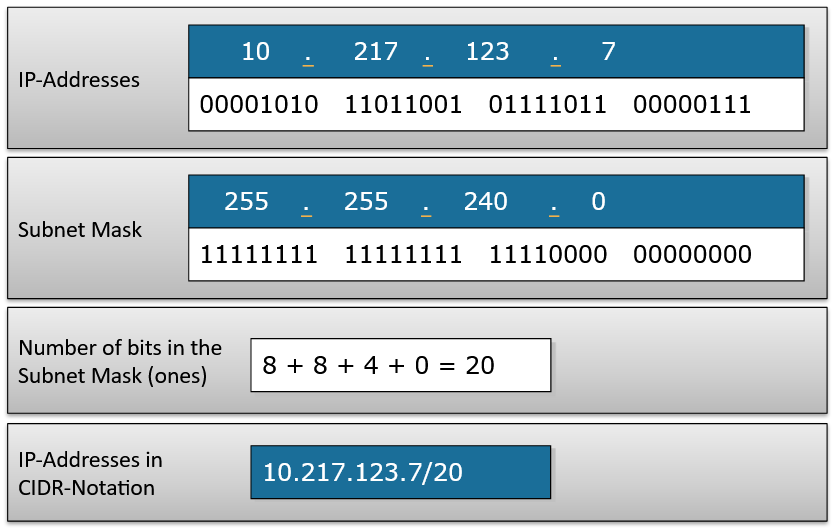

IP位址和類別 大家都知道一個IP位址長得像是下面 這樣：


這是由32個位元、每8個位元用一個十進位的數字來表示，所以一共有4個數字。一般來說，會依據位元組（8個位元）的個數來區隔成不同類別（Class）的網路，不同類型的網路可以容納不同數量的IP位址數目。

例如，若使用8個位元來變化，以便於容納IP位址的話，就可以容納28個IP位址，也就是256個。若使用兩個位元組（就是16個位元）來做變化，就可以容納216個，也就是65,536個IP位址。以這樣的基礎的定址與路由，都稱之為 Classful，也就是以 **類別** 為基礎的方式。

不過，這種方式並不是這裡要講的主題，所以不會多加介紹。這篇文章要說的，是要打破這種以類別為基礎的定址與路由，所以稱之為 **Classless**。

為什麼先講這些？因為想讓大家先知道 CIDR 要著重的範圍是什麼，這樣一來，再來看這篇文章的時候才知道在講些什麼。不過，在詳細介紹 CIDR 之前，必須要確實地了解何謂網路遮罩、子網路等等知識。

### 網路遮罩和IP位址表示方式

再次使用剛才的範例，IP位址就如同以下這般：


這是由32個位元、每8個位元用一個十進位的數字來表示，所以一共有4個數字。如果再加上網路遮罩的資訊，一般的寫法就如下面所示：


以上的表示法代表網路位址是172.16.0.0，而後面的16則表示「網路遮罩的二進位表示法中，最後16個數字為0」，因此上面的表示法是用來敘述這樣一個子網路環境。倘若將網路遮罩用二進位來表示，就相當於以下的表示方式：


最後16個位數都是0，若把這樣的網路遮罩轉換成十進位，也就是說，網路遮罩將為255.255.0.0。

### 網路位址、主機位址與廣播位址

還有另一個要注意的基本知識是網路位址（Network Address）與主機位址（Host Address），就以剛剛的子網路為例：


假設有一個IP位址172.16.32.4是位於這個子網路內，則網路位址為172.16.0.0，而主機位址即為172.16.32.4，而廣播位址就是把後面主機位址的部分，在二進位的表示法中都為1，如果把172.16.0.0轉成二進位表示，則如下列所示：


因為知道遮罩數目為16，所以從後面數過來16個數字都是屬於主機位址可以分配的部分，因此這個網路的廣播位址就只要把這些主機位址可分配的部分都設定為1即可，也就是：


轉成十進位就是172.16.255.255。可以從這裡發現到，這個廣播位址是不能被拿來當成主機位址，當然網路位址也不能拿來當作主機位址，所以一個子網路中到底可以用多少個IP位址來當作主機位址呢？再繼續往下看！


### 子網路中所能使用的IP數量

網路遮罩到底有什麼用途？它能表示這個網路或子網路內可以使用的IP位址有多少，這是最基本的用途。從上面這個例子來看，由於網路遮罩是255.255.0.0，所以從二進位來看，它就是（這裡把不能變動的部分用粗體來表示）：


這代表在分配IP位址時，前面16個數字不能變動，只有後面16個數字可以變動，而前面不能變動的就是使用網路位址的部分。現在來看網路位址，在上面的範例中，網路位址是172.16.0.0，轉成二進位就是：


而能夠分配的IP位址為：

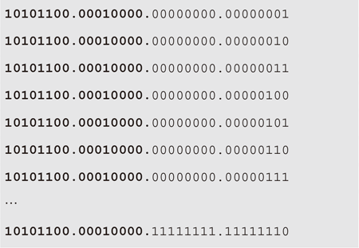

轉成十進位的話，就代表可使用的IP位址範圍為172.16.0.1到172.16.255.254。

所以這個子網路中可以使用的IP數量為2的16次方減2，也就是216-2=65534個IP位址。減去兩個的部分分別是172.16.0.0與172.16.255.255這兩個IP位址，為什麼這兩個要減去呢？

因為172.16.0.0已經被拿來使用成這個子網路的網路位址，而172.16.255.255是廣播位址，不能被拿來分配成一般IP位址使用。到目前為止，大家對於IP位址分配應該已經有初步的概念了。

接著，再說明CIDR中一個很重要的知識：多變長度子網路遮罩。

## CIDR 重點1：多變長度子網路遮罩

一般而言，在切割子網路時，子網路遮罩都是切成類似255.255.255.0或255.255.0.0這樣的數字。不過，這樣切割的話，雖然很容易使用，但可能會造成IP的浪費，因為不見得每個子網路中的IP使用量都是相同的。

就拿上面的範例來說，可以看到上面的子網路可以分配出65,534個IP位址，這也太多了吧？就算使用255.255.255.0這樣的網路遮罩，那子網路中的IP位址個數也有254個，也是不少。

假設有一個公司要為行政部門分配出20個IP位址，而要為開發部門分配出100個IP位址，則此時變成會使用到兩個子網路，而每個子網路的網路遮罩都是255.255.255.0，也就是每個子網路都可以分配254個IP位址。這樣的話，就已經浪費掉(254-20)+(254-100)個IP位址。如果大家都這樣使用，那還得了？就因為如此，才有多變長度子網路遮罩的出現。

**多變長度子網路遮罩**（Variable-Length Subnet Mask，VLSM）是用來讓不同長度、不同類別（Class）的子網路能在同一個網路內存在並且運作。所以，也就是說多變長度子網路遮罩能夠讓網路內的IP位址分配更加彈性化，也可以讓可用的IP位址個數增加。

### 計算多變長度子網路遮罩的方式

舉例來說明如何計算多變長度子網路遮罩，可能會比較容易了解。假設有一個子網路是：


而現在想分割一個子網路是可以容納10台機器所使用，也就是要能夠分配10個IP位址。而由一開始對網路遮罩的介紹，應該就能夠算出172.16.32.0/20總共可以分配出的IP位址個數為：


如果直接把172.16.32.0/20這個子網路拿來給這10個IP位址使用，實在是太浪費，因為只會用10個IP位址，其他4,084個IP位址都沒有使用到。

若是使用多變長度子網路遮罩，則能夠把172.16.32.0/20子網路分割成172.16.32.0/28，如此一來，將得到下列這些子網路：

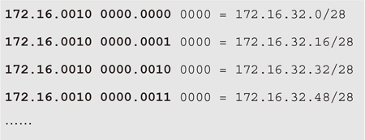

這裡把位址的最後兩個數字用二進位表示，這樣比較容易計算，其中，172.16的部分算是網路位址，172.16.0010這些部分算是子網路的部分，而172.16.00100000.0001就已經結合了多變長度子網路遮罩，至於最後四個位元，則是用來分配IP位址給主機用。

所以，這樣分配之後，172.16.32.0/20一共可以分成256個多變長度子網路，256的計算方式如下：


而每一個多變長度子網路皆可分配14個IP位址，其計算方式如下：


剛好符合原本的需求：「分割子網路來分配10個IP位址」。這樣分割之後，只會浪費4個IP位址，與原本會浪費四千多個IP位址比較起來，真的是差太多了。

### IP位址分配的應用範例

現在，用另一個例子說明多變長度子網路遮罩如何讓網路管理人員更有效地規劃IP位址。假設現在分配到的網段是：


打算分配給四個不同的部門，每個部門都有自己的網段，且每個部門的IP位址個數要55個。每個部門必須有一個路由器負責連接到公司要連到外部WAN網路的路由器上，這之間的IP位址也必須在規劃之中。

首先，大略思考一下可能的網路架構圖應該是如何。因為要分配四個網段，而每個網段會有一個路由器必須連接到公司要連到外部WAN網路的路由器上（這是當然的，不然這些部門的機器就無法連出網路），因此網路架構圖應該如圖1所示。

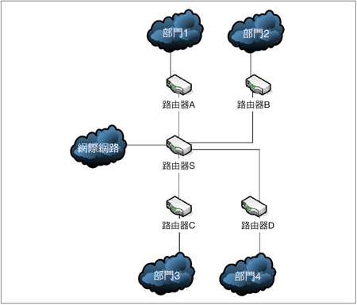

而各網段的IP位址都還沒有填上去，這就是現在要做的工作。在這裡，所要規劃的IP位址部分包含：


由於知道每個部門都要規劃55個IP位址，所以下一個步驟就是決定多變長度子網路遮罩要用多少。表1整理出常用之不同的遮罩長度與所能分配的IP位址個數一覽表，可以直接查找。

**表1 不同的遮罩長度與所能分配的IP位址個數**

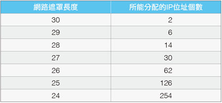

從這裡可以看出，網路遮罩長度不能超過30個，因為至少要保留網路位址及廣播位址，而還要能夠分配IP位址的話，網路遮罩最多只能到30個位數。由於打算能夠分配55個IP位址，所以由上面這個表格可以看出，至少必須使用26個位元當作網路遮罩。

由於所分配到的網段是：


所以轉換成二進位後即為：


這裡稍微偷懶一下，只把後面的32.0轉換成二進位。而粗體顯示的地方是屬於網路位址的部分，在這裡規劃時無法變更。而剛剛也計算出來所要使用的網路遮罩個數是26，所以可以把所能獲得的第一個網段分配給部門1，也就是：


那第二段要怎麼計算呢？由於知道剛剛分配的遮罩數目是26，因此重新看一下剛剛所分配的子網路遮罩：


這裡把屬於172.16.32.0/26網段的子網路（Subnet）部分標示底線，就會比較明白，因此可以看出，粗體而且具有底線的部分就是原本的子網路部分，而沒有粗體但有底線的是VLSM的子網路部分。現在由於要計算下一個網段的位址，所以能動的是標示底線的部分，因此下一個要給部門2的子網路應該是：


而要給部門3的子網路是：


同理，最後要給部門4的子網路則是：


現在，把這些已經分配好的子網路填到剛剛的網路架構圖中，如圖2所示。

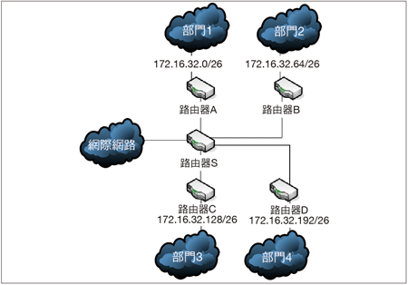

接下來，將要分配路由器A、B、C、D以及路由器S之間的IP位址。剛剛分配完四個部分後，172.16.32.0/24都不能使用了。所以，接下來可分配的第一組子網路可以是：


再來，看看遮罩數目應該要多少。假設要先分配給路由器A和路由器S之間，則因為只需要分配兩個IP位址，一個給路由器A朝向路由器S的介面，另一個IP位址則分配給路由器S朝向路由器A的介面。

因此，至少要使用的遮罩是30，所以可以得知要分配的子網路是：

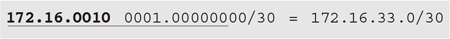

同樣地，路由器B和路由器S之間的子網路就是下一段子網路位址：

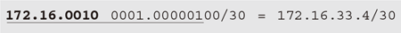

而路由器C和路由器S之間的子網路就是下一段子網路位址：


路由器D和路由器S之間的子網路就是下一段子網路位址：


現在，把這些子網路資訊加到剛剛的網路架構圖中，就完成了整個IP位址分配，如圖3所示。

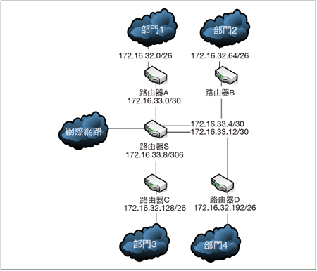

大功告成！到這裡，相信大家已經了解到這個技術的威力了。

## CIDR 重點2：路由匯總

路由匯總就是Route Summarization，又稱為Route Aggregation或是Super-netting。主要目的就是在於將多筆路由資訊匯總而成比較簡單的單筆路由資訊。

如果用實際生活的範例來解釋的話，可以這樣思考：把信件想成是網路封包，地址就是IP位址，路由當然就是各個郵差如何去運送這些信件的方式。為了達到很好的效率，因此產生現在這樣的地址設計。

舉例來說，台北市分成各個區，有大安區、中正區、信義區等等，所以當郵差還沒有看到詳細的地址之前，可以先根據大區域先分類，然後再由各個區域的郵差去細部運送。同樣地，當其他縣市郵局看到是送往台北市的信件，也不用看細部的地址甚至於區域，直接先送往台北市負責的郵局（假設有一個台北市郵局先處理全部送往台北市的所有信件），這樣的設計會變得很有效率。路由匯總的設計原理跟這範例是類似的。

接著來看看圖4這個例子，也許大家會比較容易了解路由匯總的用途和好處在哪裡。
在圖4的網路架構圖中，路由器X連接著兩個子網路，分別是172.16.32.0/24和172.16.128.0/24，如果沒有路由匯總，則路由器X必須把這兩個子網路 中的路由資訊全部傳送給路由器Y，如此一來，一旦這兩個子網路中有任何的改變，則路由器X都必須傳送相對應的路由資訊給路由器Y，這樣不僅增加太多網路負擔，要維護這些資料也是相當麻煩的事情。

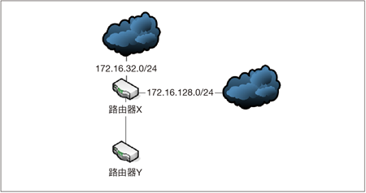

如果再仔細看一下這個網路架構圖，可以發現對於路由器Y而言，相當於「路由器X知道如何送到172.16.0.0/16這樣的網路區段」。所以，以後一旦路由器Y收到相當於傳送給172.16.0.0/16這樣的目的地，就可以直接把這樣的封包傳送給路由器X，因為它知道怎麼傳送。把172.16.32.0/24和172.16.128.0/24這兩個子網路路由資訊結合成一筆172.16.0.0/16的路由，就是路由匯總的功能。

Classless的路由協定（像是RIPv2、OSPF、IS-IS以及EIGRP路由協定等等）都有支援路由匯總，當然也支援VLSM，而Classful的路由協定（例如RIPv1和IGRP路由協定）則沒有支援路由匯總，因為已經自動做了相對應的匯總動作。

路由匯總的詳細資訊與運作方式，都被定義在RFC 1518之中（An Architecture for IP Address Allocation with CIDR），可前往查看並研讀。

### 路由匯總的計算方式

了解路由匯總的目的與運作方式之後，應該就已經大略明白如何計算路由匯總的資料。不過，下面還是用例子來說明一下。假設有個路由器收到以下這些子網路的路由資訊更新：


那麼路由匯總之後的資料應該是如何呢？首先把這些資料轉成二進位：

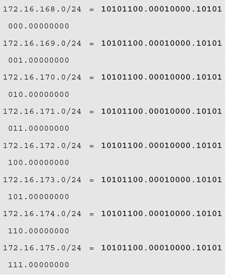

轉換之後，很容易就可以發現，前面粗體字部分在這八個子網路當中都是一樣的，所以這些相同的部分就是路由匯總之後的結果，也就是：

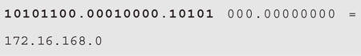

因為相同的部分有21個數字，所以遮罩就是21。因此，最後路由匯總的結果就是：


現在，應該也能完全了解路由匯總了。接著，來看看多變長度子網路遮罩下的路由匯總又是如何。

### 多變長度子網路遮罩的路由匯總

以圖5的網路架構圖為例，為大家說明多變長度子網路遮罩的路由匯總又是如何計算的。

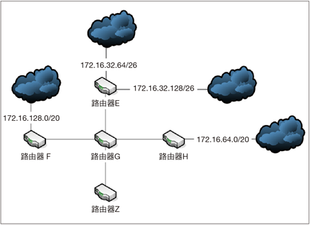

假設路由器E、F以及路由器H會把路由資訊傳送給路由器G，然後路由器G會把路由資訊傳送給路由器Z，這裡可以發現，路由器E所連接的子網路遮罩是26，而路由器F和路由器H所連接的子網路遮罩是20，因此這個網路架構是多變長度子網路遮罩。

底下來看看如何在這個多變長度子網路遮罩的環境中做到路由匯總。首先，匯總路由器E所連接的子網路，若將路由器E所連接的子網路172.16.32.64/26和172.16.32.128/26轉換成二進位，則如下列所示：

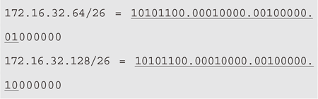

可以發現匯總起來的結果是：

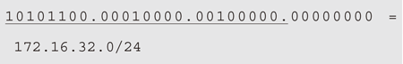

所以，路由器E傳送給路由器G的路由匯總資料是172.16.32.0/24。因此，路由器G會收到的路由資料有：

```
172.16.128.0/20
172.16.32.0/24
172.16.64.0/20
```

若將這些資料轉換成二進位，則如下列所示：

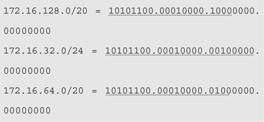

即使這三筆路由資料各使用不同的子網路遮罩，但從上面的二進位表示法中可以很清楚地發現，相同之處只有最前面的部分，如下所示：


而後面都完全不同，所以這三筆路由資料經過路由匯總之後的結果應該是：

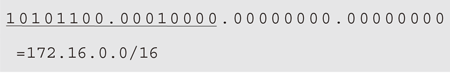

看到這裡，想必大家應該都已經完全明白在多變長度子網路遮罩的環境中如何做到路由匯總了。

### 設計路由匯總所必須考慮的因素

從這些介紹可以發現路由匯總有以下這些好處：

1. 有效地減少路由更新的頻率
2. 減少不必要的網路流量
3. 減少路由表所佔據的記憶體使用量

但是，在使用路由匯總的同時，以下這些因素也是網路管理人員所必須考量的：

1. 所有不同的IP位址都必須擁有一定程度的相同之 位元。這裡所指的相同的位元，當然都必須是從左邊考量過來，也就是所謂的Highest Order Bits。
2. 路由的決定必須取決於整個完整的位址，也就是整 個32位元的位址。
3. 路由協定必須傳送子網路遮罩的長度資訊。

### CIDR的優勢所在

由上面的例子與各種技術的說明，可以看出CIDR的能力與使用的方法，因此以下可以歸納出幾個CIDR的優點：

**1. 更有效地使用IP位址**

從上面的範例就可以看出來，分割子網路時，所可能浪費的IP位址數量可藉由多變長度子網路遮罩而大量地減少。

**2. 可達到更好的路由匯總功能**

多變長度子網路遮罩讓IP分配更有階層式架構的感覺，但又不受限於原本的類別分割方式。舉剛剛的例子來說，原本子網路的部分為172.16.32.0/20，但是透過多變長度子網路遮罩，可以再次分成172.16.32.0/28、172.16.32.32/28等等的子網路。

因此，多變長度子網路等於是從原本的子網路再次切割出來，而這種情況在路由表格中可以達到更好的路由匯總功能（Route Summarization）。

**3. 能有效減少其他路由器的路由更新次數**

如果路由匯總功能被使用在大型或是比較複雜的網路架構中，則在某個子網路底下的某網路連結有狀況上的改變，也不會影響其他網段的路由器。

舉例來說，假設在172.16.32.0/28中有個網路連線不穩定，連線時好時壞，則因為有使用路由匯總功能，所以對其他網段的路由器而言，根本不用考慮到如此詳盡的資料，也就是說，其他路由器並不需要做相對頻繁的路由資料更新動作。

## 結語

其實簡單來說，CIDR綜合了以上提到的技術，這些都是從RFC 1518和1519等文件開始記錄這些改進後的設計。這裡整理出幾個CIDR的宗旨：

1. 網路遮罩可以指定任意長度，也就是採用多變長度 子網路遮罩的技術。
2. 利用路由匯總的方式，使得網路路由程序簡單化， 不需要分級。
3. 打破原本類別的規範，可以依據真正的需求來規劃 IP位址分配。

到這裡為止，相信各位已經明白所謂的CIDR（Classless Inter-Domain Routing）是如何運作的，包含這項技術的設計緣由、設計方式以及運作原理等等，希望能夠讓大家了解如何更有效地規劃企業的網路。

