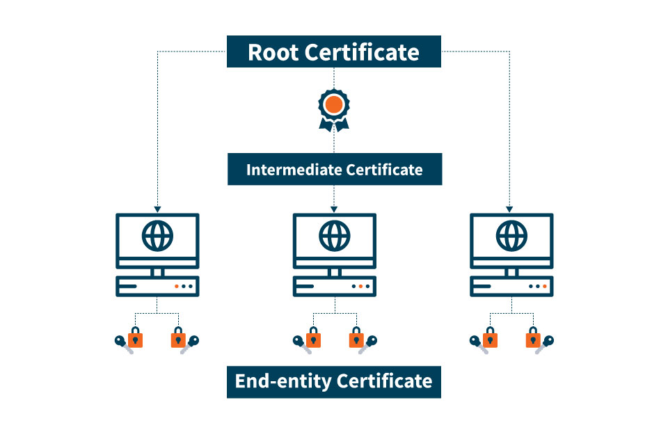

# 在憑證信任庫中安裝根 CA 證書

原文: [Installing a root CA certificate in the trust store](https://ubuntu.com/server/docs/security-trust-store)



通常在企業的 IT 環境中有時會有一個本地證書頒發機構 (CA)，它頒發自簽的證書供在組織內中的服務來使用。為了使 Ubuntu 服務器正常運行並信任此環境中的主機或服務，此 CA 必須安裝在 Ubuntu 的憑證信任庫中。

##　憑證的格式（PEM 或 DER）

要在憑證信任庫中安裝證書，它必須採用 **PEM** 格式。**PEM** 格式的證書採用 `base64` 格式，是人類可讀的，並以 `----BEGIN CERTIFICATE----` 行開頭。如果你看到這些行，你就可以安裝了。如果不是，則很可能是 DER 格式的證書，需要先行進行格式轉換 (DER 轉成 PEM 格式)。

## 安裝 PEM 格式的證書

假設 PEM 格式的根 CA 證書位於 `local-ca.crt` 中，請按照以下步驟進行安裝。

!!! tip
    注意：文件的擴展名必需為 `.crt` 很重要，否則將不會被處理。

```bash
$ sudo apt-get install -y ca-certificates作為 /etc/ssl/certs/ca-certificates.crt 中的單個文件（PEM 包）
作為 /etc/ssl/certs 中的 OpenSSL 兼容證書目錄
$ sudo cp local-ca.crt /usr/local/share/ca-certificates
$ sudo update-ca-certificates
```

在此之後，您可以使用 Ubuntu 的工具（如 `curl` 和 `wget`）連接到本地站點。

## 從 DER 格式轉換為 PEM 格式

將名為 `local-ca.der` 的 DER 格式證書轉換為 PEM 格式，如下所示：

```bash
$ sudo openssl x509 -inform der -outform pem -in local-ca.der -out local-ca.crt
```

## CA 憑證信任庫存儲位置

由 `update-ca-certificates` 生成的 CA 信任庫位於以下位置：

- 作為 `/etc/ssl/certs/ca-certificates.crt` 中的單個文件（PEM 包）
- 作為 `/etc/ssl/certs` 中的 OpenSSL 兼容證書目錄
