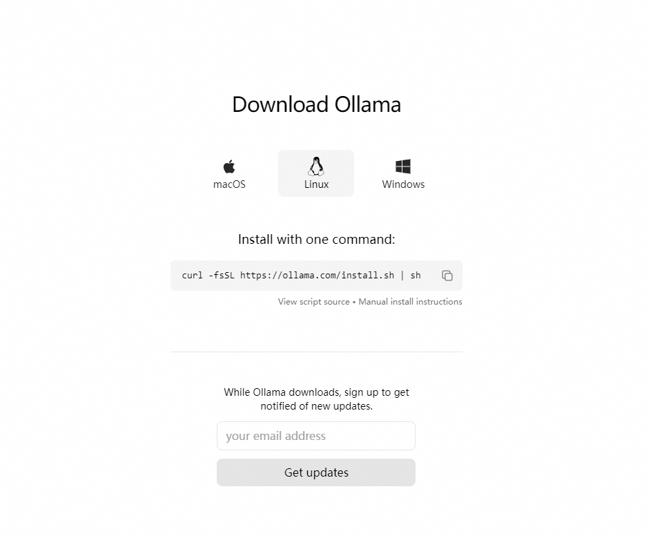

# Ollama 簡介

原文: [LLM大模型部署实战指南](https://www.cnblogs.com/ting1/p/18358286)

Ollama 是一個開源框架，專為在本地機器上便捷部署和運行大型語言模型（LLM）而設計。 ，這是 Ollama 的官網網址：https://ollama.com/

以下是其主要特點和功能概述：

- 簡化部署：Ollama 目標在於簡化在 Docker 容器中部署大型語言模型的過程，使得非專業使用者也能方便地管理和運行這些複雜的模型。
- 輕量級與可擴展：作為輕量級框架，Ollama 保持了較小的資源佔用，同時具備良好的可擴展性，允許用戶根據需要調整配置以適應不同規模的專案和硬體條件。
- API支援：提供了一個簡潔的 API，使得開發者能夠輕鬆建立、運行和管理大型語言模型實例，降低了與模型互動的技術門檻。
- 預先建立模型庫：包含一系列預先訓練好的大型語言模型，使用者可以直接選用這些模型應用於自己的應用程序，無需從頭訓練或自行尋找模型來源



## 一鍵安裝

執行下列命令:

```bash
curl -fsSL https://ollama.com/install.sh | sh
```

## 手動安裝

下載 ollama 二進位檔案

Ollama 以自包含的二進位檔案形式分發。可至 [Ollama Release](https://github.com/ollama/ollama/releases) 根據對應的 O.S 來下載 Ollama Binary 到您的 PATH 中的目錄。

或是根據下列 [Ollama Manaul install](https://github.com/ollama/ollama/blob/main/docs/linux.md) 指引來進行。

```bash
curl -L https://ollama.com/download/ollama-linux-amd64.tgz -o ollama-linux-amd64.tgz
sudo tar -C /usr -xzf ollama-linux-amd64.tgz
```

### 新增 Ollama 作為啟動服務

為 Ollama 建立使用者和群組：

```bash
sudo useradd -r -s /bin/false -U -m -d /usr/share/ollama ollama
sudo usermod -a -G ollama $(whoami)
```

`useradd` 指令:
- `-r` 建立一個系統帳戶
- `-s` 指定新用戶帳戶的默認 shell
- `-U` 建立一個與使用者同名的群組
- `-m` 自動創建新用戶帳戶的主目錄
- `-d` 指定新用戶帳戶的主目錄

!!! info
    在 Linux 系統中，`useradd` 指令用於新增使用者。 `-r` 選項的作用是建立一個系統使用者帳戶。系統使用者帳戶主要用於系統服務和進程，通常這些使用者不會有自己的登入權限。使用 `-r` 選項時，`useradd` 指令會建立一個系統帳戶，並將其 `UID`（使用者 ID）設定為系統範圍內的特定值（通常低於 `1000`）。這些帳戶的主要用途是提供系統服務所需的存取權限，而不是用於登入系統。

在 `/etc/systemd/system/ollama.service` 中建立服務文件：

```bash
[Unit]
Description=Ollama Service
After=network-online.target

[Service]
ExecStart=/usr/bin/ollama serve
User=ollama
Group=ollama
Restart=always
RestartSec=3
Environment="PATH=$PATH"

[Install]sudo systemctl daemon-reload
sudo systemctl enable ollama
WantedBy=default.target
```

然後啟動服務：

```bash
sudo systemctl daemon-reload
sudo systemctl enable ollama
```

### 啟動 Ollama 服務

使用 systemd 啟動 Ollama：

```bash
sudo systemctl start ollama
sudo systemctl status ollama
```

## 修改模型檔儲存路徑

Ollama模型預設儲存在：
- Linux：`/usr/share/ollama/.ollama/models`

如果 Ollama 作為 systemd 服務運行，則應使用以下命令設定環境變數 `systemctl`：

1. 透過呼叫來編輯 systemd 服務 `systemctl edit ollama.service`。這將打開一個編輯器。
2. 對於每個環境指標的環境，在部分下方新增一行 `[Service]`：

    ```bash
    [Service]
    Environment="OLLAMA_HOST=0.0.0.0:7861"
    Environment="OLLAMA_MODELS=/www/algorithm/LLM_model/models"
    ```

3. 儲存並退出。
4. 重新載入 systemd 並重新啟動 Ollama：

    ```bash
    systemctl daemon-reload 
    systemctl restart ollama
    ```
5. 使用 systemd 啟動 Ollama：

    ```bash
    sudo systemctl start ollama
    ```

## 啟動 LLM

**下載模型:**

```bash
ollama pull llama3.1
ollama pull qwen2
```


**運行模型:**

```bash
ollama run llama3.1
ollama run qwen2
```

## Ollama 命令解說

```bash
$ ollama -h

Large language model runner

Usage:
  ollama [flags]
  ollama [command]

Available Commands:
  serve       Start ollama
  create      Create a model from a Modelfile
  show        Show information for a model
  run         Run a model
  pull        Pull a model from a registry
  push        Push a model to a registry
  list        List models
  ps          List running models
  cp          Copy a model
  rm          Remove a model
  help        Help about any command

Flags:
  -h, --help      help for ollama
  -v, --version   Show version information

Use "ollama [command] --help" for more information about a command.
```

### `- serve`

手動地使用命令行來啟用 ollama 的服務


### `- create`

從模型定義設定檔案來讓 ollama 使用客制模型

### `- show`

顯示特定模型的元信息(metadata):

```bash
$ ollama show llama3.1

  Model                                          
  	parameters      	8.0B  	                         
  	quantization    	Q4_0  	                         
  	arch            	llama 	                         
  	context length  	131072	                         
  	embedding length	4096  	                         
  	                                               
  Parameters                                     
  	stop	"<|start_header_id|>"	                      
  	stop	"<|end_header_id|>"  	                      
  	stop	"<|eot_id|>"         	                      
  	                                               
  License                                        
  	LLAMA 3.1 COMMUNITY LICENSE AGREEMENT        	  
  	Llama 3.1 Version Release Date: July 23, 2024
```

### `- run`

運行模型

```bash
$ ollama run llama3.1

>>> 你好
您好！我是中文AI助手。很高兴和您聊天！今天过得怎么样呢？

>>> Send a message (/? for help)
```

### `- pull`

從 registry 中下載模型

```bash
$ ollama pull llama3.1
```

### `- push`

將本地模型推送到 ollama model registry 中:

```bash
$ ollama push -h

Push a model to a registry

Usage:
  ollama push MODEL [flags]

Flags:
  -h, --help       help for push
      --insecure   Use an insecure registry

Environment Variables:
      OLLAMA_HOST                IP Address for the ollama server (default 127.0.0.1:11434
```

### `- list`

列出下載到本地的模型資訊:

```bash
$ ollama list

NAME                                   	ID          	SIZE  	MODIFIED          
llama3.1:latest                        	42182419e950	4.7 GB	47 minutes ago   	
qwen2:latest                           	dd314f039b9d	4.4 GB	About an hour ago
```

### `- ps`

列出正在運行的本地模型:

```bash
$ ollama ps

NAME           	ID          	SIZE  	PROCESSOR      	UNTIL              
llama3.1:latest	42182419e950	5.9 GB	73%/27% CPU/GPU	4 minutes from now
```

### `- rm`

刪除己下載到本地模型:

```bash
$ ollama rm llama3.1

deleted 'llama3.1'
```