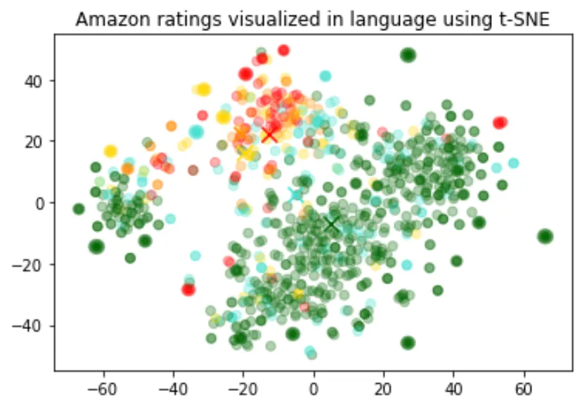

# Embeddings

## 什麼是嵌入?

OpenAI 的文本嵌入可用來衡量不同文字字串的相關性。嵌入通常用於：

- **Search** 其中結果按與查詢字串的相關性進行排名
- **Clustering** 其中文字字串按相似性分組
- **Recommendations** 推薦具有相關文字字串的項目
- **Anomaly detection** 辨識出相關性很小的異常值
- **Diversity measurement** 分析相似度分佈
- **Classification** 其中文字字串按最相似的標籤進行分類

嵌入是浮點數的向量。兩個向量之間的距離衡量它們的相關性。距離小表示相關性高，距離大表示相關性低。

## 如何獲得嵌入

若要取得嵌入，請將文字字串以及嵌入模型 ID 的選擇（例如，`text-embedding-ada-002`）傳送到 embeddings API 端點。回應將包含一個嵌入，您可以提取、儲存和使用它。

請求範例：

=== "python"

    ```python
    from openai import OpenAI
    client = OpenAI()

    response = client.embeddings.create(
        input="Your text string goes here",
        model="text-embedding-ada-002"
    )

    print(response.data[0].embedding)
    ```

=== "curl"

    ```bash
    curl https://api.openai.com/v1/embeddings \
    -H "Content-Type: application/json" \
    -H "Authorization: Bearer $OPENAI_API_KEY" \
    -d '{
        "input": "Your text string goes here",
        "model": "text-embedding-ada-002"
    }'
    ```

回應範例：

```json
{
  "data": [
    {
      "embedding": [
        -0.006929283495992422,
        -0.005336422007530928,
        ...
        -4.547132266452536e-05,
        -0.024047505110502243
      ],
      "index": 0,
      "object": "embedding"
    }
  ],
  "model": "text-embedding-ada-002",
  "object": "list",
  "usage": {
    "prompt_tokens": 5,
    "total_tokens": 5
  }
}
```

## 嵌入模型

OpenAI 提供 1 個第二代嵌入模型（模型 ID 中以 `-002` 表示）和 16 個第一代模型（模型 ID 中以 `-001` 表示）。

我們建議對幾乎所有用例使用 `text-embedding-ada-002`。它更好、更便宜、使用更簡單。

|MODEL GENERATION|TOKENIZER|MAX INPUT TOKENS|KNOWLEDGE CUTOFF|
|----------------|---------|----------------|----------------|
|V2|cl100k_base|**8191**|Sep 2021|
|V1|GPT-2/GPT-3|2046|Aug 2020|

使用按輸入 token 定價，每 1000 個令牌 $0.0004 美元，或每美元約 3,000 個頁面（假設每頁約 800 個令牌）:

|MODEL|ROUGH PAGES PER DOLLAR|EXAMPLE PERFORMANCE ON BEIR SEARCH EVAL|
|-----|----------------------|---------------------------------------|
|text-embedding-ada-002|3000|53.9|
|*-davinci-*-001|6|52.8|
|*-curie-*-001|60|50.9|
|*-babbage-*-001|240|50.4|
|*-ada-*-001|300|49.0|

**第二代模型**

|MODEL NAME|TOKENIZER|MAX INPUT TOKENS|OUTPUT DIMENSIONS|
|----------|---------|----------------|-----------------|
|text-embedding-ada-002|cl100k_base|**8191**|**1536**|

## 案例

這裡我們展示了一些代表性的用例。我們將在以下範例中使用 [Amazon 美食評論資料集](https://www.kaggle.com/snap/amazon-fine-food-reviews)。

### 取得 embeddings

該資料集包含截至 2012 年 10 月亞馬遜用戶留下的總共 568,454 條食品評論。出於說明目的，我們將使用 1,000 條最新評論的子集。評論是英文的，往往是正面的或負面的。每則評論都有 ProductId、UserId、Score、評論標題（摘要）和評論正文（文字）。例如：

|PRODUCT ID|USER ID|SCORE|SUMMARY|TEXT|
|----------|-------|-----|-------|----|
|B001E4KFG0|A3SGXH7AUHU8GW|5|Good Quality Dog Food|I have bought several of the Vitality canned...|
|B00813GRG4|A1D87F6ZCVE5NK|1|Not as Advertised|Product arrived labeled as Jumbo Salted Peanut...|

我們將把評論摘要和評論文本合併成一個組合文本。該模型將對組合文字進行編碼並輸出單一向量嵌入(single vector embedding)。

[Get embeddings from dataset](https://cookbook.openai.com/examples/get_embeddings_from_dataset)

```python
from openai import OpenAI
client = OpenAI()

def get_embedding(text, model="text-embedding-ada-002"):
   text = text.replace("\n", " ")
   return client.embeddings.create(input = [text], model=model).data[0].embedding

df['ada_embedding'] = df.combined.apply(lambda x: get_embedding(x, model='text-embedding-ada-002'))

df.to_csv('output/embedded_1k_reviews.csv', index=False)
```

要從已儲存的檔案載入數據，您可以執行以下命令：

```python
import pandas as pd

df = pd.read_csv('output/embedded_1k_reviews.csv')

df['ada_embedding'] = df.ada_embedding.apply(eval).apply(np.array)
```

### 數據 2D 視覺化

[Visualizing_embeddings_in_2D.ipynb](https://cookbook.openai.com/examples/visualizing_embeddings_in_2d)

嵌入的大小隨著底層模型的複雜度而改變。為了可視化這些高維度數據，我們使用 `t-SNE` 演算法將數據轉換為二維。

我們根據評論者給出的星級評分對各個評論進行著色：

- 1-star: red
- 2-star: dark orange
- 3-star: gold
- 4-star: turquoise
- 5-star: dark green



視覺化似乎產生了大約 3 個集群，其中一個集群大多是負面評論。

```python
import pandas as pd
from sklearn.manifold import TSNE
import matplotlib.pyplot as plt
import matplotlib

df = pd.read_csv('output/embedded_1k_reviews.csv')
matrix = df.ada_embedding.apply(eval).to_list()

# Create a t-SNE model and transform the data
tsne = TSNE(n_components=2, perplexity=15, random_state=42, init='random', learning_rate=200)
vis_dims = tsne.fit_transform(matrix)

colors = ["red", "darkorange", "gold", "turquiose", "darkgreen"]
x = [x for x,y in vis_dims]
y = [y for x,y in vis_dims]
color_indices = df.Score.values - 1

colormap = matplotlib.colors.ListedColormap(colors)
plt.scatter(x, y, c=color_indices, cmap=colormap, alpha=0.3)
plt.title("Amazon ratings visualized in language using t-SNE")
```

### 作為文字特徵編碼器 

[Regression_using_embeddings.ipynb](https://cookbook.openai.com/examples/regression_using_embeddings)

嵌入可以用作機器學習模型中的通用自由文字特徵編碼器。如果一些相關輸入是自由文本，那麼結合嵌入將提高任何機器學習模型的效能。嵌入也可以用作 ML 模型中的分類特徵編碼器。如果分類變數的名稱有意義且數量眾多（例如職位名稱），那麼這會增加最大的價值。對於此任務，相似性嵌入通常比搜尋嵌入表現更好。

我們觀察到，通常嵌入表示非常豐富且資訊密集。例如，使用 SVD 或 PCA 降低輸入維度，即使降低 10%，通常也會導致特定任務的下游效能變差。

程式碼將資料分為訓練集和測試集，將由以下兩個用例使用，即回歸和分類。

```python
from sklearn.model_selection import train_test_split

X_train, X_test, y_train, y_test = train_test_split(
    list(df.ada_embedding.values),
    df.Score,
    test_size = 0.2,
    random_state=42
)
```

**使用嵌入特徵進行迴歸分析**

嵌入提供了一種預測數值的優雅方法。在此範例中，我們根據評論者的評論文字來預測評論者的星級。由於嵌入中包含的語義資訊很高，因此即使評論很少，預測也不錯。

我們假設分數是 1 到 5 之間的連續變量，並允許演算法預測任何浮點值。 ML 演算法最小化了預測值與真實分數的距離，並實現了 0.39 的平均絕對誤差，這意味著預測平均偏差不到半顆星。

```python
from sklearn.ensemble import RandomForestRegressor

rfr = RandomForestRegressor(n_estimators=100)
rfr.fit(X_train, y_train)
preds = rfr.predict(X_test)
```

### 作為特徵來進行分類

[Classification_using_embeddings.ipynb](https://cookbook.openai.com/examples/classification_using_embeddings)

這次，我們不會讓演算法預測 1 到 5 之間的任何值，而是嘗試將評論的確切星級數分成 5 個桶，範圍從 1 到 5 顆星。

訓練後，模型學習預測 1 星和 5 星評論的效果比更細緻的評論（2-4 星）要好得多，這可能是由於更極端的情緒表達。

```python
from sklearn.ensemble import RandomForestClassifier
from sklearn.metrics import classification_report, accuracy_score

clf = RandomForestClassifier(n_estimators=100)
clf.fit(X_train, y_train)
preds = clf.predict(X_test)
```

### Zero-shot 分類

[Zero-shot_classification_with_embeddings.ipynb](https://cookbook.openai.com/examples/zero-shot_classification_with_embeddings)

我們可以使用嵌入進行零樣本分類，而無需任何標記的訓練資料。對於每個類，我們嵌入類名稱或類的簡短描述。為了以零樣本的方式對一些新文本進行分類，我們將其嵌入與所有類別嵌入進行比較，並預測相似度最高的類別。

```python
from openai.embeddings_utils import cosine_similarity, get_embedding

df= df[df.Score!=3]
df['sentiment'] = df.Score.replace({1:'negative', 2:'negative', 4:'positive', 5:'positive'})

labels = ['negative', 'positive']
label_embeddings = [get_embedding(label, model=model) for label in labels]

def label_score(review_embedding, label_embeddings):
   return cosine_similarity(review_embedding, label_embeddings[1]) - cosine_similarity(review_embedding, label_embeddings[0])

prediction = 'positive' if label_score('Sample Review', label_embeddings) > 0 else 'negative'
```

### 進行冷啟動推薦

[User_and_product_embeddings.ipynb](https://cookbook.openai.com/examples/user_and_product_embeddings)

我們可以透過對所有評論進行平均來獲得用戶嵌入。類似地，我們可以透過對有關該產品的所有評論進行平均來獲得產品嵌入。為了展示這種方法的實用性，我們使用 5 萬條評論的子集來覆蓋每個用戶和每個產品的更多評論。

我們在單獨的測試集上評估這些嵌入的有用性，其中我們將使用者和產品嵌入的相似性繪製為評級的函數。有趣的是，基於這種方法，即使在用戶收到產品之前，我們也可以比隨機更好地預測他們是否喜歡該產品。


```python
user_embeddings = df.groupby('UserId').ada_embedding.apply(np.mean)

prod_embeddings = df.groupby('ProductId').ada_embedding.apply(np.mean)
```

### 聚類

[Clustering.ipynb](https://cookbook.openai.com/examples/clustering)

聚類是理解大量文字資料的一種方法。嵌入對於此任務很有用，因為它們提供了每個文本的語義上有意義的向量表示。因此，以無監督的方式，聚類將揭示資料集中隱藏的分組。

在這個例子中，我們發現了四個不同的群集：一個專注於狗糧，一個專注於負面評論，兩個專注於正面評論。


```python
import numpy as np
from sklearn.cluster import KMeans

matrix = np.vstack(df.ada_embedding.values)
n_clusters = 4

kmeans = KMeans(n_clusters = n_clusters, init='k-means++', random_state=42)
kmeans.fit(matrix)
df['Cluster'] = kmeans.labels_
```

### 進行文字搜尋

[Semantic_text_search_using_embeddings.ipynb](https://cookbook.openai.com/examples/semantic_text_search_using_embeddings)

為了檢索最相關的文檔，我們使用查詢的嵌入向量與每個文檔之間的餘弦相似度，並返回得分最高的文檔。

```python
from openai.embeddings_utils import get_embedding, cosine_similarity

def search_reviews(df, product_description, n=3, pprint=True):
   embedding = get_embedding(product_description, model='text-embedding-ada-002')
   df['similarities'] = df.ada_embedding.apply(lambda x: cosine_similarity(x, embedding))
   res = df.sort_values('similarities', ascending=False).head(n)
   return res

res = search_reviews(df, 'delicious beans', n=3)
```

### 進行程式碼搜尋

[Code_search.ipynb](https://cookbook.openai.com/examples/code_search)

程式碼搜尋的工作方式與基於嵌入的文字搜尋類似。我們提供了一種從給定儲存庫中的所有 Python 檔案中提取 Python 函數的方法。然後，每個函數都由 `text-embedding-ada-002` 模型進行索引。

為了執行程式碼搜索，我們使用相同的模型將查詢嵌入到自然語言中。然後我們計算生成的查詢嵌入和每個函數嵌入之間的餘弦相似度。餘弦相似度最高的結果最相關。

```python
from openai.embeddings_utils import get_embedding, cosine_similarity

df['code_embedding'] = df['code'].apply(lambda x: get_embedding(x, model='text-embedding-ada-002'))

def search_functions(df, code_query, n=3, pprint=True, n_lines=7):
   embedding = get_embedding(code_query, model='text-embedding-ada-002')
   df['similarities'] = df.code_embedding.apply(lambda x: cosine_similarity(x, embedding))

   res = df.sort_values('similarities', ascending=False).head(n)
   return res

res = search_functions(df, 'Completions API tests', n=3)
```

### 進行推薦

[Recommendation_using_embeddings.ipynb](https://cookbook.openai.com/examples/recommendation_using_embeddings)

由於嵌入向量之間的距離越短表示相似性越高，因此嵌入對於推薦很有用。

下面，我們舉例說明一個基本的推薦器。它接受一個字串列表和一個「來源」字串，計算它們的嵌入，然後傳回字串的排名，從最相似到最不相似排列。作為一個具體範例，下面連結的筆記本將此函數的一個版本應用於 AG 新聞資料集（採樣到 2,000 條新聞文章描述），以傳回與任何給定來源文章最相似的前 5 篇文章。

```python
def recommendations_from_strings(
   strings: List[str],
   index_of_source_string: int,
   model="text-embedding-ada-002",
) -> List[int]:
   """Return nearest neighbors of a given string."""

   # get embeddings for all strings
   embeddings = [embedding_from_string(string, model=model) for string in strings]

   # get the embedding of the source string
   query_embedding = embeddings[index_of_source_string]

   # get distances between the source embedding and other embeddings (function from embeddings_utils.py)
   distances = distances_from_embeddings(query_embedding, embeddings, distance_metric="cosine")

   # get indices of nearest neighbors (function from embeddings_utils.py)
   indices_of_nearest_neighbors = indices_of_nearest_neighbors_from_distances(distances)
   return indices_of_nearest_neighbors
```
