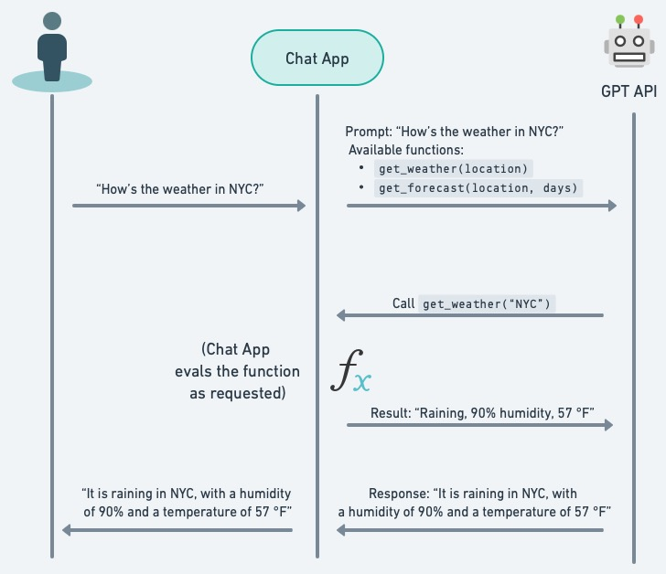

# Function calling

了解如何將大型語言模型與外部工具進行整合與連接。

## 介紹

為了能夠呼叫讓 LLM 決定如何正確呼叫外部的 API ，您可以在 Chat Completion 的的呼叫中去{==描述想要 LLM 決定去呼外的外部函數的功能描述(比如 get_weather() 函數是用來取得最更新的天氣資訊...)，並讓 LLM 模型智慧地選擇輸出包含呼叫一個或多個函數的參數的 JSON 物件==}。Chat Completions API 不會呼叫該函數；相反，LLM 模型會產生呼叫該外部函數的 Input JSON　物件，您可以使用這個 JSON 物件來它來呼叫這個外部函數。

<figure markdown="span">
  
  <figcaption>Function calling 範例流程</figcaption>
</figure>

最新模型（`gpt-3.5-turbo-0125` 和 `gpt-4-turbo-preview`）經過訓練，可以根據使用者的 Input 訊息來決定何時應調用外部函數（取決於輸入）並使用遵循函數簽名的 JSON 來生成呼叫外部外部函數的 JSON object。這種能力也帶來了潛在的風險。我們強烈建議在代表用戶採取行動（發送電子郵件、在線上發佈內容、購買等）之前建立用戶確認流程。

範例:

```bash hl_lines="20-139"
curl --location 'https://api.openai.com/v1/chat/completions' \
--header 'Content-Type: application/json' \
-u :$OPENAI_API_KEY \
--data '{
    "messages": [
        {
            "role": "system",
            "content": "The current date and time is 2023-07-22T13:57:34+02:00. Be very presumptive when guessing the values of function parameters."
        },
        {
            "role": "user",
            "content": "What things can I do in Amsterdam?"
        }
    ],
    "model": "gpt-4-0613",
    "max_tokens": null,
    "stream": false,
    "n": 1,
    "temperature": 0.0,
    "functions": [
        {
            "name": "planner",
            "description": "Plan a public transport trip from train station A to station B in the Netherlands.",
            "parameters": {
                "type": "object",
                "properties": {
                    "origin": {
                        "description": "origin station name in the Netherlands for the trip. Be presumtive and accept very short shorthands.",
                        "type": "string"
                    },
                    "destination": {
                        "description": "destination station name in the Netherlands for the trip. Be presumptive and accept very short shorthands.",
                        "type": "string"
                    },
                    "trip_date_time": {
                        "description": "Requested DateTime for the departure or arrival of the trip in '\''YYYY-MM-DDTHH:MM:SS+02:00'\'' format. The user will use a time in a 12 hour system, make an intelligent guess about what the user is most likely to mean in terms of a 24 hour system, e.g. not planning for the past.",
                        "type": "string"
                    },
                    "departure": {
                        "description": "True to depart at the given time, False to arrive at the given time",
                        "type": "boolean"
                    },
                    "language": {
                        "description": "Language of the input text",
                        "type": "string"
                    }
                },
                "required": [
                    "origin",
                    "destination",
                    "departure",
                    "language"
                ]
            }
        },
        {
            "name": "train_station_departures",
            "description": "Show the departures from a train station in the Netherlands",
            "parameters": {
                "type": "object",
                "properties": {
                    "departure_station": {
                        "description": "Departure train station in the Netherlands",
                        "type": "string"
                    },
                    "dateTime": {
                        "description": "Requested DateTime for the departures or arrival of the trip in '\''YYYY-MM-DDTHH:MM:SS+02:00'\'' format.",
                        "type": "string"
                    },
                    "transport_type": {
                        "description": "Type of departures to show. Either '\''train'\'' or '\''bus'\''",
                        "enum": [
                            "train",
                            "bus"
                        ],
                        "type": "string"
                    }
                },
                "required": [
                    "departure_station",
                    "dateTime"
                ]
            }
        },
        {
            "name": "outings",
            "description": "Show the available outings in an area in the Netherlands",
            "parameters": {
                "type": "object",
                "properties": {
                    "area": {
                        "description": "Area in the Netherlands",
                        "type": "string"
                    }
                },
                "required": [
                    "area"
                ]
            }
        },
        {
            "name": "show_screen",
            "description": "Determine which screen the user wants to see",
            "parameters": {
                "type": "object",
                "properties": {
                    "screen_to_show": {
                        "description": "type of screen to show. Either '\''account'\'': '\''all personal data of the user'\'', '\''settings'\'': '\''if the user wants to change the settings of the app'\''",
                        "enum": [
                            "account",
                            "settings"
                        ],
                        "type": "string"
                    }
                },
                "required": [
                    "screen_to_show"
                ]
            }
        },
        {
            "name": "custom_search",
            "description": "answer all questions about NS",
            "parameters": {
                "title": "QAToolInput",
                "type": "object",
                "properties": {
                    "question": {
                        "title": "Question",
                        "description": "question about NS",
                        "type": "string"
                    }
                },
                "required": [
                    "question"
                ]
            }
        }
    ]
}'
```

## 常見用例

OpenAI 的 Function calling 可讓您更可靠地讓 LLM 模型生成結構化資料。這樣的能力可讓 LLM 模型可以：

- 建立透過呼叫外部 API 來回答問題的助手（例如 ChatGPT 插件）
    - 例如定義諸如 `send_email(to: string, body: string)` 或 `get_current_weather(location: string, unit: 'celsius' | 'fahrenheit')` 之類的函數
- 將自然語言轉換為 API 呼叫
    - 例如轉換 "誰是我的主要客戶？" `get_customers(min_revenue: int, created_before: string, limit: int)` 並且呼叫您的內部 API
- 從文字中提取結構化數據
    - 例如定義一個名為 `extract_data(name: string,birthday: string)` 或 `sql_query(query: string)` 的函數

Function calling　的基本步驟順序如下：

1. 在呼叫 OpenAI 的 ChatCompletion 的呼叫中使用 functions parameter　定義的一組函數讓 LLM 來決定呼叫。
2. LLM 模型可以選擇呼叫一個或多個函數；如果是這樣，(1)的結果將是一個符合您定義的函數 INPUT schema 的 JSON 物件。
3. 你需要在 APP 的程式邏輯中將(2)字串解析為 JSON，並使用提供的參數（如果存在）呼叫LLM 決定要呼叫的外部函數/API。
4. 透過將外部函數/API 的回應作為新訊息附加來再次呼叫 LLM 模型，並讓模型將結果匯總傳回給使用者。

## 支援模型

並非所有模型版本都使用函數呼叫資料進行訓練。以下模型支援函數呼叫：

- gpt-4
- gpt-4-turbo-preview
- gpt-4-0125-preview
- gpt-4-1106-preview
- gpt-4-0613
- gpt-3.5-turbo
- gpt-3.5-turbo-0125
- gpt-3.5-turbo-1106
- gpt-3.5-turbo-0613

此外，以下模型支援併行函數呼叫：

- gpt-4-turbo-preview
- gpt-4-0125-preview
- gpt-4-1106-preview
- gpt-3.5-turbo-0125
- gpt-3.5-turbo-1106

## 併行函數調用

併行函數呼叫是模型同時執行多個函數呼叫的能力，允許並行解決這些函數呼叫的效果和結果。如果函數需要很長時間，這尤其有用，並且可以減少 API 的往返次數。例如，模型可能會呼叫函數來同時取得 3 個不同位置的天氣，這將導致在 `tool_calls` 陣列中產生一條包含 3 個函數呼叫的訊息，每個函數呼叫都有一個 id。

要回應這些函數調用，請在對話中新增 3 個新訊息，每個訊息都包含一個函數調用的結果，並使用 `tool_call_id` 引用 `tool_calls` 中的 `id`。

在此範例中，我們定義了一個函數 `get_current_weather`。模型多次呼叫函數，並將函數回應傳回模型後，我們讓它決定下一步。它回覆了一條面向用戶的訊息，告訴用戶舊金山、東京和巴黎的氣溫。根據查詢，它可能會選擇再次呼叫函數。

如果您想要強制模型呼叫特定函數，可以透過設定 `tool_choice` 與特定函數名稱來實現。您也可以透過設定 `tool_choice: "none"` 強制模型產生使用者導向的訊息。請注意，預設行為 `（tool_choice：“auto”）` 是模型自行決定是否呼叫函數以及如果呼叫哪個函數。

## 令牌

在底層，函數依照模型訓練過的語法注入到系統訊息中。這表示函數會根據模型的上下文限制進行計數，並作為輸入令牌進行計費。如果遇到上下文限制，我們建議限制函數的數量或為函數參數提供的文件的長度。

如果定義了許多函數，也可以使用微調來減少使用的標記數量。