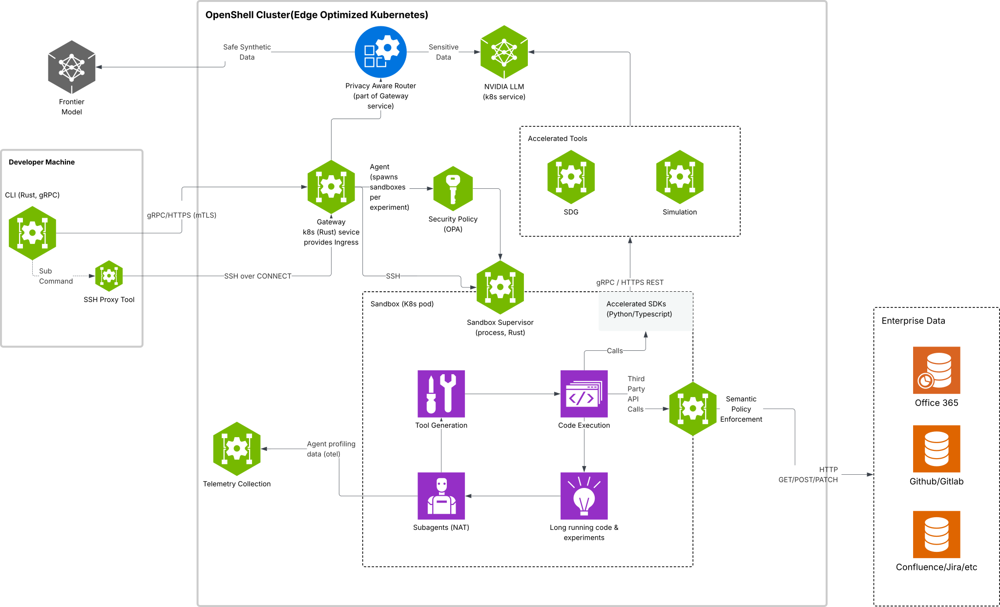

# How OpenShell Works

OpenShell 運行在 Docker 容器內。每個沙箱都是一個隔離的環境，由網關管理。四個組件協同工作，確保代理的安全。

## Components

下表描述了每個組件及其在系統中的作用：

|組件|角色|
|---|----|
|**Gateway**|控制平面 API，用於協調沙箱生命週期和狀態，充當身份驗證邊界，並在整個平台之間代理請求。|
|**Sandbox**|包含容器監管和策略強制執行的出口路由的隔離運行 runtime。|
|**Policy Engine**|檔案系統、網路和進程約束的策略定義和執行層。縱深防禦策略從應用層向下延伸至基礎設施層和核心層。|
|**Privacy Router**|具有隱私感知能力的 LLM 路由層，可在沙箱運算中保留敏感上下文，並根據成本和隱私策略進行路由。|

## How a Request Flows

來自代理程式碼的每個出站連線都經過相同的決策路徑：

1. Agent 程式開啟一個出站連線（API 呼叫、軟體包安裝、git 複製等）。
2. Sandbox 內的 proxy 攔截該連接，並識別是哪個二進位檔案打開的。
3. 如果目標是 `https://inference.local`，proxy 會在策略評估之前將其作為託管推論進行處理。 OpenShell 會移除沙箱提供的憑證，注入已設定的後端憑證，並將請求轉送到託管模型端點。
4. 對於所有其他 destination，proxy 程式會使用目標位址、連接埠和呼叫二進位檔案查詢策略引擎。
5. Policy engine 傳回以下兩種決策之一：
      - **Allow** - 目標位址和二進位檔案與策略區塊相符。流量直接流向外部服務。
      - **Deny** - 沒有符合的策略區塊。連線被阻止並記錄日誌。

對於啟用了 TLS 終止的 REST 端點，代理程式也會解密 TLS，並在允許請求通過之前，根據每個方法和路徑的規則檢查每個 HTTP 請求。

## Deployment Modes

OpenShell 可以運行在本機、遠端主機或雲端代理程式之後。所有情況下架構都相同－只有 Docker 容器的位置和驗證模式有所不同。

|模式|描述|命令|
|---|----|---|
|**Local**|Gateway 運行在您工作站的 Docker 容器中。首次使用時，命令列介面 (CLI) 會自動對其進行設定。|`openshell gateway start`|
|**Remote**|Gateway 透過 `SSH` 在遠端主機上運行。遠端機器上只需要有 Docker 即可。|`openshell gateway start --remote user@host`|
|**Cloud**|Gateway 已運行在雲端的反向代理（例如 Cloudflare Access）之後。透過瀏覽器註冊並進行身份驗證。|`openshell gateway add https://gateway.example.com`|

您可以註冊多個 gateway，並使用 `openshell gateway select` 指令在它們之間切換。有關完整的部署和管理工作流程，請參閱 [gateway](./gateway.md)。

