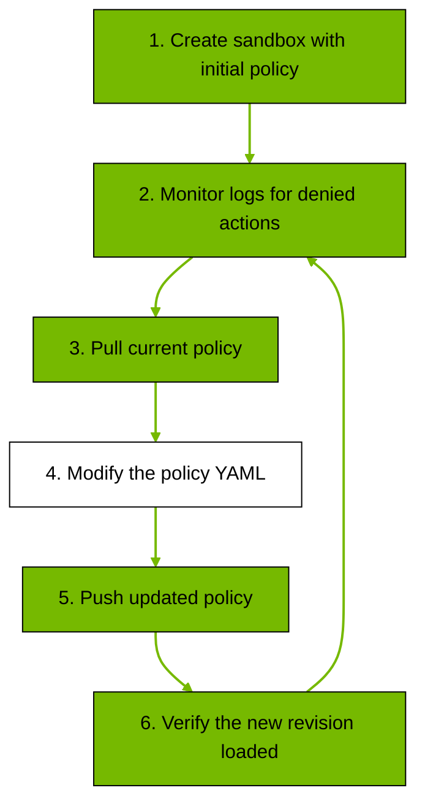

# Customize Sandbox Policies

使用此頁面的教程可在運行中的沙箱環境中套用和迭代策略變更。如需完整的逐字段 YAML 定義，請參閱 [Policy Schema Reference](https://docs.nvidia.com/openshell/latest/reference/policy-schema.html)。

## Policy Structure

政策包含靜態部分 **filesystem_policy**, **landlock** 和 **process**，這些部分在沙箱建立時會被鎖定；以及動態部分 **network_policies**，該部分可以在運行中的沙箱上熱重載。

```yaml
version: 1

# Static: locked at sandbox creation. Paths the agent can read vs read/write.
filesystem_policy:
  read_only: [/usr, /lib, /etc]
  read_write: [/sandbox, /tmp]

# Static: Landlock LSM kernel enforcement. best_effort uses highest ABI the host supports.
landlock:
  compatibility: best_effort

# Static: Unprivileged user/group the agent process runs as.
process:
  run_as_user: sandbox
  run_as_group: sandbox

# Dynamic: hot-reloadable. Named blocks of endpoints + binaries allowed to reach them.
network_policies:
  my_api:
    name: my-api
    endpoints:
      - host: api.example.com
        port: 443
        protocol: rest
        enforcement: enforce
        access: full
    binaries:
      - path: /usr/bin/curl
```

靜態部分在沙箱建立時即被鎖定。更改它們需要銷毀並重新建立沙箱。動態部分可以在運行中的沙箱上更新，並設定 openshell 策略，更新後無需重新啟動即可生效。

|定義區塊|類型|描述|
|---|----|---|
|`filesystem_policy`|Static|控制代理程式可以存取磁碟上的哪些目錄。路徑分為唯讀和讀寫兩個清單。任何未列入這兩個清單的路徑都無法存取。設定 `include_workdir: true` 可自動將代理程式的工作目錄新增至讀取與寫入清單。 [Landlock LSM](https://docs.kernel.org/security/landlock.html) 在核心層級強制執行這些限制。|
|`landlock`|Static|配置 Landlock LSM 強制執行行為。將相容性設為 `best_effort`（使用主機核心支援的最高 ABI）或 `hard_requirement`（如果所需的 ABI 不可用，則失敗）。|
|`process`|Static|設定代理程式的 OS-level identity 身份。 `run_as_user` 和 `run_as_group` 預設為 `sandbox`。 Root（`root` 或 `0`）會被拒絕。代理程式也會執行 `seccomp` 過濾器，以阻止危險的系統呼叫。|
|`network_policies`|Dynamic|控製沙箱中普通出站流量的網路存取。每個策略區塊包含一個名稱、一個端點清單（主機、連接埠、協定和可選規則）以及一個允許使用這些端點的二進位檔案清單。<br/>除 `https://inference.local` 之外的所有出站連線都透過 proxy，proxy 會使用目標位址和呼叫二進位檔案來查詢[策略引擎](https://docs.nvidia.com/openshell/latest/about/architecture.html)。只有當目標位址和呼叫二進位檔案都與同一策略區塊中的條目相符時，連線才被允許。<br/>對於協定為 rest 的端點，proxy 程式會自動偵測 TLS 並終止連接，以便根據該端點的規則（方法和路徑）檢查每個 HTTP 請求。<br/>對於協定為 rest 的端點，proxy 程式允許 TCP 流通過，而不檢查有效負載。<br/>如果沒有符合的端點，則連線將被拒絕。您可以透過「[配置推理路由](https://docs.nvidia.com/openshell/latest/inference/configure.html)」單獨配置託管模型推論服務。|

## Apply a Custom Policy

建立沙箱時，請傳遞一個策略 YAML 檔案：

```bash
openshell sandbox create --policy ./my-policy.yaml -- claude
```

`openshell sandbox create` 指令會在初始指令結束後繼續執行沙箱，這在規劃迭代策略時非常有用。如果您希望沙箱自動刪除，請新增 `--no-keep` 參數。

為避免每次都傳遞 `--policy` 參數，請使用環境變數設定預設策略：

```bash
export OPENSHELL_SANDBOX_POLICY=./my-policy.yaml
openshell sandbox create -- claude
```

如果未明確提供 `--policy`，則 CLI 將使用 `OPENSHELL_SANDBOX_POLICY` 中的策略。

## Iterate on a Running Sandbox

若要變更沙箱的存取權限，請取得目前策略，編輯 YAML 文件，然後推送更新。工作流程是迭代的：建立沙箱，監控日誌中被拒絕的操作，取得策略，修改策略，推送更新，然後驗證。



以下步驟概述了熱重載策略更新工作流程。

1. 請依照上面的 **Apply a Custom Policy** 步驟建立具有初始策略的沙箱（或設定 `OPENSHELL_SANDBOX_POLICY`）。
2. 監控拒絕的請求。每個日誌條目都會顯示主機、連接埠、二進位和拒絕原因。或者，您也可以使用 `openshell term` 查看即時儀錶板。
   
    ```bash
    openshell logs <name> --tail --source sandbox
    ```

3. 取得當前策略。在重新使用該檔案之前，請移除元資料頭（版本、雜湊值、狀態）。

    ```bash
    openshell policy get <name> --full > current-policy.yaml
    ```

4. 編輯 YAML：新增或調整 `network_policies` 條目、二進位、存取權限或規則。
5. 推送更新後的策略。Exit codes: `0 = loaded`, `1 = validation failed`, `124 = timeout`。
   
    ```bash
    openshell policy set <name> --policy current-policy.yaml --wait
    ```

6. 驗證新版本。如果狀態為 `loaded`，則根據需要從 step 2 重複操作；如果失敗，請修正策略並從 step 4 重複操作。

    ```bash
    openshell policy list <name>
    ```

## Global Policy Override

當您希望一個策略有效負載應用於每個沙箱時，請使用全域策略。

```bash
openshell policy set --global --policy ./global-policy.yaml
```

配置全域策略後：

- 全域策略的有效載荷將完整應用於所有沙箱。
- 在移除全域策略之前，沙箱層級的策略更新將被拒絕。

若要恢復沙盒層級的策略控制，請刪除全域策略設定：

```bash
openshell policy delete --global
```

您可以使用以下命令檢查沙箱的有效設定和策略來源：

```bash
openshell settings get <name>
```

## Debug Denied Requests

檢查 `openshell logs <name> --tail --source sandbox`，尋找被拒絕的主機、路徑和二進位。

在對被拒絕的請求進行分類時，請檢查：

- 目標主機和端口，以確認缺少哪個端點。
- 呼叫二進位檔案路徑，以確認需要新增或調整哪個二進位檔案條目。
- HTTP 方法和路徑（對於 REST 端點），以確認需要新增或調整哪個規則條目。

然後依照上述步驟推送更新後的策略。

## Examples

將這些程式碼區塊新增至沙箱策略的 `network_policies` 部分。使用 `openshell policy set <name> --policy <file> --wait` 指令來套用。主機級允許清單使用 **Simple endpoint**，方法/路徑控制使用 **Granular rules**。

=== "Simple endpoint"

    允許使用 `pip install` 和 `uv pip install` 指令存取 PyPI：

    ```yaml
    pypi:
      name: pypi
      endpoints:
        - host: pypi.org
          port: 443
        - host: files.pythonhosted.org
          port: 443
      binaries:
        - { path: /usr/bin/pip }
        - { path: /usr/local/bin/uv }
    ```

    沒有協定的端點使用 TCP 直通，proxy 允許資料流傳輸而不檢查有效負載。

=== "Granular rules"

    允許 Claude 和 GitHub CLI 透過路徑規則存取 `api.github.com`：所有路徑僅允許讀取（GET, HEAD, OPTIONS）和 GraphQL（POST）；允許 `alpha-repo` 完全寫入；僅允許 `bravo-repo` 建立/編輯 issue。請將 <org_name> 替換為您的 GitHub 組織或使用者名稱。

    !!! tip
        若要了解將此策略與 GitHub 憑證提供者和沙箱建立相結合的端對端演練，請參閱「[授予 GitHub 推播存取權給沙箱代理程式](https://docs.nvidia.com/openshell/latest/tutorials/github-sandbox.html)」。

    ```yaml
    github_repos:
      name: github_repos
      endpoints:
        - host: api.github.com
          port: 443
          protocol: rest
          enforcement: enforce
          rules:
            - allow:
                method: GET
                path: "/**"
            - allow:
                method: HEAD
                path: "/**"
            - allow:
                method: OPTIONS
                path: "/**"
            - allow:
                method: POST
                path: "/graphql"
            - allow:
                method: "*"
                path: "/repos/<org_name>/alpha-repo/**"
            - allow:
                method: POST
                path: "/repos/<org_name>/bravo-repo/issues"
            - allow:
                method: PATCH
                path: "/repos/<org_name>/bravo-repo/issues/*"
      binaries:
        - { path: /usr/local/bin/claude }
        - { path: /usr/bin/gh }
    ```

    協定為 rest 的端點會啟用 HTTP 請求檢查。Proxy 程式會自動偵測 HTTPS 端點上的 TLS，終止 TLS，並根據規則清單檢查每個 HTTP 請求。