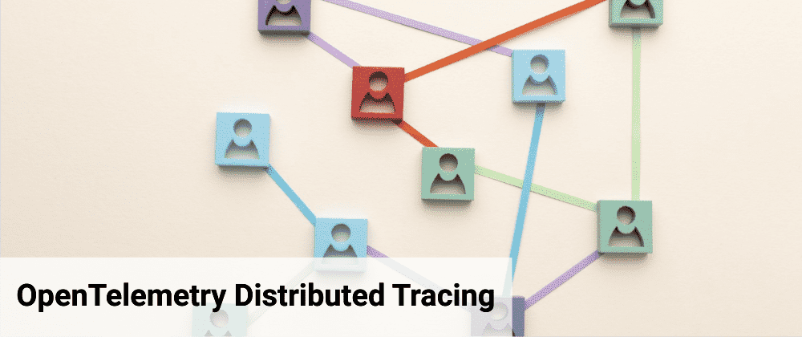
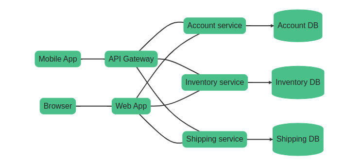
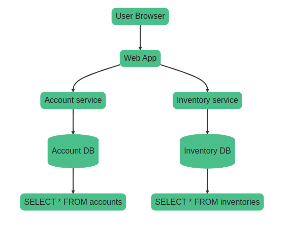

# 分佈式追踪

原文: [OpenTelemetry Distributed Tracing](https://uptrace.dev/opentelemetry/distributed-tracing.html)

分佈式跟踪允許查看請求如何通過不同的服務和系統、每個操作的時間、任何日誌和發生的錯誤。

在分佈式環境中，跟踪工具還可以幫助您了解微服務之間的關係和交互。分佈式跟踪允許您查看特定微服務的執行情況以及該服務如何影響其他微服務。

## Tracing 如何運作？

在現代應用程序中，尤其是基於微服務或無服務器架構的應用程序中，不同的服務經常相互交互來滿足單個用戶請求。這使得識別性能瓶頸、診斷問題和分析整體系統行為變得具有挑戰性。

分佈式追踪旨在通過創建追踪來解決這些挑戰，跟踪表示單個用戶請求通過各種服務和組件的旅程。每個跟踪由一系列互連的跨度組成，其中每個跨度代表特定服務或組件內的單個操作或活動。

當請求進入服務時，追踪上下文(trace context)會隨請求一起傳播。這通常涉及將追踪標頭注入請求中，從而允許下游服務參與同一追踪。

當請求流經系統時，每個服務都會生成自己的跨度，並使用有關其操作持續時間、元數據和任何相關上下文的信息更新追踪上下文。

分佈式追踪工具使用生成的追踪數據來提供對系統行為的可見性，幫助識別性能問題，協助調試，並幫助確保分佈式應用程序的可靠性和可擴展性。

## Spans

**Span** 表示跟踪中的一個 opeartion (unit of work)。Span 可以是遠程過程調用 (RPC)、數據庫查詢或進程內函數調用。一個 span 可能包含有：

- span 名稱 (operation 名稱)。
- 父 span。
- 一種 span 類型。
- 開始和結束時間。
- 報告 operation 是成功還是失敗的狀態。
- 一組描述 operation 的鍵值屬性。
- 事件的時間表。
- 指向其他 span 的鏈接列表。
- 在不同服務之間傳播的 trace ID 和其他數據的 span context。

**Trace** 是一棵 spans tree，顯示請求通過應用程序的路徑。Root span 是跟踪中的第一個 span。

### Span name

後端使用 span 名稱和一些屬性將相似的 span 組合在一起。要正確地對 span 進行分組，請給它們起簡短的名稱。唯一跨度名稱的總數應少於 1000。否則，跨度組過多，您的體驗可能會受到影響。

以下名稱很好，因為它們簡短、獨特並且有助於將相似的跨度組合在一起：

|Span name |Comment|
|----------|-------|
|`GET /projects/:id`|Good. A route name with param names.|
|`select_project`|Good. A function name without arguments.|
|`SELECT * FROM projects WHERE id = ?`|Good. A database query with placeholders.|

以下名稱是不好的，因為它們包含變量和參數：

|Span name |Comment|
|----------|-------|
|`GET /projects/42`|Bad. Contains a variable param 42.|
|`select_project(42)`|Bad. Contains a variable 42.|
|`SELECT * FROM projects WHERE id = 42`|Bad. Contains a variable arg 42.|

### Span kind

跨度種類必須具有以下值之一：

- `server` 用於服務器操作，例如 HTTP 服務器處理程序。
- `client` 用於客戶端操作，例如 HTTP 客戶端請求。
- `producer` 消息生產者的生產者，例如Kafka生產者。
- `consumer` 用於消息消費者和異步處理，例如，Kafka 消費者。
- `internal` 用於內部操作。

### Status code

狀態代碼指示操作是成功還是失敗。它必須具有以下值之一：

- `ok` - 成功。
- `error` -失敗。
- `unset` - 允許後端分配狀態的默認值。

### Attributes

要記錄上下文信息，您可以使用攜帶特定於操作的信息的屬性來註釋 span。例如，HTTP 端點可能具有 `http.method = GET` 和 `http.route = /projects/:id` 這樣的屬性。

您可以根據需要命名屬性，但對於常見操作，您應該使用語義屬性約定([semantic attributes](https://uptrace.dev/opentelemetry/attributes.html)。它定義了一個公共屬性鍵列表及其含義和可能的值。

### Events

您還可以使用具有開始時間和任意數量屬性的事件來註釋 span。事件和跨度之間的主要區別是事件沒有結束時間（因此沒有持續時間）。

事件通常表示異常、錯誤、日誌和消息（例如在 RPC 中），但您也可以創建自定義事件。

### Context

Trace/span context 是 request-scoped 的數據，例如：

- `trace id` - 唯一跟踪標識符
- `span id` - 唯一的跨度標識符
- `trace flags` - 各種旗標，例如採樣、延遲和調試

您可以使用上下文中的數據進行跨度關聯或採樣，例如，您可以使用 trace id 來了解哪些 span 屬於哪些 trace。

### Context propagation

OpenTemetry 在進程內的函數之間傳播上下文（進程內傳播），甚至從一個服務傳播到另一個服務（分佈式傳播）。

**進程內 context 傳播** 可以是隱式的或顯式的，具體取決於您使用的編程語言。隱式傳播是通過將活動上下文自動存儲在 thread-local variables（Java、Python、Ruby、NodeJS）。顯式傳播需要顯式地將活動上下文作為參數從一個函數傳遞到另一個函數 (Go)。

對於 **分佈式 context 傳播**，OpenTelemetry 支持多種定義如何序列化和傳遞上下文數據的協議：

- [W3C trace context](https://www.w3.org/TR/trace-context/) 在 traceparent header, 例如, `traceparent=00-84b54e9330faae5350f0dd8673c98146-279fa73bc935cc05-01`。
- [B3 Zipkin](https://github.com/openzipkin/b3-propagation) 在 headers 並用 `x-b3-` 的前綴, 例如, `X-B3-TraceId`。

[W3C trace context](https://www.w3.org/TR/trace-context/)  是預設啟用的 context propagator。

### Baggage

[Baggage](https://github.com/open-telemetry/opentelemetry-specification/blob/main/specification/baggage/api.md) 的工作方式類似於 `span context`，並允許您將用戶定義的 `key:value (attributes)` 從一項服務傳播到另一項服務。在 gRPC 世界中，類似的概念稱為 gRPC metadata。

例如，您可以使用 `baggage` 將有關創建跟踪的服務的信息傳播到所有其他服務。

## Instrumentations

[Instrumentations](https://uptrace.dev/opentelemetry/instrumentations/) 是流行開發 frameworks 和 libraries 的插件，使用 OpenTelemetry API 記錄重要操作，例如 HTTP 請求、數據庫查詢、日誌、錯誤等。

Instrumentations library 是執行檢測本身的庫，而不是檢測的目標。您在創建 tracer 時提供 instrumentation library name。

## 要對什麼東西進行 instrument

您無需 instrument 所有 operation 即可充分利用 tracing 的功能。為所有的 operation 進行 instrument 可能會花費很多時間，而且通常不需要。考慮優先考慮以下 operation：

- `Network operations`, 例如，HTTP 請求或 RPC 調用
- `Filesystem operations`, 例如，讀取/寫入文件
- `Database queries`
- `Errors` 與 `logs`

## 結論

分佈式跟踪對於理解複雜應用程序的端到端行為、識別性能問題、優化系統資源以及為架構改進或優化方面的更好決策提供見解非常有價值。
