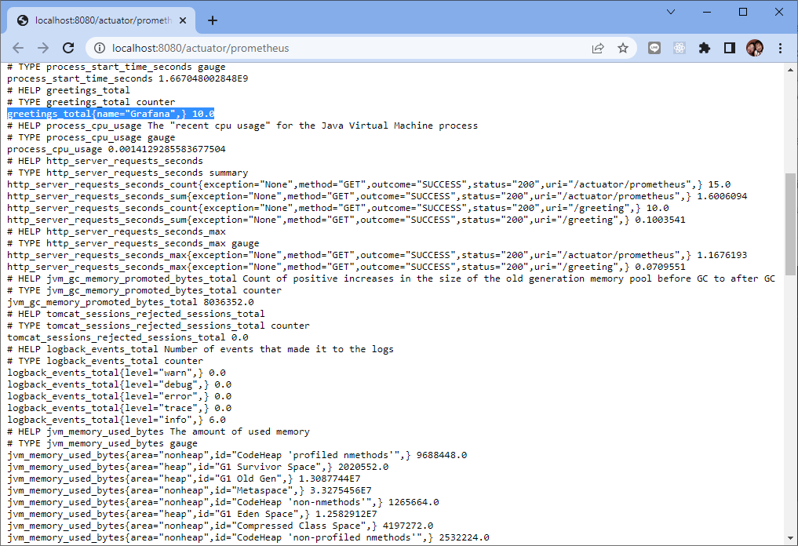

# 如何使用 OTEL agent 捕獲 Spring Boot 指標

原文: [How to capture Spring Boot metrics with the OpenTelemetry Java Instrumentation Agent](https://grafana.com/blog/2022/05/04/how-to-capture-spring-boot-metrics-with-the-opentelemetry-java-instrumentation-agent/)

這篇教程展示如何使用 OpenTelemetry Java 檢測代理來捕獲 Spring Boot 指標。

## 設置示例應用程序

我們將使用一個簡單的 Hello World REST 服務作為示例應用程序。源代碼來自 Spring 的 [Building a RESTful Web Service 指南](https://github.com/spring-guides/gs-rest-service.git)示例代碼的 `./complete/` 目錄。

```console
# 下載源碼
git clone https://github.com/spring-guides/gs-rest-service.git

# 切換目錄
cd gs-rest-service/complete/

# 編譯並打包應用程式
./mvnw clean package

# 執行應用程式
java -jar target/rest-service-complete-0.0.1-SNAPSHOT.jar
```

該應用程序在端口 `8080` 上公開了一個 REST 服務，您可以在其中問候不同的名稱，例如 http://localhost:8080/greeting?name=Grafana。它還沒有公開任何指標。


## 暴露 Prometheus 指標

作為第一步，我們在示例應用程序中啟用指標，並直接以 Prometheus 格式公開這些指標。我們還不會使用 OpenTelemetry Java 檢測代理。

我們在 `pom.xml` 中需要兩個額外的依賴：

```xml
<dependency>
  <groupId>org.springframework.boot</groupId>
  <artifactId>spring-boot-starter-actuator</artifactId>
</dependency>
<dependency>
  <groupId>io.micrometer</groupId>
  <artifactId>micrometer-registry-prometheus</artifactId>
  <scope>runtime</scope>
</dependency>
```

`spring-boot-starter-actuator` 提供了指標 API 和一些開箱即用的指標。在底層，它使用了 Micrometer 度量庫。 

而 `micrometer-registry-prometheus` 函式庫則用於將 Micrometer 指標以 Prometheus 格式來公開。

接下來，我們需要啟用 Prometheus 端點。使用以下行創建文件 `./src/main/resources/application.properties`：

```property
management.endpoints.web.exposure.include=prometheus
```

重新編譯並重新啟動應用程序後，您將在 `http://localhost:8080/actuator/prometheus` 上看到指標。開箱即用的指標包括一些 JVM 指標，如 `jvm_gc_pause_seconds`、來自日誌記錄框架的一些指標，如 `logback_events_total`，以及來自 REST 端點的一些指標，如 `http_server_requests`。


最後，我們希望有一個自定義指標可以使用。自定義指標必須使用 Spring Boot 提供的 `MeterRegistry` 進行註冊。所以第一步是將 `MeterRegistry` 注入 `GreetingController`，例如通過構造函數注入：

```java title="GreetingController.java"
// ...
import io.micrometer.core.instrument.MeterRegistry;

@RestController
public class GreetingController {

  // ...
  private final MeterRegistry registry;

  // Use constructor injection to get the MeterRegistry
  public GreetingController(MeterRegistry registry) {
	this.registry = registry;
  }

  // ...
}
```

現在，我們可以添加我們的自定義指標。我們將創建一個按名稱跟踪問候呼叫的計數器。我們將計數器添加到 `greeting()` REST 端點的現有實現中：

```java title="GreetingController.java"
@GetMapping("/greeting")
public Greeting greeting(@RequestParam(value = "name", defaultValue = "World") String name){
 
  // Add a counter tracking the greeting calls by name
  registry.counter("greetings.total", "name", name).increment();
 
  // ...
}
```

讓我們嘗試一下：重新編譯並重新啟動應用程序，並使用不同的名稱調用問候端點，例如 `http://localhost:8080/greeting?name=Grafana`。

在 `http://localhost:8080/actuator/prometheus` 上，您將看到度量 `greetings_total` 計算每個名稱的調用次數：

```bash
# HELP greetings_total··
# TYPE greetings_total counter
greetings_total{name="Grafana",} 2.0
greetings_total{name="Prometheus",} 1.0
```



!!! info
    請注意，將用戶輸入用作標籤值通常是一個壞主意，因為這很容易導致基數爆炸（即為每個名稱創建一個新指標）。但是，在我們的示例中它很方便，因為它為我們提供了一種嘗試不同標籤值的簡單方法。

## 將 OpenTelemetry 收集器放在中間

OpenTelemetry 收集器是接收、處理和導出遙測數據的組件。它通常位於要監控的應用程序和監控後端之間的中間位置。


作為下一步，我們將配置一個 OpenTelemetry 收集器以從 Prometheus 端點抓取指標並以 Prometheus 格式公開它們。


到目前為止，這不會添加任何功能，除了我們將 OpenTelemetry 收集器作為新的基礎設施組件。收集器在 `8889` 端口上公開的指標應該與應用程序在 `8080` 端口上公開的指標相同。

從 `https://github.com/open-telemetry/opentelemetry-collector-releases/releases` 下載最新的 `otelcol_*.tar.gz` 版本，然後解壓。它應該包含一個名為 `otelcol` 的可執行文件。在撰寫本文時，最新版本是 `otelcol_0.63.1_linux_amd64.tar.gz`。

```bash
# 下載最新的打包
wget https://github.com/open-telemetry/opentelemetry-collector-releases/releases/download/v0.63.1/otelcol_0.63.1_linux_amd64.tar.gz

# 解壓縮
tar -xzvf otelcol_0.63.1_linux_amd64.tar.gz
```

創建一個名為 `config.yaml` 的配置文件，內容如下：

```yaml title="config.yaml"
receivers:
  prometheus:
    config:
      scrape_configs:
        - job_name: "example"
          scrape_interval: 5s
          metrics_path: '/actuator/prometheus'
          static_configs:
            - targets: ["localhost:8080"]

processors:
  batch:

exporters:
  prometheus:
    endpoint: "localhost:8889"

service:
  pipelines:
    metrics:
      receivers: [prometheus]
      processors: [batch]
      exporters: [prometheus]
```

執行下列命令來啟動 collector:

```bash
./otelcol --config=config.yaml
```

結果:

```console
2022-10-29T22:14:50.548+0800    info    service/telemetry.go:110        Setting up own telemetry...
2022-10-29T22:14:50.548+0800    info    service/telemetry.go:140        Serving Prometheus metrics      {"address": ":8888", "level": "basic"}
2022-10-29T22:14:50.549+0800    info    service/service.go:89   Starting otelcol...     {"Version": "0.63.1", "NumCPU": 8}
2022-10-29T22:14:50.549+0800    info    extensions/extensions.go:42     Starting extensions...
2022-10-29T22:14:50.549+0800    info    pipelines/pipelines.go:74       Starting exporters...
2022-10-29T22:14:50.549+0800    info    pipelines/pipelines.go:78       Exporter is starting... {"kind": "exporter", "data_type": "metrics", "name": "prometheus"}
2022-10-29T22:14:50.550+0800    info    pipelines/pipelines.go:82       Exporter started.       {"kind": "exporter", "data_type": "metrics", "name": "prometheus"}
2022-10-29T22:14:50.550+0800    info    pipelines/pipelines.go:86       Starting processors...
2022-10-29T22:14:50.550+0800    info    pipelines/pipelines.go:90       Processor is starting...        {"kind": "processor", "name": "batch", "pipeline": "metrics"}
2022-10-29T22:14:50.550+0800    info    pipelines/pipelines.go:94       Processor started.      {"kind": "processor", "name": "batch", "pipeline": "metrics"}
2022-10-29T22:14:50.550+0800    info    pipelines/pipelines.go:98       Starting receivers...
2022-10-29T22:14:50.550+0800    info    pipelines/pipelines.go:102      Receiver is starting... {"kind": "receiver", "name": "prometheus", "pipeline": "metrics"}
2022-10-29T22:14:50.550+0800    info    prometheusreceiver@v0.63.0/metrics_receiver.go:251      Starting discovery manager      {"kind": "receiver", "name": "prometheus", "pipeline": "metrics"}
2022-10-29T22:14:50.550+0800    info    prometheusreceiver@v0.63.0/metrics_receiver.go:239      Scrape job added        {"kind": "receiver", "name": "prometheus", "pipeline": "metrics", "jobName": "example"}
2022-10-29T22:14:50.550+0800    info    pipelines/pipelines.go:106      Receiver started.       {"kind": "receiver", "name": "prometheus", "pipeline": "metrics"}
2022-10-29T22:14:50.550+0800    info    service/service.go:106  Everything is ready. Begin running and processing data.
2022-10-29T22:14:50.550+0800    info    prometheusreceiver@v0.63.0/metrics_receiver.go:281      Starting scrape manager {"kind": "receiver", "name": "prometheus", "pipeline": "metrics"}
...
...
```

您可以訪問 `http://localhost:8889/metrics` 上的指標。


## 附加 OpenTelemetry Java 儀器化代理

我們現在準備將我們的應用程序從公開 Prometheus 指標轉換為直接提供 OpenTelemetry 指標。我們將擺脫應用程序中的 Prometheus 端點，並使用 OpenTelemetry Java 儀器化代理來公開指標。


首先，我們必須重新配置 OpenTelemetry 收集器的接收端以使用 OpenTelemetry Line Protocol (otlp)，而不是從 Prometheus 端點抓取指標：

```yaml title="config.yaml"
receivers:
  otlp:
    protocols:
      grpc:
      http:

processors:
  batch:

exporters:
  prometheus:
    endpoint: "localhost:8889"

service:
  pipelines:
    metrics:
      receivers: [otlp]
      processors: [batch]
      exporters: [prometheus]
```

現在，從 `https://github.com/open-telemetry/opentelemetry-java-instrumentation/releases` 下載最新版本的 OpenTelemetry Java 儀器化代理。

```bash
wget https://github.com/open-telemetry/opentelemetry-java-instrumentation/releases/download/v1.19.1/opentelemetry-javaagent.jar
```

默認情況下，代理中禁用指標，因此您需要通過設置環境變量 `OTEL_METRICS_EXPORTER=otlp` 來啟用它們。然後，重新啟動附加代理的示例應用程序：

```bash
# 設置環境變量
export OTEL_METRICS_EXPORTER=otlp
export OTEL_TRACES_EXPORTER=none
export OTEL_LOGS_EXPORTER=none

# export OTEL_METRICS_EXPORTER=prometheus

# 執行範例應用程式
java -javaagent:./opentelemetry-javaagent.jar -jar ./target/rest-service-complete-0.0.1-SNAPSHOT.jar
```

大約一分鐘後，您將看到收集器再次在 `http://localhost:8889/metrics` 上公開指標。但是，這一次它們使用 OpenTelemetry 協議直接運送遙測數據到收集器。由於我們不再需要使用到應用程序的 Prometheus 端點。您現在可以在 `application.properties` 中刪除 Prometheus 端點配置，並從 `pom.xml` 中刪除 `micrometer-registry-prometheus` 依賴項。

但是，如果您仔細觀察，您會發現這些指標與之前公開的不同。

## 橋接 OpenTelemetry 和 Micrometer

我們現在在收集器中看到的指標來自 OpenTelemetry Java 儀器化代理本身。它們不是 Spring Boot 應用程序維護的原始指標。該代理很好地為我們提供了一些關於 REST 端點調用的開箱即用指標，例如 `http_server_duration`。然而，一些指標明顯缺失，例如最初由 Spring 框架提供的 `logback_events_total` 指標。而且我們的自定義指標 `greetings_total` 也消失了。

為了理解原因，我們需要看看 Spring Boot 指標在內部是如何工作的。 Spring 使用 Micrometer 作為其度量庫。 Micrometer 為應用程序開發人員提供通用 API，並為供應商提供靈活的指標註冊器，以公開其特定監控後端的指標。

在上面的第一步中，我們使用了 [Prometheus meter registry](https://github.com/micrometer-metrics/micrometer/tree/main/implementations/micrometer-registry-prometheus)，它是用於公開 Prometheus 指標的 Micrometer 註冊器。

使用 OpenTelemetry Java 檢測代理捕獲 Micrometer 指標幾乎可以開箱即用：代理檢測 Micrometer 並動態地註冊了 `OpenTelemetryMeterRegistry`。

不幸的是，代理使用 Micrometer 的 `Metrics.globalRegistry` 註冊，而 Spring 通過依賴注入使用自己的註冊器實例。由於 OpenTelemetryMeterRegistry 註冊在錯誤的 MeterRegistry 實例中，因此 Spring 不會使用它。

為了解決這個問題，我們需要將 OpenTelemetry 的 `OpenTelemetryMeterRegistry` 作為 Spring bean 提供，以便 Spring 在設置依賴注入時可以正確註冊它。這可以通過將以下代碼添加到您的 Spring 引導應用程序來完成：

```java title="RestServiceApplication.java" hl_lines="16-24"
package com.example.restservice;

import io.micrometer.core.instrument.MeterRegistry;
import io.micrometer.core.instrument.Metrics;
import org.springframework.boot.SpringApplication;
import org.springframework.boot.autoconfigure.SpringBootApplication;
import org.springframework.boot.autoconfigure.condition.ConditionalOnClass;
import org.springframework.context.annotation.Bean;

import java.util.Optional;

@SpringBootApplication
public class RestServiceApplication {
    // Unregister the OpenTelemetryMeterRegistry from Metrics.globalRegistry and make it available
    // as a Spring bean instead.
    @Bean
    @ConditionalOnClass(name = "io.opentelemetry.javaagent.OpenTelemetryAgent")
    public MeterRegistry otelRegistry() {
        Optional<MeterRegistry> otelRegistry = Metrics.globalRegistry.getRegistries().stream()
                .filter(r -> r.getClass().getName().contains("OpenTelemetryMeterRegistry"))
                .findAny();
        otelRegistry.ifPresent(Metrics.globalRegistry::remove);
        return otelRegistry.orElse(null);
    }

    public static void main(String[] args) {
        SpringApplication.run(RestServiceApplication.class, args);
    }

}
```

上面的代碼片段從 Micrometer 的 `Metrics.globalRegistry` 中取消註冊 `OpenTelemetryMeterRegistry` 並將其公開為 Spring bean。它僅在附加代理時才會運行，這是通過 `@ConditionalOnClass` 註釋實現的。

重新編譯並重新啟動應用程序後，所有指標都將提供給 OpenTelemetry 收集器，包括所有原始 Spring Boot 指標和我們自定義的 `greetings_total`。

有些信息是多餘的，因此您甚至可以將 Spring Boot 提供的 `http_server_requests` 中的信息與 OpenTelemetry 的 Java 檢測代理添加的 `http_server_duration` 中的信息進行比較。

## 總結

在這篇教程中，我們向您展示瞭如何使用 OpenTelemetry Java 檢測代理來捕獲 Spring Boot 指標。我們首先以 Prometheus 格式公開 Spring Boot 指標，然後將 OpenTelemetry 收集器放在中間，然後將示例應用程序從公開 Prometheus 切換為直接公開 OpenTelemetry 線路協議。

最後，我們強調了需要添加到 Java 應用程序的幾行代碼，以將 Spring Boot 的 Micrometer 指標連接到 OpenTelemetry Java 檢測代理提供的 `OpenTelemetryMeterRegistry`。