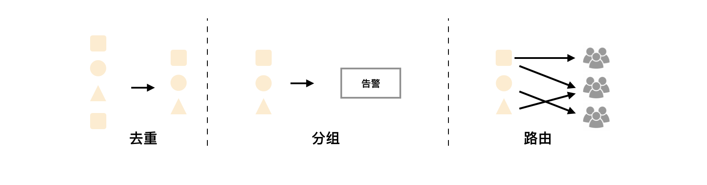
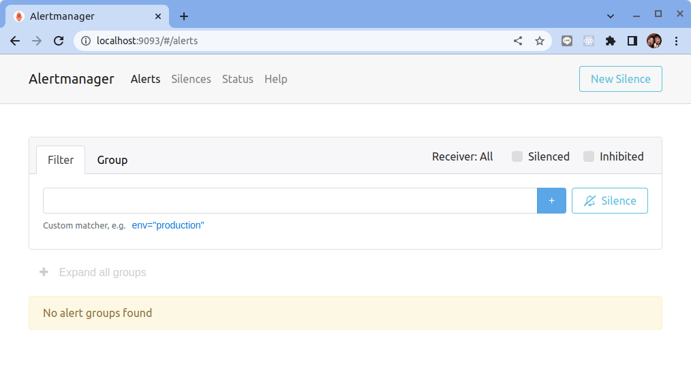

# Alertmanager 安裝

原文: [Alertmanager 安装](https://p8s.io/docs/alertmanager/deploy/)

前面我們學習 Prometheus 的時候了解到 Prometheus 包含一個報警模塊，就是我們的 AlertManager，Alertmanager 主要用於接收 Prometheus 發送的告警信息，它支持豐富的告警通知渠道，而且很容易做到告警信息進行去重，降噪，分組等，是一款前衛的告警通知系統。

## 介紹

通過在 Prometheus 中定義告警規則，Prometheus 會周期性的對告警規則進行計算，如果滿足告警觸發條件就會向 Alertmanager 發送告警信息。



在 Prometheus 中一條告警規則主要由以下幾部分組成：

- **告警名稱**：用戶需要為告警規則命名，當然對於命名而言，需要能夠直接表達出該告警的主要內容
- **告警規則**：告警規則實際上主要由 PromQL 進行定義，其實際意義是當表達式（PromQL）查詢結果持續多長時間（Duration）後觸發告警

在 Prometheus 中，還可以通過 Group（告警群組）對一組相關的告警進行統一定義。 Alertmanager 作為一個獨立的組件，負責接收並處理來自 Prometheus Server 的告警信息。 Alertmanager 可以對這些告警信息進行進一步的處理，比如當接收到大量重複告警時能夠消除重複的告警信息，同時對告警信息進行分組並且路由到正確的通知方。

Prometheus 內置了對郵件、Slack、Opsgenie 多種通知方式的支持，同時還支持與 Webhook 的集成，以支持更多定制化的場景。例如，目前 Alertmanager 還不支持 Microsoft Teams，用戶完全可以通過 Webhook 與 Microsfot Teams 進行集成，從而通過 Teams 接收告警信息。同時 AlertManager 還提供了靜默和告警抑制機制來對告警通知行為進行優化。

## 安装

在 Prometheus 官網 https://prometheus.io/download/#alertmanager 獲取適用於 Linux 的 Alertmanager 安裝包，這裡我們選擇最新的 0.24.0 版本，我們這裡是 Linux 系統，所以選擇下載 alertmanager-0.24.0.linux-amd64.tar.gz，其他系統請自行選擇。

```bash
wget https://github.com/prometheus/alertmanager/releases/download/v0.24.0/alertmanager-0.24.0.linux-amd64.tar.gz
```

解壓壓縮包：

```bash
tar -xzvf alertmanager-0.24.0.linux-amd64.tar.gz
```

切換到解壓縮後的目錄，執行 `alertmanager --version` 命令查看是否正常：

```bash
$ cd alertmanager-0.24.0.linux-amd64/
$ ./alertmanager --version
alertmanager, version 0.24.0 (branch: HEAD, revision: f484b17fa3c583ed1b2c8bbcec20ba1db2aa5f11)
  build user:       root@265f14f5c6fc
  build date:       20220325-09:31:33
  go version:       go1.17.8
  platform:         linux/amd64
```

## 配置

AlertManager 下載解壓後，可以通過下面的命令運行：

```bash
./alertmanager --config.file=simple.yml
```

其中 `-config.file` 參數是用來指定對應的配置文件的，我們先來看一下一個 AlertManager 基本的的配置 `alertmanager.yml` 檔案:

```yaml title="altermanager.yml"
route:
  group_by: ['alertname']
  group_wait: 30s
  group_interval: 5m
  repeat_interval: 1h
  receiver: 'web.hook'
receivers:
  - name: 'web.hook'
    webhook_configs:
      - url: 'http://127.0.0.1:5001/'
inhibit_rules:
  - source_match:
      severity: 'critical'
    target_match:
      severity: 'warning'
    equal: ['alertname', 'dev', 'instance']
```

暫時不需對 `alertmanager.yml` 進行任何修改，直接運行下列命令來啟動 Alertmanager:

```bash
./alertmanager --config.file=alertmanager.yml
```

 並使用瀏覽器打開 `http://localhost:9093`:

 

### Prometheus 配置修改

AlertManager 的容器啟動起來之後，我們還需要在 Prometheus 中配置下 AlertManager 的地址，讓 Prometheus 能夠訪問到 AlertManager，在 Prometheus 的配置檔 `prometheus.yml` 中添加如下配置區塊：

```yaml title="prometheus.yml" hl_lines="9-12"
global:
  scrape_interval: 5s # 抓取频率

scrape_configs:
  - job_name: "prometheus"
    static_configs:
      - targets: ["localhost:9090"]

alerting:
  alertmanagers:
    - static_configs:
        - targets: ["localhost:9093"]
```

