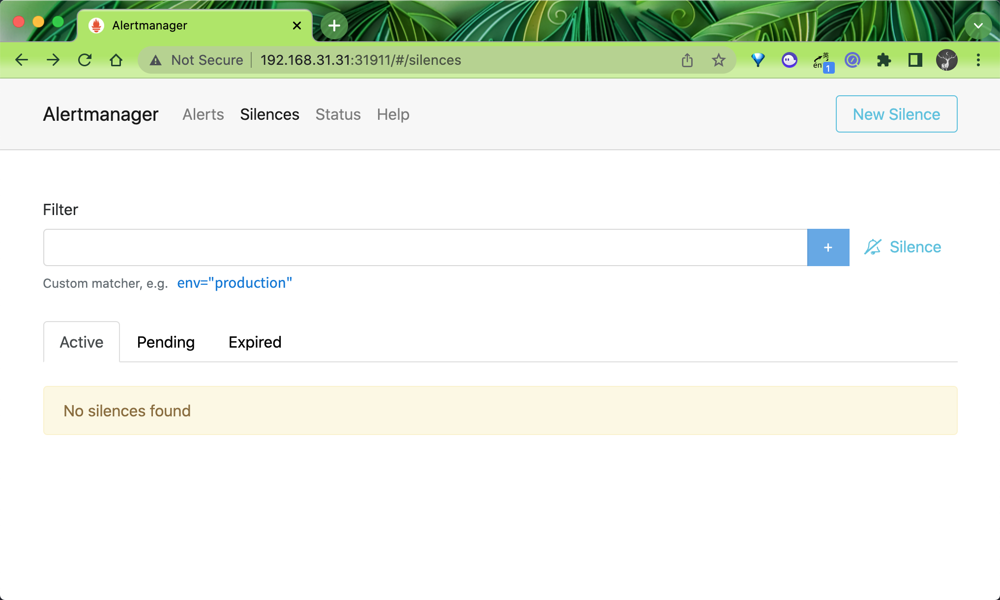
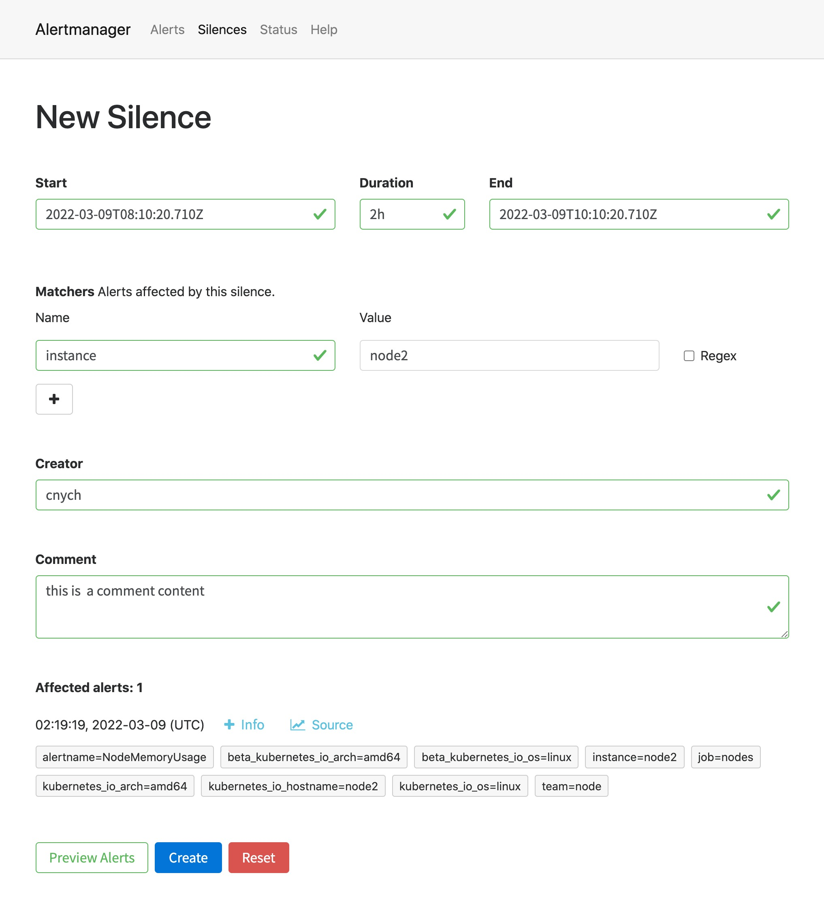
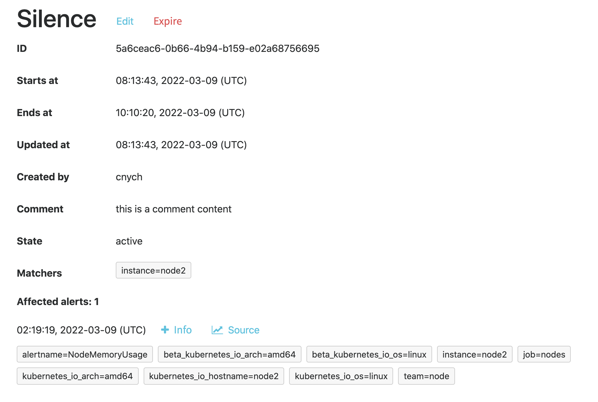
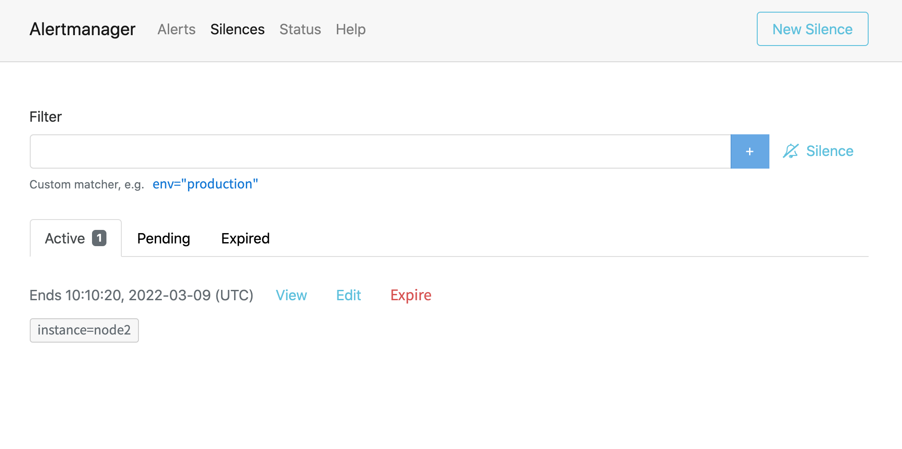
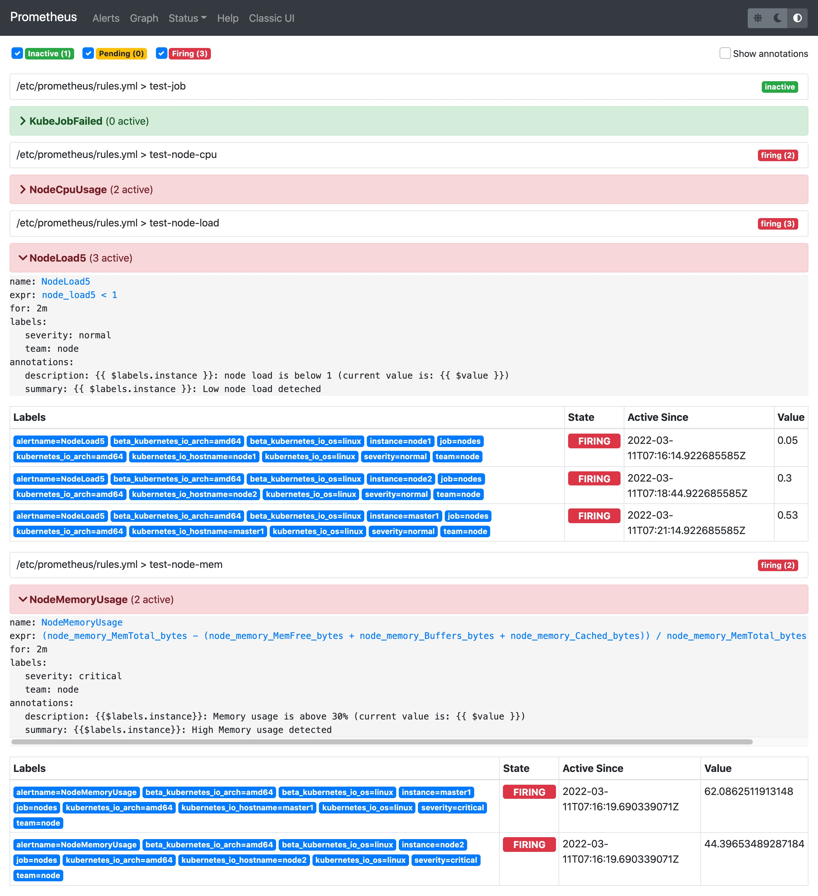
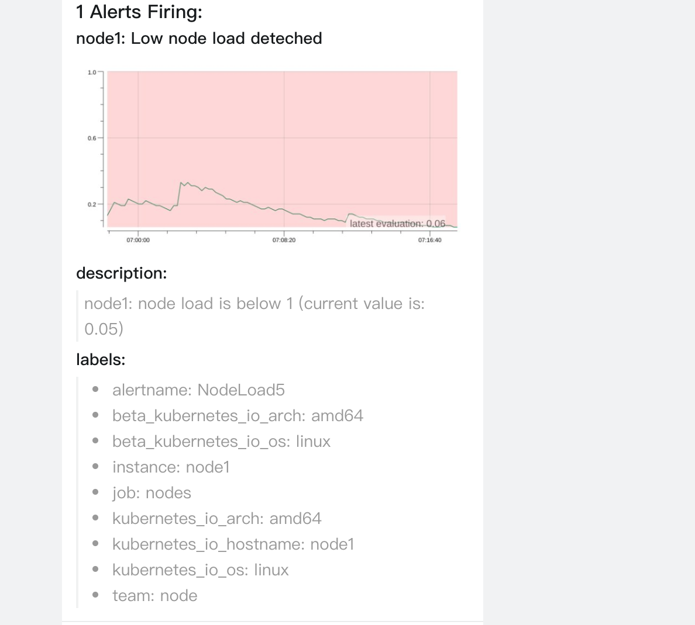

# 報警過濾

原文: [报警过滤](https://p8s.io/docs/alertmanager/filter/)

有的時候可能報警通知太過頻繁，或者在收到報警通知後就去開始處理問題了，這個期間可能報警還在頻繁發送，這個時候我們可以去對報警進行靜默設置。

## 靜默通知

在 Alertmanager 的後台頁面中提供了靜默操作的入口。



可以點擊右上面的 `New Silence` 按鈕新建一個靜默通知：



我們可以選擇此次靜默的開始時間、結束時間，最重要的是下面的 `Matchers` 部分，用來匹配哪些報警適用於當前的靜默，比如這裡我們設置 `instance=node2` 的標籤，則表示具有這個標籤的報警在 2 小時內都不會觸發報警，點擊下面的 `Create` 按鈕即可創建：



創建完成後還可以對該配置進行編輯或者讓其過期等操作。此時在靜默列表也可以看到創建的靜默狀態。



## 抑制

除了上面的靜默機制之外，Alertmanager 還提供了抑制機制來控制告警通知的行為。抑制是指當某次告警發出後，可以停止重複發送由此告警引發的其他告警的機制，比如現在有一台服務器宕機了，上面跑了很多服務都設置了告警，那麼肯定會收到大量無用的告警信息，這個時候抑制就非常有用了，可以有效的防止告警風暴。

要使用抑制規則，需要在 Alertmanager 配置文件中的 `inhibit_rules` 屬性下面進行定義，每一條抑制規則的具體配置如下：

```yaml title="alertmanager.yml"
target_match:
  [ <labelname>: <labelvalue>, ... ]
target_match_re:
  [ <labelname>: <regex>, ... ]

source_match:
  [ <labelname>: <labelvalue>, ... ]
source_match_re:
  [ <labelname>: <regex>, ... ]

equal: '[' <labelname>, ... ']'
```

當已經發送的告警通知匹配到 `target_match` 和 `target_match_re` 規則，當有新的告警規則如果滿足 `source_match` 或者 `source_match_re` 的匹配規則，並且已發送的告警與新產生的告警中 `equal` 定義的標籤完全相同，則啟動抑制機制，新的告警不會發送。

例如當集群中的某一個主機節點異常宕機導致告警 `NodeDown` 被觸發，同時在告警規則中定義了告警級別 為 `severity=critical`，由於主機異常宕機，則該主機上部署的所有服務會不可用並觸發報警，根據抑制規則的定義，如果有新的告警級別為 `severity=critical`，並且告警中標籤 `instance` 的值與 `NodeDown` 告警的相同，則說明新的告警是由 `NodeDown` 導致的，則啟動抑制機制停止向接收器發送通知。

```yaml
- source_match:
    alertname: NodeDown
    severity: critical
  target_match:
    severity: critical
  equal:
    - instance
```

比如現在我們如下所示的兩個報警規則 `NodeMemoryUsage` 與 `NodeLoad`：

```yaml
groups:
  - name: test-node-mem
    rules:
      - alert: NodeMemoryUsage
        expr: (node_memory_MemTotal_bytes - (node_memory_MemFree_bytes + node_memory_Buffers_bytes + node_memory_Cached_bytes)) / node_memory_MemTotal_bytes * 100 > 30
        for: 2m
        labels:
          team: node
          severity: critical
        annotations:
          summary: "{{$labels.instance}}: High Memory usage detected"
          description: "{{$labels.instance}}: Memory usage is above 30% (current value is: {{ $value }})"
  - name: test-node-load
    rules:
      - alert: NodeLoad
        expr: node_load5 < 1
        for: 2m
        labels:
          team: node
          severity: normal
        annotations:
          summary: "{{ $labels.instance }}: Low node load deteched"
          description: "{{ $labels.instance }}: node load is below 1 (current value is: {{ $value }})"
```

當前我們系統裡面普通（severity: normal）的告警有三條，node1、node2 和 master1 三個節點，另外一個報警有兩條，master1 和 node2 兩個節點：



現在我們假設來配置一個抑制規則，如果 `NodeMemoryUsage` 報警觸發，則抑制 `NodeLoad` 指標規則引起的報警，我們這裡就會抑制 `master1` 和 `node2` 節點的告警，只會剩下 `node1` 節點的普通告警。

在 Alertmanager 配置文件中添加如下所示的抑制規則：

```yaml
inhibit_rules:
  - source_match:
      alertname: NodeMemoryUsage
      severity: critical
    target_match:
      severity: normal
    equal:
      - instance
```

更新配置後，最好重建下 Alertmanager，這樣可以再次觸發下報警，可以看到只能收到 `node1` 節點的 `NodeLoad` 報警了，另外兩個節點的報警被抑制了：



這就是 Alertmanager 抑制的使用方式。