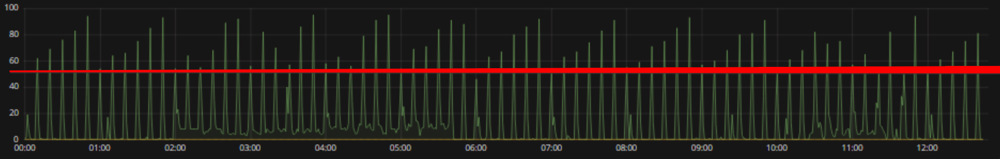
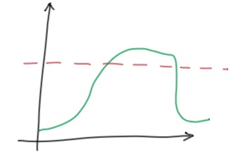
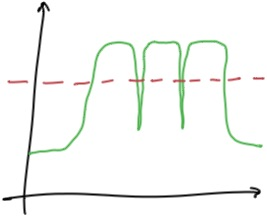
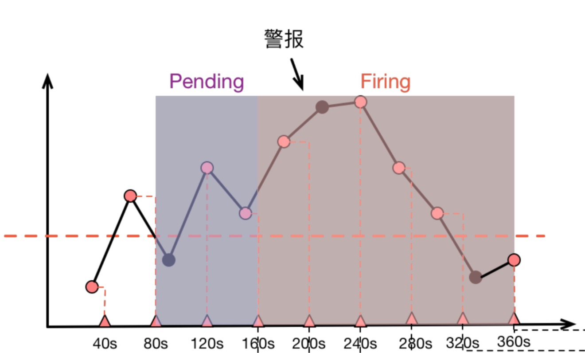

# Promtheus 到底啥時候報警？

原文: [我的 Promtheus 到底啥时候报警？](https://aleiwu.com/post/prometheus-alert-why/)

最近又被問到了 Prometheus 為啥不報警，恰好回憶起之前經常解答相關問題，不妨寫一篇文章來解決下面兩個問題：

- 我的 Prometheus 為啥報警？
- 我的 Prometheus 為啥不報警？

## 從 for 參數開始

我們首先需要一些背景知識：Prometheus 是如何計算並產生警報的？

看一條簡單的警報規則：

```yaml
- alert: KubeAPILatencyHigh
  annotations:
    message: The API server has a 99th percentile latency of {{ $value }} seconds
      for {{ $labels.verb }} {{ $labels.resource }}.
  expr: |
    cluster_quantile:apiserver_request_latencies:histogram_quantile{job="apiserver",quantile="0.99",subresource!="log"} > 4
  for: 10m
  labels:
    severity: critical
```

這條警報的*大致*含義是，假如 kube-apiserver 的 P99 響應時間大於 4 秒，並持續 10 分鐘以上，就產生報警。

首先要注意的是由 `for` 指定的 `Pending Duration`。這個參數主要用於 **降噪**，很多類似響應時間這樣的指標都是有抖動的，通過指定 `Pending Duration`，我們可以 過濾掉這些瞬時抖動，讓 on-call 人員能夠把注意力放在真正有持續影響的問題上。

那麼顯然，下面這樣的狀況是不會觸發這條警報規則的，因為雖然指標已經達到了警報閾值，但持續時間並不夠長：



但偶爾我們也會碰到更奇怪的事情。

## 為什麼不報警？



類似上面這樣持續超出閾值的場景，為什麼有時候會不報警呢？

## 為什麼報警？



類似上面這樣並未持續超出閾值的場景，為什麼有時又會報警呢？

## 採樣間隔

這其實都源自於 Prometheus 的數據存儲方式與計算方式。

首先，Prometheus 按照配置的抓取間隔(`scrape_interval`)定時抓取指標數據，因此存儲的是形如 `(timestamp, value)` 這樣的採樣點。

對於警報， Prometheus 會按固定的時間間隔重複計算每條警報規則，因此警報規則計算得到的只是稀疏的採樣點，而警報持續時間是否大於 `for` 指定的 Pending Duration 則是由這些稀疏的採樣點決定的。

而在 Grafana 渲染圖表時，Grafana 發送給 Prometheus 的是一個 Range Query，其執行機制是從時間區間的起始點開始，每隔一定的時間點（由 Range Query 的 `step` 請求參數決定） 進行一次計算採樣。

這些結合在一起，就會導致警報規則計算時“看到的內容”和我們在 Grafana 圖表上觀察到的內容不一致，比如下面這張示意圖：



上面圖中，圓點代表原始採樣點：

- 40s 時，第一次計算，低於閾值
- 80s 時，第二次計算，高於閾值，進入 Pending 狀態
- 120s 時，第三次計算，仍然高於閾值，90s 處的原始採樣點雖然低於閾值，但是警報規則計算時並沒有”看到它“
- 160s 時，第四次計算，高於閾值，Pending 達到 2 分鐘，進入 firing 狀態
- 持續高於閾值
- 直到 360s 時，計算得到低於閾值，警報消除

由於採樣是稀疏的，部分採樣點會出現被跳過的狀況，而當 Grafana 渲染圖表時，取決於 Range Query 中採樣點的分佈，圖表則有可能捕捉到 被警報規則忽略掉的”低谷“（圖三)或者也可能無法捕捉到警報規則碰到的”低谷“（圖二）。如此這般，我們就被”圖表“給矇騙過去，質疑起警報來了。

## 如何應對

首先嘛， Prometheus 作為一個指標系統天生就不是精確的——由於指標本身就是稀疏採樣的，事實上所有的圖表和警報都是”估算”，我們也就不必 太糾結於圖表和警報的對應性，能夠幫助我們發現問題解決問題就是一個好監控系統。當然，有時候我們也得證明這個警報確實沒問題，那可以看一眼 `ALERTS` 指標。 `ALERTS` 是 Prometheus 在警報計算過程中維護的內建指標，它記錄每個警報從 Pending 到 Firing 的整個歷史過程，拉出來一看也就清楚了。

但有時候 ALERTS 的說服力可能還不夠，因為它本身並沒有記錄每次計算出來的值到底是啥，而在我們回頭去考證警報時，又無法選取出和警報計算過程中一模一樣的計算時間點， 因此也就無法還原警報計算時看到的計算值究竟是啥。這時候終極解決方案就是把警報所要計算的指標定義成一條 Recording Rule，計算出一個新指標來記錄計算值，然後針對這個 新指標做閾值報警。 kube-prometheus 的警報規則中就大量採用了這種技術。

## 到此為止了嗎？

Prometheus 警報不僅包含 Prometheus 本身，還包含用於警報治理的 Alertmanager，我們可以看一看上面那張指標計算示意圖的全圖：


在警報產生後，還要經過 Alertmanager 的分組、抑制處理、靜默處理、去重處理和降噪處理最後再發送給接收者。而這個過程也有大量的因素可能會導致警報產生了卻最終 沒有進行通知。這部分的內容，之前的文章 [搞搞 Prometheus：Alertmanager](https://aleiwu.com/post/alertmanager/) 已經涵蓋，這兩篇內容加在一起，也算是能把開頭的兩個問題解答得差不多了吧😂。