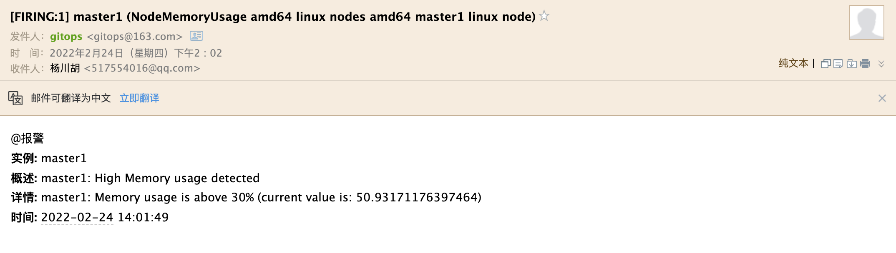

# 報警接收器

原文: [报警接收器](https://p8s.io/docs/alertmanager/receiver/)

Alertmanager 支持很多內置的報警接收器，如 email、slack、企業微信、webhook 等，上面的測試我們使用的 email 來接收報警。

## 通知模板

告警通知使用的是默認模版，因為它已經編譯到二進制包了，所以我們不需要額外配置。如果我們想自定義模版，這又該如何配置呢？

Alertmanager 默認使用的通知模板可以從[這裡](https://github.com/prometheus/alertmanager/blob/master/template/default.tmpl)獲取，Alertmanager 的通知模板是基於 [Golang 的模板系統](https://golang.org/pkg/text/template)，當然也支持用戶自定義和使用自己的模板。

第一種方式是基於模板字符串，直接在 Alertmanager 的配置文件中使用模板字符串，如下所示：

```yaml title="alertmanager.yml"
receivers:
  - name: "slack-notifications"
    slack_configs:
      - channel: "#alerts"
        text: "https://internal.myorg.net/wiki/alerts/{{ .GroupLabels.app }}/{{ .GroupLabels.alertname }}"
```

直接在配置文件中可以使用一些模板字符串，比如獲取 `{{ .GroupLabels }}` 下面的一些屬性。

另外一種方法就是直接修改官方默認的模板，此外也可以自定義可複用的模板文件，比如針對 `email` 的模板，我們可以創建一個名為 `template_email.tmpl` 的自定義模板文件，如下所示：

```yaml title="alertmanager.yml"
global:  # 全局配置
      ......
    route:  # 路由
      ......
    templates:  # 增加 templates 配置，指定模板文件
    - '/etc/alertmanager/template_email.tmpl'

    receivers:  # 接收器
    - name: 'email'
      email_configs:
      - to: '[email protected]'
        send_resolved: true
        html: '{{ template "email.html" . }}' # 此處通過 html 指定模板文件中定義的 email.html 模板
```

```yaml title="template_email.tmpl"
{{ define "email.html" }}  
{{- if gt (len .Alerts.Firing) 0 -}}{{ range .Alerts }}
@報警<br>
<strong>實例:</strong> {{ .Labels.instance }}<br>
<strong>概述:</strong> {{ .Annotations.summary }}<br>
<strong>詳情:</strong> {{ .Annotations.description }}<br>
<strong>時間:</strong> {{ (.StartsAt.Add 28800e9).Format "2006-01-02 15:04:05" }}<br>
{{ end }}{{ end -}}<br>
{{- if gt (len .Alerts.Resolved) 0 -}}{{ range .Alerts }}<br>
@恢復<br>
<strong>實例:</strong> {{ .Labels.instance }}<br>
<strong>信息:</strong> {{ .Annotations.summary }}<br>
<strong>恢復:</strong> {{ (.StartsAt.Add 28800e9).Format "2006-01-02 15:04:05" }}<br>
{{ end }}{{ end -}}
{{- end }}
```

在 Alertmanager 配置中通過 `templates` 屬性來指定我們自定義的模板路徑，這裡我們定義的 `template_email.tmpl` 模板，模板中通過 `{{ define "email.html" }}` 定義了一個名為 `email.html` 的命名模板，然後在 `email` 的接收器中通過 `email_configs.html` 來指定定義的命名模板即可。更新上面 Alertmanager 的配置對象，重啟 Alertmanager 服務，然後等待告警發出，即可看到我們如下所示自定義的模板信息：



## WebHook 接收器

上面我們配置的是 AlertManager 自帶的郵件報警模板，我們也說了 AlertManager 支持很多報警接收器，比如 slack、微信之類的，其中最為靈活的方式當然是使用 `webhook` 了，我們可以定義一個 `webhook` 來接收報警信息，然後在 `webhook` 裡面去進行處理，需要發送怎樣的報警信息我們自定義就可以，下面的 JSON 數據就是 AlertManager 將報警信息 POST 給 `webhook` 的數據：

```json
{
  "receiver": "webhook",
  "status": "firing",
  "alerts": [
    {
      "status": "firing",
      "labels": {
        "alertname": "NodeMemoryUsage",
        "beta_kubernetes_io_arch": "amd64",
        "beta_kubernetes_io_os": "linux",
        "instance": "node1",
        "job": "nodes",
        "kubernetes_io_arch": "amd64",
        "kubernetes_io_hostname": "node1",
        "kubernetes_io_os": "linux",
        "team": "node"
      },
      "annotations": {
        "description": "node1: Memory usage is above 30% (current value is: 42.097619438581596)",
        "summary": "node1: High Memory usage detected"
      },
      "startsAt": "2022-03-02T02:13:19.69Z",
      "endsAt": "0001-01-01T00:00:00Z",
      "generatorURL": "http://prometheus-649968556c-8p4tj:9090/graph?g0.expr=%28node_memory_MemTotal_bytes+-+%28node_memory_MemFree_bytes+%2B+node_memory_Buffers_bytes+%2B+node_memory_Cached_bytes%29%29+%2F+node_memory_MemTotal_bytes+%2A+100+%3E+30\u0026g0.tab=1",
      "fingerprint": "8cc4749f998d64dd"
    }
  ],
  "groupLabels": { "instance": "node1" },
  "commonLabels": {
    "alertname": "NodeMemoryUsage",
    "beta_kubernetes_io_arch": "amd64",
    "beta_kubernetes_io_os": "linux",
    "instance": "node1",
    "job": "nodes",
    "kubernetes_io_arch": "amd64",
    "kubernetes_io_hostname": "node1",
    "kubernetes_io_os": "linux",
    "team": "node"
  },
  "commonAnnotations": {
    "description": "node1: Memory usage is above 30% (current value is: 42.097619438581596)",
    "summary": "node1: High Memory usage detected"
  },
  "externalURL": "http://alertmanager-5774d6f5f4-prdgr:9093",
  "version": "4",
  "groupKey": "{}/{team=\"node\"}:{instance=\"node1\"}",
  "truncatedAlerts": 0
}
```

