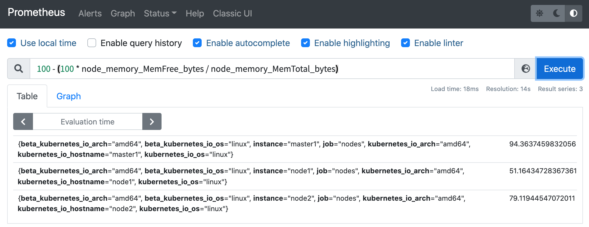
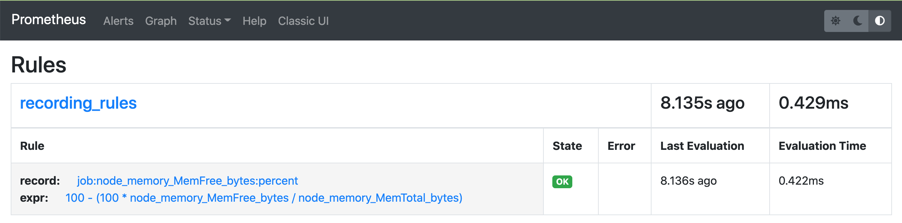
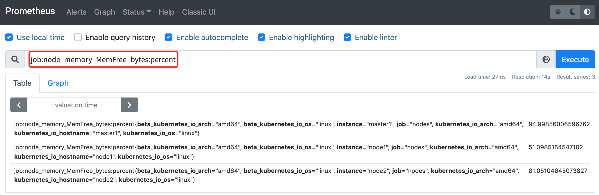

# 記錄規則

原文: [记录规则](https://p8s.io/docs/alertmanager/record/)

通過 `PromQL` 可以實時對 Prometheus 中採集到的樣本數據進行查詢，聚合以及其它各種運算操作。而在某些 PromQL 較為複雜且計算量較大時，直接使用 PromQL 可能會導致 Prometheus 響應超時的情況。這時需要一種能夠類似於後台批處理的機制在後台完成這些複雜運算的計算，對於使用者而言只需要查詢這些運算結果即可。 

Prometheus 通過 `Recoding Rule` 規則支持這種後台計算的方式，可以實現對複雜查詢的性能優化，提高查詢效率。這對於 Grafana Dashboard 特別有用，儀表板每次刷新時都需要重複查詢相同的表達式。

## 配置

在 Prometheus 配置文件中，我們可以通過 `rule_files` 定義 `recoding rule` 規則文件的訪問路徑。

```yaml
rule_files: [- <filepath_glob> ...]
```

每一個規則文件通過以下格式進行定義：

```yaml
groups: [- <rule_group>]
```

一個簡單的規則文件可能是這個樣子的：

```yaml
groups:
  - name: example
    rules:
      - record: job:http_inprogress_requests:sum
        expr: sum(http_inprogress_requests) by (job)
```

rule_group 的具體配置項如下所示：

```yaml
# 分組的名稱，在一個文件中必須是唯一的
name: <string>

# 評估分組中規則的頻率
[ interval: <duration> | default = global.evaluation_interval ]

rules:
  [ - <rule> ... ]
```

與告警規則一致，一個 group 下可以包含多條規則。

```yaml
# 輸出的時間序列名稱，必須是一個有效的 metric 名稱
record: <string>
# 要計算的 PromQL 表達式，每個評估週期都是在當前時間進行評估的，結果記錄為一組新的時間序列，metrics 名稱由 record 設置
expr: <string>
# 添加或者覆蓋的標籤
labels: [<labelname>: <labelvalue>]
```

根據規則中的定義，Prometheus 會在後台完成 `expr` 中定義的 PromQL 表達式計算，並且將計算結果保存到新的時間序列 `record` 中，同時還可以通過 `labels` 標籤為這些樣本添加額外的標籤。

這些規則文件的計算頻率與告警規則計算頻率一致，都通過 `global.evaluation_interval` 進行定義:

```yaml
global: [evaluation_interval: <duration> | default = 1m]
```

## 測試

比如現在我們想要獲取空閒節點內存的百分比，可以使用如下所示的 PromQL 語句查詢：

```promql
100 - (100 * node_memory_MemFree_bytes / node_memory_MemTotal_bytes)
```



然後現在我們就可以使用記錄規則將上面的表達式重新配置。同樣在配置報警規則的 groups 下面添加如下所示配置：

```yaml
groups:
  - name: recording_rules
    rules:
    - record: job:node_memory_MemFree_bytes:percent
      expr: 100 - (100 * node_memory_MemFree_bytes / node_memory_MemTotal_bytes)
  # 其他報警規則
  - name: test-node-mem
    rules:  # 具體的報警規則
    - alert: NodeMemoryUsage  # 報警規則的名稱
      ......
```

這裡其實相當於我們為前面的查詢表達式配置了一個 `job:node_memory_MemFree_bytes:percent` 的別名，一般來說記錄規則的名稱可以使用`:`字符來進行連接，這樣的命名方式可以讓規則名稱更加有意義。更新上面配置並 `reload` 下 Prometheus 即可讓記錄規則生效，在 Prometheus 的 `Rules` 頁面正常也可以看到上面添加的記錄規則：



現在我們就可以直接使用記錄規則的名稱 `job:node_memory_MemFree_bytes:percent` 來進行查詢了：



由於我們這裡的查詢語句本身不消耗資源，所以使用記錄規則來進行查詢差距不大，但是對於需要消耗大量資源的查詢語句則提升會非常明顯。