# 報警規則

原文: [报警规则](https://p8s.io/docs/alertmanager/rules/)

現在我們只是把 AlertManager 服務運行起來了，也和 Prometheus 進行了關聯，但是現在我們並不知道要做什麼報警，因為沒有任何地方告訴我們要報警，所以我們還需要配置一些報警規則來告訴我們對哪些數據進行報警。

## 添加報警規則

警報規則允許你基於 Prometheus 表達式語言的表達式來定義報警條件，並在觸發警報時發送通知給外部的接收者。

同樣在 Prometheus 的配置文件中添加如下報警規則配置：

```yaml title="prometheus.yml"
rule_files:
  - /etc/prometheus/rules.yml # 報警規則定義檔 (請根據自己的相錄結構進行調整)
```

接著我們先編寫一個報警規則:

```yaml title="rules.yml"
groups:
  - name: test-node-mem
    rules:
    - alert: NodeMemoryUsage
      expr: (node_memory_MemTotal_bytes - (node_memory_MemFree_bytes + node_memory_Buffers_bytes + node_memory_Cached_bytes)) / node_memory_MemTotal_bytes * 100 > 20
      for: 2m
      labels:
        team: node
      annotations:
        summary: "{{$labels.instance}}: High Memory usage detected"
        description: "{{$labels.instance}}: Memory usage is above 20% (current value is: {{ $value }})"
```

面我們定義了一個名為 `NodeMemoryUsage` 的報警規則，一條報警規則主要由以下幾部分組成：

- **alert**：告警規則的名稱
- **expr**：是用於進行報警規則 PromQL 查詢語句
- **for**：評估等待時間（Pending Duration），用於表示只有當觸發條件持續一段時間後才發送告警，在等待期間新產生的告警狀態為 `pending`
- **labels**：自定義標籤，允許用戶指定額外的標籤列表，把它們附加在告警上
- **annotations**：指定了另一組標籤，它們不被當做告警實例的身份標識，它們經常用於存儲一些額外的信息，用於報警信息的展示之類的

!!! info "for 屬性"
    這個參數主要用於 **降噪**，很多類似響應時間這樣的指標都是有抖動的，通過指定 Pending Duration，我們可以過濾掉這些瞬時抖動，可以讓我們能夠把注意力放在真正有持續影響的問題上。

為了讓告警信息具有更好的可讀性，Prometheus 支持模板化 `label` 和 `annotations` 中的標籤的值，通過 `$labels.變量` 可以訪問當前告警實例中指定標籤的值，`$value` 則可以獲取當前 PromQL 表達式計算的樣本值。

為了方便演示，我們將的表達式判斷報警臨界值設置為 `20` (內存的使用率)，設定 `prometheus.yml` 與 `rules.yml` 配置文件之後重新啟動 Prometheus 進程，接著去 Prometheus 的 Dashboard 中切換到 "Status -> Rules" 路徑下面就可以看到有報警配置的配置：

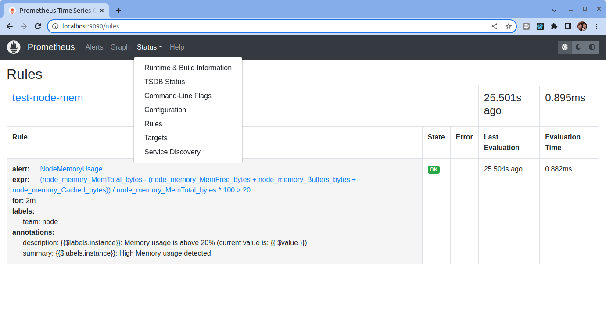

切換到 Dashoard 中 "Alerts" 可以看到報警配置規則現在的狀態：


頁面中出現了我們剛剛定義的報警規則信息，而且報警信息中還有狀態顯示，一個報警信息在生命週期內有下面 3 種狀態：

- **pending**: 表示在設置的閾值時間範圍內被激活了
- **firing**: 表示超過設置的閾值時間被激活了
- **inactive**: 報警規則沒有得到滿足或者已經過期（還沒觸發或者已經修復）

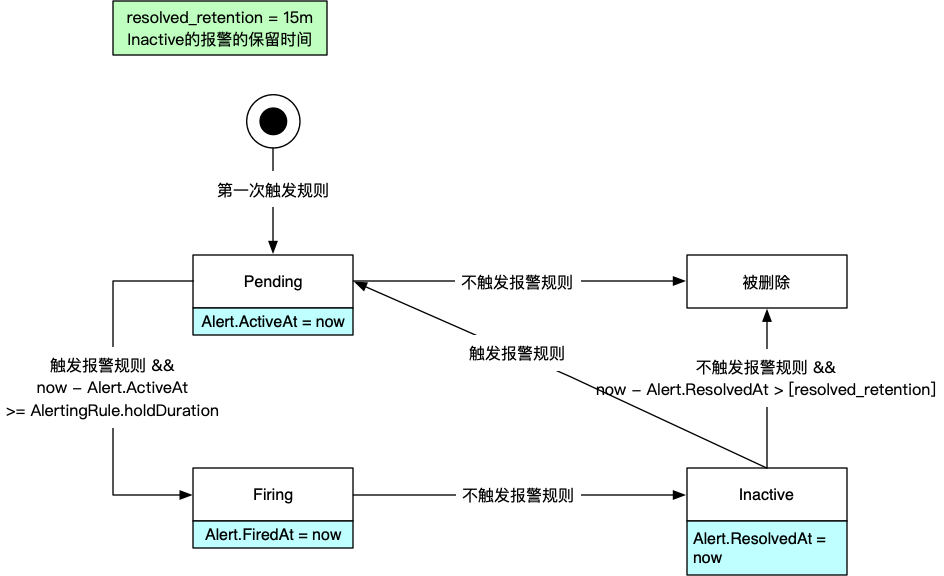

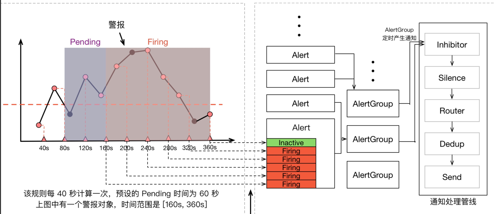

這裡的 `pending` 狀態是說報警規則已經得到滿足了，但是持續時間還不夠，這裡的持續時間是通過配置文件中的 `for` 來設置的，如果沒有設置，那麼就不存在 pending 狀態，而是報警規則一得到滿足就會發送報警，如果設置了這個字段，那麼就會進入 `pending` 狀態，並且在持續時間足夠的時候，才會發送出去。

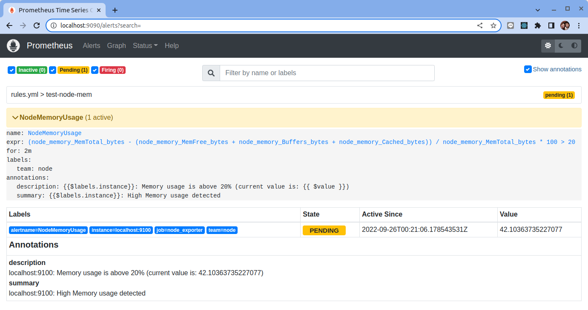

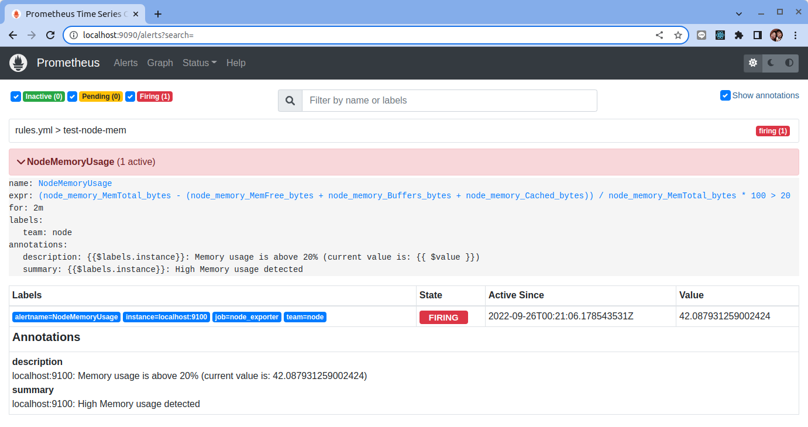

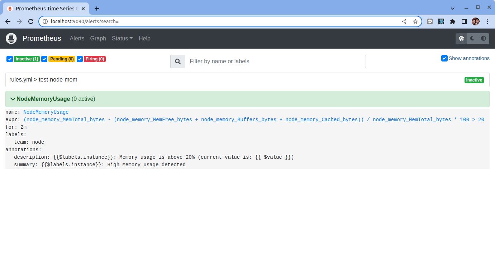

同時對於已經 `pending` 或者 `firing` 的告警，Prometheus 也會將它們存儲到時間序列 `ALERTS{}` 中。當然我們也可以通過表達式去查詢告警實例：

```promql
ALERTS{alertname="<alert name>", alertstate=~"pending|firing", <additional alert labels>}
```

比如說我們可使用下列查詢出所有被觸發的報警:

```promql
ALERTS{alertstate=~"pending|firing"}
```

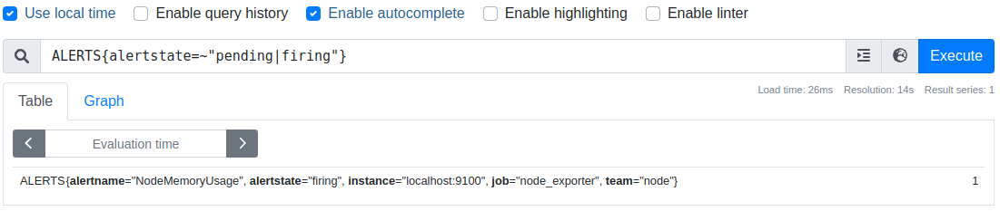

樣本值為 `1` 表示當前告警處於活動狀態（`pending` 或者 `firing`），當告警從活動狀態轉換為非活動狀態時，樣本值則為 `0`。

我們這裡的狀態現在是 `firing` 就表示這個報警已經被激活了，我們這裡的報警信息有一個 `team=node` 這樣的標籤，如果在配置 `alertmanager` 的時候有如下的路由配置：

```yaml title="altermanager.yml" hl_lines="5"
routes:
  - receiver: email
    group_wait: 10s
    match:
      team: node

```

所以我們這裡的報警信息會被 email 這個接收器來進行報警，我們上面配置的是郵箱，所以正常來說這個時候我們會收到一封如下的報警郵件：

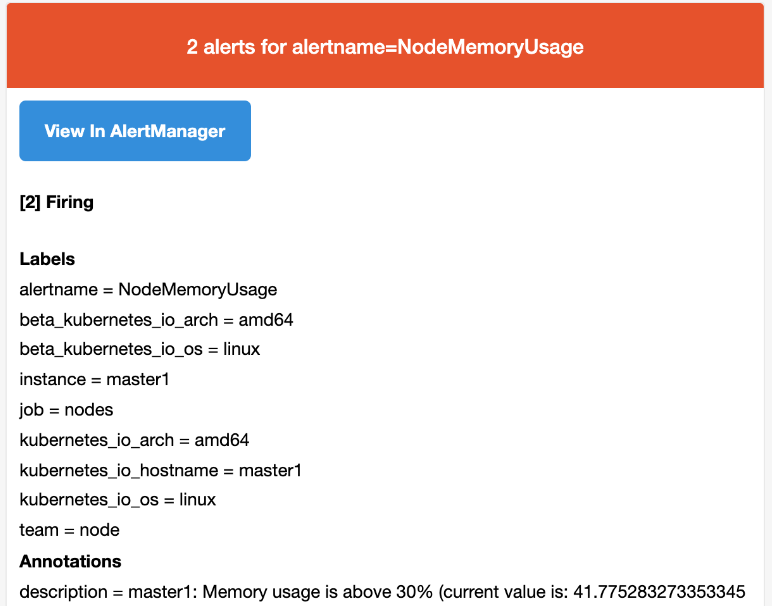

我們可以看到收到的郵件內容中包含一個 `View In AlertManager` 的鏈接。然後通過點擊鏈接，我們就可以查看到 AlertManager 的 Dashboard 頁面。

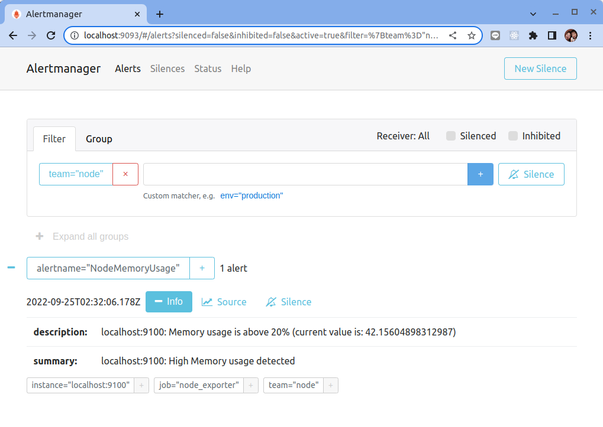

在這個頁面中我們可以進行一些操作，比如過濾、分組等等，裡面還有兩個新的概念：`Inhibition(抑制)` 和 `Silences(靜默)`。

- `Inhibition`：如果某些其他警報已經觸發了，則對於某些警報，Inhibition 是一個抑制通知的概念。例如：一個警報已經觸發，它正在通知整個集群是不可達的時，Alertmanager 則可以配置成關心這個集群的其他警報無效。這可以防止與實際問題無關的數百或數千個觸發警報的通知，Inhibition 需要通過上面的配置文件進行配置。

- `Silences`：靜默是一個非常簡單的方法，可以在給定時間內簡單地忽略所有警報。 Silences 基於 matchers 配置，類似路由樹。來到的警告將會被檢查，判斷它們是否和活躍的 Silences 相等或者正則表達式匹配。如果匹配成功，則不會將這些警報發送給接收者。

## 何時報警

在 Prometheus 與 Alertmanager 中有很多地方都涉及到報警時機的配置，那麼我的報警規則具體會在什麼時候報警呢？

首先在 Prometheus 的全局配置中有一個 `evaluation_interval` 屬性，該屬性表示的是間隔多長時間對報警規則進行評估，比如我們這裡配置的 `30s`，那麼每 `30s` 會去驗證下我們的報警規則是否達到了閾值。

此時我們的報警狀態處於 `inactive`，如果評估後達到了閾值，則會變成 `pending` 狀態，這個時候報警還沒有發送給 Alertmanager，什麼時候觸發需要依賴報警規則中的 `for` 屬性配置了，比如我們配置成 `1m`，那麼也就是在後續 1 分鐘內的評估如果都達到了閾值，那麼就會變成 `pending` 狀態，並將報警發送給 Alertmanager，後續的操作就是 Alertmanager 來處理了。

所以有的場景下我們的監控圖表上面已經有部分指標達到了告警的閾值了，但是並不一定會觸發告警規則，比如我們上面的規則中，設置的是 1 分鐘的 Pending Duration，對於下圖這種情況就不會觸發告警，因為持續時間太短，沒有達到一分鐘：

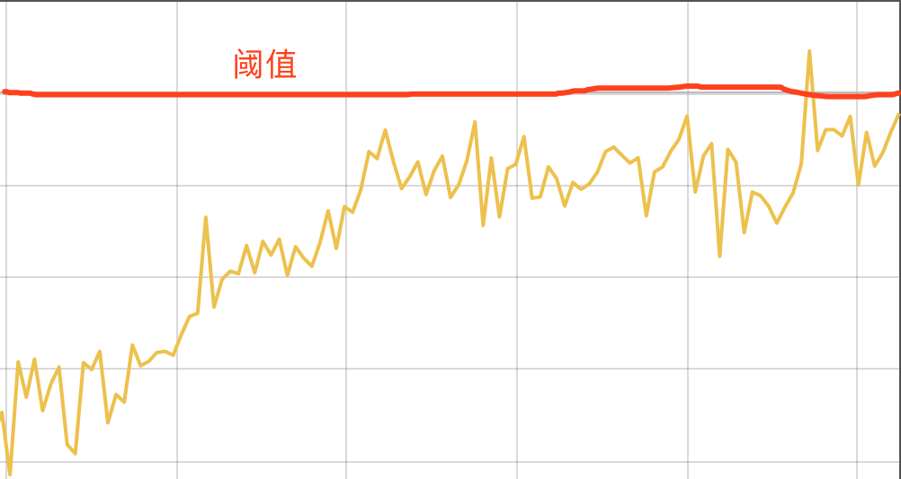

報警具體什麼時候發送就要看我們的報警路由規則如何配置的了，核心是下面幾個屬性：

- `group_by: [instance]` 報警分組
- `group_wait: 30s` 在組內等待所配置的時間，如果同組內，比如, 30秒內在同一個組內出現出現相同報警。
- `group_interval: 5m` 每個分組中最多每 5 分鐘發送一條警報
- `repeat_interval: 1h` 發送報警間隔，如果指定時間內沒有修復，則重新發送報警。

Alertmanager 會將收到的報警規則按照 `group_by` 進行分組。當一個報警觸發之後，如果之前沒有分組，那麼就會創建一個分組，當創建完之後會等待 `group_wait` 這麼長的時間才會發送，這裡不會馬上發送就是需要積攢一定數量的報警，防止報警數量過多，形成報警風暴。

當一個報警觸發之後，如果這個報警屬於某個 `group`，但是這個 `group` 因為距離第一個 alert 已經足夠 `group_wait` 時間了，發送過一次了，那麼就會等待 `group_interval` 時間之後再次發送新的報警 group 了。

所以，如果報警已經從 Prometheus 送到 Alertmanager 了，那麼最多可能等待 `max(group_wait，group_interval）`的時間。

假如一個相同的警報一直 FIRING，Alertmanager 並不會一直發送警報，而會等待一段時間，這個等待時間就是 `repeat_interval`，顯然，不同類型警報的發送頻率也是不一樣的。

比如現在我們添加兩條如下所示的報警規則：

```yaml title="prometheus.yml"
groups:
  - name: test-node-mem
    rules: # 具體的報警規則
      - alert: NodeMemoryUsage # 報警規則的名稱
        expr: (node_memory_MemTotal_bytes - (node_memory_MemFree_bytes + node_memory_Buffers_bytes + node_memory_Cached_bytes)) / node_memory_MemTotal_bytes * 100 > 30
        for: 1m
        labels:
          team: node
        annotations:
          summary: "{{$labels.instance}}: High Memory usage detected"
          description: "{{$labels.instance}}: Memory usage is above 30% (current value is: {{ $value }})"
  - name: test-node-cpu
    rules:
      - alert: NodeCpuUsage
        expr: ((1 - sum(increase(node_cpu_seconds_total{mode="idle"}[1m])) by (instance) / sum(increase(node_cpu_seconds_total[1m])) by (instance) ) * 100) > 5
        for: 2m
        labels:
          team: node
        annotations:
          summary: "{{$labels.instance}}: High CPU usage detected"
          description: "{{$labels.instance}}: CPU usage is above 5% (current value is: {{ $value }})"
```

並在 Alertmanager 中配置路由的時候設置根據 `instance` 進行分組：

```yaml title="alertmanager.yml"
routes:
  - receiver: email
    group_wait: 10s
    group_by: ["instance"]
    match:
      team: node
```

正常情況下會先觸發 `NodeMemoryUsage` 這條報警，然後觸發 `NodeCpuUsage`，如果兩個報警都屬於同一個 instance，則會被分到同一個組中，如下所示：

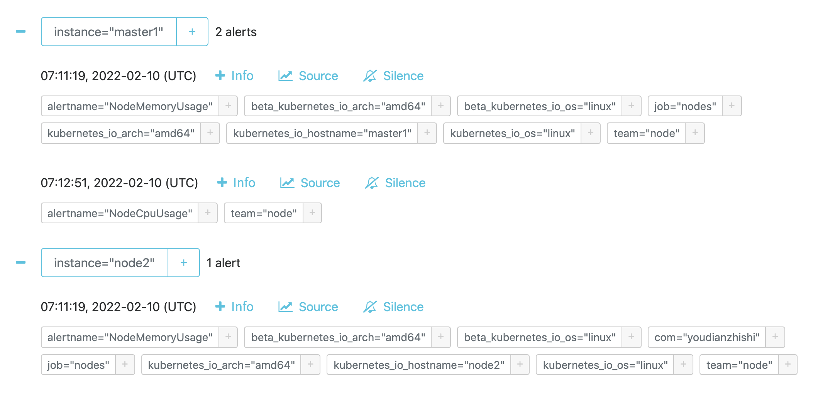

同一個分組的報警會發送一條，如果組內有新的報警信息出現，則會等待 `group_interval` 時間再次發送，如果沒有新的變化，並且報警信息還是 `FIRING` 狀態，則需要等待 `repeat_interval` 時間後再次發送。

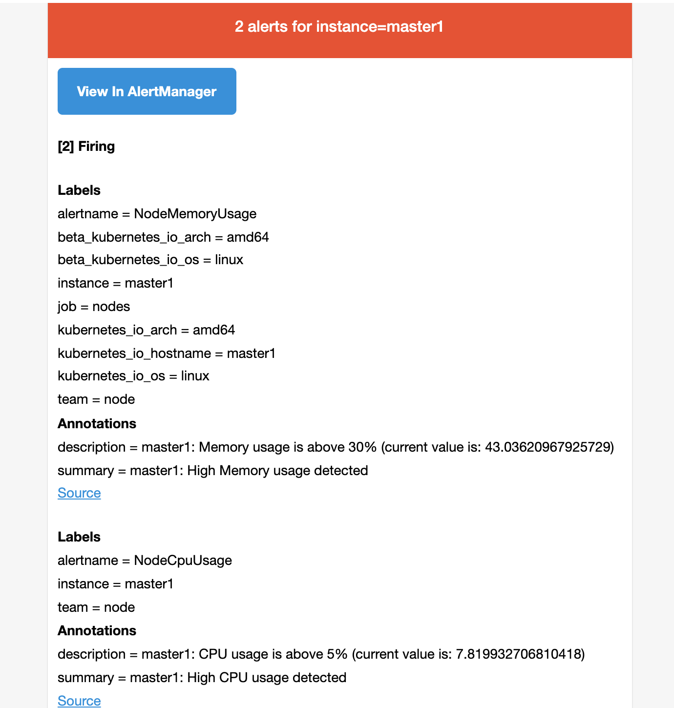

