# 儀錶盤

原文: [仪表盘](https://p8s.io/docs/grafana/gauge/)

如果想展示與最大值和最小值相關的數據，我們可以選擇使用儀錶盤面板，比如我們用一個儀錶盤面板來展示內存使用率。

## 標準儀錶盤可視化

在 Dashboard 頁面上點擊創建一個新的空面板，在面邊編輯器右上方選擇 `Gauge` 類型的面板：

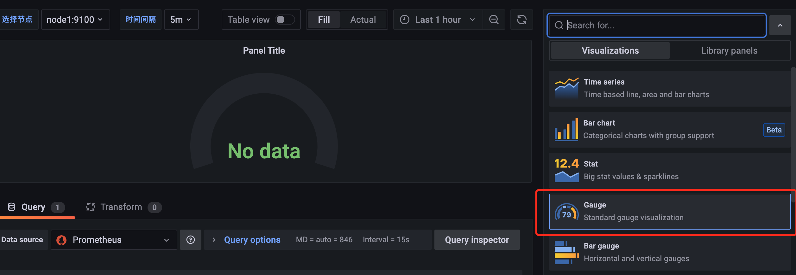

然後添加如下所示的查詢語句，獲取內存使用率：

```promql
  (
      1
    -
        (
            node_memory_Buffers_bytes + node_memory_Cached_bytes{instance=~"$host"}
          +
            node_memory_MemFree_bytes{instance=~"$host"}
        )
      /
        node_memory_MemTotal_bytes{instance=~"$host"}
  )
*
  100
```

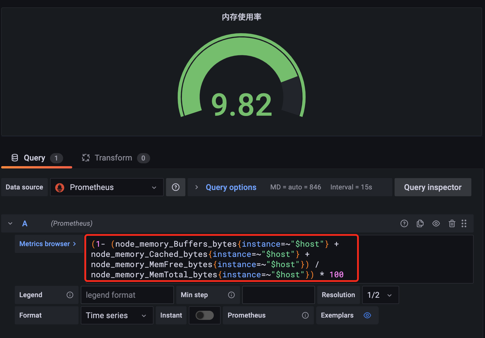

接下來在右側屬性區域設置單位、最小值為 0、最大值為 100：

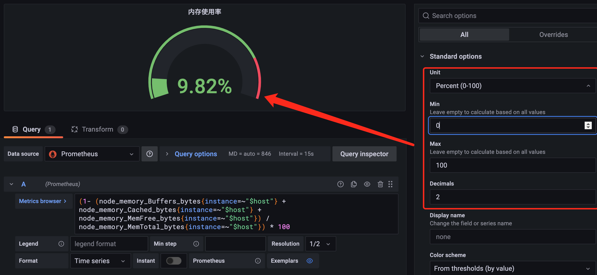

同樣的，如果選擇多個節點的時候顯示不夠友好:

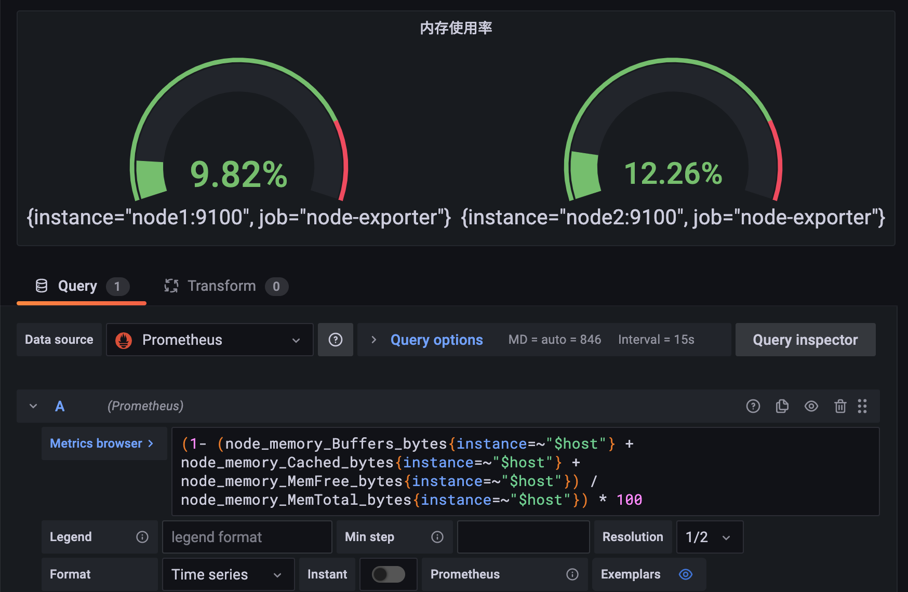

需要在 Legend 地方配置顯示的標籤 `{{instance}}`，然後添加一個 `Rename by regex` 的轉換器：

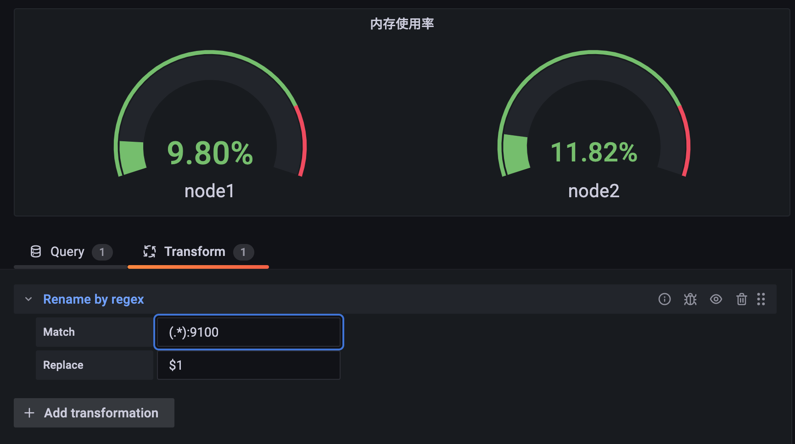

## 條形儀錶盤

除了上面標準的儀錶盤面板之外，還有條形儀錶盤，該面板可以顯示一個或多個條形儀表，同樣我們可以用來展示 CPU 使用率、內存使用率等。比如這裡我們用條形儀錶盤來進行展示。

點擊添加一個新的空面板，在面板編輯器右側選擇 `Bar gauge`：

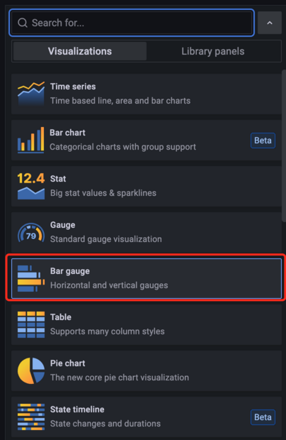

然後接著添加 CPU 使用率的查詢：

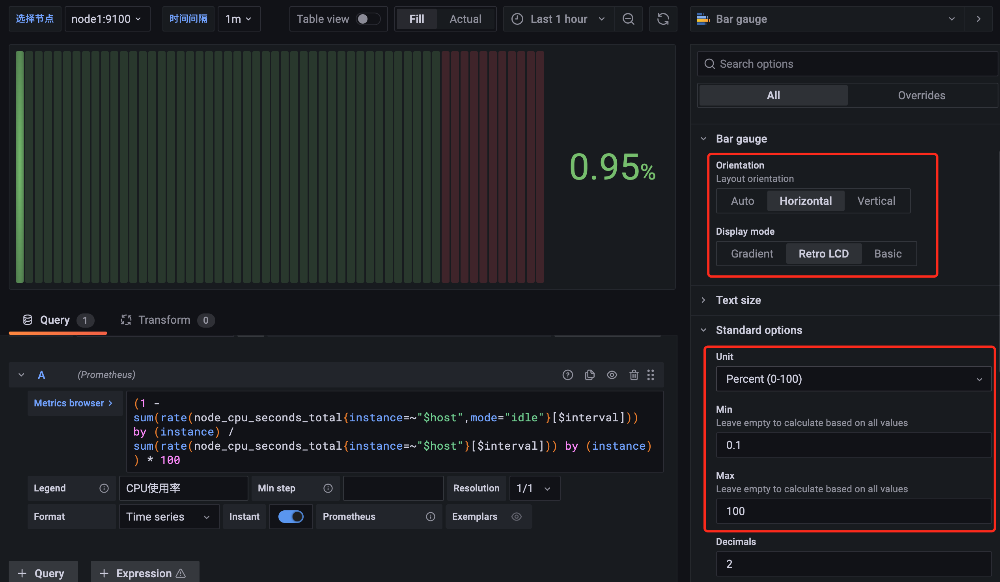

查詢語句添加完成後，在右側屬性配置中設置 `Bar gauge` 的展示方向為水平 `Horizontal` 方向，顯示模式為 Retro LCD，同時設置顯示的單位為 `Percent (0-100)`，最小值為 `0.1`，最大值為 `100`，這樣就將 CPU 使用率用條形儀錶盤的形式展示出來了，用同樣的方式添加內存使用率的展示：

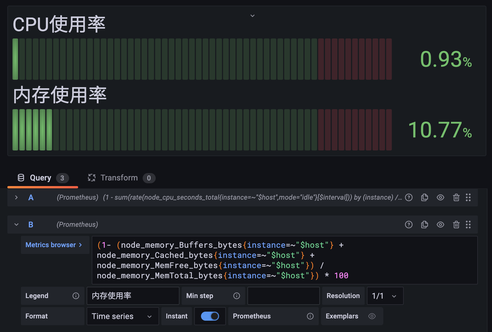

比如我們還可以添加一個最大分區的使用率，要獲取該監控數據，首先我們就要先獲取最大的分區目錄，這裡要使用的指標是 `node_filesystem_size_bytes`：

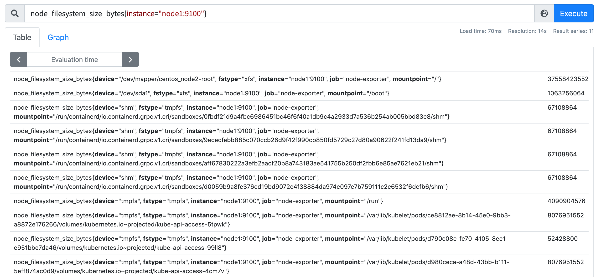

首先我們要過濾掉不是 ext3(4) 或者 xfs 類型的文件系統:

```promql
node_filesystem_size_bytes{fstype=~"ext.?|xfs"}
```

然後可以按照掛載點 `mountpoint` 大小進行排序，獲取最大的一個結果:

```promql
topk(1,sort_desc(max(node_filesystem_size_bytes{fstype=~"ext.?|xfs"}) by (mountpoint)))
```


獲取到了最大的分區後就可以來方便的計算分區的使用率了，比如查詢 `node1` 節點的根分區 / 的使用率：

```promql
(node_filesystem_size_bytes{instance=~"node1:9100", fstype=~"ext.?|xfs", mountpoint="/"} - node_filesystem_free_bytes{instance=~"node1:9100", fstype=~"ext.?|xfs", mountpoint="/"}) / node_filesystem_size_bytes{instance=~"node1:9100", fstype=~"ext.?|xfs", mountpoint="/"} * 100
```

要在 Grafana 的面板中查詢最大分區使用率，這裡我們需要先將最大分區的獲取通過參數進行配置，添加一個名為 `maxpoint` 的參數，查詢語句為 `query_result(topk(1,sort_desc (max(node_filesystem_size_bytes{instance=~'node1:9100',fstype=~"ext.?|xfs"}) by (mountpoint))))`，然後通過正則表達式來獲取定義的參數值：

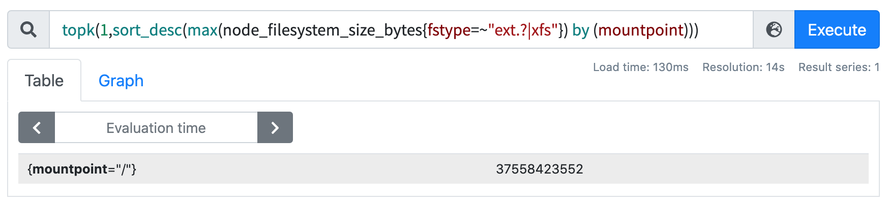

這樣在面板中要查詢的最大分區使用率語句如下所示：

```promql
(node_filesystem_size_bytes{instance=~"$host", fstype=~"ext.?|xfs", mountpoint="$maxpoint"} - node_filesystem_free_bytes{instance=~"$host", fstype=~"ext.?|xfs", mountpoint="$maxpoint"}) / node_filesystem_size_bytes{instance=~"$host", fstype=~"ext.?|xfs", mountpoint="$maxpoint"} * 100
```

最終的效果如下圖所示：

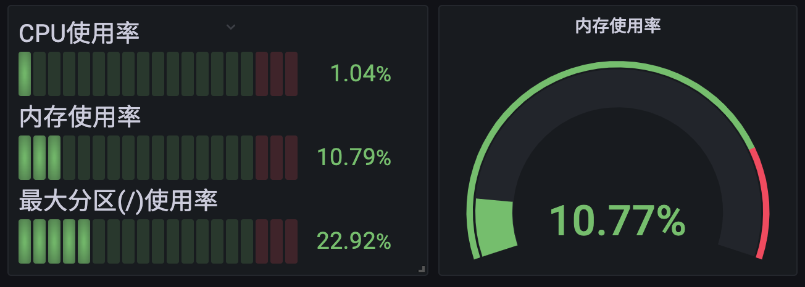