# 圖形定制

原文: [图形定制](https://p8s.io/docs/grafana/graph-custom/)

根據上面的方式方法基本上可以把我們的監控圖表繪製出來，但是有的場景下面可能需要更多的定制功能。比如我們想要在 CPU 使用率的面板中同時展示系統、用戶以及總的使用率，還需要做一些其他定制讓我們的圖表看起來更加友好。

## 設定參數

注意: 請將在[前一章節所設定的參數](./graph.md#_4) `instance` 更名成 `host`。

## 多個查詢

編輯 CPU 使用率這個面板，在面板編輯器下方的 `Query` 區域點擊 `+ Query` 按鈕新增一個查詢。

在該查詢中輸入下列查詢語句來獲取 **CPU 總使用率**：

```promql
(1 - 
     sum(rate(node_cpu_seconds_total{instance=~"$host",mode="idle"}[5m])) by (instance) 
     / 
     sum(rate(node_cpu_seconds_total{instance=~"$host"}[5m])) by (instance) ) * 100
```

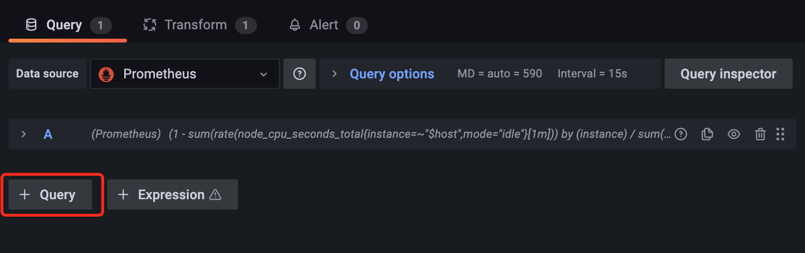

在該查詢中輸入下列查詢語句來獲取 **系統 CPU 的使用率**：

```promql
sum(rate(node_cpu_seconds_total{instance=~"$host",mode="system"}[1m])) by (instance) 
/ 
sum(rate(node_cpu_seconds_total{instance=~"$host"}[1m])) by (instance) 
* 100
```

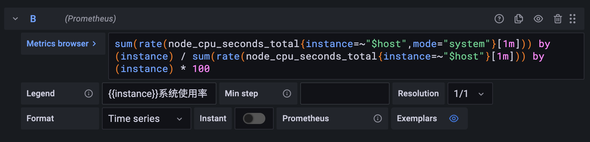

用同樣的方式再新增一個查詢 **用戶 CPU 使用率** 的語句：

```promql
sum(rate(node_cpu_seconds_total{instance=~"$host",mode="user"}[1m])) by (instance) 
/
sum(rate(node_cpu_seconds_total{instance=~"$host"}[1m])) by (instance) 
* 100
```

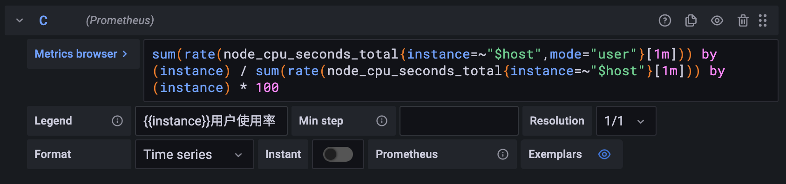

如果我們選擇查詢所有節點的 CPU 使用率，那麼最終的效果如下所示：

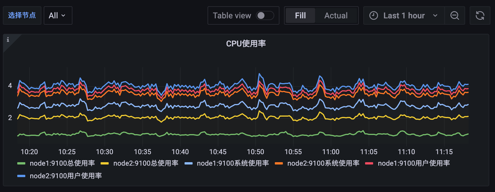

## 轉換

我們可以看圖中 Legend 部分的展示始終會帶上 `:9100` 這個端口號，但其實這對於我們展示來說意義不大，所以最好是去掉這個端口信息，可以點擊編輯器下方 `Query` 旁邊的 `Transform` 選項卡進入轉換頁面：

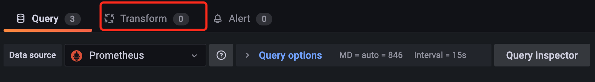

`Transform` 轉換功能允許我們在查詢結果可視化之前加入、計算、重新排序、隱藏和重命名查詢結果，不過目前只支持時間序列數據。對於擁有大量儀表板或大量查詢的用戶而言，能夠在另一個面板中重用來自一個面板的查詢結果可能會帶來巨大的性能提升。

如果有多個轉換，Grafana 會按照它們列出的順序來應用它們，每個轉換都會創建一個新的結果集，該結果集會傳遞到管道中的下一個轉換進行處理。

Grafana 中支持非常多的轉換方式，我們這裡使用 `Rename by regex` 這個通過正則重命名的轉換器即可，這裡我們只需要添加一個 `(.*):9100` 的正則表達式即可，將 `host` 信息保留下來，如下圖所示：

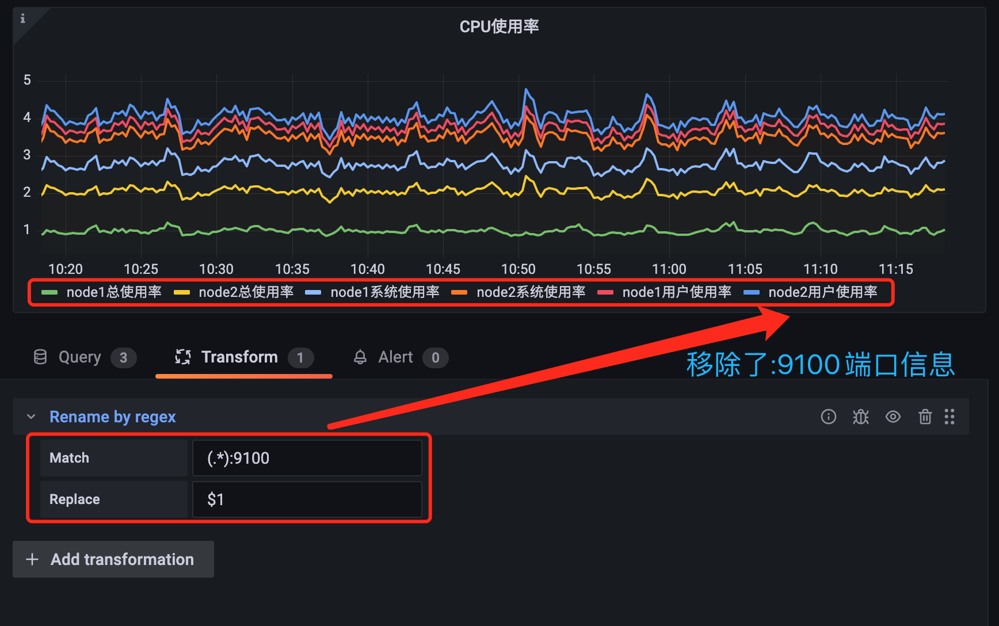

關於轉換的更多使用方法可以參考[官方文檔](https://grafana.com/docs/grafana/latest/panels/transformations/types-options/)了解更多信息。

## Legend 配置

上面轉換完成後，可以看到 Legend 部分展示的圖例較多，我們可以將 Legend 的模式修改為 `Table`：

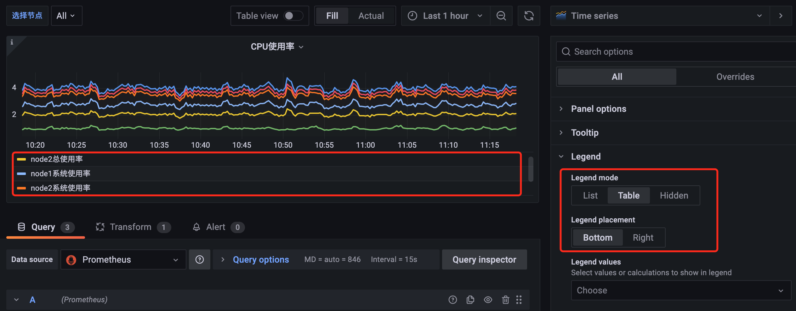

修改為 Table 模式後可以看到圖形中的 Legend 用表格的形式展示出來了，此外我們還可以通過 Legend values 來選擇一些其他的信息進行展示，比如最大值、最小值、平均值等等：

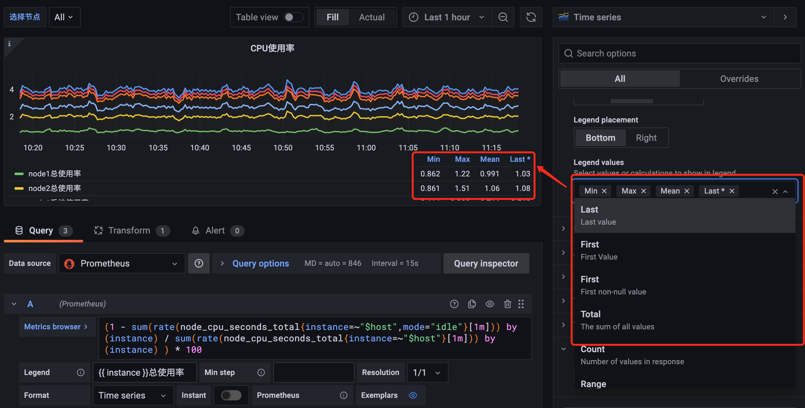

## 其他選項

由於我們這裡計算的都是百分比，所以可以將單位設置為 `%`，位於右側的 `Standard options` 下方的 `Unit` 中選擇 `Misc -> Percent(0-100)` 即可：

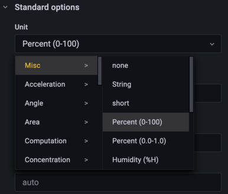

此外還可以配置圖例的最小值、最大值、保留小數的位數、圖形顏色配置等等：

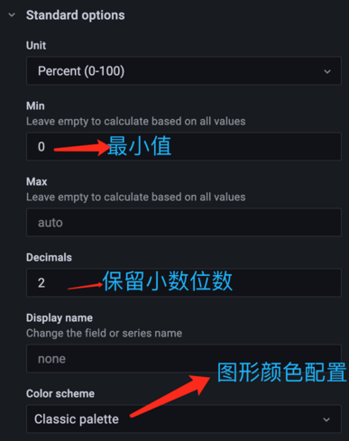

## 時間間隔

前面我們在查詢監控數據的時候都是將區間向量的範圍固定成了 `1m` 或者 `5m`，這樣固定後顯然不是非常靈活，所以我們可以再添加一個時間間隔的參數來靈活選擇。

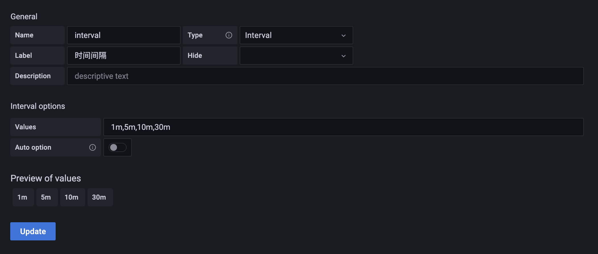

這裡我們新增了一個名為 `interval` 的參數，不過需要注意該參數的類型為 `Interval`，然後我們配置該參數可選的值包括 `1m,5m,10m,30m`，添加後在 Dashboard 頁面上就會多一個時間間隔的下拉框。然後記得將查詢語句中的相關時間間隔替換成 `$interval` 參數：

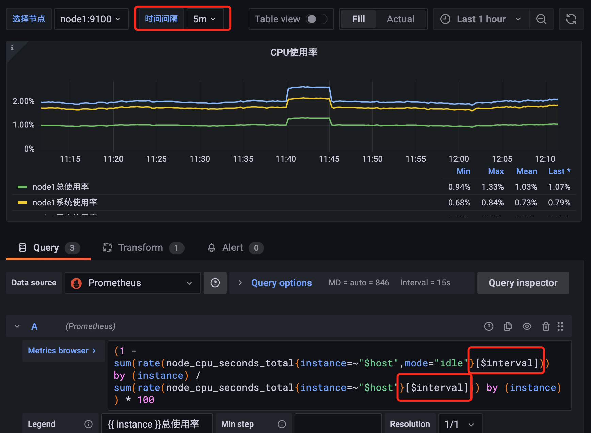

## 覆蓋

用同樣的方式可以去對內存監控圖表進行修改，比如在一個圖表中展示總內存、已用內存、可用內存、內存使用率等信息。

新增下列的查詢:

- 總內存的查詢 `node_memory_MemTotal_bytes{instance=~"$host"}`
- 已用內存的查詢 `node_memory_MemTotal_bytes{instance=~"$host"} - node_memory_MemAvailable_bytes{instance=~"$host"}` 
- 可用內存的查詢 `node_memory_MemAvailable_bytes{instance=~"$host"}`

如下圖所示：

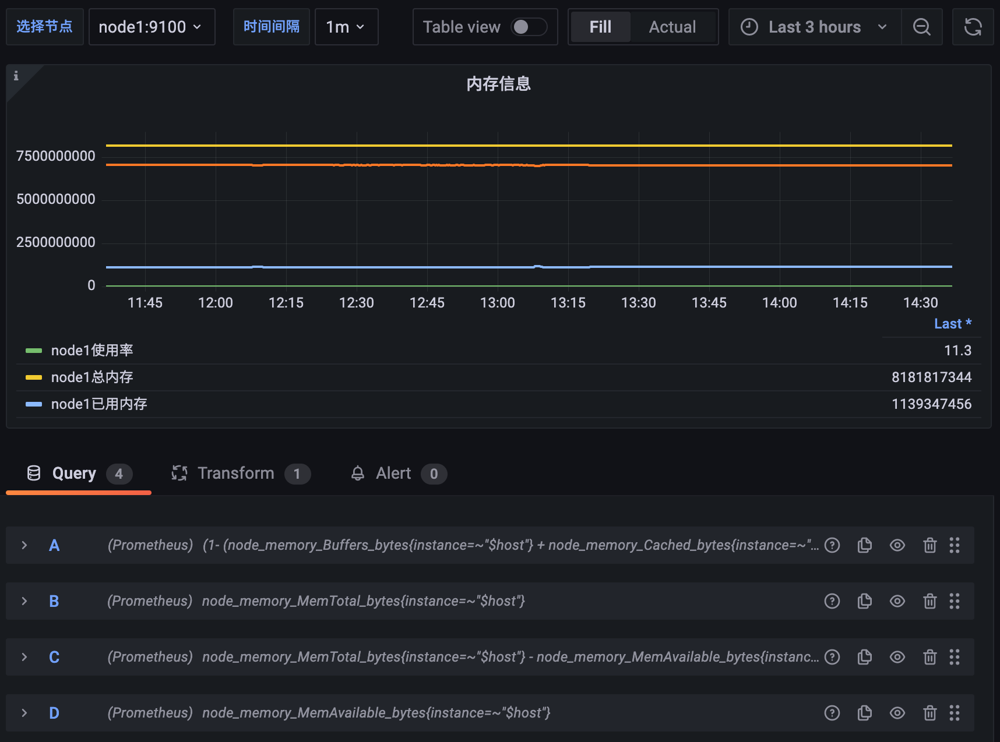

但是這裡有一個明顯的問題是內存使用率的結果是一個百分比，而其他內存使用情況的結果是具體的內存大小，那麼將他們繪製在同一個圖形中必然會有單位不一致的問題，而且結果相差也較大，那麼可以怎麼來解決這個問題呢？

首先我們可以先將整個面板的單位調整為 `bytes(IEC)`，該形式的單位會自動在 `GiB、MiB、KiB` 之間進行換算：


但是明顯使用率的單位是不正確的，這個時候就需要我們針對該查詢進行覆蓋配置，點擊編輯器右側 `Overrides` 選項卡進行覆蓋配置：

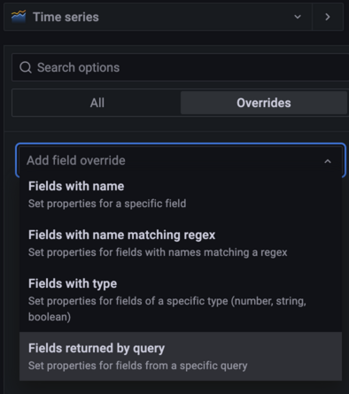

點擊選項卡中的 `+ Add field override` 按鈕可以對屬性進行覆蓋操作，可選的方式有很多，比如可以設置指定具體屬性的值，也可以根據正則表達式來匹配屬性的名進行配置，還可以根據指定的類型以及指定的 query 查詢結果進行覆蓋，顯然我們這裡選擇最後一項 `Fields returned by query` 更加合理，直接選擇查詢使用率的 A 這條語句進行覆蓋：

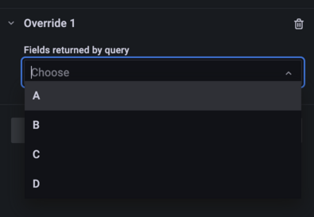

然後就可以開始針對查詢 A 的各項屬性進行單獨的配置：

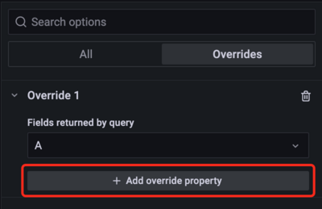

比如我們可以將內存使用百分比的圖形樣式修改成 `Point` 點的形式：

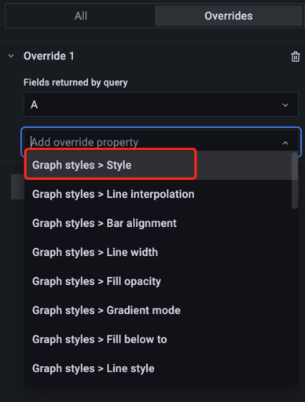

然後還可以圖形的各種樣式，比如 `Point` 的大小

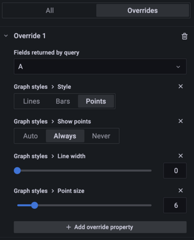

同樣還可以給圖例的 Y 軸添加上百分比的單位，顯示在圖形右側，這樣看上去就更加清晰了：

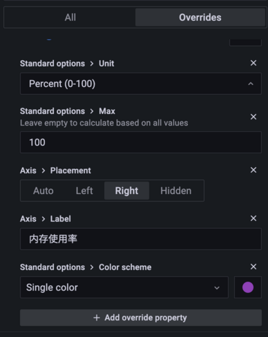

最終效果如下所示：

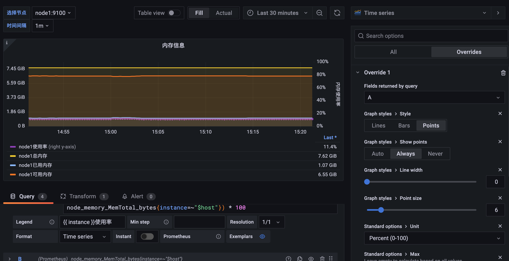

這樣我們就在同一個圖形當中顯示出了不同單位的兩種圖形，而且毫無違和感吧~

## 調整精度

在上面的內存信息圖表中我們已經可以直接看到總內存、使用了多少內存等信息了，其實對於內存的使用率數據要求就不是那麼高了，我們可以少繪製幾個使用率的數據點，可以提高 Grafana 的性能。

這裡就需要對查詢 A 的 `Min Step` 和 `Resolution` 選項進行配置：

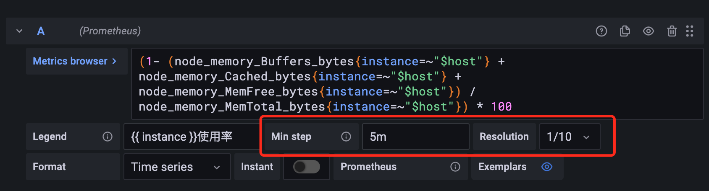

當查詢到的樣本數據量非常大時可以導致 Grafana 渲染圖標時出現一些性能問題，通過 `Min Step` 可以控制 Prometheus 查詢數據時的最小步長，從而減少從 Prometheus 返回的數據量。 `Resolution` 選項則可以控制 Grafana 自身渲染的數據量。

例如，如果 `Resolution` 的值為 `1/10`，Grafana 會將 Prometeus 返回的 `10` 個樣本數據合併成一個點。因此 `Resolution` 越小可視化的精確性越高，反之，可視化的精度越低。比如我們這裡設置最小步長為 `5m`，分辨率為 `1/10`，最終的圖形樣式如下所示：

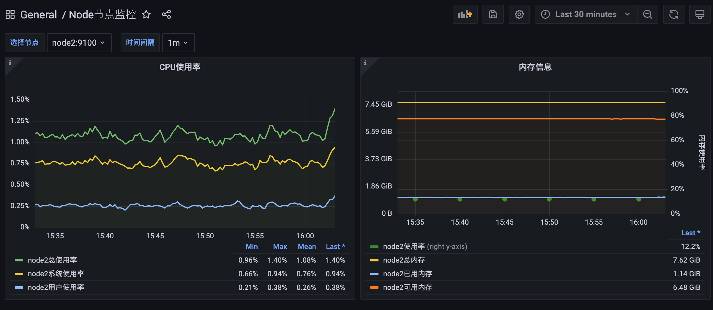