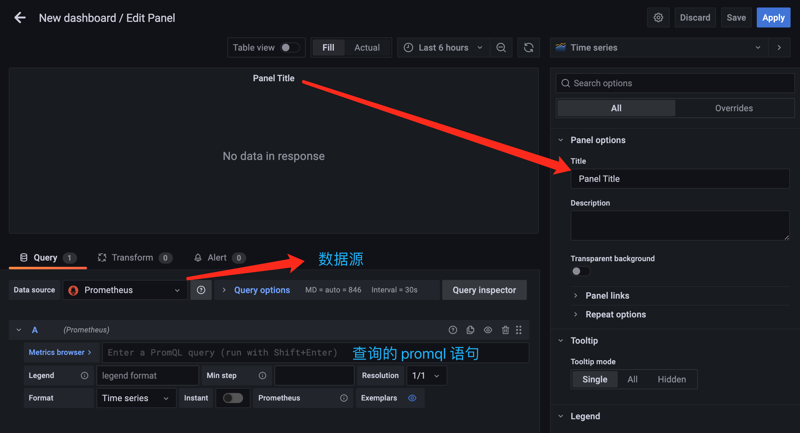

# 圖形面板

原文: [图形面板](https://p8s.io/docs/grafana/graph/)

前文我們介紹了 Grafana 中的面板概念，對於基於時間的折線圖、面積圖和條形圖，我們建議使用默認的時間序列進行可視化。接下來我們就來介紹基於 Time series 時間序列的圖形可視化方式的操作。

## 數據源

在創建面板之前我們需要指定我們的面板數據來源，也就是數據源，Grafana 支持多種數據源，我們這里當然使用 Prometheus 作為數據源來進行說明。在 Grafana 左側工具欄選擇 `Configuration`，點擊到下面的 `Data sources`，打開添加數據源的頁面：


點擊頁面中的 `Add data source` 按鈕開始添加數據源：


選擇第一項 `Prometheus` 數據源進行配置：


在 HTTP 項中配置 URL 地址為 `http://localhost:9090`，其實就是 Prometheus 的地址，由於我們這裡 Grafana 和 Prometheus 都在同一個節點上，所以用 `localhost` 即可訪問，當然用 IP 也可以，Access 選擇默認的 `Server 代理` 方式，這樣就相當於 Grafana 程序去訪問 Prometheus 而不是在瀏覽器端去訪問。

如果 Prometheus 配置有認證，則還需要在下發配置 `Auth` 信息，配置完成後，拉到最下方點擊 `Save & test`，提示添加成功即表面數據源添加成功了。然後在數據源列表中就會出現我們剛剛添加的 Prometheus 這個數據源了：


如果想要添加其他支持的數據源則也可用同樣的方式進行添加。

## 添加面板

面板是屬於某一個 Dashboard 的，所以我們需要先創建一個 Dashboard，在側邊欄點擊 + 切換到 Dashboard 下面開始創建 Dashboard：


在默認創建的新的 Dashboard 中就有一個空的面板，點擊 `Add a new panel` 即可開始添加面板：


進入面板編輯器後即可添加面板了，中間位置是查詢語句的顯示結果，下方是用於配置查詢語句的地方，左側可以選擇面板顯示的類型，面板元信息，比如標題、描述信息等。



比如我們現在就要來查詢節點的 CPU 使用率，前面在 `node_exporter` 章節中已經學習了該監控數據的查詢語句為:

```promql
(1 - sum(rate(node_cpu_seconds_total{mode="idle"}[5m])) by (instance) / sum(rate(node_cpu_seconds_total[5m])) by (instance) ) * 100
```
 
只需要將該語句填充到查詢的 `PromQL` 語句中即可在上面顯示出監控的結果：


點擊右上角的 Apply 按鈕即可創建成功一個 Panel 面板。


用同樣的方式我們可以創建一個用於查詢節點內存使用率的面板：

```promql
(1- (node_memory_Buffers_bytes + node_memory_Cached_bytes + node_memory_MemFree_bytes) / node_memory_MemTotal_bytes) * 100
```


創建完成後的面板我們也可以拖動他們的排列位置：


如果還想重新編輯面板，可以點擊標題，在彈出來的下拉框中選擇 `Edit` 編輯即可：


## 添加參數

現在我們在一個 Dashboard 中添加了兩個 Panel，我們可以很明顯看到會直接將所有的節點信息展示在同一個面板中，但是如果有非常多的節點的話數據量就非常大了。

這種情況下我們最好的方式是將節點當成參數，可以讓用戶自己去選擇要查看哪一個節點的監控信息，要實現這個功能，我們就需要去添加一個以節點為參數的變量來去查詢監控數據。

點擊 Dashboard 頁面右上方的 `Dashboard settings` 按鈕，進入配置頁面：


在該 `Settings` 頁面可以來對整個 Dashboard 進行配置，比如名稱、標籤、變量等：


這裡我們點擊左邊的 `Variables` 添加一個變量，變量支持更具交互性和動態性的儀表板，我們可以在它們的位置使用變量，而不是在指標查詢中硬編碼，變量顯示為 Dashboard 頂部的下拉列表，這些下拉列表可以輕鬆更改儀表板中顯示的數據。


為了能夠選擇節點數據，這裡我們定義了一個名為 `instance` 的變量名，在添加變量的頁面中主要包括如下一些屬性：

- `Name`：變量名，在儀錶盤中調用使用 $變量名 的方式
- `Type`：變量類型，變量類型有多種，其中 query 表示這個變量是一個查詢語句
- `Hide`：為空是表現為下拉框，選擇 label 表示不顯示下拉框的名字，選擇 variable 表示隱藏該變量，該變量不會在 Dashboard 上方顯示出來，默認選擇為空
- `Data source`：查詢語句的數據源
- `Refresh`：何時去更新變量的值，變量的值是通過查詢數據源獲取到的，但是數據源本身也會發生變化，所以要時不時的去更新變量的值，這樣數據源的改變才會在變量對應的下拉框中顯示出來。 Refresh 有兩個值可以選擇：On Dashboard Load（在 Dashboard 加載時更新）、On Time Range Change（在時間範圍變更的時候更新）
- `Query`：查詢表達式，不同的數據源查詢表達式都不同
- `Regex`：正則表達式，用來對抓取到的數據進行過濾，默認不過濾
- `Sort`：排序，對下拉框中的變量值做排序，默認是 disable，表示查詢結果是怎樣下拉框就怎樣顯示
- `Multi-value`：啟用這個功能，變量的值就可以選擇多個，具體表現在變量對應的下拉框中可以選多個值的組合
- `Include All option`：啟用這個功能，變量下拉框中就多了一個全選 all 的選項

但是定義的這個變量值從哪個地方獲取呢？


監控節點的相關指標是來源於名為 `node-exporter` 的任務，我們可以通過查詢 `up` 來獲取所有的監控實例：


要想獲取到 `instance` 標籤中的值，我們這裡可以使用一個正則表達式 `.*instance="(.*?)".*` 來獲取實例數據，這樣就成功定義了一個變量，除了使用正則表達式的方式來獲取需要的值，此外我們還可以使用一個 `label_values()` 的函數來直接獲取查詢結果中的某個 `label` 標籤的值：


回到 Dashboard 頁面就可以看到多了一個選擇節點的下拉框：


但是這個時候的面板並不會隨著我們下拉框的選擇而變化，我們需要將 `instance` 這個變量傳入查詢語句中，比如重新修改 CPU 使用率的查詢語句：


用同樣的方式給內存使用率添加根據節點過濾的參數：


回到 Dashboard 頁面就可以根據我們的下拉框來選擇需要監控的節點數據了，定義參數的時候如果選擇了可以選擇所有，同樣可以查看所有節點的數據：


