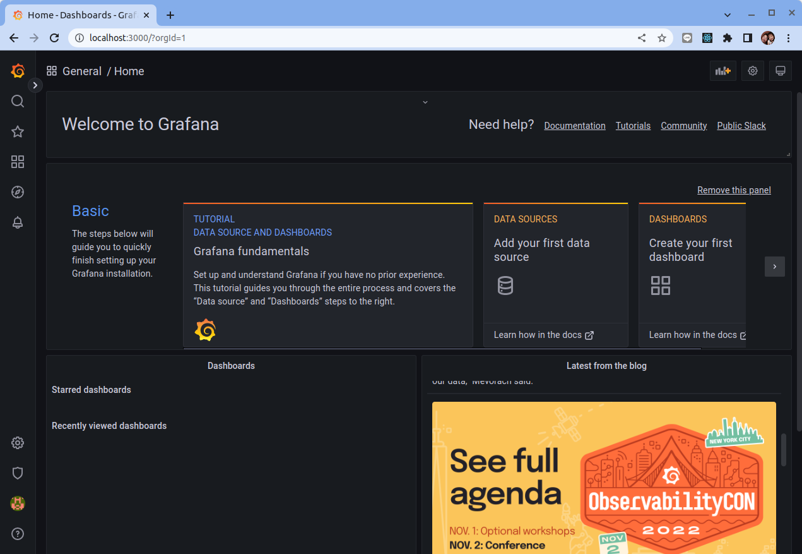

# Grafana 簡介

原文: [Grafana 介绍](https://p8s.io/docs/grafana/overview/)

Grafana 是一個監控儀表系統，它是由 Grafana Labs 公司開源的的一個系統監測工具，它可以大大幫助我們簡化監控的複雜度，我們只需要提供需要監控的數據，它就可以幫助生成各種可視化儀表，同時它還有報警功能，可以在系統出現問題時發出通知。

Grafana 支持許多不同的數據源，每個數據源都有一個特定的查詢編輯器，每個數據源的查詢語言和能力都是不同的，我們可以把來自多個數據源的數據組合到一個儀表板，但每一個面板被綁定到一個特定的數據源。目前官方支持以下數據源：

- Alertmanager
- AWS CloudWatch
- Azure Monitor
- Elasticsearch
- Google Cloud Monitoring
- Graphite
- InfluxDB
- Loki
- Microsoft SQL Server (MSSQL)
- MySQL
- OpenTSDB
- PostgreSQL
- Prometheus
- Jaeger
- Zipkin
- Tempo

我們這里當然重點需要介紹的就是 Prometheus 這個數據源了。

## 下載

接下來我們就來安裝 Grafana，Grafana 本身是非常輕量級的，不會佔用大量資源，此外 Grafana 需要一個數據庫來存儲其配置數據，比如用戶、數據源和儀錶盤等，目前 Grafana 支持 SQLite、MySQL、PostgreSQL 3 種數據庫，默認使用的是 SQLite，該數據庫文件會存儲在 Grafana 的安裝位置，所以需要對 Grafana 的安裝目錄進行持久化。

要安裝 Grafana 的方式有很多，我們這裡使用的是 Linux 系統，可以在 Grafana 官方下載頁面篩選合適的版本 https://grafana.com/grafana/download?edition=oss&platform=linux 根據自己的需求來進行安裝，比如我們這裡直接使用 Standalone Linux Binaries 包進行下載與解壓縮：

```bash
wget https://dl.grafana.com/oss/release/grafana-9.1.6.linux-amd64.tar.gz
tar -zxvf grafana-9.1.6.linux-amd64.tar.gz
```

切換到解壓縮後的目錄，執行 `grafana-server -v` 命令查看是否正常：

```bash
$ bin/grafana-server -v
Version 9.1.6 (commit: 92461d8d1e, branch: HEAD)
```

## 配置

前文我們已經下載完成了 Grafana，接下來在啟動之前我們需要為其創進行配置。

Grafana 默認設置存儲在 `$WORKING_DIR/conf/defaults.ini` 文件中。不要更改此文件。

如果需要調整一些參數，可以使用 `--config` 參數覆蓋自定義配置文件路徑。

在Grafana的官網上可在[Configure Grafana](https://grafana.com/docs/grafana/latest/setup-grafana/configure-grafana/)的網頁上找到相關可配置的細項與解說，比如數據目錄、日誌目錄、目錄等。

## 啟動

上面文件中可以找到從 Grafana 的各種數據配置路徑，比如數據目錄、日誌目錄、目錄等，正常啟動器完成後 Grafana 會在 `3000` 個插件監聽上，所以我們可以在瀏覽器中打開 Grafana 的 WebUI。


在本教程中我們使用預設的配置來啟動 Grafana:

```bash
$ bin/grafana
```

正常啟動完成後 Grafana 會監聽在 `3000` 端口上，所以我們可以在瀏覽器中打開 Grafana 的 WebUI。


默認的用戶名和密碼為 `admin`，也可以在配置文件中配置 `admin_user` 和 `admin_password` 兩個參數來進行覆蓋。



