# 面板介紹

原文: [面板介绍](https://p8s.io/docs/grafana/panel/)

面板（Panel）是 Grafana 中基本可視化構建塊，每個面板都有一個特定於面板中選擇數據源的查詢編輯器，每個面板都有各種各樣的樣式和格式選項，面板可以在儀表板上拖放和重新排列，它們也可以調整大小，所以要在 Grafana 上創建可視化的圖表，面板是我們必須要掌握的知識點。

Panel 是 Grafana 中最基本的可視化單元，每一種類型的面板都提供了相應的查詢編輯器(Query Editor)，讓用戶可以從不同的數據源（如 Prometheus）中查詢出相應的監控數據，並且以可視化的方式展現，Grafana 中所有的面板均以插件的形式進行使用。 

Grafana 提供了各種可視化來支持不同的用例，目前內置支持的面板包括：

- Time series（時間序列）是默認的也是主要的圖形可視化面板
- State timeline（狀態時間表）狀態隨時間變化
- Status history（狀態歷史記錄
- Bar chart（條形圖）
- Histogram（直方圖）
- Heatmap（熱力圖）
- Pie chart（餅狀圖）
- Stat（統計數據）
- Gauge
- Bar gauge
- Table（表格）
- Logs（日誌）
- Node Graph（節點圖）
- Dashboard list（儀表板列表）
- Alert list（報警列表）
- Text panel（文本面板，支持 markdown 和 html）
- News Panel（新聞面板，可以顯示 RSS 摘要）
 
除此之外，我們還可以通過官網的面板插件頁面 https://grafana.com/grafana/plugins/?type=panel 獲取安裝其他面板進行使用。

接下來針對幾種常用的可視化面板來做進一步的介詔。

## 時序圖表

對於基於時間的折線圖、面積圖和條形圖，我們建議使用默認的 `Time series 時間序列` 進行可視化。

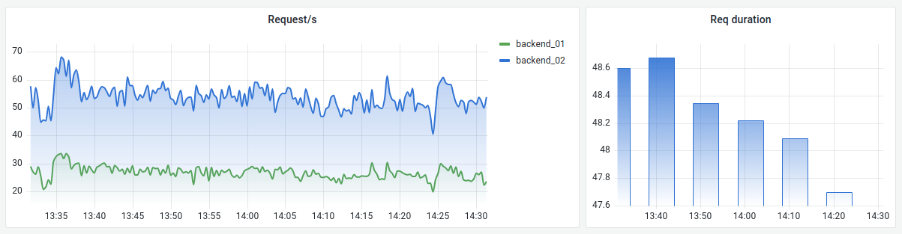

## 條形圖

而對於分類數據，則使用 Bar Chart 條形圖可視化。

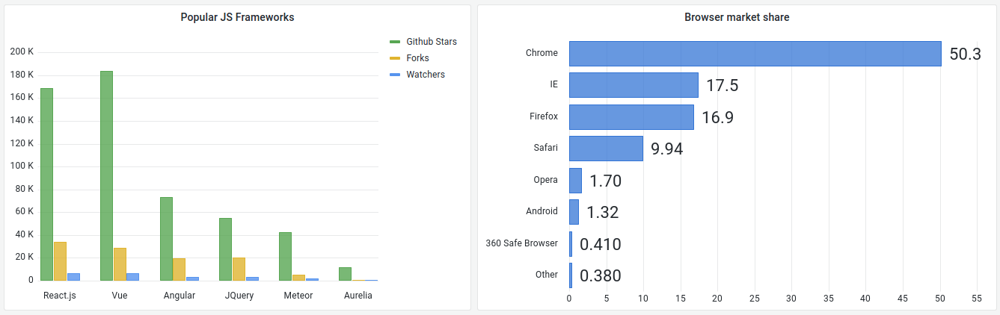

## 條形儀錶盤

Grafana 還具有水平或垂直 Bar gauge（條形儀表面板），具有三種不同的不同顯示模式。

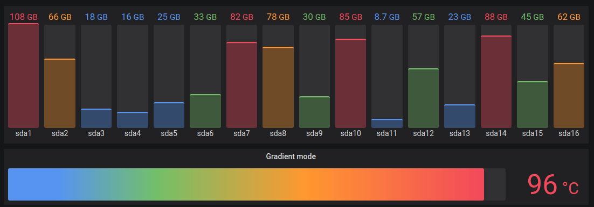

## 儀錶盤

如果想顯示與最小值和最大值相關的值，則有兩個選擇，首先是如下所示的標準徑 Gauge 面板。

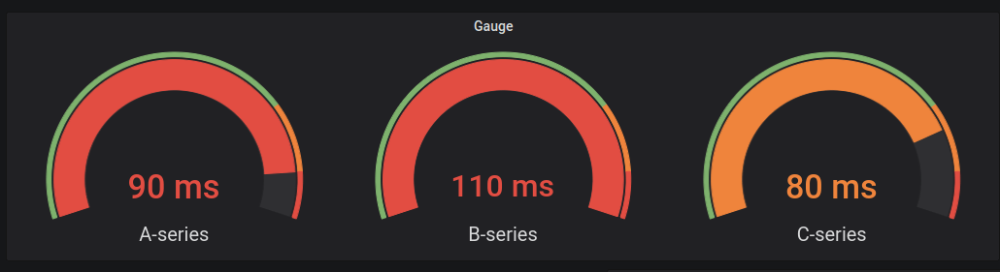

## 燭台圖

要顯示類相似股價變動般的數據，可使用 Candlestick 燭台圖面板可視化。 Candlestick 面板包括 Open-High-Low-Close (OHLC) 模式，並支持基於時間序列數據的其他維度。

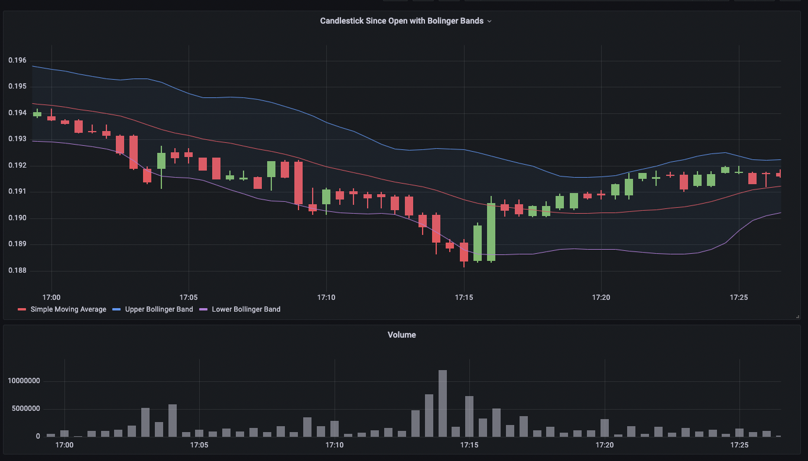

## 地理圖

Geomap 面板可視化允許使用地理空間數據查看和自定義世界地圖。可以配置各種疊加樣式和地圖視圖設置，以便輕鬆關注數據的重要基於位置的特徵。

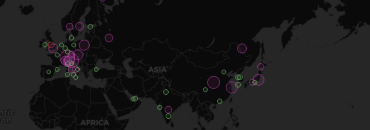

## 熱力圖

要顯示值分佈，請使用 Heatmap 熱力圖面板可視化。

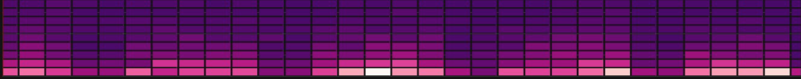

## 直方圖

直方圖可視化計算值的分佈並將它們顯示為條形圖。 Y 軸和每個條的高度表示落入每個括號的值的計數，而 X 軸表示值範圍。

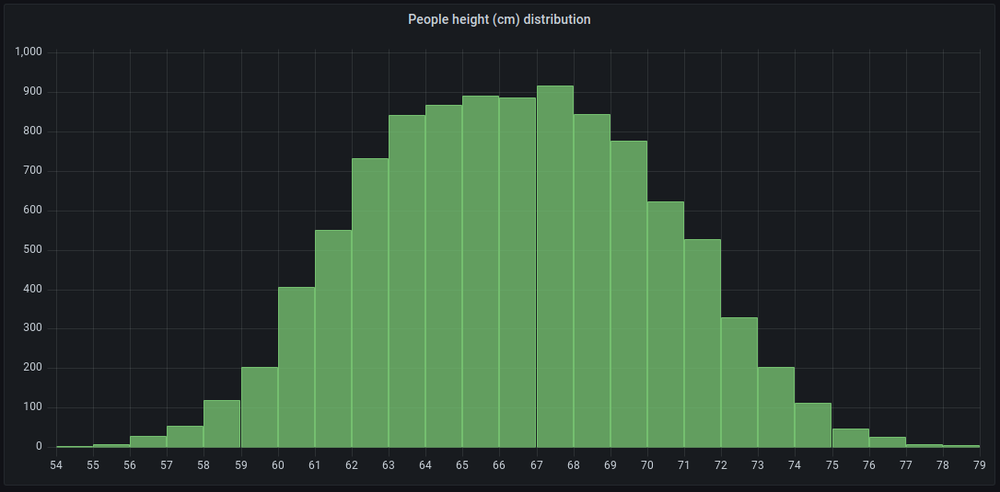

## 日誌面板

日誌面板可視化顯示來自支持日誌的數據源的日誌行，例如 Elastic、Influx 和 Loki。通常，您會使用圖形面板旁邊的此面板來顯示相關進程的日誌輸出。

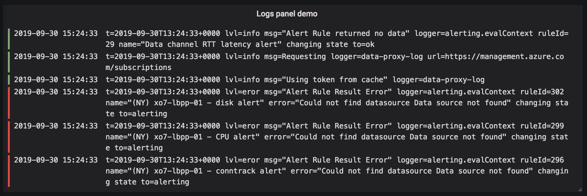

## 節點圖面板

節點圖可以可視化有向圖或網絡。它使用定向力佈局來有效定位節點，因此它可以顯示複雜的基礎架構圖、層次結構或執行圖。

## 餅狀圖

Grafana 現在支持 Pie Chart 餅狀圖面板可視化。

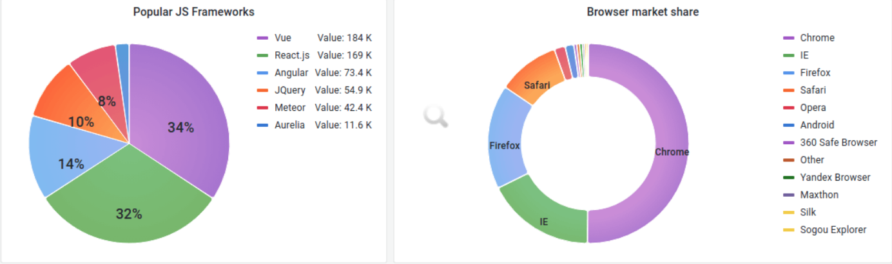

## 軌跡面板

跟踪是一種可視化，使您能夠在請求遍歷基礎架構中的服務時對其進行跟踪和記錄。

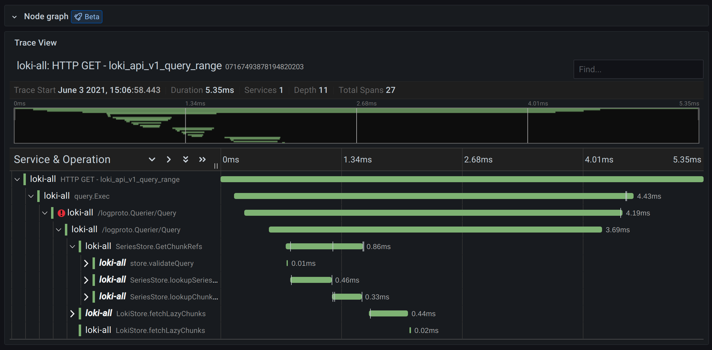

## 數據統計

用於數據統計相關的可視化可以使用 `Stat` 面板進行可視化，我們可以使用閾值或色標來控制背景或值顏色。

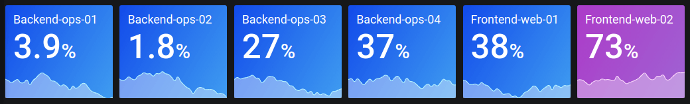

## 狀態時間線面板

狀態時間線面板可視化顯示隨時間的離散狀態變化。每個字段或系列都呈現為其唯一的水平帶。狀態區域可以使用或不使用值來呈現。此面板適用於字符串或布爾狀態，但也可用於時間序列。當與時間序列一起使用時，閾值用於將數值轉換為離散的狀態區域。

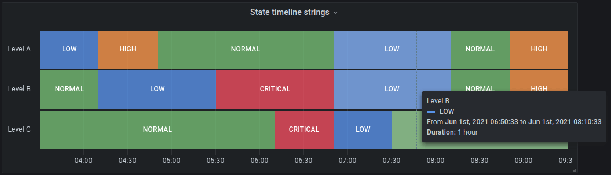

## 狀態歷史面板

狀態歷史可視化顯示一段時間內的周期性狀態。每個字段或系列都呈現為水平行。框被渲染並以每個值為中心。

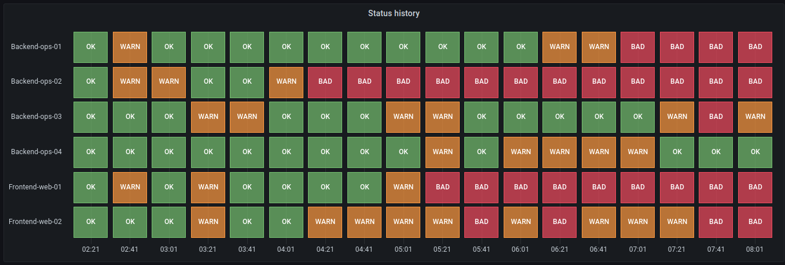

## 表格

要在表格佈局中顯示數據，需要使用 Table 表格面板進行可視化。

接下來我們將為大家介紹一些常用的圖形面板的操作使用方式。