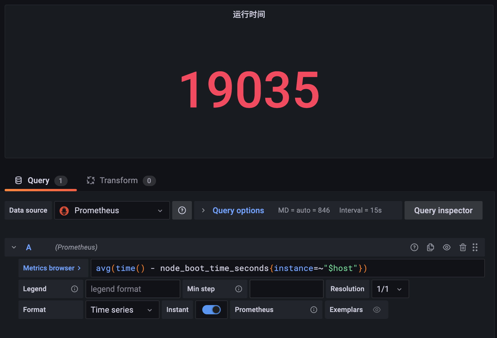

# 統計面板

原文: [统计面板](https://p8s.io/docs/grafana/stat/)

統計面板可以用於顯示一個大的統計值和一個可選的背景顏色，我們可以使用閾值來控制背景或顏色值，效果如下所示：


下面我們使用該面板來統計幾個監控數據，比如節點運行時間、CPU 核數、總內存大小等等。

## 文本模式

首先創建一個空的面板，選擇使用 `Stat` 面板：


首先添加一個用於查詢節點運行時間的統計數據：

```promql
avg(time() - node_boot_time_seconds{instance=~"$host"})
```



同樣我們可以在面板編輯器右側對該面板的屬性進行編輯，可以選擇展示的方向是水平還是垂直，文本展示模式選擇只展示 `Value` 值或者只展示 `Name`，也可以都顯示，也可以不顯示，這裡我們選擇默認的 `Auto` 即可，顏色模式也有 `None`、`Value`、`Background` 三個選項，`Value` 選項會根據設置的閾值進行展示，而 `Background` 則會顯示背景顏色。

接著同樣可以設置單位，最大值、最小值等，比如這裡我們設置單位為 `seconds (s)`：


這裡我們設置的顏色是 `From thresholds (by value)` 也就是可以根據閾值設置的值進行展示，所以我們可以配置下不同閾值想要顯示的顏色值，比如這裡我們設置閾值在 1 和 3 的時候顯示不同的顏色：


由於現在統計結果為 5，已經超過了 3，所以顯示的是綠色的文本。然後用同樣的方式再添加一個統計 CPU 核數的統計面板：


比如還可以添加一個統計節點總內存的統計面板：


統計面板的屬性配置都可以根據我們自己的需求進行配置。

## 背景模式

上面我們的統計面板只展示了值的結果，屬於純文本的模式，此外我們還可以在展示的使用帶背景顏色的方式，比如我們將內存使用率的展示使用 `Stat` 面板進行顯示，設置文本模式為 `Value and name`，顏色模式為 `Background`，效果如下所示：


然後根據需求設置不同的閾值顯示的顏色即可，同樣我們可以將之前的 CPU 使用率和最大分區使用率改成使用 Stat 統計面板進行展示，最終的完整效果如下所示：


我們這裡只是為了為大家說明不同的面板的使用方法，所以出現了一些相同的查詢統計，可以根據實際的需求選擇合適的面板進行顯示即可。