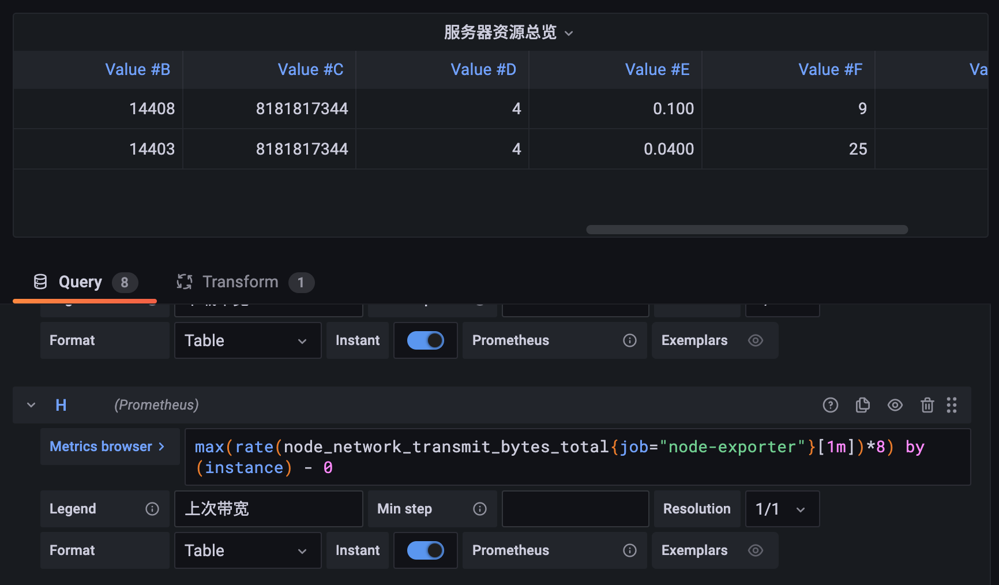

# 表格面板

原文: [表格面板](https://p8s.io/docs/grafana/table/)

表格面板可視化非常靈活，支持時間序列和表格和原始 JSON 數據的多種模式，此面板還提供日期格式、值格式和著色選項。如下圖效果所示：


## 添加表格面板

接下來我們以統計服務器資源為例，對表格面板的使用進行說明。在 Dashboard 中添加添加一個空的 Panel 面板，進入面板編輯器後在右側上方選擇 `Table` 面板：


首先我們需要展示節點信息，我們可以使用 `node_uname_info` 指標來獲取，在查詢區域添加如下所示查詢語句：

```promql
node_uname_info{job="node_exporter"}
```


然後再添加一個查詢來獲取節點運行時間的相關信息，可以使用 `node_boot_time_seconds` 指標來進行計算，查詢語句為:

```promql
sum(time() - node_boot_time_seconds{job="node_exporter"})by(instance)
```


然後我們對於節點其他資源統計也非常關心，比如節點總內存、總 CPU 數、負載、帶寬等等信息，接下來分別添加如下查詢：

- 總內存：`node_memory_MemTotal_bytes{job="node_exporter"}`
- CPU 核數：`count(node_cpu_seconds_total{job="node_exporter", mode='system'}) by (instance)`
- 5 分鐘負載：`node_load5{job="node_exporter"}`
- 連接數：`node_netstat_Tcp_CurrEstab{job="node_exporter"}`
- 下行帶寬：`max(rate(node_network_receive_bytes_total{job="node_exporter"}[$interval])*8) by (instance)`
- 上行帶寬：`max(rate(node_network_transmit_bytes_total{job="node_exporter"}[$interval])*8) by (instance)`

如還有其他需要展示的也可以直接添加新的查詢即可：


## 表格轉換

現在我們將所有需要展示的信息都通過 Table 形式展示出來了，但是現在有一個很大的問題，就是需要對每一個查詢切換顯示：


這顯然是非常不友好的顯示方式，我們需要將這些表格內容合併成一個表格進行展示，這個時候就需要用到 Grafana 的 Transform 轉換功能了，在 Transform 選項卡中選擇 Merge 選項：


Merge 轉換器可以合併多個序列或者多個表格為一個表格，其中可合併的值將合併到同一行中，用於顯示在表格中可視化的多個序列、表格或兩者的組合。當我們選擇了 Merge 轉換器過後就會將上面的多個查詢結果合併成一個表格。


但其實合併後的表格數據有一些地方沒有顯示，這是因為我們查詢的結果實際上是包含 `__name__` 這個標籤的，在合併的時候會造成數據丟失，我們可以將所有的查詢語句後面添加上一個 `- 0` 來去掉這個標籤，這樣合併的時候就不會丟失數據了。比如查詢主機信息的語句變成 `node_uname_info{job="node-exporter"} - 0`，其他的語句也都加上 `- 0` 這個操作。



數據雖然正確了，但是表頭卻看不出來是表達的什麼意義，有的列還是不需要的，這個時候同樣也要用到 Transform 轉換器了，這裡我們需要用到的是 Organize fields 轉換器，該轉換器允許用戶重新排序、隱藏或重命名字段或者列。


這裡我們將不需要的一些列隱藏掉了，將表頭進行了重命名。

## 屬性覆蓋

上面我們將查詢的數據結果用一個表格展示出來了，但是現在我們的數據都是直接的一個結果，我們需要進行轉換加上我們的單位。

比如對於運行時間這一列，我們需要添加覆蓋，設置一個 `seconds (s)` 類型的單位，然後會根據我們的結果進行自動轉換：


同樣對總內存這一列的數據結果進行覆蓋添加 bytes(IEC) 類型的單位：


此外在定制某列數據的顯示效果的時候我們還可以為其配置背景顏色，只需要設置 `Cell display mode` 表格模式，該屬性可以配置文本顏色、背景、按照 `gauge` 進行顯示等方式：


比如我們可以為 CPU使用率 與 內存使用率 配置顯示模式為 LCD gauge，顯示效果如下所示：


## 添加顯示行

我們還可以定義一個 `total` 參數來表示監控的主機總數，不過需要注意的是這裡的參數我們不需要展示，需要選擇隱藏方式為 `Variable`：


再單獨定義一個顯示主機名的變量，這裡我們使用的查詢語句為 `node_uname_info{instance=~"$host"}`，需要注意的是這里關聯的是前面定義的 `$host` 這個變量：


然後我們可以添加兩個空的 `Row` 行：


把我們的面板放到不同的行中去，並為每一行定義顯示標題，標題裡面就可以使用前面定義的變量：


到這裡我們的節點監控的完整效果如下所示：


