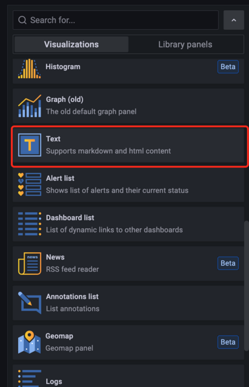
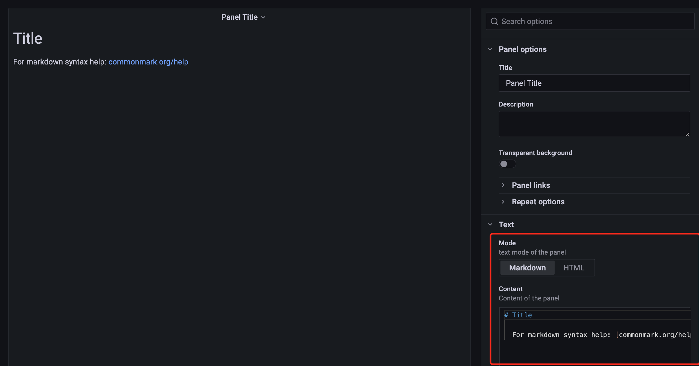
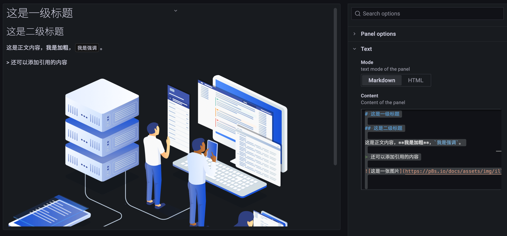
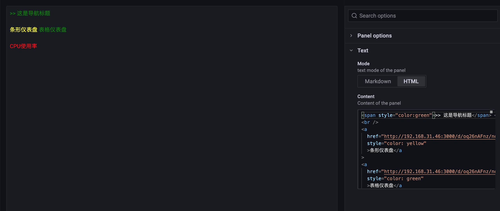
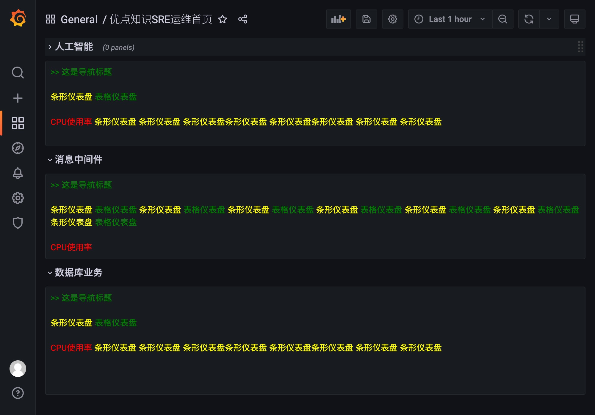

# 文本面板

原文: [文本面板](https://p8s.io/docs/grafana/text/)

前面我們介紹的一些面板基本上都是通過查詢來獲取數據進行展示的，這裡給大家另外一個面板：文本面板，該面板不需要查詢語句，直接用來展示文本信息，而且是支持 Markdown 和 HTML 兩種格式，這就為我們提供了很大的定制靈活性。

文本面板的使用非常簡單，直接選擇使用 Markdown 還是 HTML 來設置文本樣式即可，然後在面板編輯器的文本框中輸入內容即可。比如很多公司業務太大太多，需要監控的 Dashboard 非常多，操作管理起來非常麻煩，這個時候我們就可以使用文本面板來做一個導航頁面進行歸類。

現在我們創建一個新的 Dashboard，添加一個新的空面板，選擇使用 `Text` 面板：



然後就可以在內容框中輸入我們想要展示的內容了：



我們可以看到有 Markdown 和 HTML 兩種模式可以選擇，比如我們選擇使用 Markdown 模式，則可以在面板內容區域輸入想要展示的 Markdown 內容，比如我們輸入如下所示的內容：

```md
# 這是一級標題

## 這是二級標題

這是正文內容，**我是加粗**，`我是強調`。

> 還可以添加引用的內容


```

渲染效果如下：



同樣由於支持 HTML 格式的內容，所以我們可以隨意對內容的樣式進行定制，比如我們添加幾個文本鏈接，去鏈接到其他的 Dashboard 或者面板

```html
<span style="color:green">>>這就是導航標題</span>

<br/><br/>

<a href="http://192.168.31.46:3000/d/oq26nAFnz/nodejie-dian-jian-kong?orgId=1&from=1637118532394&to=1637120332394&var-host=node2%3A9100&var-interval=1m&var-maxpoint=%2F&refresh= 30s&viewPanel=24" style="color:yellow">條形儀錶盤</a>

<a href="http://192.168.31.46:3000/d/oq26nAFnz/nodejie-dian-jian-kong?orgId=1&refresh=30s&viewPanel=16" style="color:green">表格儀錶盤</a>

<br/><br/>

<a href="http://192.168.31.46:3000/d/oq26nAFnz/nodejie-dian-jian-kong?orgId=1&refresh=30s&viewPanel=2" style="color:red">CPU使用率</a>
```

渲染效果如下所示：



同樣我們還可以將同類型的業務監控進行歸類，添加一個新的 `Row`，將業務進行歸類：



這樣當遇到監控業務非常複雜的情況下我們就可以製作這樣一個運維首頁導航來提供我們的效率。

