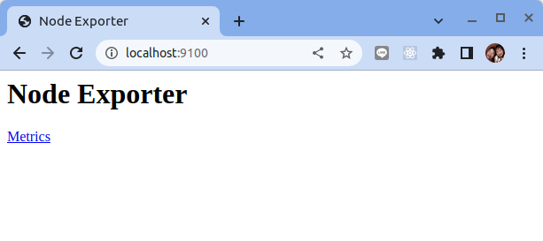
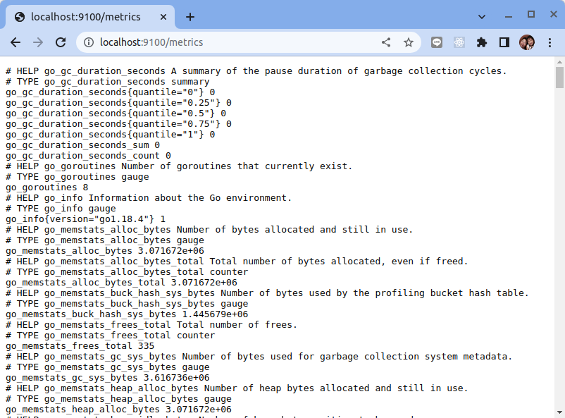
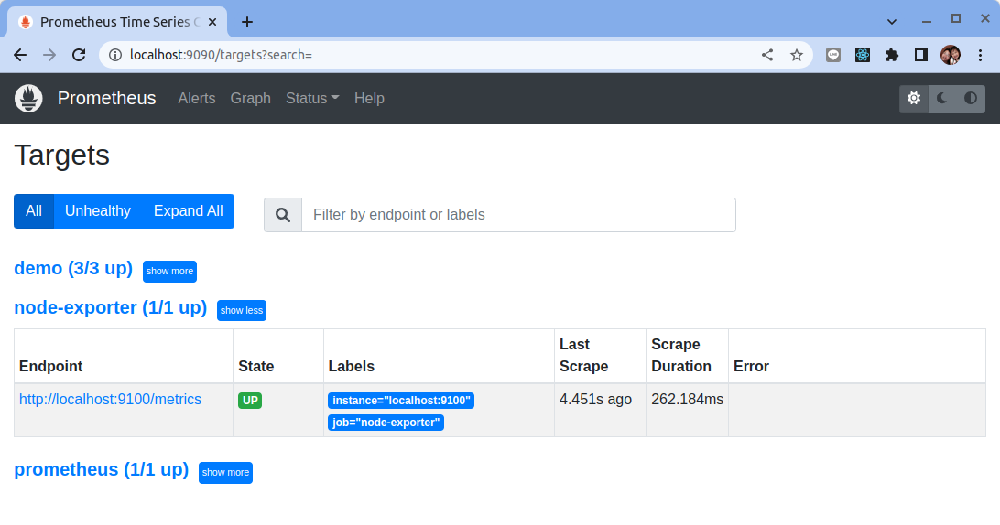

# 安裝配置

原文: [安装配置](https://p8s.io/docs/node-exporter/install/)

## 介紹

Node Exporter 是用於暴露 *NIX 主機指標的 Exporter，比如採集 CPU、內存、磁盤等信息。採用 Go 編寫，不存在任何第三方依賴，所以只需要下載解壓即可運行。

## 安装

由於 Node Exporter 是一個獨立的二進製文件，可以直接從 [Prometheus 下載頁面](https://prometheus.io/download/#node_exporter) 下載解壓運行：

```bash
node_exporter-1.4.0-rc.0.linux-amd64.tar.gz

$ wget https://github.com/prometheus/node_exporter/releases/download/v1.4.0-rc.0/node_exporter-1.4.0-rc.0.linux-amd64.tar.gz
$ tar -xvf node_exporter-1.4.0-rc.0.linux-amd64.tar.gz

node_exporter-1.4.0-rc.0.linux-amd64/
node_exporter-1.4.0-rc.0.linux-amd64/LICENSE
node_exporter-1.4.0-rc.0.linux-amd64/NOTICE
node_exporter-1.4.0-rc.0.linux-amd64/node_exporter

$ cd node_exporter-1.4.0-rc.0.linux-amd64 && ls -la

total 18604
drwxr-xr-x 2 dxlab dxlab     4096 Jul 28 00:19 .
drwxrwxr-x 6 dxlab dxlab     4096 Sep 25 07:32 ..
-rw-r--r-- 1 dxlab dxlab    11357 Jul 28 00:19 LICENSE
-rwxr-xr-x 1 dxlab dxlab 19024432 Jul 28 00:15 node_exporter
-rw-r--r-- 1 dxlab dxlab      463 Jul 28 00:19 NOTICE
```

## 配置

Node Exporter 下載解壓後，可以通過下面的命令運行：

```bash
$ ./node_exporter
```

結果:

```bash
ts=2022-09-24T23:35:46.243Z caller=node_exporter.go:182 level=info msg="Starting node_exporter" version="(version=1.4.0-rc.0, branch=HEAD, revision=73dabdfe9eb9a46a5349a486ebf4bb75e9660f29)"
ts=2022-09-24T23:35:46.243Z caller=node_exporter.go:183 level=info msg="Build context" build_context="(go=go1.18.4, user=root@eb4ea82c806e, date=20220727-16:14:50)"
ts=2022-09-24T23:35:46.244Z caller=diskstats_common.go:100 level=info collector=diskstats msg="Parsed flag --collector.diskstats.device-exclude" flag=^(ram|loop|fd|(h|s|v|xv)d[a-z]|nvme\d+n\d+p)\d+$
ts=2022-09-24T23:35:46.244Z caller=filesystem_common.go:111 level=info collector=filesystem msg="Parsed flag --collector.filesystem.mount-points-exclude" flag=^/(dev|proc|run/credentials/.+|sys|var/lib/docker/.+|var/lib/containers/storage/.+)($|/)
ts=2022-09-24T23:35:46.244Z caller=filesystem_common.go:113 level=info collector=filesystem msg="Parsed flag --collector.filesystem.fs-types-exclude" flag=^(autofs|binfmt_misc|bpf|cgroup2?|configfs|debugfs|devpts|devtmpfs|fusectl|hugetlbfs|iso9660|mqueue|nsfs|overlay|proc|procfs|pstore|rpc_pipefs|securityfs|selinuxfs|squashfs|sysfs|tracefs)$
ts=2022-09-24T23:35:46.246Z caller=node_exporter.go:108 level=info msg="Enabled collectors"
ts=2022-09-24T23:35:46.246Z caller=node_exporter.go:115 level=info collector=arp
ts=2022-09-24T23:35:46.246Z caller=node_exporter.go:115 level=info collector=bcache
ts=2022-09-24T23:35:46.246Z caller=node_exporter.go:115 level=info collector=bonding
ts=2022-09-24T23:35:46.246Z caller=node_exporter.go:115 level=info collector=btrfs
ts=2022-09-24T23:35:46.246Z caller=node_exporter.go:115 level=info collector=conntrack
ts=2022-09-24T23:35:46.246Z caller=node_exporter.go:115 level=info collector=cpu
ts=2022-09-24T23:35:46.246Z caller=node_exporter.go:115 level=info collector=cpufreq
ts=2022-09-24T23:35:46.246Z caller=node_exporter.go:115 level=info collector=diskstats
ts=2022-09-24T23:35:46.246Z caller=node_exporter.go:115 level=info collector=dmi
ts=2022-09-24T23:35:46.246Z caller=node_exporter.go:115 level=info collector=edac
ts=2022-09-24T23:35:46.246Z caller=node_exporter.go:115 level=info collector=entropy
ts=2022-09-24T23:35:46.246Z caller=node_exporter.go:115 level=info collector=fibrechannel
ts=2022-09-24T23:35:46.246Z caller=node_exporter.go:115 level=info collector=filefd
ts=2022-09-24T23:35:46.246Z caller=node_exporter.go:115 level=info collector=filesystem
ts=2022-09-24T23:35:46.246Z caller=node_exporter.go:115 level=info collector=hwmon
ts=2022-09-24T23:35:46.246Z caller=node_exporter.go:115 level=info collector=infiniband
ts=2022-09-24T23:35:46.246Z caller=node_exporter.go:115 level=info collector=ipvs
ts=2022-09-24T23:35:46.246Z caller=node_exporter.go:115 level=info collector=loadavg
ts=2022-09-24T23:35:46.246Z caller=node_exporter.go:115 level=info collector=mdadm
ts=2022-09-24T23:35:46.246Z caller=node_exporter.go:115 level=info collector=meminfo
ts=2022-09-24T23:35:46.246Z caller=node_exporter.go:115 level=info collector=netclass
ts=2022-09-24T23:35:46.246Z caller=node_exporter.go:115 level=info collector=netdev
ts=2022-09-24T23:35:46.246Z caller=node_exporter.go:115 level=info collector=netstat
ts=2022-09-24T23:35:46.246Z caller=node_exporter.go:115 level=info collector=nfs
ts=2022-09-24T23:35:46.246Z caller=node_exporter.go:115 level=info collector=nfsd
ts=2022-09-24T23:35:46.246Z caller=node_exporter.go:115 level=info collector=nvme
ts=2022-09-24T23:35:46.246Z caller=node_exporter.go:115 level=info collector=os
ts=2022-09-24T23:35:46.246Z caller=node_exporter.go:115 level=info collector=powersupplyclass
ts=2022-09-24T23:35:46.246Z caller=node_exporter.go:115 level=info collector=pressure
ts=2022-09-24T23:35:46.246Z caller=node_exporter.go:115 level=info collector=rapl
ts=2022-09-24T23:35:46.246Z caller=node_exporter.go:115 level=info collector=schedstat
ts=2022-09-24T23:35:46.246Z caller=node_exporter.go:115 level=info collector=selinux
ts=2022-09-24T23:35:46.246Z caller=node_exporter.go:115 level=info collector=sockstat
ts=2022-09-24T23:35:46.246Z caller=node_exporter.go:115 level=info collector=softnet
ts=2022-09-24T23:35:46.246Z caller=node_exporter.go:115 level=info collector=stat
ts=2022-09-24T23:35:46.246Z caller=node_exporter.go:115 level=info collector=tapestats
ts=2022-09-24T23:35:46.246Z caller=node_exporter.go:115 level=info collector=textfile
ts=2022-09-24T23:35:46.246Z caller=node_exporter.go:115 level=info collector=thermal_zone
ts=2022-09-24T23:35:46.246Z caller=node_exporter.go:115 level=info collector=time
ts=2022-09-24T23:35:46.246Z caller=node_exporter.go:115 level=info collector=timex
ts=2022-09-24T23:35:46.246Z caller=node_exporter.go:115 level=info collector=udp_queues
ts=2022-09-24T23:35:46.246Z caller=node_exporter.go:115 level=info collector=uname
ts=2022-09-24T23:35:46.246Z caller=node_exporter.go:115 level=info collector=vmstat
ts=2022-09-24T23:35:46.246Z caller=node_exporter.go:115 level=info collector=xfs
ts=2022-09-24T23:35:46.246Z caller=node_exporter.go:115 level=info collector=zfs
ts=2022-09-24T23:35:46.247Z caller=node_exporter.go:199 level=info msg="Listening on" address=:9100
ts=2022-09-24T23:35:46.247Z caller=tls_config.go:195 level=info msg="TLS is disabled." http2=false
```

從日誌上可以看出 node_exporter 監聽在 **9100** 端口上，默認的 metrics 接口通過 `/metrics` 端點暴露，



我們可以通過訪問 `http://localhost:9100/metrics` 來獲取監控指標數據：




該 metrics 接口數據就是一個標準的 Prometheus 監控指標格式，我們只需要將該端點配置到 Prometheus 中即可抓取該指標數據。為了了解 node_exporter 可配置的參數，我們可以使用 `./node_exporter -h` 來查看幫助信息：

```bash
./node_exporter -h
    --web.listen-address=":9100"     # 監聽的端口，默認是9100
    --web.telemetry-path="/metrics"  # metrics的路徑，默認為/metrics
    --web.disable-exporter-metrics   # 是否禁用go、prome默認的metrics
    --web.max-requests=40            # 最大並行請求數，默認40，設置為0時不限制
    --log.level="info"               # 日誌等級: [debug, info, warn, error, fatal]
    --log.format=logfmt              # 置日誌打印target和格式: [logfmt, json]
    --version                        # 版本號
    --collector.{metric-name}        # 各個metric對應的參數
    ......
```

## 收集器

配置 Node Exporter 其中最重要的參數就是 `--collector.<name>`，通過該參數可以啟用我們收集的功能模塊，node_exporter 會默認採集一些模塊，要禁用這些默認啟用的收集器可以通過 `--no-collector.<name>` 標誌來禁用，如果只啟用某些特定的收集器，基於先使用 `--collector.disable-defaults` 標誌禁用所有默認的，然後在通過指定具體的收集器 `--collector.<name>` 來進行啟用。

### 默認啟用收集器

下表列出了默認啟用的收集器：

Name     | Description | OS
---------|-------------|----
arp | Exposes ARP statistics from `/proc/net/arp`. | Linux
bcache | Exposes bcache statistics from `/sys/fs/bcache/`. | Linux
bonding | Exposes the number of configured and active slaves of Linux bonding interfaces. | Linux
btrfs | Exposes btrfs statistics | Linux
boottime | Exposes system boot time derived from the `kern.boottime` sysctl. | Darwin, Dragonfly, FreeBSD, NetBSD, OpenBSD, Solaris
conntrack | Shows conntrack statistics (does nothing if no `/proc/sys/net/netfilter/` present). | Linux
cpu | Exposes CPU statistics | Darwin, Dragonfly, FreeBSD, Linux, Solaris, OpenBSD
cpufreq | Exposes CPU frequency statistics | Linux, Solaris
diskstats | Exposes disk I/O statistics. | Darwin, Linux, OpenBSD
dmi | Expose Desktop Management Interface (DMI) info from `/sys/class/dmi/id/` | Linux
edac | Exposes error detection and correction statistics. | Linux
entropy | Exposes available entropy. | Linux
exec | Exposes execution statistics. | Dragonfly, FreeBSD
fibrechannel | Exposes fibre channel information and statistics from `/sys/class/fc_host/`. | Linux
filefd | Exposes file descriptor statistics from `/proc/sys/fs/file-nr`. | Linux
filesystem | Exposes filesystem statistics, such as disk space used. | Darwin, Dragonfly, FreeBSD, Linux, OpenBSD
hwmon | Expose hardware monitoring and sensor data from `/sys/class/hwmon/`. | Linux
infiniband | Exposes network statistics specific to InfiniBand and Intel OmniPath configurations. | Linux
ipvs | Exposes IPVS status from `/proc/net/ip_vs` and stats from `/proc/net/ip_vs_stats`. | Linux
loadavg | Exposes load average. | Darwin, Dragonfly, FreeBSD, Linux, NetBSD, OpenBSD, Solaris
mdadm | Exposes statistics about devices in `/proc/mdstat` (does nothing if no `/proc/mdstat` present). | Linux
meminfo | Exposes memory statistics. | Darwin, Dragonfly, FreeBSD, Linux, OpenBSD
netclass | Exposes network interface info from `/sys/class/net/` | Linux
netdev | Exposes network interface statistics such as bytes transferred. | Darwin, Dragonfly, FreeBSD, Linux, OpenBSD
netstat | Exposes network statistics from `/proc/net/netstat`. This is the same information as `netstat -s`. | Linux
nfs | Exposes NFS client statistics from `/proc/net/rpc/nfs`. This is the same information as `nfsstat -c`. | Linux
nfsd | Exposes NFS kernel server statistics from `/proc/net/rpc/nfsd`. This is the same information as `nfsstat -s`. | Linux
nvme | Exposes NVMe info from `/sys/class/nvme/` | Linux
os | Expose OS release info from `/etc/os-release` or `/usr/lib/os-release` | _any_
powersupplyclass | Exposes Power Supply statistics from `/sys/class/power_supply` | Linux
pressure | Exposes pressure stall statistics from `/proc/pressure/`. | Linux (kernel 4.20+ and/or [CONFIG\_PSI](https://www.kernel.org/doc/html/latest/accounting/psi.html))
rapl | Exposes various statistics from `/sys/class/powercap`. | Linux
schedstat | Exposes task scheduler statistics from `/proc/schedstat`. | Linux
selinux | Exposes SELinux statistics. | Linux
sockstat | Exposes various statistics from `/proc/net/sockstat`. | Linux
softnet | Exposes statistics from `/proc/net/softnet_stat`. | Linux
stat | Exposes various statistics from `/proc/stat`. This includes boot time, forks and interrupts. | Linux
tapestats | Exposes statistics from `/sys/class/scsi_tape`. | Linux
textfile | Exposes statistics read from local disk. The `--collector.textfile.directory` flag must be set. | _any_
thermal | Exposes thermal statistics like `pmset -g therm`. | Darwin
thermal\_zone | Exposes thermal zone & cooling device statistics from `/sys/class/thermal`. | Linux
time | Exposes the current system time. | _any_
timex | Exposes selected adjtimex(2) system call stats. | Linux
udp_queues | Exposes UDP total lengths of the rx_queue and tx_queue from `/proc/net/udp` and `/proc/net/udp6`. | Linux
uname | Exposes system information as provided by the uname system call. | Darwin, FreeBSD, Linux, OpenBSD
vmstat | Exposes statistics from `/proc/vmstat`. | Linux
xfs | Exposes XFS runtime statistics. | Linux (kernel 4.4+)
zfs | Exposes [ZFS](http://open-zfs.org/) performance statistics. | FreeBSD, [Linux](http://zfsonlinux.org/), Solaris

### 其它收集器

node_exporter 還實現了許多默認沒有啟用的收集器。造成這種情況的原因因不同的 collector 而異，可能包括：

Name     | Description | OS
---------|-------------|----
buddyinfo | Exposes statistics of memory fragments as reported by /proc/buddyinfo. | Linux
cgroups | A summary of the number of active and enabled cgroups | Linux
devstat | Exposes device statistics | Dragonfly, FreeBSD
drbd | Exposes Distributed Replicated Block Device statistics (to version 8.4) | Linux
ethtool | Exposes network interface information and network driver statistics equivalent to `ethtool`, `ethtool -S`, and `ethtool -i`. | Linux
interrupts | Exposes detailed interrupts statistics. | Linux, OpenBSD
ksmd | Exposes kernel and system statistics from `/sys/kernel/mm/ksm`. | Linux
lnstat | Exposes stats from `/proc/net/stat/`. | Linux
logind | Exposes session counts from [logind](http://www.freedesktop.org/wiki/Software/systemd/logind/). | Linux
meminfo\_numa | Exposes memory statistics from `/proc/meminfo_numa`. | Linux
mountstats | Exposes filesystem statistics from `/proc/self/mountstats`. Exposes detailed NFS client statistics. | Linux
network_route | Exposes the routing table as metrics | Linux
ntp | Exposes local NTP daemon health to check time | _any_
perf | Exposes perf based metrics (Warning: Metrics are dependent on kernel configuration and settings). | Linux
processes | Exposes aggregate process statistics from `/proc`. | Linux
qdisc | Exposes [queuing discipline](https://en.wikipedia.org/wiki/Network_scheduler#Linux_kernel) statistics | Linux
runit | Exposes service status from [runit](http://smarden.org/runit/). | _any_
slabinfo | Exposes slab statistics from `/proc/slabinfo`. Note that permission of `/proc/slabinfo` is usually 0400, so set it appropriately. | Linux
supervisord | Exposes service status from [supervisord](http://supervisord.org/). | _any_
sysctl | Expose sysctl values from `/proc/sys`. Use `--collector.sysctl.include(-info)` to configure. | Linux
systemd | Exposes service and system status from [systemd](http://www.freedesktop.org/wiki/Software/systemd/). | Linux
tcpstat | Exposes TCP connection status information from `/proc/net/tcp` and `/proc/net/tcp6`. (Warning: the current version has potential performance issues in high load situations.) | Linux
wifi | Exposes WiFi device and station statistics. | Linux
zoneinfo | Exposes NUMA memory zone metrics. | Linux

各個系統管理者可針對個自系統的特性與監控的目標來調整 collector 的啟用列表。

## Prometheus 配置修改

Node Exporter 啟動完成後我們使用配置的方式在之前的 Prometheus 中新增一個 `scrape_configs` 的抓取任務，來獲取 node_exporter 暴露的指標，範例配置文件如下所示：

```yaml title="prometheus.yml" hl_lines="8-10"
global:
  scrape_interval: 5s # 抓取频率

scrape_configs:
  - job_name: "prometheus"
    static_configs:
      - targets: ["localhost:9090"]
  - job_name: "node_exporter" # 新增 node_exporter 任務
    static_configs:
      - targets: ["localhost:9100"]
...
...
```

修改完 `prometheus.yml` 後重新啟動 Prometheus，在 "Status -> Targets" 的網頁就可觀察到是否順利地抓取到 Node exporter 所暴露的指標:



