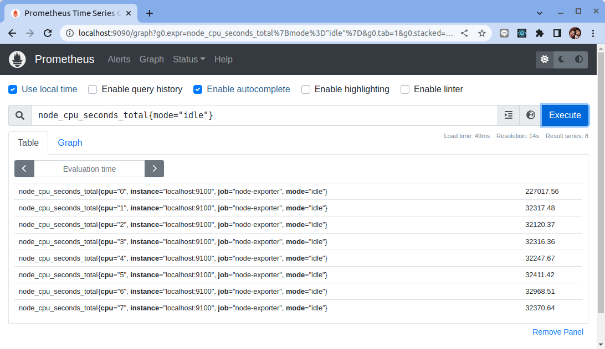
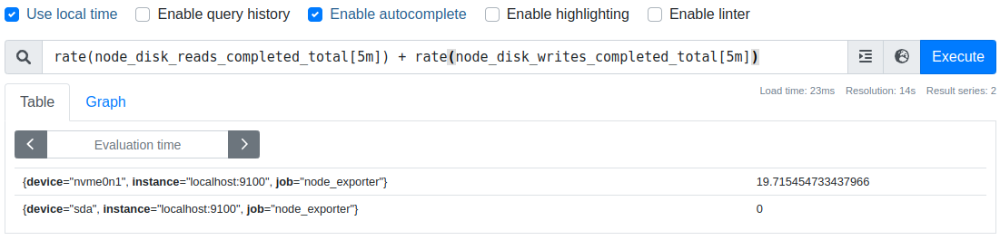

# 常用監控指標

原文: [常用监控指标](https://p8s.io/docs/node-exporter/metrics/)

本節來了解一些關於我們常用的監控指標，CPU、內存、IO監控等。

## CPU 監控

對於節點我們首先能想到的就是要先對 CPU 進行監控，因為 CPU 是處理任務的核心，根據 CPU 的狀態可以分析出當前系統的健康狀態。要對節點進行 CPU 監控，需要用到 `node_cpu_seconds_total` 這個監控指標，在 Node export 的 `~/metrics` 接口中該指標內容如下所示：


```bash
# HELP node_cpu_seconds_total Seconds the CPUs spent in each mode.
# TYPE node_cpu_seconds_total counter
node_cpu_seconds_total{cpu="0",mode="idle"} 13172.76
node_cpu_seconds_total{cpu="0",mode="iowait"} 0.25
node_cpu_seconds_total{cpu="0",mode="irq"} 0
node_cpu_seconds_total{cpu="0",mode="nice"} 0.01
node_cpu_seconds_total{cpu="0",mode="softirq"} 87.99
node_cpu_seconds_total{cpu="0",mode="steal"} 0
node_cpu_seconds_total{cpu="0",mode="system"} 309.38
node_cpu_seconds_total{cpu="0",mode="user"} 79.93
node_cpu_seconds_total{cpu="1",mode="idle"} 13168.98
node_cpu_seconds_total{cpu="1",mode="iowait"} 0.27
node_cpu_seconds_total{cpu="1",mode="irq"} 0
node_cpu_seconds_total{cpu="1",mode="nice"} 0
node_cpu_seconds_total{cpu="1",mode="softirq"} 74.1
node_cpu_seconds_total{cpu="1",mode="steal"} 0
node_cpu_seconds_total{cpu="1",mode="system"} 314.71
node_cpu_seconds_total{cpu="1",mode="user"} 78.83
node_cpu_seconds_total{cpu="2",mode="idle"} 13182.78
node_cpu_seconds_total{cpu="2",mode="iowait"} 0.69
node_cpu_seconds_total{cpu="2",mode="irq"} 0
node_cpu_seconds_total{cpu="2",mode="nice"} 0
node_cpu_seconds_total{cpu="2",mode="softirq"} 66.01
node_cpu_seconds_total{cpu="2",mode="steal"} 0
node_cpu_seconds_total{cpu="2",mode="system"} 309.09
node_cpu_seconds_total{cpu="2",mode="user"} 79.44
node_cpu_seconds_total{cpu="3",mode="idle"} 13185.13
node_cpu_seconds_total{cpu="3",mode="iowait"} 0.18
node_cpu_seconds_total{cpu="3",mode="irq"} 0
node_cpu_seconds_total{cpu="3",mode="nice"} 0
node_cpu_seconds_total{cpu="3",mode="softirq"} 64.49
node_cpu_seconds_total{cpu="3",mode="steal"} 0
node_cpu_seconds_total{cpu="3",mode="system"} 305.86
node_cpu_seconds_total{cpu="3",mode="user"} 78.17
```


從接口中描述可以看出該指標是用來統計 CPU 每種模式下所花費的時間，是一個 `Counter` 類型的指標，也就是會一直增長，這個數值其實是 CPU 時間片的一個累積值，意思就是從操作系統啟動起來 CPU 開始工作，就開始記錄自己總共使用的時間，然後保存下來。

而且這裡的累積的 CPU 使用時間還會分成幾個不同的模式，比如用戶使用時間、空閒時間、中斷時間、內核使用時間等等，也就是平時我們使用 `top` 命令查看的 CPU 的相關信息，而我們這裡的這個指標會分別對這些模式進行記錄。

接下來我們來對節點的 CPU 進行監控，我們也知道一個一直增長的 CPU 時間對我們意義不大，一般我們更希望監控的是節點的 CPU 使用率，也就是我們使用 `top` 命令看到的百分比。


要計算 CPU 的使用率，那麼就需要搞清楚這個使用率的含義，**CPU 使用率** 是:

```bash
CPU 扣除了空閒（idle）狀態之外的其他所有 CPU 狀態的時間總和 / 總的 CPU 時間
```

理解了這個概念後就可以寫出正確的 promql 查詢語句了。

要計算扣除"空閒狀態之外的 CPU 時間總和"，更好的方式是不是直接計算空閒狀態的 CPU 時間使用率，然後用 1 減掉就是我們想要的結果了，所以首先我們先過濾 `idle` 模式的指標，在 Prometheus 的 WebUI 中輸入 `node_cpu_seconds_total{mode="idle"}` 進行過濾：



要計算使用率，肯定就需要知道 `idle` 模式的 CPU 用了多長時間，然後和總的進行對比，由於這是 `Counter` 指標，我們可以用 `increase` 函數來獲取變化，使用查詢語句:

```promql
increase(node_cpu_seconds_total{mode="idle"}[1m])
```

因為 `increase` 函數要求輸入一個"區間向量"，所以這裡我們取 1 分鐘內的數據：


我們可以看到查詢結果中有很多不同 cpu 核心的數據，我們當然需要計算所有 CPU 的時間，所以我們將它們聚合起來，我們要查詢的是不同節點的 CPU 使用率，所以就需要根據 `instance` 標籤進行聚合，使用查詢語句:

```promql
sum(increase(node_cpu_seconds_total{mode="idle"}[1m])) by (instance)
```


這樣我們就分別拿到不同節點 1 分鐘內的空閒 CPU 使用時間了，然後和總的 CPU （這個時候不需要過濾狀態模式）時間進行比較即可，使用查詢語句:

```promql
sum(increase(node_cpu_seconds_total{mode="idle"}[1m])) by (instance)
 / 
sum(increase(node_cpu_seconds_total[1m])) by (instance)
```


然後計算 CPU 使用率就非常簡單了，使用 1 減去乘以 100 即可：

```promql
(1 - (
        sum(increase(node_cpu_seconds_total{mode="idle"}[1m])) by (instance) 
          / 
        sum(increase(node_cpu_seconds_total[1m])) by (instance)
      )
) * 100
```


這就是能夠想到的最直接的 CPU 使用率查詢方式了，當然前面我們學習的 promql 語法中提到過更多的時候我們會去使用 `rate` 函數，而不是用 `increase` 函數進行計算，所以最終的 CPU 使用率的查詢語句為：

```
(1 - (
        sum(rate(node_cpu_seconds_total{mode="idle"}[1m])) by (instance) 
          / 
        sum(rate(node_cpu_seconds_total[1m])) by (instance)
      )
) * 100
```


可以和 `top` 命令的結果進行對比，基本上是保持一致的，這就是監控節點 CPU 使用率的方式。


## 內存監控

除了 CPU 監控之外，我們可能最關心的就是節點內存的監控了，平時我們查看節點的內存使用情況基本上都是使用 `free` 命令來查看：


`free` 命令的輸出會顯示系統內存的使用情況，包括物理內存、交換內存(swap)和內核緩衝區內存等，所以要對內存進行監控我們需要先了解這些概念，我們先了解下 `free` 命令的輸出內容：

- `Mem 行` (第二行)是內存的使用情況
- `Swap 行` (第三行)是交換空間的使用情況
- `total 列` 顯示系統總的可用物理內存和交換空間大小
- `used 列` 顯示已經被使用的物理內存和交換空間
- `free 列` 顯示還有多少物理內存和交換空間可用使用
- `shared 列` 顯示被共享使用的物理內存大小
- `buff/cache 列` 顯示被 buffer 和 cache 使用的物理內存大小
- `available 列` 顯示還可以被應用程序使用的物理內存大小

其中我們需要重點關注的 `free` 和 `available` 兩列。 `free` 是真正尚未被使用的物理內存數量，而 `available` 是從應用程序的角度看到的可用內存，Linux 內核為了提升磁盤操作的性能，會消耗一部分內存去緩存磁盤數據，就是 `buffer` 和 `cache`，所以對於內核來說，`buffer` 和 `cache` 都屬於已經被使用的內存，只是應用程序需要內存時，如果沒有足夠的 `free` 內存可以用，內核就會從 `buffer` 和 `cache` 中回收內存來滿足應用程序的請求。

所以從應用程序的角度來說 `available = free + buffer + cache`，不過需要注意這只是一個理想的計算方式，實際中的數據有較大的誤差。

如果要在 Prometheus 中來查詢內存使用，則可以用 `node_memory_*` 相關指標，我們可以計算可使用的內存，使用 promql 查詢語句:

```promql
node_memory_Buffers_bytes + node_memory_Cached_bytes + node_memory_MemFree_bytes
```


然後計算可用內存的使用率，和內存的總合相除，然後同樣用 1 減去即可，語句為:

```promql
(1- (node_memory_Buffers_bytes + node_memory_Cached_bytes + node_memory_MemFree_bytes) / node_memory_MemTotal_bytes) * 100
```


這樣計算出來的就是節點內存使用率。

當然如果想要查看各項內存使用直接使用對應的監控指標即可，比如要查看節點總內存，直接使用 `node_memory_MemTotal_bytes` 指標即可獲取。

```promql
node_memory_MemTotal_bytes
```


## 磁盤監控

接下來是比較重要的磁盤監控，對於磁盤監控我們不僅對磁盤使用情況感興趣，一般來說對於磁盤 IO 的監控也是非常有必要的。

### 磁盤容量監控

要監控磁盤容量，需要用到 巷node_filesystem_*巷 相關的指標，比如要查詢節點磁盤空間使用率，則可以同樣用總的減去可用的來進行計算，磁盤可用空間使用 `node_filesystem_avail_bytes` 指標:

```promql
node_filesystem_avail_bytes
```


但是由於會有一些我們不關心的磁盤信息，所以我們可以使用 `fstype` 標籤過濾出我們關心的磁盤信息，比如 `ext4` 或者 `xfs` 格式的磁盤：

```promql
node_filesystem_avail_bytes{fstype=~"ext4|xfs"}
```


要查詢磁盤空間使用率，則使用查詢語句:

```promql
(1 - node_filesystem_avail_bytes{fstype=~"ext4|xfs"} / node_filesystem_size_bytes{fstype=~"ext4|xfs"}) * 100
```


這樣就可以得到我們關心的磁盤空間使用率了。

### 磁盤 IO 監控

要監控磁盤 IO，就要區分是 **讀的 IO**，還是 **寫的 IO**，讀 IO 使用 `node_disk_reads_completed` 指標，寫 IO 使用 `node_disk_writes_completed_total` 指標。

**磁盤讀 IO** 使用下列查詢語句即可：

```promql
sum by (instance) (rate(node_disk_reads_completed_total[5m])) 
```


當然如果你想根據 `device` 進行聚合也是可以的，我們這裡是全部聚合在一起了。

**磁盤寫 IO** 使用下列查詢語句即可：

```promql
sum by (instance) (rate(node_disk_writes_completed_total[5m]))
```


如果要計算總的讀寫 IO，則加起來即可:

```promql
rate(node_disk_reads_completed_total[5m]) + rate(node_disk_writes_completed_total[5m])
```




## 網絡 IO 監控

上行帶寬需要用到的指標是 `node_network_receive_bytes`，由於我們對網絡帶寬的 **瞬時變化** 比較關注，所以一般我們會使用 `irate` 函數來計算網絡 IO。

如果要計算上行帶寬使用下列的查詢語句:

```promql
sum by(instance) (irate(node_network_receive_bytes_total{device!~"bond.*?|lo"}[5m]))
```


!!! tip
    在計算網絡 IO的相關指標時，要特別注意根據想監控的目的來設定 `device` 的引入或排除的條件。

下行帶寬用到的指標為 `node_network_transmit_bytes`，如果要計算下行帶寬使用下列的查詢語句:

```promql
sum by(instance) (irate(node_network_transmit_bytes{device!~"bond.*?|lo"}[5m]))
```


當然我們還可以根據網卡設備進行分別聚合計算，最後還可以根據自己的需求將結果進行單位換算。