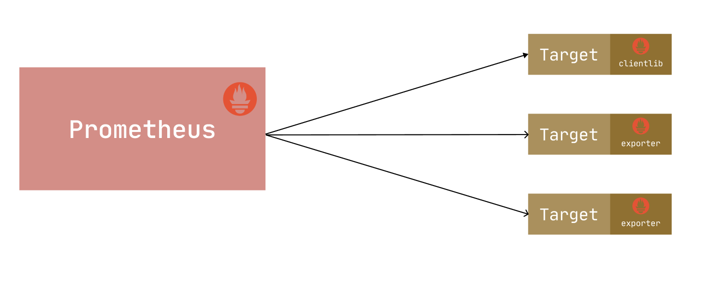

# Exporter 簡介

原文: [Exporter 介绍](https://p8s.io/docs/node-exporter/overview/)

前面我們介紹了我們可以通過一個 `~/metrics` 接口為 Prometheus 提供監控指標，最好的方式就是直接在目標應用中集成該接口，但是有的應用並沒有內置支持 metrics 接口，比如 linux 系統、mysql、redis、kafka 等應用，

這種情況下我們就可以單獨開發一個應用來專門提供 metrics 服務，這就是我們這裡說的 **Exporter**，廣義上講所有可以向 Prometheus 提供監控樣本數據的程序都可以被稱為一個 Exporter，Exporter 的一個實例就是我們要監控的 target。

Prometheus 社區提供了豐富的 Exporter 實現，涵蓋了從基礎設施、中間件以及網絡等各個方面的監控實現，當然社區也出現了很多其他的 Exporter，如果有必要，我們也可以完全根據自己的需求開發一個 Exporter，但是最好以官方的 Exporter 開發的最佳實踐文檔作為參考實現方式，我們會在後續內容中介紹如何開發一個合格的 Exporter。官方提供的主要 Exporter 如下所示：

- 數據庫：Consul exporter、Memcached exporter、MySQL server exporter
- 硬件相關：Node/system metrics exporter
- HTTP：HAProxy exporter
- 其他監控系統：AWS CloudWatch exporter、Collectd exporter、Graphite exporter、InfluxDB exporter、JMX exporter、SNMP exporter、StatsD exporter、Blackbox exporter

由於 Exporter 是用於提供監控指標的獨立服務，所以我們需要單獨部署該服務來提供指標服務，比如 Node Exporter 就需要在操作系統上獨立運行來收集系統的相關監控數據轉換為 Prometheus 能夠識別的 metrics 接口，接下來我們主要和大家來介紹幾個比較常見的 Exporter 的使用。