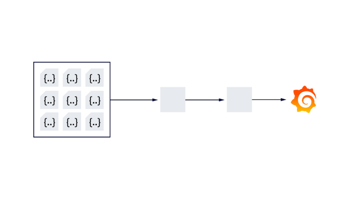
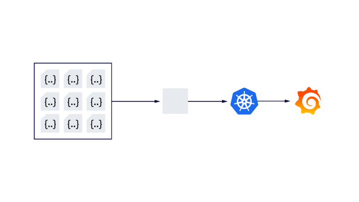
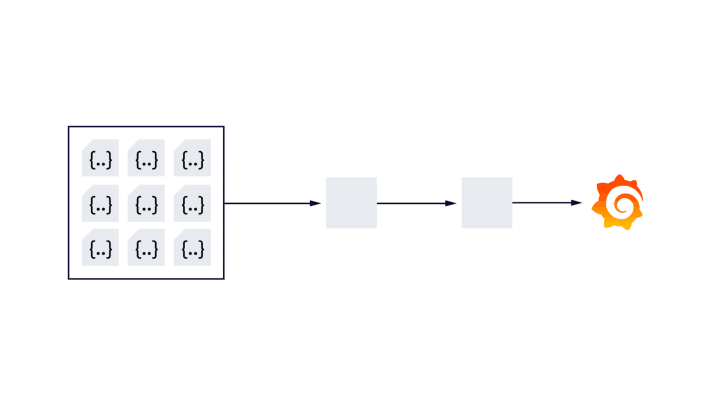
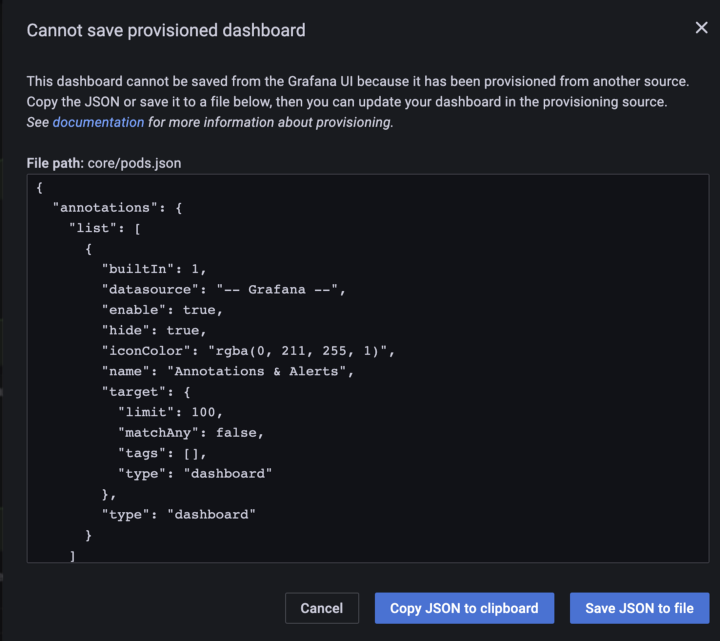

# Grafana Dashboard 的 GitOps 方式

原文:[The GitOps Way for Consistent Monitoring](https://medium.com/riskified-technology/consistent-monitoring-the-gitops-way-1d481e9965c9)

任何在 Kubernetes 工作過的人都可能知道，像 Prometheus 和 Grafana 這樣的工具非常適合監控容器化環境，並且是部署在集群中的最常見選擇之一。

Prometheus 和 Grafana 與 Kubernetes 的集成很棒，但是作為一個 Infra 團隊，在所有環境中配置和維護監控堆棧仍然存在一些開銷。

基本 Prometheus 監控堆棧中的主要組件是：

- `Prometheus` — 用於指標收集和聚合
- `Grafana` — 用於探索和創建指標儀表板的可視化 UI
- `Alertmanager` — 負責將警報分組和路由到許多集成，例如電子郵件、Slack 和 Pagerduty。

在這篇教程中，我們將專注於簡化使用 Grafana 的工作。

## 維護多個儀表板

Grafana 確實是一個了不起的、強大的工具，它可以通過漂亮、靈活的儀表板創建、探索和共享您的數據——無論數據存儲在哪裡。

但是，隨著公司的發展，在維護大量儀表板方面帶來了新的挑戰。讓我們來看看其中的一些……

### Inconsistent dashboards in different environments

很多時候，我們根據當時的特定需求更新儀表板，然後忘記在所有其他環境中更新它。這會導致跨環境的不一致，因此它使監控變得更加困難，有時甚至效率低下。一個常見的例子是，對 Grafana 儀表板的大多數更改都是在生產環境中進行的，並且暫存工作負載的監控嚴重不足。

在某些情況下，過時的儀表板導致我們錯過了暫存環境中的問題，並且錯誤的代碼到達了生產環境。

### Ownership

儀表板沒有明確的所有者。創建和更改儀表板，與佈署儀表板的權責不明。

### Diaster recovery

當涉及到災難恢復、創建新環境或將現有環境遷移到新集群時，如何將所有內容恢復到所需狀態並準備必要的調整。

### ChangeLog

隨著開發部門的發展，儀表板的變化也越來越頻繁。有時，可以針對特定案例或測試在不同環境中更改多個儀表板。
Grafana 有自己的變更管理，但是，它是每個儀表板的。我們缺乏一個集中的地方，在那裡我們可以看到某人所做的所有更改，並且能夠在需要時立即回滾所有內容。

### Lost dashboards

如上所述，很多時候開發人員會為特定的當前需求創建儀表板，當他們稍後再次需要此儀表板時，他們會忘記給它起的名稱。不斷向 Infra 團隊提出查找儀表板的請求。

## Dashboards, ConfigMaps 與 GitOps

如果我們可以將儀表板放在一個地方，它會神奇地出現在 Grafana 中——在所有環境中……

幸運的是，Grafana 5.0 版引入了一個使用配置文件的新的主動供應系統。這意味著我們現在能夠從配置文件（Kubernetes 中的 ConfigMap）配置儀表板。 Grafana 將自動加載它們，而無需進一步部署部署（就像我們過去在 Kubernetes 中使用配置映射時一樣）。

我們現在需要找到一種方法將 configmap 從一個地方分發到所有環境。

GitOps 方法可以幫助我們實現這一點，因為我們將儀表板配置存儲在 git 中，合併到主分支的任何更改都將自動應用於我們的系統。

市面上有很多 GitOps 工具，比如 Flux、Jenkins 等等——我們選擇了 ArgoCD。

ArgoCD 是用於 Kubernetes 的聲明式 GitOps 持續交付工具。

ArgoCD 持續監視指定的 github 存儲庫，將其與集群中當前部署的清單進行比較，並在它們上有效地運行 `kubectl apply -f <all>`。

對於廣泛的用例，這導致了一個非常簡單和可見的持續交付過程——在我們的例子中，在 configmaps 中持續部署 Grafana 儀表板。

## 新的 GitOps 工作流程

我們創建了一個 Helm chart，它讀取一個目錄，其中包含 json 中的所有儀表板。 Helm 模板為目錄中的每個文件創建一個單獨的配置映射。

當需要對儀表板進行更改時，他們首先像以前一樣在 UI 中編輯儀表板（除非他們真的想在 json 中編寫數千行），然後當他們嘗試保存它時（在 Grafana UI 中） ，他們得到描述儀表板的json彈出到屏幕上。

這是他們應該複製到 git 中的 json。

每當他們將更改推送到主/主分支時，ArgoCD 會識別差異並且 CD 進程將啟動。

### More developer independence, Less overhead for the infra teams

所有監控儀表板和指標評估均由開發團隊處理。該團隊負責創建儀表板、審查對等儀表板的提交，並立即將其部署到所有所需的環境。

### Consistency

由於儀表板現在存儲在 git 中，ArgoCD 將監控更改並將它們部署到所有定義的環境。

### No more lost dashboards

它們都可以在團隊的 github 存儲庫中找到。

### Increasing velocity

在一個環境中創建和測試儀表板，一旦合併到主/主分支，儀表板就會自動發布。

## 總結

一致和準確的監控從來都不是一個容易實現的目標。使用 gitops 來管理與發佈是最佳的實踐。
